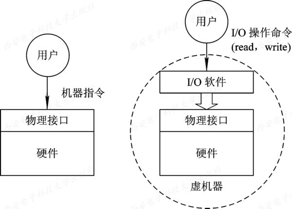
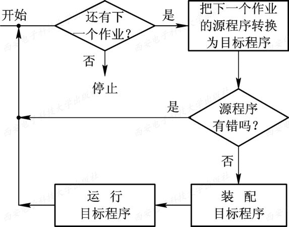
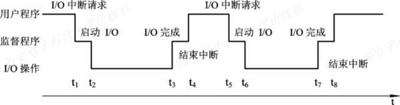
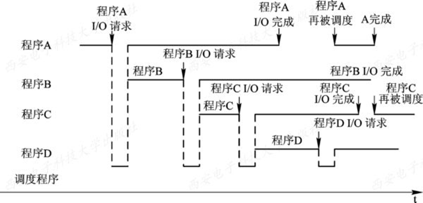

# 操作系统
## 操作系统的目标
1. 方便性
  方便了用户，使计算机变得易学易用。
2. 有效性
   1. 有效性所包含的第一层含义是提高系统资源的利用率。
   2. 有效性的另一层含义是，提高系统的吞吐量。
3. 可扩充性
  能方便地增添新的功能和模块，以及对原有的功能和模块进行修改，具有良好的可扩充性。
1. 开放性(兼容性)
  遵循国际标准，软硬件彼此兼容，方便实现互连。

--- 
## 操作系统的作用
1. 用户与计算机硬件系统之间的接口
2. 计算机系统资源的管理者
3. 实现了对计算机资源的抽象
  

## 推动操作系统发展的主要动力     
1. 不断提高计算机资源利用率  
  单道、多道、虚拟技术  
1. 方便用户  
  图形用户界面　　  
2. 器件的不断更新换代  
  计算机硬件(芯片、外设)性能的快速提高，推动了OS的功能和性能迅速增强和提高。  
3. 计算机体系结构的不断发展  
4. 不断提出新的应用需求  
   多媒体、安全性、智能设备  

--- 
## 发展过程  

### 人工操作方式  
纸带输入机将纸带(或卡片)上的程序和数据输入计算机，然后运行,结束后获取结果

- 缺点  
  用户独占全机  
  CPU等待人工操作  
### 脱机输入/输出(Off-Line I/O)方式

事先将纸带装入纸带输入机，在一台外围机的控制下，把纸带(卡片)上的数据(程序)输入到磁带上。当CPU需要这些程序和数据时，再从磁带上高速地调入内存。

### 单道批处理系统

批作业以脱机方式输入到磁带上,配上监督程序(Monitor),使这批作业能一个接一个地连续处理
<!--    -->
  

- 缺点  
  系统中的资源得不到充分的利用

### 多道批处理系统
用户所提交的作业先存放在外存上，并排成一个队列，称为"后备队列"。然后由作业化调度程序按—定的算法，从后备队列中选择若干个作业调入内存，使它们共享 CPU 和系统中的各种资源。  

在运行程序 A 时,利用空档时间调度另一道程序 B 运行
  

- 优点  
  资源利用率高  
  系统吞吐量大  
   
- 缺点  
  平均周转时间长  
  无交互能力   
 
- 需要解决的问题  
  处理机争用问题  
  内存分配和保护问题  
  I/O设备分配问题  
  文件的组织和管理问题  
  作业管理问题  
  用户与系统的接口问题  
  
### 分时系统
推动分时系统形成和发展的主要动力，则是为了满足用户对人—机交互的需求    
1. 人—机交互  
2. 共享主机   
 
- 关键问题  
  及时接收  
  及时处理  
  
- 特征  
  多路性  
  独立性  
  及时性  
  交互性  

### 实时系统

- 类型  
  工业(武器)控制系统  
  信息查询系统  
  多媒体系统  
  嵌入式系统   
   
- 任务的类型  
  周期性实时任务和非周期性实时任务  
  硬实时任务和软实时任务    
  
- 实时系统与分时系统特征的比较  
  - 多路性
  - 独立性
  - 及时性
    - 实时控制系统的实时性则是以控制对象所要求的截止时间来确定的，一般为秒级到毫秒级。
  - 交互性
    - 不像分时系统那样，提供数据处理、资源共享等服务。多媒体系统的交互性仅限于用户发送某些特定的命令，如开始、停止、快进等，由系统立即响应
  - 可靠性
    - 分时系统要求系统可靠，实时系统要求系统高度可靠。

### 微机操作系统的发展  
1. 单用户单任务操作系统  
   1)  CP/M   
   2)  MS-DOS  
2. 单用户多任务操作系统   
  只允许一个用户上机，把程序分为若干个任务，并发执行  
3. 多用户多任务操作系统  
  多个用户通过各自的终端，使用同一台机器，共享主机系统中的资源  

--- 
## 操作系统的特征

### 并发 
宏观同时发生，微观观交替发生   

进程，指在系统中能独立运行并作为资源分配的基本单位，由一组机器指令、数据和堆栈等组成，是能独立运行的活动实体   

多个进程之间可以并发执行和交换信息  

### 共享
系统中资源可供多个并发执行的进程共同使用
- 互斥共享  
- 同时共享  
  并发共享  

### 虚拟
- 空分复用技术  
  虚拟存储技术   
- 时分复用技术   
  虚拟处理器技术、虚拟设备技术  

### 异步
多程序并发，进程断断续续推进   

进程是以人们不可预知的速度向前推进的，此即进程的异步性  

--- 
## 主要功能

### 处理机管理功能

1. 进程控制   
   为作业创建进程、撤消（终止）已结束的进程     
2. 进程同步   
   多个进程（线程）的运行进行协调    
3. 进程通信    
   进程之间的信息交换   
4. 调度   
   作业调度、进程调度    

### 存储器管理功能

1. 内存分配    
   - 为每道程序分配内存空间  
   -  提高存储器的利用率  
   -  允许运行时增加内存空间  
2. 内存保护  
   - 确保程序都仅在自己的内存空间内运行  
   - 不允许用户程序访问操作系统的程序和数据、用户程序转移到的其它用户程序执行    
3. 地址映射  
4. 内存扩充  

### 设备管理功能  

1. 完成用户进程提出的I/O请求，为用户进程分配所需的I/O设备，并完成指定的I/O操作    
2. 提高CPU和I/O设备的利用率，提高I/O速度    

- 设备管理应具有缓冲管理、设备分配和设备处理以及虚拟设备等功能

### 文件管理功能
1. 文件存储空间的管理    
2. 目录管理    
3. 文件的读/写管理和保护    

### 操作系统与用户之间的接口

1. 用户接口  
  联机、脱机、图形用户接口
2. 程序接口  

--- 
## 操作系统的运行环境

### 处理器运行模式

- 特权指令   
- 非特权指令    

### 操作系统内核
1. 时钟管理  
2. 中断机制  
3. 原语  
4. 系统控制的数据结构及处理  
    常见操作：进程管理、存储器管理、设备管理

### 中断和异常

#### 中断
外中断，CPU执行来自指令外部的事件
- 可屏蔽中断    
- 不可屏蔽中断  

#### 异常
内中断，来自CPU指令内部的事件
- 故障  
  指令执行异常  
- 自陷  
  用户态调用系统内核程序  
- 终止  
  CPU无法继续执行的硬件故障  

--- 
## 操作系统结构

### 分层

### 模块化
衡量模块独立性的两个主要标准
### 宏内核
主要模块作为整体运行
### 微内核
基本功能保留在内核，其他转移到用户态执行
- 基本功能  
  1. 进程管理   
  2. 低级存储管理  
  3. 中断和陷入管理  
 
- 特点
  1. 扩展性和灵活性
  2. 可靠性和安全性
  3. 可移植性
  4. 分布式计算

### 外核

--- 
## 操作系统引导

1. 激活CPU
2. 硬件自检
3. 加载带有操作系统的硬盘
4. 加载主引导记录
5. 扫描硬盘分区表
6. 加载分区引导记录
7. 加载启动管理器
8. 加载操作系统

--- 
## 虚拟机
### 第一类虚拟机管理程序
唯一运行在最高权限级的裸机
### 第二类虚拟机管理程序
依赖于Windows、Linux等操作系统分配和调度资源的程序

--- 