# 内存管理基础
## 内存管理的概念
#### 程序的装入与链接
- 编译  
- 链接  
- 装入  

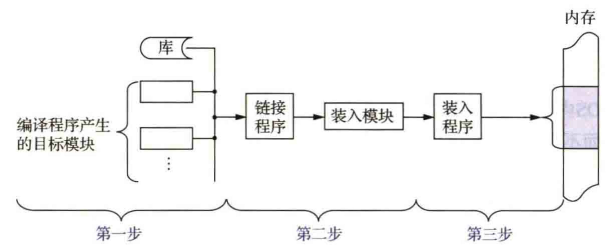  

#### 逻辑地址空间与物理地址空间
CPU生成的地址通常称为**逻辑地址**或相对地址  
内存单元看到的地址通常称为**物理地址**或绝对地址  

在**编译**时和**装入**时的地址绑定会生成**相同的**逻辑地址和物理地址，而**执行**时的地址绑定则会生成**不同的**逻辑地址和物理地址  
在这种情况下，也称逻辑地址为**虚拟地址**。 由程序所生成的所有**逻辑地址的集合**称为**逻辑地址空间**，这些逻辑地址**对应**的所有物理地址的集合称为**物理地址空间**  
因此，对于执行时的地址绑定方案，逻辑地址空间与物理地址空间是不同的 

#### 内存保护
通过 CPU硬件对在用户态下产生的物理地址与寄存器的地址进行比较来完成  
即判断 “ $基地址\leqslant 物理地址<(基地址+界限地址)$ ” 是否成立
 

#### 程序的装入
- **绝对装入方式**  
  - 计算机系统很小，且仅能运行**单道程序**时，完全有可能知道程序将驻留在内存的什么位置  
  - 装入模块被装入内存后，由千程序中的逻辑地址与实际内存地址**完全相同**，既可在编译或汇编时给出，又可由程序员直接赋予

- **可重定位装入方式**  
  - 根据内存的具体情况，将装入模块装入内存的适当位置，会使装入模块中的所有逻辑地址与实际装入内存的物理地址不同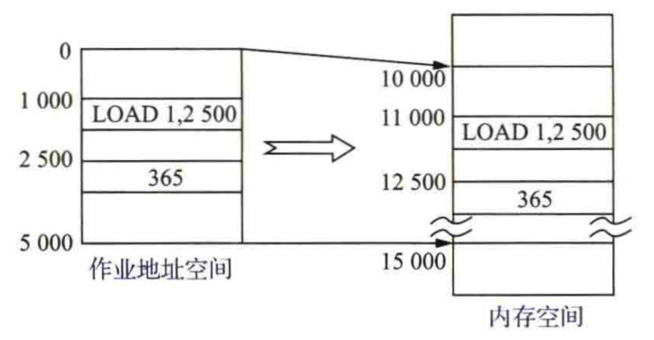  
  - 把在装入时对目标程序中指令和数据的逻辑地址变换为物理地址的**过程**，称为**重定位**  
  - 如果地址变换是在进程装人时**一次性完成**的，以后不再改变，则称这种重定位方式为**静态重定位**  
- **动态运行时装入方式** 
  - 把装入模块装入内存后，并不会立即把装入模块中的相对地址变换为绝对地址，而是会把这种地址变换推迟到**程序真正要执行时**才进行  
  - 装入内存后的所有地址都仍是**相对地址**
  - 运行时进行地址变换的重定位方式称为**动态重定位**

#### 程序的链接
- **静态链接**  
  - 在程序**运行之前**，先将各目标模块及它们所需的库函数链接成一个**完整的装配模块**，以后不再拆开。这种事先进行链接而以后不再拆开的方式，称为 *静态链接*  
  - 须解决的问题  
    1. 修改相对地址  
    2. 变换外部调用符号  
   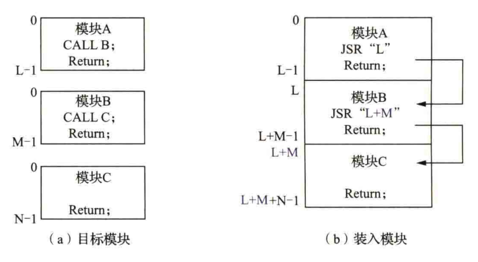  

- **装入时动态链接**  
  - 将用户源程序编译后所得的一组目标模块，在装入内存时，采用**边装入边链接**的链接方式  
  - 在装入一个目标模块时，若发生一个外部模块调用事件，则将引起装入程序找出相应的外部目标模块，并将它装入内存，**修改目标模块中的相对地址**    
  - 优点  
    1. 便于修改和更新  
    2. 便于实现对目标模块的共享
- **运行时动态链接**  
  - 对某些模块的链接推迟到**程序执行时**才进行   
  - 在执行过程中，当**发现**一个“被调用模块”尚未被装入内存时，立即由OS去**找到**该模块，将其**装入**内存，并**链接**到装入模块上  
  - 在执行过程中**未被用到**的目标模块，都不会被调入内存和被链接到装入模块上，这样不仅能**加快**程序的装入过程，而且可**节省大量 内存空间**  

## 对换与覆盖

**对换的类型**
- 整体对换
- 页面（分段）对换

**对换区管理的主要目标**
- 文件区管理的主要目标  
  - 采取离散分配存储管理方式
- 对换区管理的主要目标
  - 采取连续分配存储管理方式

#### 换出与换入
> [!cite]- pic
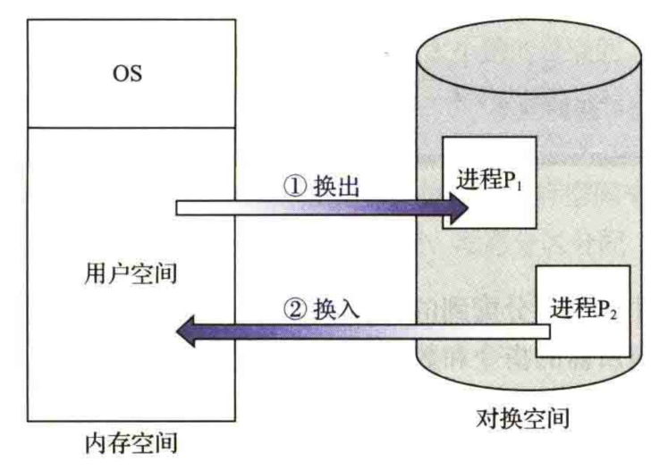  

**换出**： 
- 选择被换出的进程  
- 换出进程  

**换入**：  
- 查看PCB集合中所有进程的状态  
- 找出处于“就绪”状态但已被换出的进程  
- 为它申请内存空间  
- 申请**成功**，则可直接将进程从外存换入内存  
- 申请**失败**，则须先将内存中的某些进程换出，腾出足够的内存空间后，再将进程换入

#### 覆盖
> [!cite]- pic
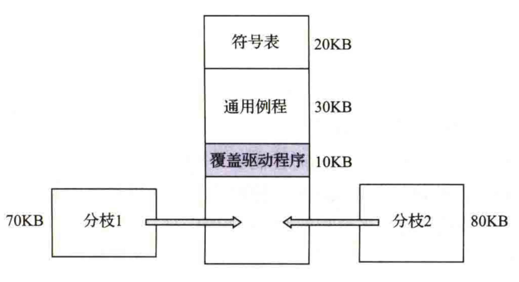  

在任何时候只在内存中**保留所需的指令和数据**；当需要其他指令和数据时，它们就会被装入刚刚不需要的指令和数据所占用的内存空间

**优点**
- 不需要OS 的特别支持 。 用户通过简单的文件结构将文件读入内存，并执行所读指令，即可实现完全覆盖

**缺点**  
- 覆盖结构的程序**设计很复杂**，需要程序员对程序结构、数据结构有完全的了解  
- 程序比较大时才需要使用覆盖，小程序无须使用覆盖，因此获得对程序足够且完整的**理解比较困难**  
- 覆盖的使用通常局限于**微处理机**和**有限物理内存**且**缺乏先进硬件支持**的其他系统 

## 离散分配存储管理方式

## 连续分配存储管理方式
为了能将用户程序装入内存，则必须为它分配一定大小的内存空间 。 连续分配存储管理方式（简称连续分配方式）   

为一个用户程序分配一个连续的内存空间，即程序中代码或数据的逻辑地址相邻，体现在内存空间中为分配的物理地址相邻
#### 单一连续分配
单道程序环境下，早期的存储器管理方式是把内存分为**系统区**和**用户区**两部分
- **系统区**  ：仅供OS使用，它通常放在内存的低址部分   
- **用户区**  ：仅装有一道用户程序，即整个内存的用户区由该程序独占  

这样的存储器分配方式被称为单一连续分配

#### 固定分区分配
为了能在内存中装入多道程序，且使这些程序之间不会发生相互干扰，于是将整个用户空间划分为若干个固定大小的区域（称为分区），并在每个分区中只装入一道作业

- **分区划分**  
  - 分区大小相等  
  - 分区大小不等
- **内存分配**     
  - 将分区按其大小进行排队，并为之建立一张固定分区使用表  
  - 找出一个能满足要求的、尚未分配的分区，将之分配给该程序，然后将该表项中的状态置为“已分配”   
  - 若未找到大小足够的分区，则拒绝为该用户程序分配内存  
  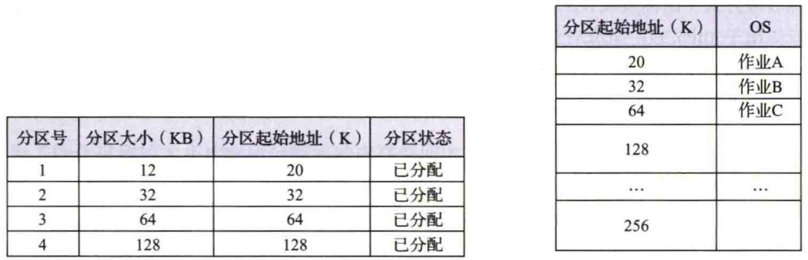  

#### 动态分区分配
可变分区分配，根据进程的**实际需要**，动态地为之分配内存空间

- 动态分区分配中的**数据结构**  
  - **空闲分区表** : 用于记录每个空闲分区的情况  
  - **空闲分区链** : 通过前、后向指针可将所有的空闲分区链接成一个双向链  
  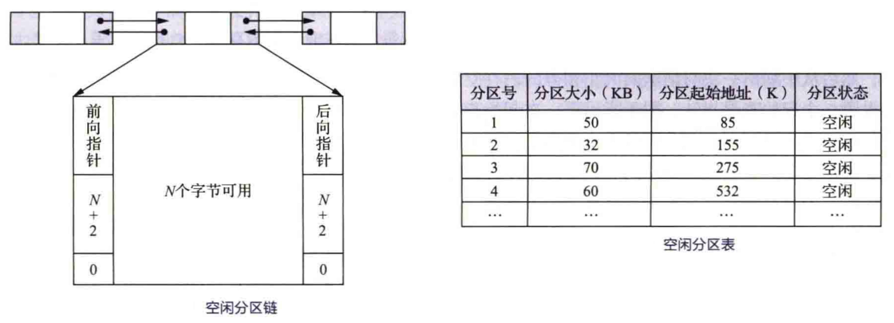  
 
- 动态分区分配**算法**  
  - 基于**顺序**搜索的动态分区分配算法（顺序分配算法）  
    - 首次适应算法  
      - 要求空闲分区链以**地址递增**的次序链接  
      - 从**链首**开始顺序查找，直至找到一个大小能满足要求的空闲分区为止  
      - 按照作业的大小，从该分区中划出一块内存空间分配给请求者  
      - 找不到则内存分配失败，返回  
    - 循坏首次适应算法  
      - 从**上次找到的空闲分区**的下一个空闲分区开始查找，直至找到一个能满足要求的空闲分区  
      - 应设置一个起始查寻指针，用于指示下一次起始查寻的空闲分区  
      - 采用循环查找方式，即如果最后一个（链尾）空闲分区的大小仍不能满足要求，则应**返回第一个空闲分区**并比较其大小是否满足要求
    - 最佳适应算法  
      - 每次为作业分配内存时，总是把能**满足要求**、又是**最小**的空闲分区分配给作业  
      - 要求将所有的空闲分区按其容量以**从小到大的顺序**，排成一个空闲分区链  
      - 存储器中会留下许多难以利用的碎片  
    - 最坏适应算法  
      - 扫描整个空闲分区表或空闲分区链时，总是会挑选一个**最大的空闲区**，从中分割一部分存储空间给作业使用  
      - 优点是可使剩下的空闲区不至于太小，产生碎片的概率最小   
      - 求将所有的空闲分区，按容量以**从大到小**的顺序排成一个空闲分区链，查找时，**只看第一个**分区能否满足作业要求
  - 基于**索引**搜索的动态分区分配算法（索引分配算法）  
    - 快速适应算法  
      - 根据进程的长度，在索引表中找到能容纳它的**最小空闲**分区链表  
      - 从链表中取下**第一块**进行分配  
      - 在进行空闲分区分配时，不会对任何分区产生分割，因此能**保留大的分区**，满足对大空间的需求，也**不会产生内部碎片**  
      - **优点**：查找**效率高**  
      - **缺点**：为了有效合并分区，分区归还内存时的**算法较复杂，系统开销较大**  
    - 伙伴系统  
      - **规定**，无论已分配分区还是空闲分区，其大小均为 $2$ 的 $K$ 次幕， $K$ 为正整数   
      - 对于具有相同大小的所有空闲分区，为它们单独设立一个**空闲分区双向链表**  
      - 当需要为进程分配一个长度为 $n$ 的存储空间时，首先计算一个 $i$ 值，使$2^{i-1}<n\leq $SL$ ant 2^i$  
      - 在空闲分区大小为 $2^i$ 的空闲分区链表中查找   
      - 能找到，则把该空闲分区分配给进程  
      - 否则，表明大小为 $2^i$ 的空闲分区已经耗尽，须在分区大小为 $2^{i+1}$ 的空闲分区链表中接着查找  
      - 若存在，把该空闲分区分为相等的两个分区，一个分区用于分配，另一个分区加入大小为 $2^i$ 的空闲分区链表
    - 哈希算法  
      - 利用哈希快速查找的优点，以及**空闲分区在可利用空闲分区链表中的分布规律**，建立哈希函数，构造一张以空闲分区大小为关键字的哈希表，该表的每个表项均记录了一个对应的空闲分区链表表头指针  
      - 当进行空闲分区分配时，根据所需空闲分区大小，通过哈希函数**计算得到**哈希表中的**位置**，从中得到相应的空闲分区链表，最终实现最佳分配策略  
- 分区的**分配与回收**操作
  - **分配内存**  
    - 系统利用某种分配算法，从空闲分区链表中找到所需大小的分区 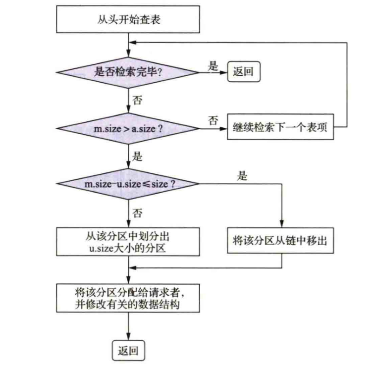 
  - **回收内存**   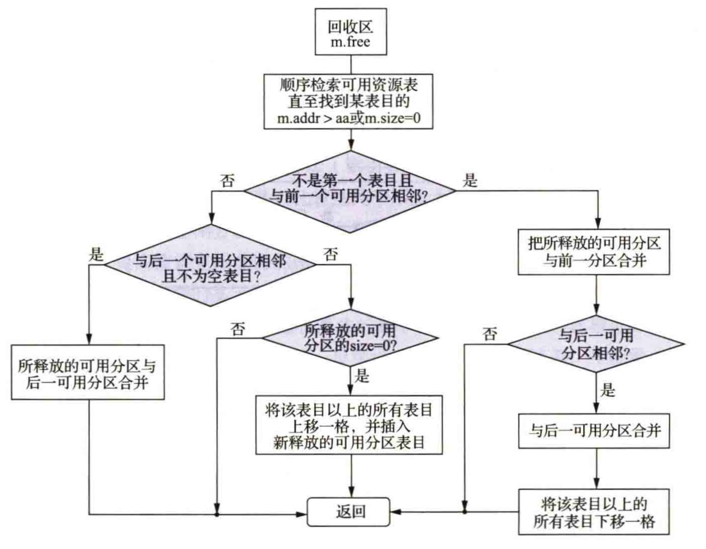  

#### 动态重定位分区分配
**紧凑**

**动态重定位**   
地址变换过程是在程序执行期间随着对每条指令或数据的访问自动进行的
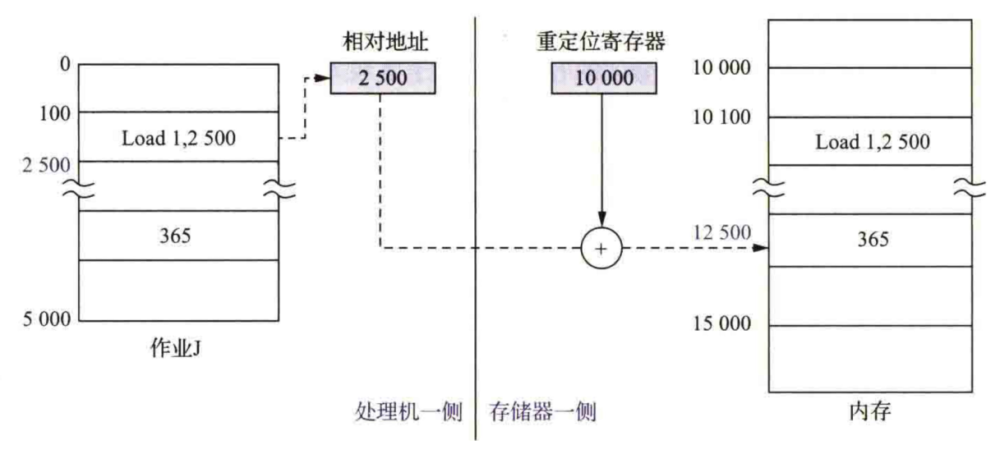  

**动态重定位分区分配算法**
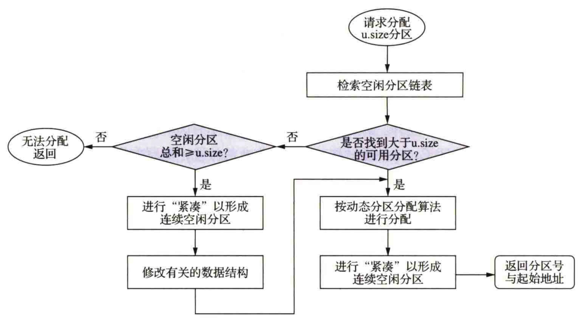  

#### 分页存储管理方式
**页面和物理块**
- 页面  
  - 将进程的地址空间分成若干个页，并为每页加以编号，从0开始  
  - 在为进程**分配内存**时，**以块为单位**，将进程中的若干个页分别装入多个可以不相邻接的物理块中
- 页面大小  
  - 页面的大小应选择得适中，且页面大小应是2的幕，通常为 1KB、2KB 、4KB 、8KB

**地址结构**
- 前一部分为页号 $P$ ，后一部分为位移量 $W$  
  - 地址长度为 $32$ 位，其中 $0-11$ 位为页内地址，即每页的大小为 $4KB$  
  - $1,2,\dots ,31$ 位为页号，地址空间最多允许有 $1M$ 页    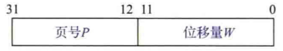   
  - 对于特定机器，地址结构是一定的。给定一个逻辑地址空间中的地址为 $A$ ，页面大小为 $L$  ，则页号 $P$ 和页内地址 $d$ 可按下式求得 $$P=INT[\frac{A}{L}]$$  $$d=[A]MOD \  L$$  
    - $INT$ 是向下取整函数， $MOD$ 是取余函数  

**页表**
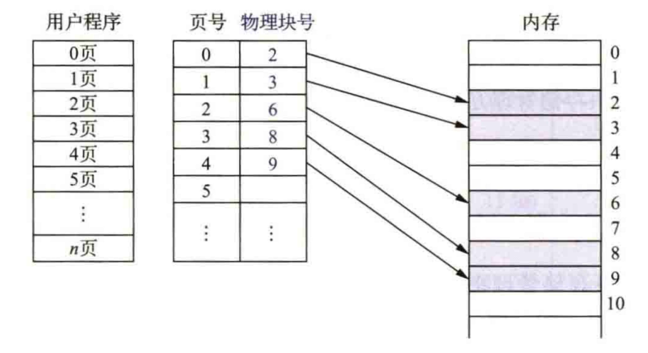  

**地址变换机构**
> 将用户地址空间中的逻辑地址变换为内存空间中的物理地址  
- **基本**的地址变换机构  
  - 当进程要访问某个逻辑地址中的数据时，分页地址变换机构会自动将有效地址分为**页号**和**页内地址**两部分，再**以页号为索引**去检索页表    
  - 查找操作由**硬件**执行。 在执行检索之前，将页号与页表长度进行比较  
  - 如果页号**大于或等于**页表长度，则表示本次所访问的地址已超越进程的地址空间，错误将被系统发现，并产生一个**地址越界中断**   
  - 若未出现越界错误，则将**页表起始地址**与“**页号和页表项长度的乘积**”相加，便可得到该表项在页表中的位置，于是可以从中得到该页的物理块号，然后将之装入物理地址寄存器中  
  - 再将有效地址寄存器中的页内地址送入物理地址寄存器的块内地址字段中 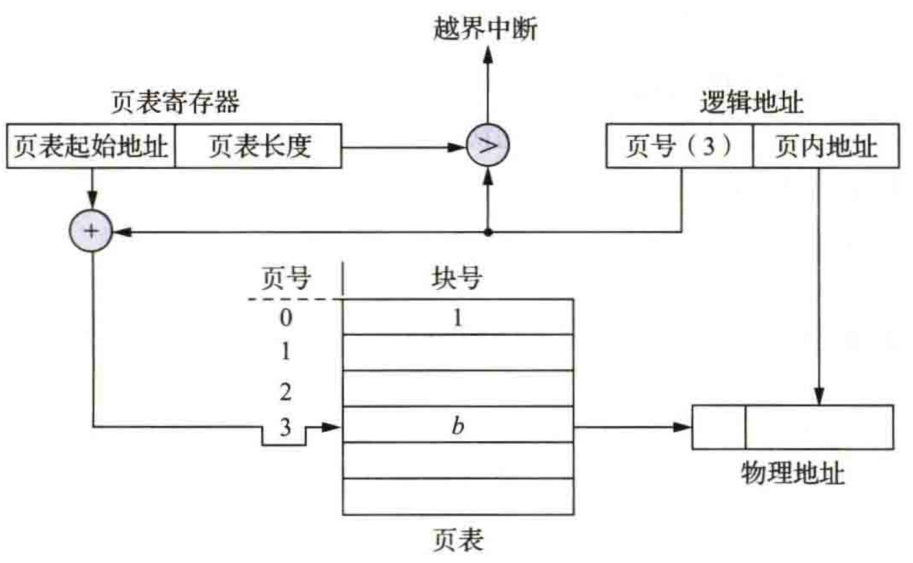    
 
- 具有**快表**的地址变换机构  
  - 为了**提高地址变换速度**，可在地址变换机构中增设一个具有并行查寻能力的高速缓冲寄存器，称为“联想寄存器”或“快表”  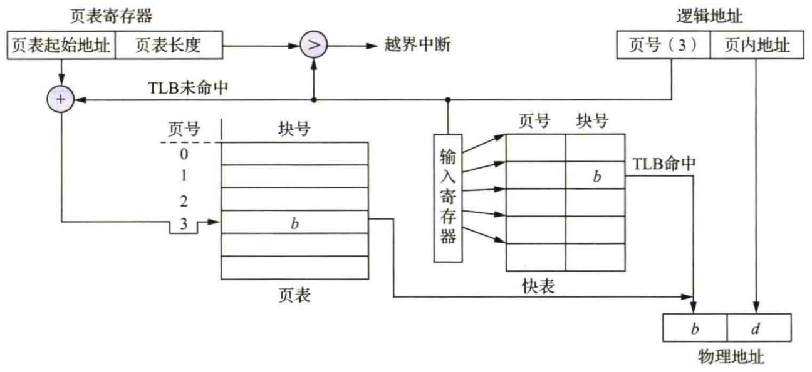    
  - 通常只存放 $16\sim 512$ 个页表项

**引入快表后的内存有效访问时间**  
- 由于引入了快表，CPU访问数据所耗费的时间明显减少  

**两级页表和多级页表**
- 对于页表所需的内存空间，可采用**离散分配**方式，以解决难以找到一块连续的大内存空间的问题  
- 只将**当前需要**的部分页表项调入内存，其余的页表项仍驻留在磁盘上，需要时再调入   
- **两级页表**  
  - 当页面大小为 $4KB$ 时(12位)，若采用一级页表结构，则应具有 $20$ 位的页号，即页表项应有 $1M$ 个；在采用两级页表结构时，再对页表进行分页，假设每个页表项占用 $4B$ ，则每页中包含 $2^{10}$ (即 $1024$ )个页表项，最多允许有 $2^{10}$ 个页表分页；或者说，外层页表中的外层页内地址 $P_2$ 为 $10$ 位，外层页号 $P_1$ 也为 $10$ 位  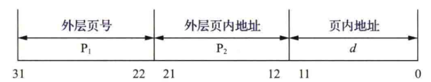    
  - 两级页表的地址变换机构  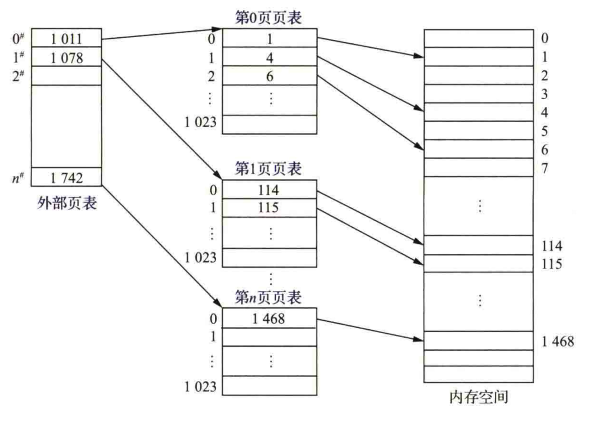   
- **多级页表**  
  - 在现在的 $64$ 位计算机中，把可直接寻址的存储器空间减少为 $48$ 位长度(即 $2^{48}$ ) 左右，这样便可利用 三级页表结构实现分页存储管理

**反置页表**  
- 引入  
  - 为每个物理块设置一个页表项，并将它们按**物理块的编号**进行排序，其中的内容则是**页号**和其**隶属进程的标识符**  
- 地址变换  
  - 根据进程标识符 $pid$ 和页号 $p$ 检索反置页表   
  - 如果检索到了与之匹配的页表项，则该表项的序号 $i$ 便是该页所在的物理块号，可用该块号 $i$ 与页内地址 $d$ 一起**构成物理地址**送往内存地址寄存器  
  - 若检索了整个反置页表都未找到匹配的页表项，则表明此页**尚未装入内存**  
  - 对于不具有请求调页功能的存储器管理系统，此时则显示地址**出错**  
  - 对于具有**请求调页功能**的存储器管理系统，此时则产生请求调页**中断**，系统将把此页调入内存  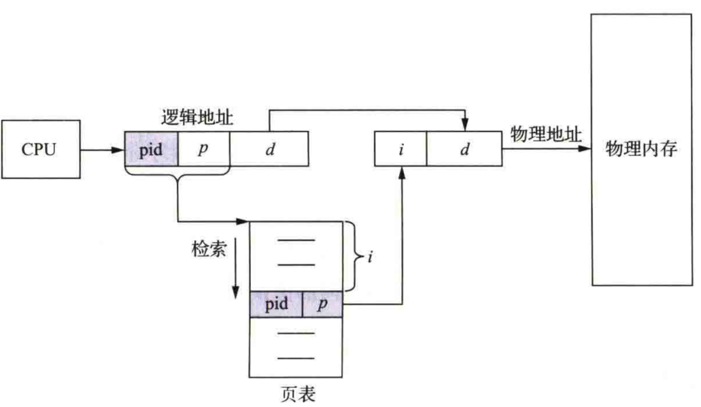  

#### 分段存储管理式
- 方便编程   
- 信息共享  
- 信息保护  
- 动态链接  
- 动态增长  

**基本原理**   
- 分段  
  - 作业的地址空间被划分为若干段，每个段都**定义**了一组**逻辑信息**  
  - 每个段都**从0开始**编址，并采用一段连续的地址空间  
  - 段的长度由相应的逻辑信息组的长度决定，因此各段的**长度并不相等**   
  - 整个作业的地址空间，由于被分成了多个段，因此呈现出了二维特性  
  - 每个段既包含了一部分**地址空间**，又标志了**逻辑关系**  
  - 段的**逻辑地址**由**段号**（段名）和**段内地址**所组成
  - 允许一个作业最长有 $64K$ 个段，每个段的最大长度为 $64KB$ 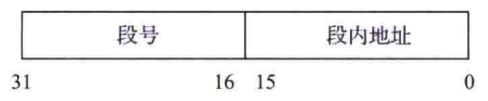  
  - 编译程序能自动地根据源程序的情况产生若干个段  

- 段表   
  - 在系统中为**每个进程**建立一张段映射表，简称“段表”  
  - 每个段在表中均占有一个表项，其中记录了该段在内存中的起**始地址和段的长度**  
  - 段表可以存放在一组**寄存器**中，以提高地址变换速度，更常见的方法是放在**内存**中  
  - 配置段表后，执行中的进程可通过查找段表来找到每个段所对应的内存区  
  - 段表是用于实现从逻辑段到物理内存区映射的  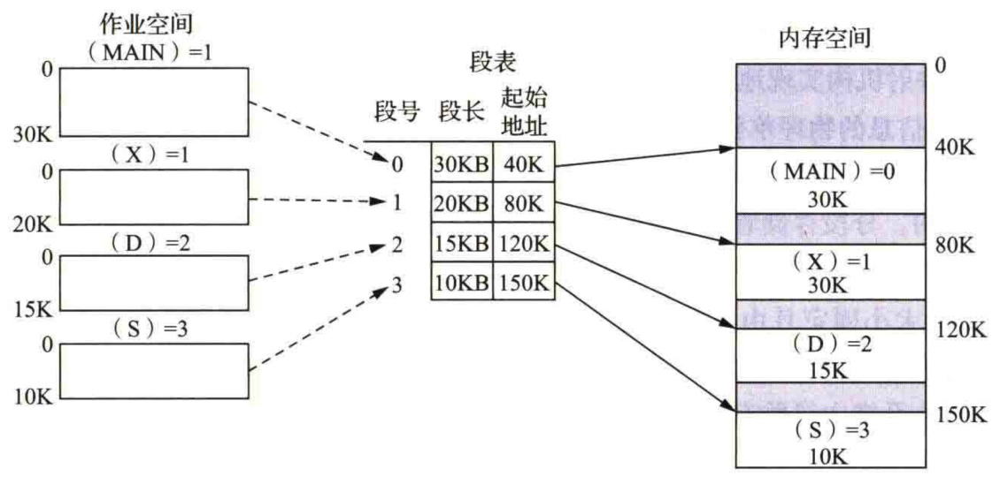  

- 地址变换机构  
  - 为了实现进程从逻辑地址到物理地址的变换功能，在系统中设置了**段表寄存器**，用于**存放段表起始地址和段表长度** $TL$   
  - 在进行地址变换时，系统将**逻辑地址**中的段号 $S$ 与段表长度 $TL$ 进行比较  
  - 若 $S>TL$ , 则表示**段号太大**，访问越界，于是产生**越界中断**信号  
  -  若未越界，则根据段表起始地址和该段的段号，计算出该段对应段表项的位置，从中读出该段在内存中的**起始地址**  
  -  再检查段内地址 $d$ 是否超过该段的段长  $SL$    
  -  若**超过**，即 $d>SL$ , 则同样产生越界**中断**信号   
  -  若未越界，则将该段的起始地址 $d$ 与段内地址相加，即可得到要访问的**内存物理地址**  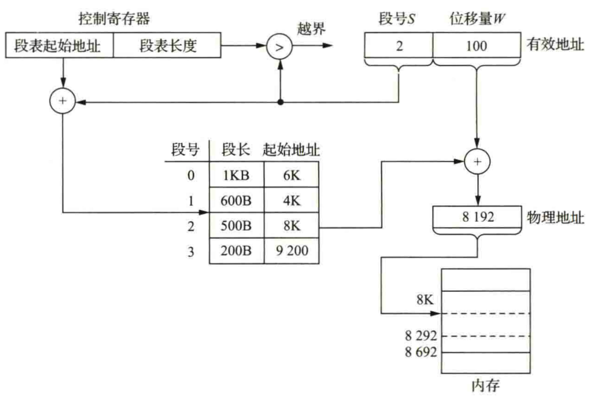  

- 分页和分段的主要区别  
  - **页是信息的物理单位**  
    - **分页**存储管理方式是为了**实现离散分配方式**，以消**减内存的外零头**，**提高内存的利用率**。只是系统管理上的需要，完全是系统的行为，对用户是不可见的  
    - **分段**存储管理方式中的段，则是**信息的逻辑单位**，它通常包含的是一组意义相对**完整的信息** 。 分段的目的主要在于能更好地满足用户的需要  
  - 页的大小固定且由**系统决定**  
    - **分页**存储管理方式的系统中，在硬件结构上就把用户程序的逻辑地址划分为页号和页内地址两部分，也就是说该管理方式是直接由硬件实现的，因而在每个系统中**只能有一种大小**的页面  
    - **段**的**长度不固定**，其取决于用户所编写的程序，通常由编译程序在对源程序进行编译时根据信息的性质来划分
  - 分页的**用户程序地址空间是一维**的  
    - 分页是**系统的行为**，用户程序的地址属于**单一的线性地址**空间，程序员只须利用一个标识符即可表示一个地址  
    - 分段是**用户的行为**，在分段系统中，用户程序的地址空间是**二维**的，程序员在标志一个地址时，既须给出**段名**，又须给出**段内地址**

**信息共享**    
- 分页系统中对程序和数据的共享  
  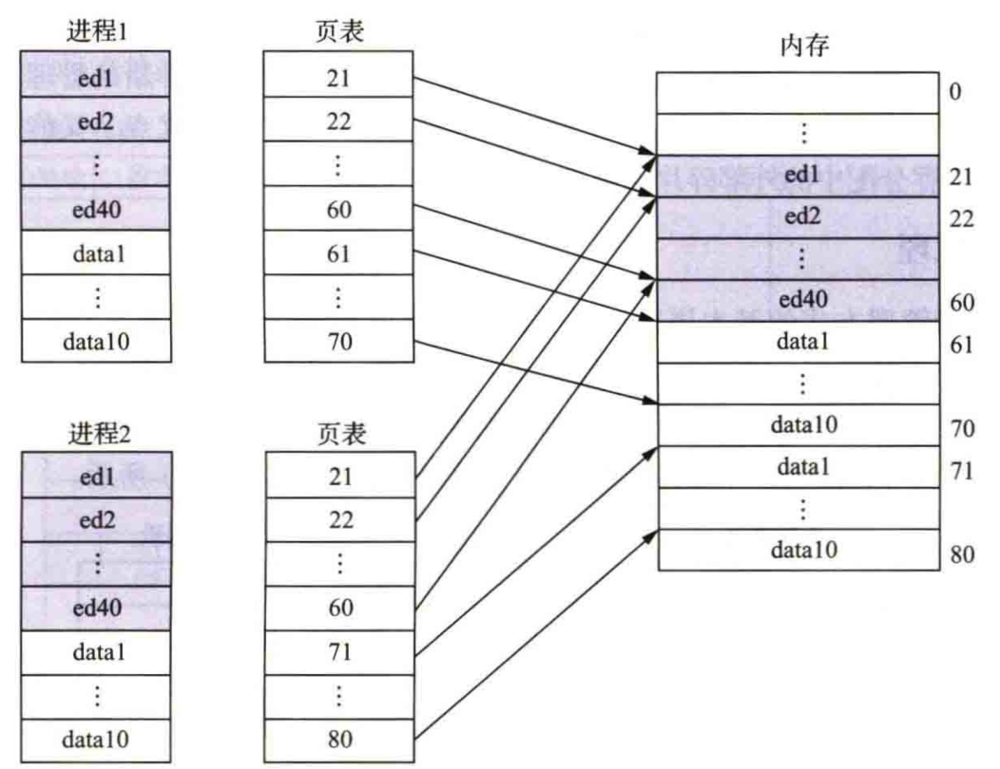  

- 分段系统中对程序和数据的共享  
    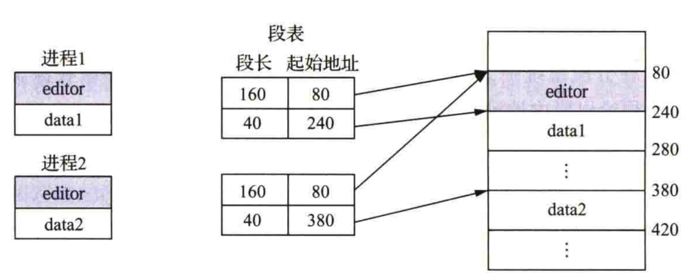  

#### 段页式存储管理方式
**基本原理**  

- 先将**用户程序分成若干段**，再把**每段分成若干页**，并为每一个段赋予一个段名   
- 作业地址空间结构由主程序段、子程序段和数据段组成，页面大小为4KB   
- 地址结构由段号、段内页号及页内地址组成  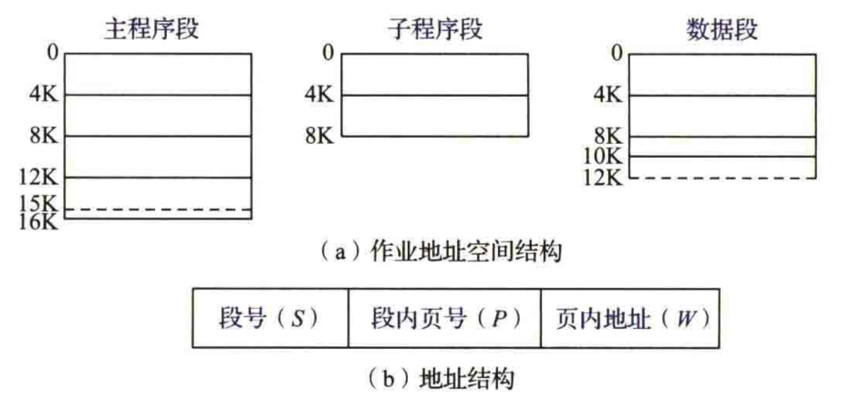   
- 在段页式存储管理方式下，为了实现从逻辑地址到物理地址的变换，系统中需要同时**配置段表和页表**  
- 段表： 页表起始地址和页表长度  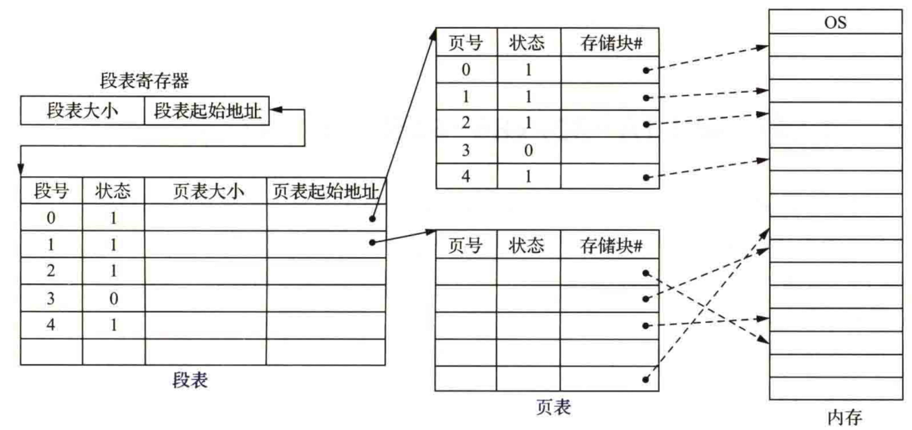  

**地址变换过程**  
- 为系统配置一个段表寄存器，其中存放段表起始地址和段长 $TL$   
- 在进行地址变换时，首先比较段号 $S$ 与段长 $TL$   
- 若 $S<TL$ ，则表示未越界，于是利用段表起始地址和段号来求出该段所对应的段表项在段表中的位置，从中得到该段的页表起始地址，并利用逻辑地址中的段内页号 $p$ 来获得对应页的页表项位置，从中读出该页所在的物理块号 $b$   
- 再利用物理块号 $b$ 和页内地址来构成物理地址  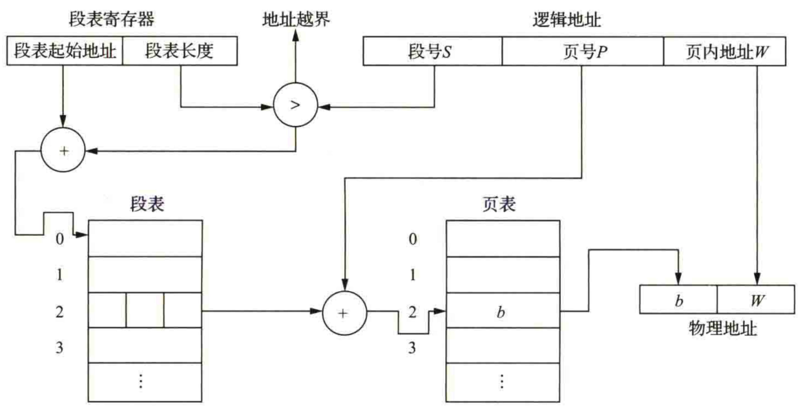  

# 虚拟存储器管理
## 虚拟存储器的基本概念
#### 常规存储器管理方式的特征和局部性原理  
**常规存储器管理方式的特征**  
- **一次性**  
  - 作业必须**一次性地全部装入内存**后，方能开始运行  
  - 当**作业很大**时，它所要求的内存空间超过了内存总容量，此时无法将全部作业装入内存，导致该作业无法运行  
  - 在有大最作业要求运行的情况下，由于每个作业都需要全部装人内存后方能运行，因此**每次只能装入少量**的作业，致使系统的多道程序度下降，这对于提高处理机的利用率和系统吞吐量都会产生不利影响
- **驻留性**  
  - 作业被装入内存后，整个作业都一直驻留在内存中，其中任何部分都不会被换出，直至作业运行结束  

**局部性原理**  
- 程序在执行时，除了少部分的转移和过程调用指令外，在大多数情况下是**顺序执行的**  
- 过程调用将会使程序的执行轨迹由一部分区域转至另一部分区域 ，程序将会在一段时间内都**局限在这些过程的范围内**运行  
- 程序中存在许多循环结构，这些结构虽然只由**少数指令构成**，但是它们将会被多次执行  
- 程序中还包括许多对数据结构的处理，如对数组进行操作，它们往往都**局限于很小的范围**内  
- **表现在**  
  - **时间局限性**  
    - 如果程序中的某条指令被执行，则不久以后该指令可能会被再次执行  
    - 如果某数据被访问过了，则不久以后该数据可能会被再次访问   
    - 典型原因是在程序中存在着大量的循环操作
  - **空间局限性**  
    - 一旦程序访问了某个存储单元，不久之后，其附近的存储单元也将会被访问  
    - 即程序在一段时间内所访问的地址可能集中在一定的范围之内  
    - 典型情况是程序的顺序执行 

**虚拟存储器的基本工作情况**
- 基于**局部性原理**可知，在运行应用程序之前，没有必要将之全部装入内存，而仅须将那些前要运行的少数页面或段先装入内存便可运行，其余部分**暂留**在盘上  
- 程序在运行时，如果要访问的页（段）已被调入内存，则可继续执行下去  
- 如果程序所要访问的页（段）**尚未被调入内存**（称为**缺页或缺段**），则须发出缺页（段）**中断**请求，此时OS将利用**请求调页**（段）功能，将它们调入内存，以使进程能继续执行下去  
- 如果此时内存已满，无法再装入新的页（段），则OS还须再利用页（段）的**置换**功能，将内存中暂时不用的页（段）**调至盘上**，在**腾出**足够的内存空间后，再将要访问的页（段）调入内存，使程序继续执行下去 

#### 虚拟存储器的定义与特征
**虚拟存储器的定义**  
- 具有请求**调入**功能和**置换**功能，能从**逻辑上**对内存容量加以**扩充**的一种存储器系统  
- 逻辑容量由内存容量和外存容量**之和**所决定，其**运行速度接近于内存速度**，而每个存储位的**成本却又接近于外存**  
- 虚拟存储技术是一种**性能非常优越**的存储器管理技术，故被广泛应用于大、中、小和微型计算机中

**虚拟存储器的特征**  
- 多次性  
  - 一个作业中的程序和数据，无须在作业运行时一次性地全部调入内存，而是允许被**分成多次调入内存**运行  
  - 是任何其他的存储管理方式所不具有的，故此也可以认为虚拟存储器是具有**多次性特征的存储器管理系统**  
- 对换性  
  - 相对于传统存储器管理方式的驻留性而言   
  - 一个作业中的程序和数据无须在作业运行时一直常驻内存，而允许它们在**作业运行时进行换入 ， 换出**  
  - 允许将暂时不运行的进程**调至外存**，待它们重新具备运行条件时再调入内存  
  - 换入和换出能有效提高内存利用率
- 虚拟性  
  - 能够从**逻辑上扩大**内存容量，使用户所看到的内存容量远大于实际内存容量  
  - 在小的内存中运行大的作业，或者能提高多道程序度   
  - 有效**改善内存利用率**，还能**提高程序执行的并发程度**，从而可以增加**系统吞吐量**  

#### 虚拟存储器的实现方法
**请求分页系统**  
- 在分页系统的基础上，增加了**请求调页**功能和**页面置换**功能所形成的页式虚拟存储系统  
- 允许用户程序只装入少数页面的程序（及数据）即可启动运行  
- 以后，再通过请求调页功能和页面置换功能，**陆续地把即将运行的页面调入内存**，同时把暂不运行的页面换出到外存上  
- 置换时以**页面**为单位
- 系统提供  
  - **硬件**支持  
    - 请求分页的**页表机制**  
    在纯分页的页表机制上增加若干项而形成，被作为请求分页的数据结构  
    - **缺页中断**机构  
    即每当用户程序要访问的页面尚未调入内存时，便产生一个缺页中断，以请求OS将所缺的页调入内存  
    - **地址变换机构**  
    在纯分页地址变换机构的基础上发展形成
  - 实现请求分页的**软件**  
    - 用于实现**请求调页**的软件和实现**页面置换**的软件  
    - 在硬件的支持下，将程序运行时所需的（尚未在内存中的）页面**调入内存**，再将内存中暂时不用的页面从内存**置换到外存**上

**请求分段系统**  
- 在分段系统的基础上，增加了**请求调段**功能和**分段置换**功能后所形成的段式虚拟存储系统  
- 允许用户程序**只装入少数段**（而非所有的段）的程序和数据即可**启动运行**  
- 通过请求调段功能和分段置换功能将暂不运行的段调出，再调人即将运行的段  
- 以**段**为单位进行
- 系统提供  
  - **硬件**支持  
    - 请求分段的**段表**机制  
    在纯分段的段表机制上通过增加若干项而形成的，被作为请求分段的数据结构   
    - **缺段中断**机构  
    每当用户程序要访问的段尚未调入内存时，便产生一个缺段中断，以请求 OS将所缺的段调入内存  
    - **地址变换机构**  
    在纯分段地址变换机构的基础上发展形成的
  - 实现请求分段的**软件**  
    - 用于实现**请求调段**的软件和实现**段置换**的软件  
    - 在硬件的支持下，先将内存中暂时不用的段从内存**置换到外存**上，再将程序运行时所需的（尚未在内存中的）段**调入内存** 

## 请求分页存储管理方式
#### 请求分页中的硬件支持  
**请求页表机制**  
- 将用户地址空间中的**逻辑地址映射为**内存空间中的**物理地址**
- **页表包含** 

      
  - **状态位** $P$  
    - 用于指示该页是否已调入内存，供程序访问时参考
  - **访问字段** $A$  
    - 记录本页在一段时间内**被访问的次数**，或记录本页最近已有**多长时间未被访问**，供页面置换算法（程序）在选择换出页面时参考
  - **修改位** $M$  
    - 页在调入内存后**是否被修改**过  
    - 内存中的每一页都在外存中保留一份副本，因此在置换该页时，若**未被修改**，就**无须**再将该页**写回**到外存中，以减少系统的开销和启动磁盘的次数  
    - 若**已被修改**，则必须将该页**重写到外存**中，以**保证外存中所保留的副本始终是最新的**  
  - **外存地址**  
    - 用于指出该页在**外存中的地址**，通常是**物理块号**，供调入该页时参考

**缺页中断机构**  
- 一般的中断需要经历诸如保护CPU现场环境、分析中断原因、转入缺页中断处理程序进行处理以及在中断处理完成后恢复CPU现场环境等步骤  
- 一般的中断的不同点  
  - 在**指令执行期间**，**产生和处理中断信号**   
    - 缺页中断是在指令执行期间，若发现所要访问的指令或数据不在内存中时，便立即产生和处理缺页中断信号，以便能及时将所缺之页调人内存
  - 一条指令**在执行期间**，可能会产生**多次缺页中断**  
    - 系统中的硬件机构应能**保存多次中断时的状态**，并**保证最后能返回到中断前产生缺页中断的指令处**，继续执行  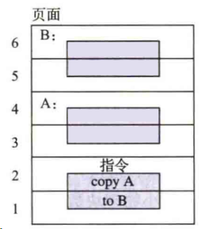  

**地址变换机构**  
- 首先会**检索快表**，试图从中找到所要访问的页  
- 若能找到，则**修改页表项中的访问位**，供页面置换算法选择换出页面时参考  
- 对于写指令，还须将**修改位置**成 “1” ，表示该页在调入内存后**已被修改**  
- 然后利用页表项中给出的**物理块号和页内地址**形成物理地址
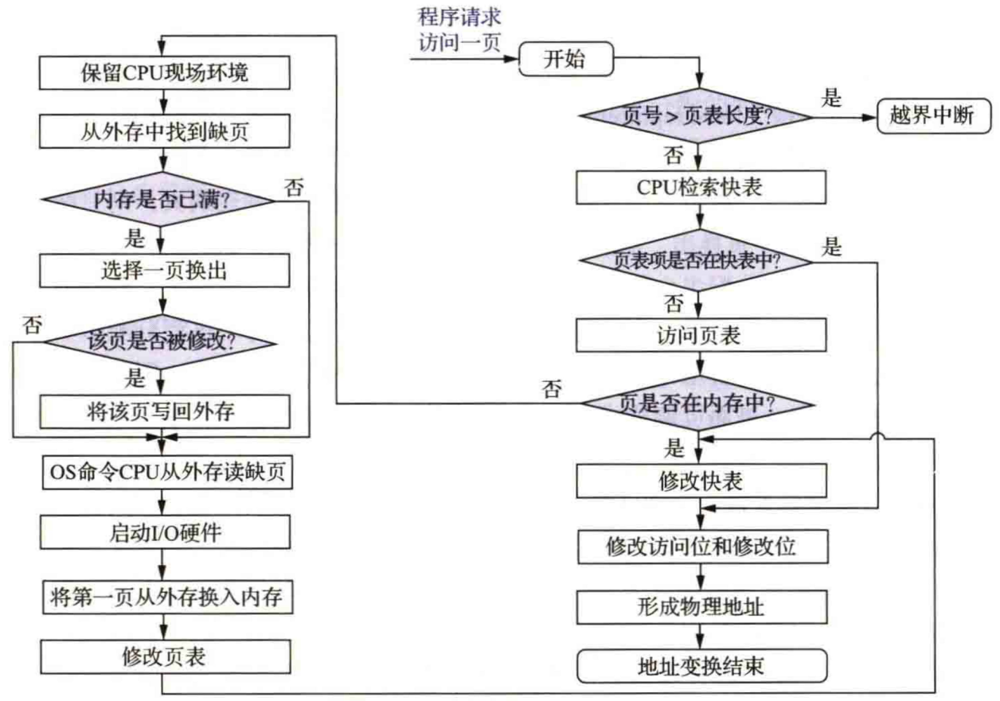  
- 如果在**快表中未找到**该页的页表项，则应到**内存中去查找页表**，再通过找到的页表项中的状态位 $P$ 来了解该页**是否已调入**内存  
- 若该页已调入内存，则应将**该页的页表项写入快表**  
- 当快表已满时，则应**先调出**按某种算法所确定的页的页表项，然后**再写入**该页的页表项  
- 若该页尚未调入内存，则应产生**缺页中断**，请求 $OS$ **从外存把该页调入**内存  

#### 请求分页中的内存分配 
> ##页面分配策略

**最小物理块数的确定**  
- 能保证进程**正常运行所需最小**的物理块数，当系统为进程分配的物理块数少于此值时，进程将无法运行  
- 进程获得的最小物理块数与计算机的**硬件结构**有关，取决于**指令的格式、功能和寻址方式**  
- 对于某些简单的机器，若是单地址指令，且采用直接寻址方式，则所需的最小物理块数为 $2$ 。 其中，一块用于存放**指令**的页面，另一块用于存放**数据**的页面  
- 如果该机器允许**间接寻址**，则至少要求有 $3$ 个物理块 
- 对于某些功能较强的机器，其**指令长度可能是两个或多于两个字节**，因而其指令本身有可能**跨两个页面**，且源地址和目标地址所涉及的区域，也都可能跨两个页面。 正如前面所介绍的在缺页中断机构中要发生 $6$ 次中断的情况一样，对于这种机器，至少要为每个进程分配 $6$ 个物理块，以装入 $6$ 个页面  

**内存分配策略**  
- **固定分配局部置换**  
  - **固定分配**  : 为每个进程分配一组数目固定的物理块在进程运行期间不再改变  
  - **局部置换**  : 如果进程在运行中发现缺页，则只能从分配给该进程的 n个页面中选出一页换出，然后再调入一页，以保证分配给该进程的内存空间不变  
  - 为每个进程分配多少物理块，是**根据进程类型**（如交互型或批处理型等）或**程序员、程序管理员的建议**来确定的  
  - **困难** :  应为每个进程分配多少个物理块难以确定  
    - **太少** :  则会频繁地出现缺页中断，降低系统吞吐晕  
    - **太多** :  则又必然会使**内存中驻留的进程数目减少**，进而可能造成 **CPU或其他资源空闲**的情况，而且在实现进程对换时，会花费更多的时间  

- **可变分配全局置换**  
  - **可变分配** :  **先为每个进程分配一定数目的物理块**，然后在进程运行期间，可根据情况做适当的增加或减少  
  - **全局置换** :  如果进程在运行中发现缺页，则将OS所保留的**空闲物理块**（一般组织为一个空闲物理块队列），**取出一块分配给该进程**，或者以所有进程的全部物理块为标的，选择一块换出，然后将所缺之页调入  
  - **凡产生缺页（中断）**的进程，都将**获得新的物理块**，仅当空闲物理块队列中的物理块**用完**时，OS才会**从内存中选择一页调出**。被选择调出的页可能是系统中任何一个进程中的页，因此这个**被选中**的进程所拥有的**物理块会减少**，这将导致其缺页率增加

- **可变分配局部置换**  
  - 根据进程的类型或程序员的要求，为每个进程分配一定数目的物理块的；但当某进程发现缺页时，则**只允许从该进程在内存的页面中选择一页换出**，这样就**不会影响其他进程的运行**  
  - 如果进程在运行中**频繁地发生缺页中断**，则系统须再为该进程**分配**若干附加的物理块，直至该进程的**缺页率减少**到适当程度为止  
  - 若一个进程在运行过程中的**缺页率特别低**，则此时可适当**减少**分配给该进程的物理块数，但**不应引起其缺页率的明显增加** 

**物理块分配算法**  
- **平均分配算法**  
  - 系统中所有可供分配的物理块，平均分配给各个进程
- **按比例分配算法**  
  - 系统中共有 $n$ 个进程，每个进程的页面数为 $S_i$ ，则系统中各进程页面数的总和 $S$ 为 : $$S=\sum_{i=1}^n S_i$$ 假定系统中可用的物理块总数为  $m$ , 则可由下式算得每个进程所能分到的物理块数 $b_i$ ，为 : $$b_i=\frac{S_i}{S}·m$$
- **考虑优先权的分配算法**  
  - 把内存中可供分配的所有物理块分成两部分：一部分**按比例分配**给各进程；另 一部分则**根据**各进程的**优先权进行分配**，为高优先权进程适当地**增加**其相应的分配份额

#### 页面调入策略
**何时调入页面**  
- **预调页策略** : 采用一种以预测为基础的预调页策略，将那些预计在不久之后会被访间的页面，预先调入内存  
- **请求调页策略**  : 进程在运行中需要访问某部分程序和数据时，若**发现**其所在的页面**不在内存中**，则立即**提出请求**，由OS将其所需页面调入内存

**从何处调入页面**  
- 系统**拥有**足够的对换区空间，这时可以**从对换区调入全部所需页面**，以提高调页速度 。 为此，在进程运行前，须将与该进程有关的文件从文件区复制到对换区  
- 系统**缺少**足够的对换区空间，这时，凡是**不会被修改的文件都直接从文件区调入**；而当换出这些页面时，由于它们未被修改，不必再将它们重写到磁盘（换出），以后再调入时仍从文件区直接调入 。 但对于那些可能**已被修改**的部分，在将它们换出时，须将它们**调到对换区**，以后需要时再从对换区调入  
- **UNIX方式** : 由于与进程有关的文件都放在文件区，故凡是未运行过的页面，都应从文件区调入。 而对于曾经运行过但又被换出的页面，由于被放在对换区，因此在下次调入时，应从对换区调入 。由于UNIX系统允许页面共享，因此，某进程所请求的页面有可能已被其他进程调入内存，此时也就无须再从对换区调入

**如何调入页面**  
- 每当程序所要访问的页面未在内存时（存在位为“0"），便向 $CPU$ 发出一个**缺页中断**  
- 中断处理程序首先**保留** $CPU$ **现场**环境，分析中断原因后转入**缺页中断处理程序**  
- 该程序通过**查找**页表得到该页的外存地址后，如果此时内存能容纳新页，则**启动磁盘** $I/O$ , 将所缺之页**调入**内存，然后修改页表

**缺页率**  
- 假设一个进程的**逻辑空间**为 $n$ 页，系统为其分配的内存**物理块数**为 $m(m\leqslant n)$  
- 如果在进程运行过程中，**访问页面成功**（即所访问页面在内存中）的次数为 $S$  
- **访问页面失败**（即所访问页面不在内存中，需要从外存调入）的次数为 $F$ 
- 该进程**总页面访问次数**为：$A=S+F$   
- 该进程在其运行过程中的**缺页率**为： $$f=F/A$$ 
- **影响因素**  
  - **页面大小** ：若页面划分较大，则缺页率较低；反之，则缺页率较高  
  - **进程所分配物理块的数目** ：所分配的物理块数目越多，缺页率越低；反之，缺页率越高  
  - **面置换算法** ：算法的优劣决定了进程执行过程中缺页中断的次数因此缺页率是衡蜇页面置换算法的重要指标  
  - **程序固有特性** ：程序本身的编制方法对缺页中断次数有影响，根据程序执行的局部性原理，程序编制的局部化程度越高，相应执行时的缺页程度就越低  
- 被置换的页面**被修改的概率**是 $\beta$  
- 其缺页**中断处理时间**是 $t_a$   
- 被置换页面**没有被修改的缺页中断时间**是 $t_b$   
- 缺页中断处理时间的计算公式可表示为 $$t=\beta ·t_b+(1-\beta)·t_b$$  

## 页面置换算法
#### 最佳页面置换算法
> optimal,OPT

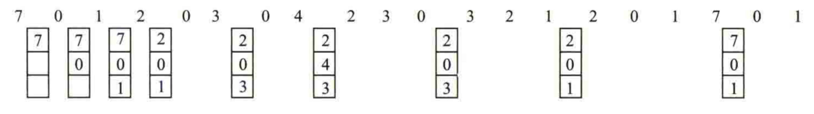  

#### 先进先出页面置换算法
> first in first out, FIFO

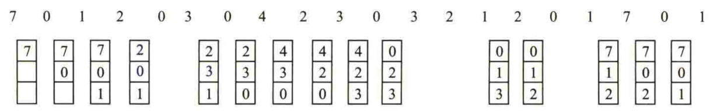  

#### 最近最久未使用页面置换算法
> least recently used, LRU

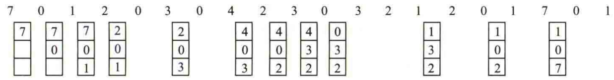  

**最少使用页面置换算法**
> least frequently used, LFU 

#### Clock页面置换算法

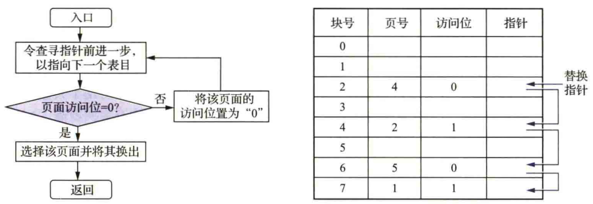 

 
## “抖动”
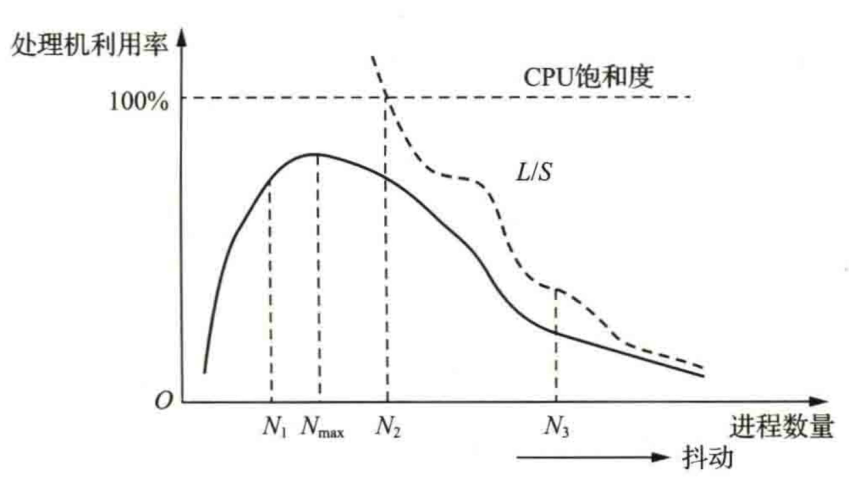  

## 工作集

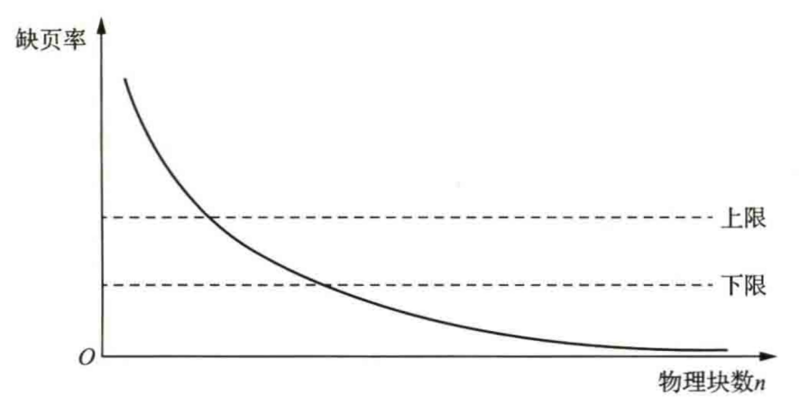  

