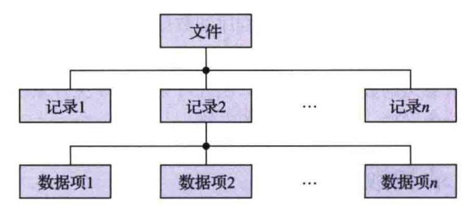
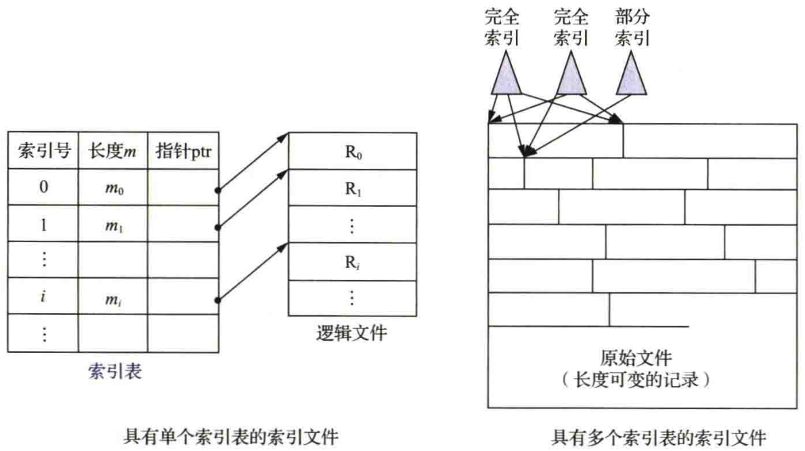
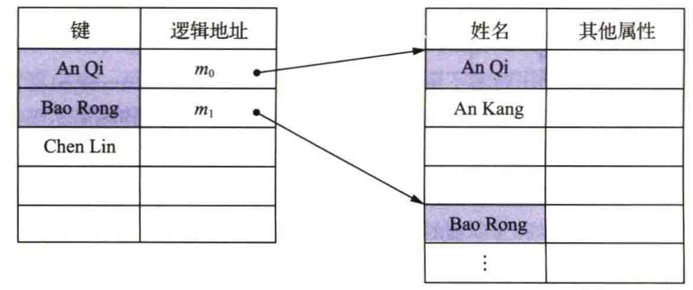
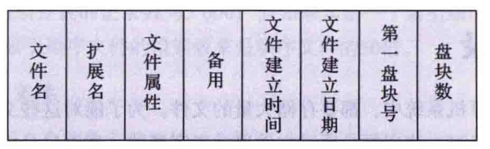

# (っ*´Д`)っ文件系统基础
## 概念
- 文件系统组成：文件集合和目录  
- 文件系统的管理功能是通过将其管理的程序和数据组织成一系列文件的方式实现的，而文件则是指具有文件名的若干相关元素的集合  
- 元素通常是记录，而记录又是一组有意义的数据项的集合  
- 基于文件系统的概念，可以把数据的组成分为文件、记录和数据项三级

**数据项**   

- **基本数据项**：是用于描述一个对象的某种属性的字符集，是数据组织中可以命名的最小逻辑数据单位，又称为**字段**  
- **组合数据项**：是由若于个基本数据项所组成的，简称**组项**  

**记录**     

- 一组相关数据项的集合，用于描述一个对象在某方面的属性  
- 在诸多记录中，为了能唯一地标志一个记录，必须在其各个数据项中确定出一个或几个数据项，并把它们的集合称为**关键字** (key)  

**文件**     

- 由创建者所定义的 、 具有文件名的一组相关元素的集合，可分为有结构文件和无结构文件两类  
  - **有结构**文件：文件由若干个相关**记录**组成  
  - **无结构**文件：被看成一个**字节流**      
- 文件在文件系统中是一个最大的数据单位，它描述了一个对象集  
- 主要属性  
  - **文件类型** ：从不同的角度来规定文件的类型，如源文件、目标文件及可执行文件等  
  - **文件长度** ：指文件的当前长度，长度的单位可以是字节 、 字或块，也可以是允许的最大长度  
  - 文件的**物理位置** ：通常用于指示文件所在的设备及文件在该设备中地址的指针  
  - 文件的**建立时间** ：亦指文件最后一次的修改时间    

## 逻辑结构
系统中的所有文件都存在着以下两种形式的文件结构:   
1. **文件的逻辑结构**( $file\  logical\   structure$ ) ：是指从用户角度出发所观察到的文件组织形式，即文件是由一系列的逻辑记录所组成的，是用户可以直接处理的数据及其结构，它独立千文件的物理特性，又称为文件组织( $file\   organization$ )。 对应的文件通常称为逻辑文件  
2. **文件的物理结构** ：又称为文件的存储结构，是指系统将文件存储在外存上所形成的一种存储组织形式，是用户所看不见的 。 文件的物理结构不仅与存储介质的存储性能有关，而且与所采用的外存分配方式也有关 。 无论是文件的逻辑结构，还是文件的物理结构，都会影响系统对文件的检索速度

#### 顺序文件
**顺序文件的排列方式**

- **串结构** ： 记录通常按存入文件先后时间进行排序，记录间的顺序与关键字无关。在检索时必须从头开始查找直至找到指定记录或查完所有的记录 
- **顺序结构** ： 由用户指定一个字段作为关键字，它可以是任意类型的变量，其 中最简单的是正整数，如 $0$ 到 $N-1$ 关键字值在文件中唯一。顺序文件可以有更高的检索速度和效率

**顺序文件的优缺点**
- 优点  
  - 最佳应用场合是在对文件中的记录进行批量存取时，即每次要读／写一大批记录时
  - 对于顺序存储设备（如磁带），也只有顺序文件才能被存储并有效地工作  
- 缺点  
  - 查找或修改单个记录性能很差
  - 增加、删除、记录困难   
#### 索引文件
**按关键字建立索引**  

- 为变长记录顺序文件建立一张索引表，为主文件中的每个记录在索引表中分别设置一个**索引表项**，用于记录指向记录的指针（即记录在逻辑地址空间的起始地址）以及记录的长度  
- 索引表按关键字排序，因此其本身也是一个定长记录的顺序文件，这样就把对变长记录顺序文件的顺序检索，转变成了**对定长记录索引文件**( $index\   file$ )的随机检索，从而加快了记录检索速度，实现了**直接存取**   
- 由于是按关键字建立的索引，因此在对索引文件进行检索时，可以根据用户（程序）提供的关键字，利用**折半查找法**检索索引表，从中找到相应的表项：再利用该表项中所给出的指向记录的指针去访问所需的记录  
- 每当要在索引文件中**增加一个新记录**时，便须对索引表进行修改  
- 由于索引文件具有较快的检索速度，其主要应用于**对信息处理的及时性有较高**要求的场合   

**具有多个索引表的索引文件**

- 按关键字建立索引表的索引文件与顺序文件一样，都只能按该关键字进行检索。而实际应用情况往往是：不同的用户为了不同的目的，希望能按不同的属性（或不同的关键字）来检索一条记录  
- 为实现此要求，需要为顺序文件建立多个索引表，即为每种可能成为检索条件的域（属性或关键字）都配置一张索引表   
- 每张索引表都按相应的一种属性或关键字进行排序  
#### 索引顺序文件
**索引顺序文件的特征**  

- 索引顺序文件( $index\   sequential\   file$ )是对顺序文件的一种改进，它基本上克服了变长记录的顺序文件不能被随机访问以及不便于删除和插入记录等缺点，但同时保留了顺序文件的关键特征，即记录是按关键字的顺序组织起来的  
- 增加了两个特征：
  - **引入文件索引表**，通过该表可以实现对索引顺序文件的随机访问
  - **增加溢出**( $overflow$ )**文件**，用它来记录新增加的、删除的和修改的记录

**一级索引顺序文件**   

  
- 一个顺序文件中所含有的记录的数量为 $N$ ,为检索到指定关键字的记录须平均查找 $N/2$ 个记录  
- 于索引顺序文件，为检索到指定关键字的记录，平均须查找 $\sqrt{N}$ 个记录数，因而其检索效率比顺序文件约高了 $\sqrt{N}/2$ 倍

**两级索引顺序文件**  
- 平均须查找记录数 $(3/2)^3\sqrt{N}$ 

## 目录结构
 
#### 文件控制块和索引节点
- 为了能对一个文件进行正确的存取，必须为文件设置**用于描述和控制文件的数据结构**，称之为**文件控制块**(file control block,FCB)  
- 文件管理程序可借助于FCB中的信息对文件施以各种操作  
- 文件与FCB一一对应，而人们把**FCB的有序集合**称为文件目录，即一个FCB就是一个文件目录项  
- 通常，一个文件目录也被看作一个文件，称为目录文件

**FCB**

- **基本信息类**  
  - **文件**  
    指用于标志一个文件的符号名，在每个系统中，每个文件都必须有唯一的名字，用户利用该名字进行存取  
  - 文件**物理位置**  
    指文件在外存中的存储位置，它包括存放文件的设备名、文件在外存上的起始盘块号、指示文件所占用的盘块数或字节数的文件长度  
  - 文件**逻辑结构**  
    指示文件是流式文件还是记录式文件、文件中的记录数、文件是定长记录还是变长记录等  
  - 文件的**物理结构**  
    指示文件在外存中的组织方式，如连续组织方式、链接组织方式或索引组织方式等
- **存取控制信息类**  
  - 文件拥有者的存取权限  
  - 核准用户的存取权限  
  - 一般用户的存取权限   
- **使用信息类**  
  - 文件的建立日期和时间  
  - 文件上一次修改的日期和时间  
  - 当前使用的信息  
  - 这些信息包括当前已打开该文件的进程数、是否被其他进程锁住、文件在内存中是否已被修改但尚未复制到盘上等  
  - 对于不同OS的文件系统，由于功能不同，它们可能只含有上述信息中的部分信息
  

8.3.1

#### 单级目录和两级目录
8.3.2

#### 树形目录和图形目录
8.3.3/4

## 文件共享
8.4

## 文件保护
#### 访问类型
8.5.2

#### 访问控制
8.5.4

# 文件系统实现
## 文件系统的层级结构
8.1.3

## 目录实现
8.3.5

## 文件实现
9.1

# 磁盘组织与管理
## 磁盘的结构
7.8.1

## 磁盘的调度算法
7.8.2/3

## 磁盘的管理
9.2
