### 程序并发执行时的特征
- 间断性
- 失去封闭性
- 不可再现性

# 进程

## 进程的定义

- 为了使程序可以并发执行，并且可以对并发执行的程序加以描述和控制，人们在OS 中引入了”进程”这一概念  
- 为使参与并发执行的每个程序（含数据）都能独立地运行，在OS中必须为之配置一个专门的数据结构，称之为**进程控制块**(process control block, **PCB**)   
- 系统利用PCB来描述进程的基本情况和活动过程，进而控制和管理进程  
- 这样，由**程序段**、**相关的数据段**和**PCB**这3部分便构成了进程实体（又称为**进程映像**）  
- 一般情况下，我们把进程实体简称为进程，例如，所谓创建进程，实质上是指创建进程的PCB ；而撤销进程，实质上是指撤销进程的PCB  

##### 不同角度
- 对于进程，从不同的角度可以给出不同的定义，其中较典型的定义有以下3种。
  1. 进程是程序的一次执行  
  2. 进程是一个程序及其数据在处理机上顺序执行时所发生的活动  
  3. 进程是具有独立功能的程序在一个数据集上执行的过程，它是系统进行资源分配和调度的一个独立单位  

> 传统OS中的进程定义为:"进程是程序的执行过程，是系统进行资源分配和调度的一个独立单位".


## 进程的特征

- 动态性  
  - 进程的实质是程序的执行过程，因此，**动态性**就是进程最基本的特征  
  - 动态性还表现在：进程由创建而产生，由调度而执行，由撤销而消亡  
  - 由此可见，进程有**一定的生命期**，而程序则只是**一组有序指令的集合**，并存放千某种介质上，其本身并不具有活动的含义， 是静态的
- 并发性  
  - 指多个进程共存于内存中，且能在一段时间内同时执行 
- 独立性  
  - 指进程是一个能够**独立运行、独立获得资源、独立接受调度的基本单位**。凡未建立PCB 的程序都不能作为一个独立的单位参与并发执行
- 异步性  
  - 按**各自独立的、不可预知的速度**向前推进  
  - 为了使进程在并发执行时虽具有异步性，但仍能保证进程并发执行的结果是可再现的，在OS 中引入了进程的概念，并且配置了相应的进程同步机制  

## 进程的基本状态与转换

#### 进程的3种基本状态

- 就绪 **(ready)** 状态
  - 进程已分配到除CPU以外的所有必要资源后，**只要再获得CPU, 便可立即执行**  
  - 如果系统中有许多处于就绪状态的进程，则通常会将它们按一定的策略（如优先级策略）排成一个队列，称该队列为**就绪队列**
- 执行 **(running)** 状态
  - 进程获得CPU后其程序"正在执行"这一状态   
  - 对任何一个时刻而言，在**单处理机系统**中，**只有一个**进程处于执行状态    
  - 在**多处理机系统**中，则可能会有**多个**进程处于执行状态。
- 阻塞 **(block)** 状态  
  - 正在执行的进程由于发生某事件（如I/0请求、申请缓冲区失败等）而暂时无法继续执行  
  - 通常系统会将处于阻塞状态的进程排成一个队列，称该队列为**阻塞队列**  

#### 进程3种基本状态间的转换
- **就绪** $\rightarrow$ **执行**  
  处于就绪状态的进程，在调度程序为之分配处理机之后便可执行  
- **执行** $\rightarrow$ **就绪**  
  正在执行的进程（当前进程），因分配给它的时间片已完而被剥夺处理机暂停  
- **执行** $\rightarrow$ **阻塞**  
  因发生某事件而致使当前进程的执行受阻（例如进程访问某临界资源而该资源又正在被其他进程访问），使之无法继续执行  

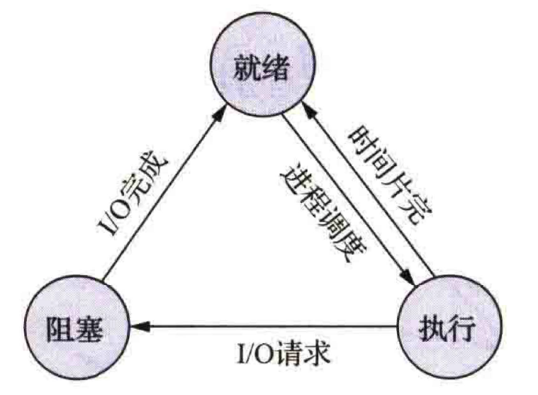  

## 创建状态和终止状态

- **创建状态**
  - 进程申请一个空白PCB, 并向PCB 中填写用于控制和管理进程的信息
  - 为该进程分配运行时所**必需的资源**  
  - 把该进程的状态转换为就绪状态并将其**插入就绪队列**之中
  - 进程所必需的**资源未满足**，进程不能被调度运行，此时进程所处的状态称为**创建状态**   
- **终止状态**
  - 等待OS进行善后处理  
  - 将进程的PCB清零，并将PCB空间返还OS  

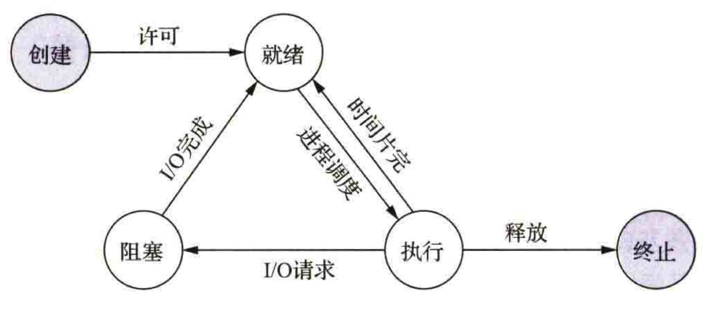  


## 挂起操作和进程状态的转换

#### 挂起操作的引入

- 终端用户的需要  
- 父进程的需要  
- 负荷调节的需要  
- OS 的需要  

#### 引入挂起操作后进程3个基本状态间的转换


- **活动就绪** $\rightarrow$ **静止就绪** 
  - 进程处于未被挂起的就绪状态，称为活动就绪状态，表示为Readya, 此时进程可以接受调度  
  - 当用挂起原语Suspend将该进程挂起后，该进程的状态便转换成了静止就绪状态，表示为Readys   
  - 处于Readys状态的进程不会再被调度执行。
- **活动阻寒** $\rightarrow$ **静止阻塞**  
  - 进程处于未被挂起的阻塞状态，称为活动阻塞状态，表示为Blockeda   
  - 当用挂起原语Suspend将该进程挂起后，进程的状态便转换成了静止阻塞状态，表示为Blockeds   
  - 处千该状态的进程在其所期待的事件发生后，它将从静止阻塞状态变为静止就绪状态  
- **静止就绪** $\rightarrow$ **活动就绪**  
  - 处于Readys状态的进程，若用激活原语Active将其激活，则该进程的状态将会转换为Readya状态。
- **静止阻塞** $\rightarrow$ **活动阻塞**  
  - 处于Blockeds状态的进程，若用激活原语Active将其激活，则该进程的状态将会转换为Blockeda状

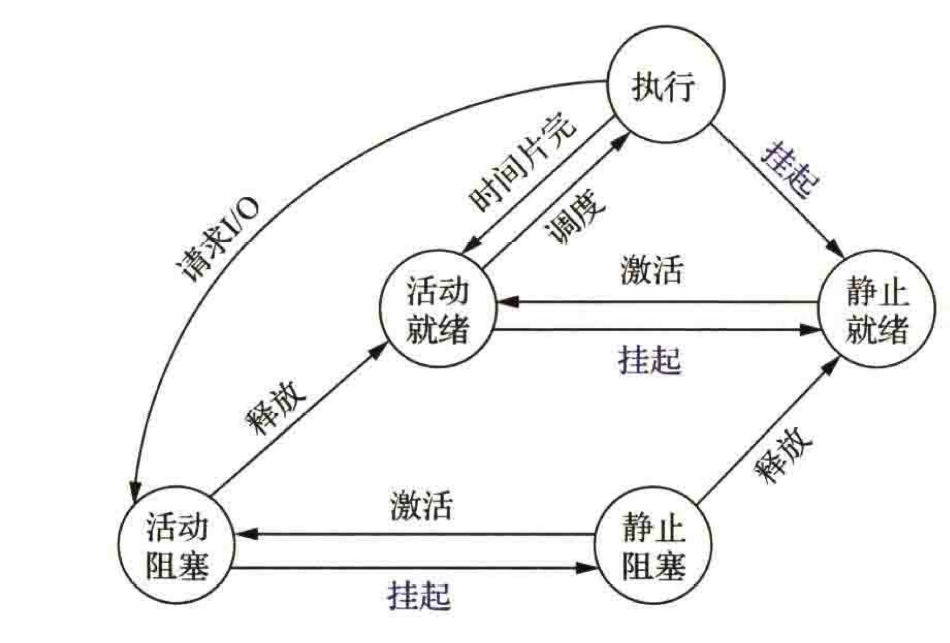  

#### 引入挂起操作后进程5 个基本状态间的转换

- **NULL** $\rightarrow$ **创建**  
  - 一个新进程产生时，该进程处于创建状态  
- **创建** $\rightarrow$ **活动就绪**  
  - 在当前系统的性能和内存容量均允许的情况下，当完成进程创建的必要操作后，相应地系统会将进程状态转换为活动就绪状态  
- **创建** $\rightarrow$ **静止就绪**  
  - 在当前的系统资源状况和性能要求不允许的情况下，系统不会分配给新建进程所需资源（主要是内存），相应地系统会将进程状态转换为静止就绪状态  
  - 进程被安置在外存，不参与调度，此时进程创建工作尚未完成   
- **执行** $\rightarrow$ **终止**   
  - 当一个进程已完成任务，或是出现了无法克服的错误他进程所终止时，将进程状态转换为终止状态  

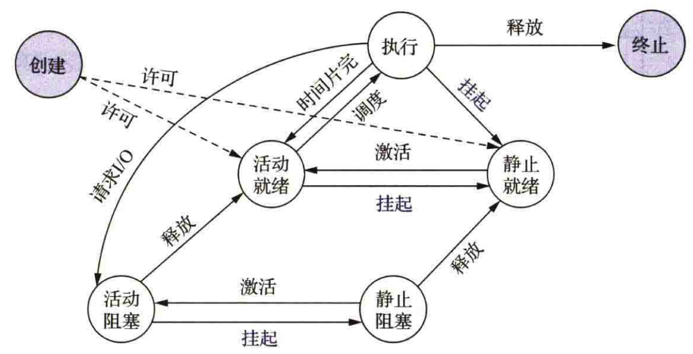  


## 进程管理中的数据结构

#### OS中用于管理资源和控制进程的数据结构
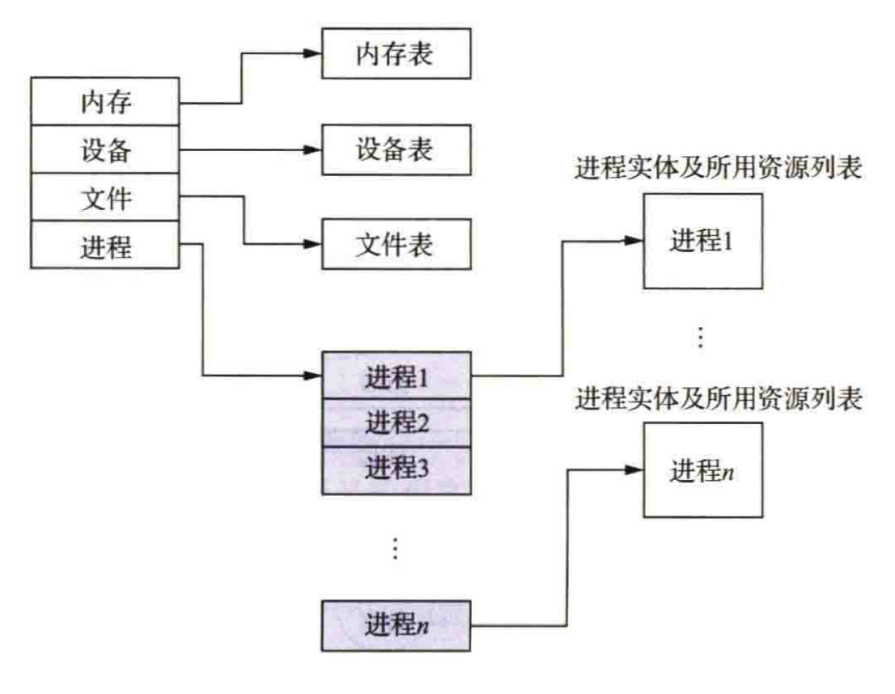  


#### PCB 的作用

- 作为独立运行基本单位的标志  
- 实现间断性运行方式  
- 提供进程管理所需要的信息  
- 提供进程调度所需要的信息  
- 实现与其他进程的同步与通信

#### PCB 中的信息

- 进程标识符
  用于唯一地标志一个进程  
  - 外部标识符  
    1. 为方便用户（进程）对进程的访问，须为每个进程设置一个外部标识符     
    2. 它是由创建者提供的，通常由字母和数字组成。为了描述进程的家族关系，还应设置父进程标识符和子进程标识符    
    3. 此外，还可设萱用户标识符，以指示拥有该进程的用户  
  - 内部标识符  
    1. 为方便系统对进程的使用，为进程设置了内部标识符，赋予每个进程唯一的一个数字标识符，它通常是一个进程的序号    
- 处理机状态  
  由处理机的各种寄存器中的内容组成  
  1. 通用寄存器  
  2. 指令计数器   
  3. 程序状态字寄存器  
  4. 用户栈指针寄存器  
- 进程调度信息
  1. 进程状态  
  2. 进程优先级  
  3. 进程调度所需要的其他信息  
  4. 事件 (即阻塞原因)
- 进程控制信息
  1. 程序和数据的地址  
  2. 进程同步和通信机制  
  3. 资源清单  
  4. 链接指针  

#### PCB 的组织方式

- 线性方式
  将系统中所有的PCB都组织在**一张线性表**中，将该表的起始地址存放在内存的一个专用区域中，适合**进程数目不多的系统**  

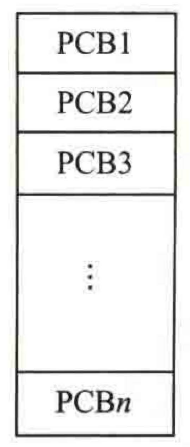  


- 链接方式
通过PCB 中的链接字，将具有相同状态的进程的PCB分别链接成一个队列。对就绪队列而言，其往往会按进程的**优先级**将PCB从高到低进行排列

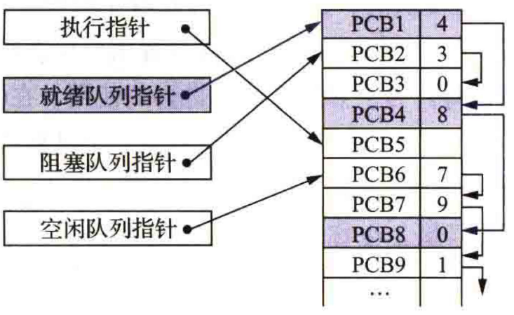  


- 索引方式
系统根据所有进程状态的不同，建立几张索引表，如就绪索引表、阻塞索引表等，并把各索引表在内存中的起始地址记录在内存的一些专用单元中

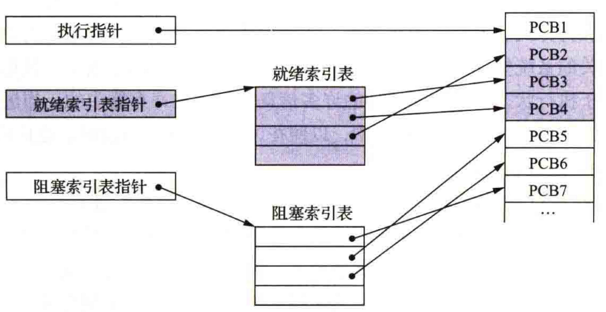  

# 进程控制

- 父进程  
  创建进程的进程

## 进程的创建
#### 引起进程创建的事件

- 用户登录  
- 作业调度  
- 提供服务  
- 应用请求

#### 进程的创建过程
1. **申请空白PCB**  
2. 为新进程**分配运行所需资源**，包括各种物理和逻辑资源，如内存、文件、I/0设备和CPU时间等 
   1. 对于批处理作业，其大小可在用户提出创建进程要求时提供   
   2. 对于为应用进程创建子进程，也应在该进程提出创建进程的请求中给出所需内存的大小    
   3. 对于交互型作业，可以不给出内存要求而由系统分配一定的内存空间，如果新进程要共享内存中的某个地址空间（即巳装入内存的共享段），则必须建立相应的链接   
3. **初始化PCB**  
   1. 初始化标志信息，将系统分配的标识符和父进程标识符填入新PCB 中  
   2. 初始化处理机状态信息，使程序计数器指向程序的人口地址，使栈指针指向栈顶    
   3. 初始化处理机控制信息，将进程的状态设置为就绪状态或静止就绪状态，通常还须将其设置为最低优先级，除非用户以显式方式提出高优先级要求    
4. 如果进程**就绪队列**能够接纳新进程，就将新进程插入就绪队列  
   1. 进程创建新进程时，有两种执行的可能
      1. 父进程与子进程并发执行  
      2. 父进程等待，直到其某个或全部子进程执行完毕  
   2. 新进程的地址空间也有两种可能  
      1. 子进程是父进程的复制品（即子进程具有与父进程相同的程序和数据）  
      2. 子进程加载另一个新程序  

## 进程的终止

#### 引起进程终止的事件
1. 正常结束
2. 异常结束
   1. **越界错** 
   2. **保护错**：进程试图去访问一个不允许（不适当的方式）访问的资源或文件
   3. **指令错**：程序试图去执行一条不存在的指令（非法指令）    
   4. **特权指令错**：进程试图去执行一条只允许OS执行的指令    
   5. **运行超时**    
   6. **等待超时**  
   7. **算术运算错**  
   8. **I/O错**  
3. 外界干预
   1. 操作员或OS干预   
   2. 父进程请求    
   3. 父进程终止  

#### 进程的终止过程

1. 根据被终止进程的标识符，从PCB集合中**检索**出该进程的PCB, 并从该进程的PCB中**读出该进程的状态**   
2. 若被终止进程正处于执行状态，则立即**终止该进程的执行**，并置调度标志为真，以指示该进程被终止后应重新进行调度  
3. 若该进程还有子孙进程，则还应**终止其所有子孙进程**，以防止它们成为不可控的进程  
4. 将被终止的进程所拥有的**全部资源**，或**归还给其父进程**，或**归还给系统**  
5. 将被终止进程的PCB从所在队列（或链表）中**移出**，等待其他程序来搜集信息 

## 进程的阻塞与唤醒

#### 引起进程阻塞与唤醒的事件

- 向系统请求共享资源失败  
- 等待某种操作的完成  
- 新数据尚未到达
- 等待新任务的到达

#### 进程阻塞过程

1. 进程通过调用阻塞原语block将自己阻塞  
2. 系统应首先立即停止执行该进程  
3. 系统把PCB中的现行状态由执行改为阻塞  
4. 系统将PCB插入阻塞队列  
5. 转至调度程序进行重新调度操作，将处理机分配给另一就绪进程并进行切换

#### 进程唤醒过程
- 有关进程（如提供数据的进程）调用唤醒原语wakeup 以将等待该事件的进程唤醒  
  - 首先把被阻塞的进程从等待该事件的阻塞队列中移出   
  - 将其PCB 中的现行状态由阻塞改为就绪  
  - 将该PCB插入就绪队列中  

## 进程的挂起与激活

#### 进程的挂起

- 利用挂起原语suspend将指定进程或处于阻塞状态的进程挂起  
  - 检查被挂起进程的状态，若为活动就绪状态，则将其改为静止就绪状态  
  - 针对处于活动阻塞状态的进程，将其状态改为静止阻塞状态  
  - 为了方便用户或父进程考查该进程的运行情况，把该进程的PCB复制到某指定的内存区域   
  - 若被挂起的进程正在执行，则转向调度程序重新调度 

#### 进程的激活

- 利用激活原语active将指定进程激活。active的执行过程是  
  - 将进程从外存调入内存，然后检查该进程的现行状态  
  - 若是静止就绪，则将其改为活动就绪  
  - 若是静止阻塞，则将其改为活动阻塞  
  - 假如采用的是抢占调度策略，则每当有静止就绪进程被激活而插入就绪队列时，便应检查是否要进行重新询度，即由调度程序将被激活进程与当前进程两者的优先级进行比较，如果被激活进程的优先级较低，就不必重新调度。否则，立即终止当前进程的运行，并把处理机分配给刚被激活的进程

# 进程通信

## 进程通信的类型

#### 共享存储器系统

- 基于共享数据结构的通信方式  
- 基于共享存储区的通信方式

#### 管道通信系统
> “管道” (pipe) ，是指用于连接一个读进程和一个写进程以实现它们之间通信的一个共享文件，又名pipe文件。向管道（共享文件）提供输入的发送进程（即写进程），会以字节流形式将大量的数据送入管道；而接收管道输出的接收进程（即读进程），则会从管道中接收（读）数

管道机制必须提供以下3方面能力  
- 互斥  
- 同步
- 确定对方是否存

#### 消息传递系统

- 直接通信方式  
  是指发送进程利用OS所提供的发送原语，直接把消息发送给目标进程  
- 间接通信方式  
  是指发送进程和接收进程都通过共享中间实体（称为信箱）的方式进行消息的发送和接收，进而完成进程间的通信

#### 客户机－服务器系统

- **套接字(socket)**  
  >一个套接字就是一个通信标志类型的数据结构， 包含通信目标地址、通信使用的端口号、通信网络的传输层协议、进程所在的网络地址以及针对客户或服务器程序所提供的不同系统调用或API等，是进程通信和网络通信的基本构件  
  - 基于文件型  
    - 基于本地文件系统支待的。一个套接字会关联一个特殊的文件，通信双方通过对这个特殊文件进行读／写而实现通信  
  - 基于网络型   
    - 采用非对称方式通信书即发送者需要提供接收者的名称。通信双方的进程运行在不同主机的网络环境下。通信被分配了一对套接字，其中一个属于接收进程（或服务器端），另一个属于发送进程（或客户端）  

- **远程过程调用(remote procedure call, RPC)**
    > 一个通信协议，用于通过网络连接的系统。该协议允许运行于一台主机（本地）系统上的进程调用另一台主机（远程）系统上的进程，如果涉及的软件采用面向对象编程，那么远程过程调用亦可称作远程方法调用

# 线程的概念
> 引入进程的概念，解决了在单处理机环境下的程序并发执行问题。目的是使多个程序能并发执行，以提高资游利用率和系统吞吐量

## 线程的引入
> 为了减少程序在并发执行时所付出的时空（时间和空间）开销，以使OS具有更好的并发性


#### 进程的两个基本属性
- 进程是一个可拥有资源的独立单位  
- 进程同时又是一个可独立调度和分派的基本单位

#### 程序并发执行所须付出的时空开销

- 创建进程  
- 撤销进程  
- 进程切换

#### 线程——作为调度和分派的基本单位
以线程为调度和分派的基本单位，有效改善多处理机系统的性能

## 线程进程的比较
- 线程：轻型进程 ( light-weight process,LWP )   
- 传统进程：重型进程 ( heavy-weight process, HWP )  

#### 调度的基本单位

- 把线程作为调度和分派的基本单位，因而**线程是能独立运行的基本单位**   
- 当进行线程切换时，仅须保存和设置少量寄存器的内容，切换代价远低于进程   
- 在同一进程中，线程的切换不会引起进程的切换   
- 从一个进程中的线程切换到另一个进程中的线程时，会引起进程的切换  

#### 并发性

- 一个进程中的多个线程之间亦可并发执行  
- 一个进程中的所有线程都能并发执行  
- 不同进程中的线程也能并发执行

#### 拥有资源

- 线程几乎不拥有资源，其仅有的资源为了确保自身能够独立运行  
  - 每个线程中都应有用于控制线程运行的**线程控制块**(thread control block, TCB)   
  - 用于指示被执行指令序列的**程序计数器**  
  - 用于保留局部变量、少数状态参数和返回地址等的一组**寄存器**  
  - **堆栈**  
- 线程除了拥有自己的少量资源外，还允许多个线程共享它们共属的进程所拥有的资源  
  - 属于同一进程的所有线程都具有相同的地址空间，线程可以访问该地址空间中的每一个虚地址  
  - 线程还可以访问其所属进程所拥有的资源，如己打开的文件、定时器、信号量机构等的内存空间，以及线程所申请到的I/0设备等

#### 独立性

- 同一进程中的不同线程之间的独立性，比不同进程之间的独立性低  
- 每个线程都可以访问它们所属进程地址空间中的所有地址  
- 一个线程的堆栈可以被其他线程读／写，甚至完全清除。由一个线程打开的文件，可以供其他线程读／写

#### 系统开销

- 线程的切换代价远低于进程  
- 多个线程具有相同的地址空间，线程之间的同步和通信比进程简单    
- 在一些OS中，线程的切换、同步以及通信都无须OS内核的干预  

#### 支持多处理机系统

可以将一个进程中的多个线程分配到多个处理机上，并行运行

## 线程状态和线程控制块

#### 线程执行的3个状态

- 就绪状态  
- 执行状态  
- 阻塞状态  

#### 线程控制块

1. 线程标识符：为每个线程赋予一个唯一的线程标识符  
2. 一组寄存器（包括程序计数器、状态寄存器和通用寄存器等） 的内容  
3. 线程执行状态：描述线程正处于何种执行状态  
4. 优先级：描述线程执行的优先程度  
5. 线程专有存储区：用于在线程切换时存放现场保护信息和与该线程相关的统计信息等  
6. 信号屏蔽：即对某些信号加以屏蔽  
7. 堆栈指针：为每个线程设置一个堆栈，用它来保存局部变量和返回地址

#### 多线程OS中的进程属性

- 进程是一个可拥有资源的基本单位  
- 多个线程可井发执行  
- 进程已不是可执行的实体

# 线程的实现
## 线程的实现方式
#### 内核支持线程
> 内核支持线程(kernel supported thread, KST)

- 优点  
  - 在多处理机系统中，内核能够同时调度同一进程中的多个线程并行运行  
  - 如果进程中的一个线程被阻塞，则内核可以调度该进程中的其他线程来占有处理机并运行，也可运行其他进程中的线程  
  - 内核支持线程具有很小的数据结构和堆栈线程的切换比较快，切换开销小    
  - 内核本身也可以采用多线程技术，可以提高系统的执行速度和效率  
- 缺点  
  - 对于用户的线程切换而，其模式切换的开销较大  
  - 在同一个进程中，从一个线程切换到另一个线程时需要从用户态转到内核态进行，这是因为用户进程的线程在用户态运行，而线程调度和管理是在内核中实现的，系统开销较大。

#### 用户级线程
> 用户级线程( user level thread, ULT )

- 优点  
  - 线程切换不需要转换到内核空间。对一个进程而言，其所有线程的管理数据结构均在该进程的用户空间中，管理线程切换的线程库也在用户空间运行，因此进程不用切换到内核方式来做线程管理，从而节省了模式切换的开销  
  - 调度算法可以是进程专用的。在不干扰OS调度的情况下，不同的进程可以根据自身需要选择不同的调度算法，以对自己的线程进行管理和调度，而与OS 的低级调度算法无关  
  - 用户级线程的实现与OS平台无关，因为面向线程管理的代码属于用户程序的一部分， 所有的应用程序都可以共这段代码。因此， ULT甚至可以在不支持线程机制的OS平台上实现。

- 缺点  
  - 系统调用的阻塞问题。在基于进程机制的OS 中大多数系统调用都会使进程阻塞，因此，当线程执行一个系统悯用时，不仅该线程会被阻塞，而且进程内的所有线程均会被阻塞。而在KST方式下，进程中的其他线程仍然可以运行  
  - 在单纯的ULT实现方式中，多线程应用不能利用多处理机可以进行多重处理的这一优点。内核每次分配给一个进程的仅有一个CPU, 因此，进程中仅有一个线程能执行，在该线程放弃CPU之前，其他线程只能等待。

#### 两种线程的组合方式

- 多对一模型  
  将多个ULT映射到一个KST上  
  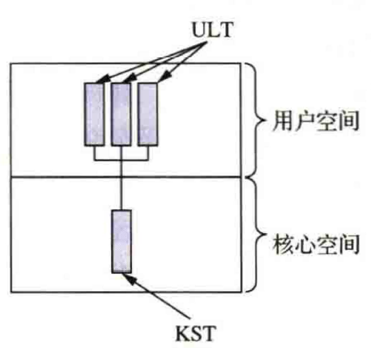   
  - ULT一般属于一个进程，运行在该进程的用户空间，调度和管理也在该进程的用户空间中完成。**仅当ULT需要访问内核时**，将其映射到一个KST上，但每次只允许一个线程进行映射  
    - 优点    
      - 线程管理的开销小，效率高    
    - 缺点    
      - 如果**一个线程**在访问内核时发生**阻塞**， 则**整个进程都会被阻塞**    
      - 在任一时刻，只有一个线程能够访问内核，多个线程不能同时在多个处理机上运行  
   
 

- 一对一模型  
  将每个ULT映射到一个KST上
  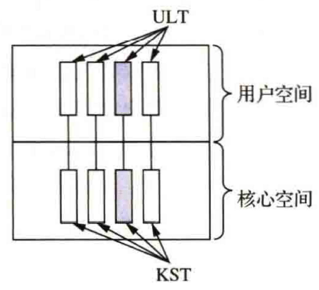    
  - 优点  
    - 当一个线程阻塞时，允许调度另一个线程运行  
    - 在多处理机系统中，允许多个线程并行地运行在多处理机系统上  
  - 缺点是  
    - 每创建一个ULT, 相应地就需要创建一个KST , 开销较大


- 多对多模型  
  将许多ULT映射到同样数益或较少数最的KST上
  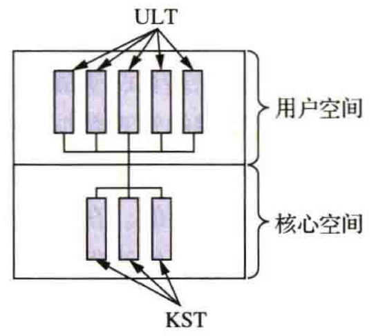  
  - 优点
    - 可以像一对一模型那样使一个进程的多个线程并行地运行在多处理机系统上，也可以像多对一模型那样减少线程管理开销并提高效率

# 处理机调度概述
> 调度的实质是—种资源分配，处理机调度是对处理机进行分配。处理机调度算法是指根据处理机分配策略所规定的处理机分配算法

## 处理机调度的层次

#### 高级调度
> 高级调度(high level scheduling)又称为长程调度或作业调度

- 调度对象：**作业**    
- 主要功能：根据某种算法，决定将外存中处于后备队列中的哪几个作业调入内存，为它们创建进程、分配必要的资源，并将它们放入就绪队列    
- 高级调度主要用于**多道批处理系统**中，而在分时系统和实时系统中，不设置高级调度  


#### 低级调度
> 低级调度(low level scheduling) 又称为短程调度或进程调度  

- 调度对象：**进程**（或LWP）  
- 主要功能：根据某种算法，决定就绪队列中的哪个进程应获得处理机，并由分派程序将处理机分配给被选中的进程  
- 低级调度是最基本的一种调度，在**多道批处理**、**分时**和**实时**这3种系统中，都必须配置这种调度

#### 中级调度

> 中级调度(intermediate schedu1ing) 又称为内存调度、中程调度   

- 目的:提高内存利用率和系统吞吐量。为此，应把那些暂时不能运行的进程调至外存等待，此时进程的状态称为就绪驻外存状态（或挂起状态）  
- 当它们已具备运行条件且内存稍有空闲时，由中级调度来决定把外存上的那些已具备运行条件的就绪进程再重新调入内存，并修改它们的状态为就绪状态，挂在就绪队列上等待 
- 中级调度实际上就是存储器管理中的对换功能  

 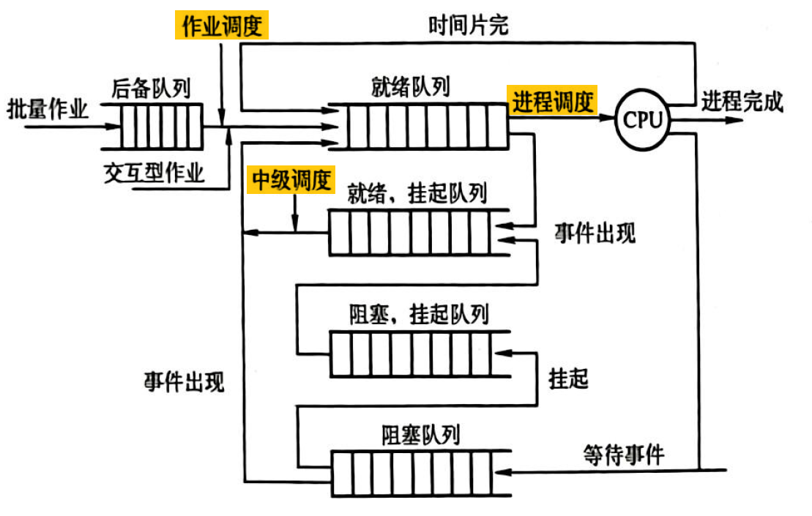  

> [!abstract] 低级调度的运行频率最高，在分时系统中通常仅10ms~100ms便进行一次低级调度，因此把它称为短程调度</p> 高级调度（作业调度）往往发生在一批作业已运行完毕退出系统，又需要重新调入一批作业进入内存的时候,周期较长，几分钟一次，因此把它称为长程调度</p>中级调度的运行频率基本上介于上述两种调度之间  

## 作业和作业调度

#### 作业
作业是一个比程序更为广泛的概念，它不仅包含了通常的程序和数据，而且配有一份作业说明书，系统根据该说明书对程序的运行进行控制。在多道批处理系统中，会将作业作为基本单位从外存调入内存

#### 作业控制块

- 为了管理和调度作业，在**多道批处理系统**中，为每个作业设置了一个作业控制块(job control block , JCB)   
- JCB是作业在系统中存在的标志，其中保存了**系统对作业进行管理和调度所需的全部信息**  
- JCB 中包含的内容  
  - 作业标志  
  - 用户名称  
  - 用户账号  
  - 作业类型（CPU繁忙型、I/0繁忙型、批量型、终端型）  
  - 作业状态  
  - 调度信息（优先级、作业运行时间）  
  - 资源需求情况（预计运行时间、要求内存大小）  
  - 资源使用情况等  


- 当一个作业进入系统时
  - ”作业注册＂程序为该作业建立一个JCB  
  - 根据作业类型将其放到相应的作业后备队列中等待调度  
  - 调度程序依据一定的调度算法来调度，被调度到的作业将被装入内存
  - 作业运行期间，系统按照JCB 中的信息和作业说明书对作业进行控制
- 一个作业执行结束并进入完成状态时
  - 系统回收巳分配给它的资源，并撤销其JCB


#### 作业调度的主要任务

- 根据JCB 中的信息，检查系统中的资源能否满足作业的需求   
- 按照一定的调度算法从外存的作业后备队列中选取某些作业调入内存，并为它们创建进程和分配必要的资源    
- 将新创建的进程排在就绪队列上等待调度  

- 每次执行作业调度时、都须做出以下两个决定  
  - 接纳多少个作业  
  - 接纳哪些作业  

## 进程调度

#### 进程调度任务

- 保存CPU现场信息  
- 按某种算法选取进程  
- 把CPU分配给进程  

#### 进程调度机制

1. **排队器** 
   - 为提高进程调度的效率，应按照一定的策略将系统中所有就绪进程排成一个或多个队列，以便调度程序找到  
   - 每当有进程转变为就绪状态，排队器便将它插入相应的就绪队列  
2. **分派器**  
   - 分派器将进程调度程序选定的进程从就绪队列中取出到新选进程间的上下文切换，以将CPU分配给新选进程  
3. **上下文切换器**  
   - 第一对上下文切换时， OS将保存当前进程的上下文，即把当前进程的CPU寄存器内容保存到该进程的PCB内的相应单元，而装入分派程序的上下文，则可以方便分派程序运行  
   - 第二对上下文切换是移出分派程序的上下文，把新选进程的CPU现场信息装入CPU的各个相应寄存器中，以便新选进程运行  

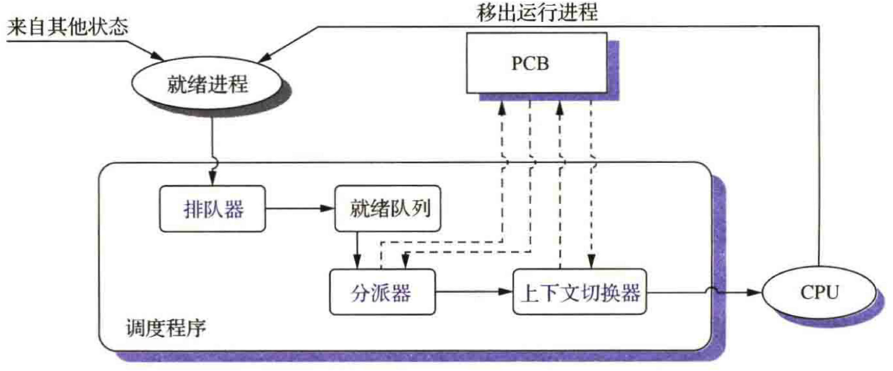  

#### 进程调度方式

###### 非抢占调度方式  
- 把处理机分配给某进程，就会**一直运行下去**，不会因为时钟中断或其他原因去抢占该进程的处理机，直至该进程**完成**或发生某事件而**被阻塞**，才会把分配给该进程的处理机分配给其他进程  
- 可能会引起进程调度的因素  
  - 正在执行的进程运行完毕，或因某事件无法继续运行  
  - 正在执行的进程提出IO请求  
  - 在进程通信或同步过程中执行了原语操作  
- **优点**：实现简单、系统开销小，适用于大多数批处理系统  
- **缺点**：不能用于分时系统和大多数实时系统

###### 抢占调度方式
- 调度程序根据某种原则**暂停**某个正在执行的进程，并将已分配给该进程的处理机**重新分配给另一进程**

- 现代OS中广泛采用抢占调度方式的原因
  - 优先级原则   
  - 短进程优先原则    
  - 时间片原则  

#### 处理机调度算法的目标  

###### 处理机调度算法的共同目标  
- **资源利用率**  $$CPU利用率=\frac{CPU有效工作时间}{CPU有效工作时间 - CPU空闲等待时间}$$  
- **公平性**  
  - 应使各进程都获得合理的CPU时间，以防止发生进程饥饿现象
- **平衡性**  
  - 尽可能保证系统资源使用的平衡性，使系统中的CPU和各种I/0设备都能经常处于忙碌状态  
- **策略强制执行**  
  - 对于所制定的策略（ 其中包括安全策略），只要有需要就必须准确的执行，即使会造成某些工作的延迟也要执行  
###### 批处理系统中处理机调度算法的目标  

- **平均周转时间短**  
  - 周转时间（亦称为作业周转时间） 是指**从作业被提交给系统开始到作业完成为止的这段时间间隔**。包括  
    1. 作业在外存后备队列上等待作业调度的时间  
    2. 进程在就绪队列上等待进程调度的时间  
    3. 进程在CPU上执行所耗费的时间  
    4. 进程等待I/O操作完成的时间  
    - 平均周转时间 $$T=\frac{1}{n}\left(\sum_{i=1}^{n}T_{i}\right)$$  
    - 平均带权周转时间（作业的周转时间$T_i$与系统为它提供服务的时间$T_{s_i}$,之比） $$T_{\mathrm{w}}=\frac{1}{n}\left(\sum_{i=1}^{n}\frac{T_{i}}{T_{\mathrm{s}_{i}}}\right)$$  
- **系统吞吐量高**
  - **单位时间内系统所完成的作业数**，与批处理作业的平均长度有关  
  - 为获得高的系统吞吐量，应更多地选择短作业运行
- **处理机利用率高**
  - 为使处理机的利用率高，应更多地选择计算最大的作业运行


###### 分时系统中处理机调度算法的目标  

- 保证响应时间快    
  - 响应时间包括  
    - 请求信息从键盘输人开始直至传送到处理机的时间  
    - 处理机对请求信息进行处理的时间  
    - 将所形成的响应信息回送到终端显示器的时间  
- 保证均衡性  
  - 系统响应时间的快慢应与用户所请求服务的复杂性相适应


###### 实时系统中处理机调度算法的目标
- 保证满足截止时间的要求  
- 保证可预测性  

# 调度算法

| 调度算法 |   占用$CPU$方式    |         吞吐量         |                  响应时间                  |   开销   |           对进程的影响            | 饥饿问题 |
| :------: | :----------------: | :--------------------: | :----------------------------------------: | :------: | :-------------------------------: | :------: |
|  $FCFS$  |       非抢占       |         不强调         | 可能很慢，特别是当进程的执行时间差别很大时 |   最小   | 对短进程不利；对$I/O$型的进程不利 |    无    |
|   $RR$   | 抢占(时间片用完时) | 若时间片小吞吐量会很低 |          为短进程提供好的响应时间          |   最小   |             公平对待              |    无    |
|  $SJF$   |       非抢占       |           高           |          为短进程提供好的响应时间          | 可能较大 |           对长进程不利            |   可能   |
|  $SRTN$  |    抢占(到达时)    |           高           |              提供好的响应时间              | 可能较大 |           对长进程不利            |   可能   |
|  $HRRN$  |       非抢占       |           高           |              提供好的响应时间              | 可能较大 |            很好的平衡             |    无    |
|   $FB$   | 抢占(时间片用完时) |         不强调         |                   不强调                   | 可能较大 |         对$I/O$型进程有利         |   可能   |

## 先来先服务调度算法
> frrst come frrst server, FCFS

- 最简单的调度算法该算法既可用于作业调度，也可用于进程调度
- 从后备作业队列中选择几个最先进入该队列的作业，调人内存  
- 分配资源和创建进程  
- 放入就绪队列

## 短作业优先调度算法
> short job first, SJF

#### 算法简介
- 作业越短，优先级越高

#### 缺点

- 必须预先知道作业的运行时间    
- 长作业的周转时间明显增长。忽视作业的等待时间，出现**饥饿**现象  
- 无法实现人机交互  
- 未考虑作业的紧迫程度，不能保证紧迫性作业能得到及时处理  

#### 最短剩余时间
> Shortest Remaining Time Next , SRTN

SJF的另一个版本，从非抢占改成了抢占

## 优先级调度算法
> priority-scheduling algorithm , PSA

#### 调度算法类型

- **非抢占式优先级调度算法**  
  - 把处理机分配给就绪队列中优先级最高的进程，该进程便会**一直执行下去直至完成**，或者当该进程因发生某事件而**放弃处理机**时，系统方可将处理机重新分配给优先级次高的进程   
- **抢占式优先级调度算法**  
  - 把处理机分配给优先级最高的进程并使之执行时，只要出现了另一个优先级更高的进程，调度程序就会将处理机分配给新到的优先级更高的进程  
  - 每当系统中出现一个新的就绪进程i时，系统就会将其优先级$P$同正在执行的进程$j$的优先级$P_j$进行比较  

#### 优先级类型

- 静态优先级  
  - 创建进程时确定的，其在进程的整个运行期间保持不变   
  - 依据  
    - **进程类型**:通常系统进程（如接收进程、对换进程等）高于用户进程  
    - **进程对资源的需求**:资源要求**少**优先级**高**  
    - **用户要求**:根据进程的紧迫程度以及用户所付费用的多少  

- 动态优先级  
  - 创建进程时确定优先级，优先级**随进程的推进或等待时间的增加而改变**，以便获得更好的凋度性能

#### 高响应比优先调度算法
> highest response ratio next, HRRN

- 优先级调度算法的特例，通常用于作业调度
- 优先级变化规律  $$优先级=\frac{等待时间 - 要求服务时间}{要求服务时间}$$  
- 由于等待时间与要求服务时间之和就是系统对该作业的响应时间，故该优先级又相当于响应比 $R_p$  $$R_p=\frac{等待时间 - 要求服务时间}{要求服务时间}=\frac{响应时间}{要求服务时间}$$ 
- 如果作业的等待时间相同，则要求服务时间越短，优先级越高，此时$HRRN$调度算法类似于$SJF$调度算法，有利于短作业  
- 当作业的要求服务时间相同时，其优先级又取决于等待时间，此时$HRRN$调度算法又类似于$FCFS$调度算法  
- 对于长作业的优先级，其可随等待时间的增加而提高，当作业的等待时间足够长时，其也可获得处理机


## 轮转调度算法
> round robin, RR

#### 基本原理
- 就绪进程按FCFS策略排成一个就绪队列。系统可设置每隔一定时间便产生一次中断，然后重新调度

#### 进程切换时机
- 时间片未用完而进程已完成  
- 当一个时间片用完时

#### 时问片大小的确定
$q=1$ 和 $q=4$ 时进程的周转时间
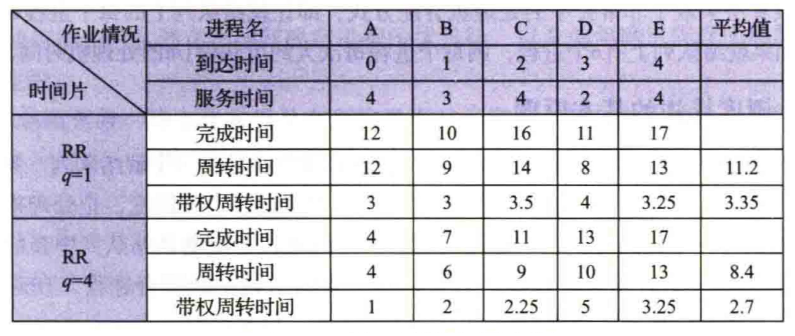  


## 多级队列调度算法
> MQ(multileved queue)

- 将系统中的进程就绪队列从一个拆分为若干个  
- 将不同类型或性质的进程固定分配在不同的就绪队列  
- 不同的就绪队列采用不同的调度算法  
- 一个就绪队列中的进程可以设置不同的优先级  
- 不同的就绪队列本身也可以设置不同的优先级

> 

- 对每个处理机的调度可以实施各自不同的调度策略  
- 对含有多个线程的进程而言，可以根据其要求将其所有线程分配在一个就绪队列上，并全部在一个处理机上运行  
- 需要相互合作的进程或线程而言，可以将它们分配到一组处理机所对应的多个就绪队列上，使它们能同时获得处理机并行执行  

## 多级反馈队列调度算法
> MFQ(multileved feedback queue)

#### 调度机制
- 设置多个就绪队列  
- 每个队列都采用FCFS调度算法  
- 按队列优先级调度  

#### 性能

- **终端型用户**  
  - 由于终端型用户提交的作业多属交互型作业，通常较小，系统只要能使这些作业在第一队列规定的时间片内完成，便可使终端型用户感到满意  
- **短批处理作业用户**  
  - 对于这类作业，如果可在第一队列中执行完成，则能获得与终端型作业一样的响应时间。对于稍长的短作业，也只须在第二和第三队列各执行一个时间片即可完成，其周转时间仍然较短  
- **长批处理作业用户**    
  - 对于这类作业，其将依次在第1,2,···,n个队列中运行，然后再按RR方式运行，用户不必担心其作业长期得不到处理。

# 进程同步

## 概念引入
> 异步环境下的一组并发进程因直接制约而互相发送消息、互相合作、互相等待，使得各进程按一定的速度执行的过程，称为进程同步

**主要任务**： 在执行次序上对多个协作进程进行协调，使并发执行的诸多
协作进程之间能按照一定的规则（或时序）共享系统资源，并能很好地相互合作，从而使程序的执行具有可再现性

#### 两种形式的制约关系

###### 互斥
> 间接相互制约

- 多个程序并发执行时，由于共享系统资源，如CPU 、I/0设备等，这些并发执行的程序之间会形成**相互制约**的关系  
- 对于这类资源，必须**统一分配**，即用户在要使用这类资源之前应先**提出申请**，而不能直接使用  

###### 同步
> 直接相互制约
- 应用程序为完成某项任务，会建立两个或多个进程。这些进程会为了完成同一任务而相互合作  
- 协作进程间的制约关系可以统称为进程同步  
- 根据制约形式的不同，其又可细分为同步关系和互斥关系，互斥是同步的一个特例  
- 同步强调的是保证进程之间操作的**先后次序的约束**，而互斥强调的是对**共享资源的互斥访问**  

#### 临界资源
> 进程在使用时需要采用互斥方式，这样的资源被称为临界资源(critical resource)

## 临界区问题
- 进程中访问临界资源的那段代码称为**临界区(critical section)**

- 如果此刻该临界资源正在被某进程访问，则本进程不能进入临界区。应在临界区前面增加一段用于进行上述检查的代码，把这段代码称为**进入区(entry section)**   
- 在临界区后面也要相应地加上一段被称为**退出区(exit section)** 的代码，用于将临界区正被访问的标志恢复为未被访问的标志  
- 进程中除进入区、临界区及退出区之外的其他部分的代码，都被称为**剩余区**  

将一个访问临界资源的循环进程描述如下:
```c
while(TURE)
{
  进入区
  临界区;
  退出区
  剩余区; 
}
```

解决临界区问题的同步机制应遵循准则  
- **空闲让进**  
  当无进程处于临界区时，表明临界资源处于空闲状态，应允许l 个请求进入临界区的进程立即进入自己的临界区，以有效地利用临界资源。
- **忙则等待**  
  当已有进程进入临界区时，表明临界资源正在被访问，因而其他试图进入临界区的进程必须等待，以保证对临界资源的互斥访问。
- **有限等待**  
  对于要求访问临界资源的进程，应保证其在有限时间内能进入自己的临界区，以免陷入“死等”状态。
- **让权等待**  
  （原则上应遵循，但非必须）当进程不能进入自己的临界区时，应立即释放处理机，以免进程陷入“忙等”状态。


# 软件同步机制
即在进入区设置并检查一些标志来表明是否有进程在临界区，若有则在进入区通过循环检查进行等待，进程离开临界区后则在退出区修改标志。

## 单标志法

算法思想：两个进程在访问完临界区后会把使用临界区的权限转交给另一个进程。也就是说每个进程进入临界区的权限只能被另一个进程赋予。所以设置一个公用整型变量  `turn` 用来表示允许进入临界区的进程编号，若 `turn=0` 则允许$P_0$进入临界区。

```cpp
// turn表示当前允许进入临界区的进程号
int turn = 0;

// P0进程
// 进入区
while (turn != 1); // ①1  
// 临界区
critical section; // ②2
// 退出区
turn = 1; // ③3
// 剩余区
remainder section; // ④4

// P1进程
// 进入区
while(turn != 0); // ⑤5
// 临界区
critical section; // ⑥6
// 退出区
turn = 0; // ⑦7
// 剩余区
remainder section;// ⑧8 
```

优点：

-  `turn` 的初值为$0$，即刚开始只允许$0$号进程进入临界区。
- 若$P_1$先上处理机运行，则会一直卡在⑤，无法使用临界资源。
- 直到$P_1$的时间片用完，发生调度，切换$P_0$上处理机运行。
- 而代码①不会卡住$P_0$，$P_0$可以正常访问临界区，在$P_0$访问临界区期间即时切换回$P_1$，$P_1$依然会卡在⑤。
- 只有$P_0$在退出区将 `turn` 改为$1$后，$P_1$才能进入临界区。
- 因此，该算法可以实现同一时刻最多只允许一个进程访问临界。

缺点：

-  `turn` 表示当前允许进入临界区的进程号，而只有当前允许进入临界区的进程在访问了临界区之后，才会修改 `turn` 的值。
- 也就是说，对于临界区的访问，一定是按$P_0\rightarrow P_1\rightarrow P_0\rightarrow P_1\rightarrow\cdots$这样轮流访问。
- 如果一个进程一直不访问临界区，那么临界资源会被这个进程一直占用。
- 违背了空闲让进的原则。

## 双标志先检查法

算法思想：设置一个布尔型数组 `flag[]` ，数组中各个元素用来标记各进程想进入临界区的意愿，比如 `flag[0]=ture` 意味着$0$号进程 $P_0$现在想要进入临界区。每个进程在进入临界区之前先检查当前有没有别的进程想进入临界区，如果没有，则把自身对应的标志 `flag[i]` 设为 `true` ，之后开始访问临界区。

```cpp
// 表示进入临界区意愿的数组
bool flag[2];
//刚开始设置为两个进程都不想进入临界区
flag [0] = false;
flag [1] = false;

// P0进程
// 进入区
while (flag[1]); // ①1
flag[0] = true; // ②2
// 临界区
critical section; // ③3
// 退出区
flag [0] = false; // ④4
// 剩余区
remainder section;

// P1进程
// 进入区
while (flag[0]); // ⑤5
flag[1] = true; // ⑥6
// 临界区
critical section; // ⑦7
// 退出区
flag[1] = false; // ⑧8
// 剩余区
remainder section; 
```

优点：不需要交替进入。

缺点：若按照①⑤②⑥③⑦……的顺序执行，若$P_0$和$P_1$同时检查，发现可以访问，$P_0$和$P_1$将会同时访问临界区，违反忙则等待原则。即在检查对方的$flag$后和切换自己的$flag$前之间有一段时间，结果都会检查通过，检查和修改操作不能一次性进行。

## 双标志后检查法

算法思想：双标志先检查法的改版。前一个算法的问题是先“检查”后“上锁”，但是这两个操作又无法一气呵成，因此导致了两个进程同时进入临界区的问题。因此，人们又想到先“上锁”后“检查”的方法，来避免上述问题。即先将自己标志位设置为 `true` 再检查对方的标志位，若对方也为 `true` 则等待，否则进入临界区。

```cpp
// 表示进入临界区意愿的数组
bool flag[2];
//刚开始设置为两个进程都不想进入临界区
flag [0] = false;
flag [1] = false;

// P0进程
// 进入区
flag[0] = true; // ①1
while (flag[1]); // ②2
// 临界区
critical section; // ③3
// 退出区
flag [0] = false; // ④4
// 剩余区
remainder section;

// P1进程
// 进入区
flag[1] = true; // ⑤5
while (flag[0]); // ⑥6
// 临界区
critical section; // ⑦7
// 退出区
flag[1] = false; // ⑧8
// 剩余区
remainder section; 
```

若进程同时想进入临界区，按照①⑤②⑥③⑦……的顺序执行，则都发现对方标志位是 `true` ，$P_0$和$P_1$都不能访问临界区都卡死。

因此，双标志后检查法虽然解决了“忙则等待”的问题，但是又违背了“空闲让进”和“有限等待”原则，会因各进程都长期无法访问临界资源而产生“饥饿”现象。

## Peterson算法

算法思想：双标志后检查法中，两个进程都争着想进入临界区，但是谁也不让谁，最后谁都无法进入临界区。$Gary\,L.Peterson$想到了一种方法，如果双方都争着想进入临界区，那可以让进程尝试“孔融让梨”，主动让对方先使用临界区。每个进程再设置自己的标志后再设置一个变量 `turn` 不允许进入标志的值，再同时检测另一个进程的状态标志位与不允许进入标志。

```cpp
// 表示进入临界区意愿的数组，初始值都是false
bool flag[2];
// turn表示优先让哪个进程进入临界区
int turn = 0;

// P0进程:
// 进入区
flag[0] = true; // ①1
turn = 1; // ②2
// 当对方也想进且本进程已经让出优先权就等待
while (flag[1] && turn==1); //③3
// 临界区
critical section; // ④4
// 退出区
flag[0] = false; // ⑤5
// 剩余区
remainder section;

// P1进程:
// 进入区
flag[1] = true; // ⑥6 表示自己想进入临界区
turn = 0; // ⑦7 可以优先让对方进入临界区
while (flag[0] && turn==0); // ⑧8 对方想进，且最后一次是自己“让梨"，那自己就循环等待
// 临界区
critical section; // ⑨9
// 退出区
flag[1] = false; // ⑩10 访问完临界区，表示自己已经不想访问临界区了
// 剩余区
remainder section; 
```

如果出现两个进程并发的情况，则其中一个进程必然被卡住，另一个进程必然会执行，所以不存在饥饿和死锁问题。

$Peterson$算法用软件方法解决了进程互斥问题，遵循了空闲让进、忙则等待、有限等待三个原则，但是依然未遵循让权等待的原则。


# 硬件同步机制

## 关中断

- 在进入锁测试之前，关闭中断  
- 直到完成锁测试并上锁之后，才能打开中断  


进程在临界区执行期间，计算机系统不响应中断，从而不会引发调度，也就不会发生进程或线程切换  


保证了对锁的测试和关锁操作的连续性和完整性，进而有效地保证了互斥

缺点  
- **滥用**关中断权力可能导致严重后果  
- 关中断**时间过长影响系统效率**，进而会限制CPU交叉执行程序的能力  
- **不适用于多CPU系统**，因为在一个CPU上进行关中断并不能防止进程在其他CPU上执行相同的临界区代码  

## 利用 $Test-and-Set$ 指令实现互斥
这条指令执行过程是不可分割的，即一条原语  , `lock` 有两种状态
- 当 `lock=FALSE` 时，表示该资源**空闲**  
- 当 `lock=TRUE` 时，表示该资源**正在被使用**
```c
boolean TS(boolean *lock ){
  boolean old;
  old = *lock;
  *lock TRUE;
  return old; 
}
```

用TS指令管理临界区时，须为每个临界资源设置一个布尔变量 `lock` 代表该资源的状态  
- `lock` 的初值为 `FALSE` , 表示该临界资源**空闲**  
- 进程在进入临界区之前，首先用TS指令测试 `lock`  
  - 如果其值为 `FALSE` , 表示没有进程在临界区内，可以进入，并将 `TRUE` 值赋予 `lock` , 这等效于关闭了临界区，使**任何进程都不能进人临界区**  
  - 否则必须**循环测试**直到 `TS(&lock)` 为 `TRUE`  

```c
do{
  ...
  while TS(&lock);    /*do skip*/
  critical section;
  lock = FALSE;
  remainder section;
}while(TRUE); 
```

- 


## 利用$swap$指令实现进程互斥
`swap` 指令被称为对换指令，在 `Intel 80x86` 中又被称为 `XCHG` 指令，用于交换两个字的内容

- 为每个临界资源设置一个全局的布尔变量 `lock`,初值为 `FALSE`     
- 在每个进程中再设置一个局部的布尔变量  `key`  , 使用swap指令与 `lock` 进行数值交换，以此来循环判断 `lock` 的取值  
- 只有当 `key` 为 `FALSE` 时，进程才可以进行临界区操作

```c
void swap(boolean *a,boolean *b){
  boolean temp;
  temp = *a;
  *a = *b;
  *b = temp; 
}
```
利用 `swap` 指令实现进程互斥的循环过程:
```c
do{
  key=TRUE
  do{
    swap(&lock,&key);
    while (key != FALSE);
    临界区操作;
    lock = FALSE;

  }
  ...
}while(TRUE); 
```
当临界资源被访问时，其他访问进程必须不断地进行测试，即处于一种**忙等状态**，这不符合"让权等待"的原则，因而会造成处理机时间的浪费，同时也很难将它们用于解决复杂的进程同步问题 

# 信号量机制
> 信号量(semaphores)

## 机制介绍

#### 整型信号量
> 一个用于表示资源数目的整型量$S$

- 除初始化外，仅能通过两个标准的原子操作($atomic operation$)来访问，即 `wait(S)`  和 `signal(S)` 操作  
- 很长的一段时间以来，这两个操作一直被分别称为`P`操作和`V`操作

`wait(S)` 和 `signal(S)` 是两个**原子操作**，因此，它们在执行时是**不可中断**的
- 当一个进程在修改某信号量时，没有其他进程可同时对该信号量进行修改  
- 在 `wait(S)` 操作中，对$S$值进行测试和做 `S:=S-1` 操作时都不可中断  
- 只要信号量$S<=0$ ，就会不断地进行测试,使进程处于"忙等"状态  


```c 
wait(S){
  // 进入区，申请资源 P
  while (S <= 0);   /*do no-op*/
  S--;
}
signal(S){
  // 退出区，释放资源 V
  S+;
} 
``` 
- 


#### 记录型信号量

- 记录型信号量机制遵循"让权等待"准则  
- 采取"让权等待"策略，会有多个进程等待访问同一临界资源  
- 为此，在信号量机制中，除了用于代表**资源数目**的整型变量 `value` 外，还应增加用于**链接所有等待进程**的链表指针 `list` , 

```c 
typedef struct{
  int value;
  struct process_control_block *list;
}semaphore; 
```

wait(S)和signal(S)操作可描述为：

```c 
wait(semaphore *S){
  S->value--;
  if(S->value < 0) block(S->list);
}
signal(semaphore *S){
  S->value++;
  if(S->value<=0)  wakeup(S->list);
} 
```

- `S->value` 的初值表示系统中某类**资源的数目**，因而又被称为**资源信号量**  
- **`wait(S)` 操作**
  - 进程请求一个单位的该类资源，系统中可供分配的该类资源数**减少一个**，因此描述为 `S->value--;`
  - `S.value < 0` ，该类资源**已分配完毕**，进程应调用 `block` 原语，进行自我阻塞，放弃处理机，并将该进程插入信号量链表 `S->list` 中  
- **`signal(S)` 操作**  
  - 执行进程**释放一个**单位的资源  
  - 使系统中可供分配的该类资源数**增加一个**，故 `S->value++` 操作表示资源数目加1  
  - 若加1后 `S->value<=O` ，该信号量链表中仍有等待该资源的进程被阻塞,应调用 `wakeup` 原语以将 `S->list` 链表中的第一个等待进程唤醒
- `S->value` 的初值为1 表示**只允许一个进程访问临界资源**，此时的信号量会转化为**互斥信号量**，用于进程互斥

## 信号量的应用

#### 利用信号量实现进程互斥

为使多个进程互斥地访问某临界资源  
- 为该资源设置一个互斥型信号址 `mutex` , 设**初值为1**  
- 然后将各进程访问该资源的临界区置于  `wait(mutex)` 和 `signal(mutex)`  操作之间  

每个欲访问该临界资源的进程，在进入临界区之前，都要先对 `mutex` 执行 `wait操作`   

- 若该资源此刻未被访问，则本次wait操作必然成功，进程便可进入自己的临界区  
- 若再有其他进程也欲进入自己的临界区，则由于对 `mutex` 执行 `wait操作` 定会失败，因而该进程阻塞，从而保证了该临界资源能被互斥地访问  

当访间临界资源的进程退出临界区后，又应对 `mutex` 执行 `signal操作` ，以便释放该临界资源

实现如下:
```c 
semaphore mutex=1;
P_A(){
  while(1){
    wait(mutex);
    临界区;
    signal(mutex) ;
    剩余区;
  }
}
P_B(){
  while(1){
    wait(mutex) ;
    临界区;
    signal(mutex) ;
    剩余区; 
  }
}
```
设 `mutex` 为互斥型信号量，其初值为$1$, 取值范围为$(-1,0,1)$  
- 当 `mutex=1` 时，表示两个进程**皆未进入**需要互斥访问的临界区  
- 当 `mutex=0` 时，表示**有一个进程进入**临界区运行，另一个必须等待，挂入阻塞队列  
- 当 `mutex=-1` 时，表示有一**个进程正在临界区运行**，而另一个进程因等待而**阻塞**在信号扯队列中，需要被当前已在临界区运行的进程在退出时唤醒


**需注意:**  
- `wait(mutex)` 和 `signal(mutex)` 必须成对出现  
- 缺少 `wait(mutex)` 将会导致系统混乱，无法保证对临界资源的互斥访问 
-  缺少 `signal(mutex)` 将会导致临界资源永远不被释放，从而使因等待该资源而阻塞的进程不能被唤醒  


#### 利用信号量实现进程同步

进程 `P1` 和 `P2` 中有两段代码 `C1` 和 `C2`   
- 若要强制 `C1` 先于 `C2` 执行，则须在 `C2` 前添加 `wait(S)` ，在 `C1` 后添加 `signal(S)`   
- 需要说明的是，信号量 $S$ 的初值应该被设置为 $0$   
- 只有 `P1` 在执行完 `C1`  后，才能执行 `signal(S)` 以把 $S$ 的值设置为$1$   
-  `P2` 执行 `wait(S)` 才能申请到信号最 $S$ ，并执行 `C2`   
-   `P1`  的 `C1` 没有提前执行，则信号量 $S$ 的值为 $0$ , `P2` 执行 `wait(S)` 时会因申请不到信号量 $S$而阻塞

```c 
semaphore S=0;
P1(){
  while(1){
    C1
    signal(S);
    ...;
  }
}
P2(){
  while(1){
    wait(S);
    C2;
    ...;
  }
}
```
设$S$为同步型信号量，其初值为$0$, 取值范图为$(-1,0,1)$ 
- 当$S=0$时，表示 `C1` 还未执行， `C2` 也未执行  
- 当$S=1$时，表示 `C1` 已经执行， `C2` 可以执行  
- 当$S=-1$ 时，表示 `C2` 想执行，但由于 `C1`  尚未执行， `C2` 不能执行，进程 `P2` 处于阻塞状态

# 管程机制

#### 管程的定义
代表共享资源的数据结构，以及由对该共享数据结构实施操作的一组过程所组成的资源管理程序，共同构成了一个$OS$ 的资源管理模块


###### 管程组成  
- 管程的名称  
- 局限于管程内的共享数据结构说明（尽管数据结构是共享的，但该共享变量局限于管程内）  
- 对该数据结构进行操作的一组过程  
- 设置局限于管程内的共享数据初值的语句
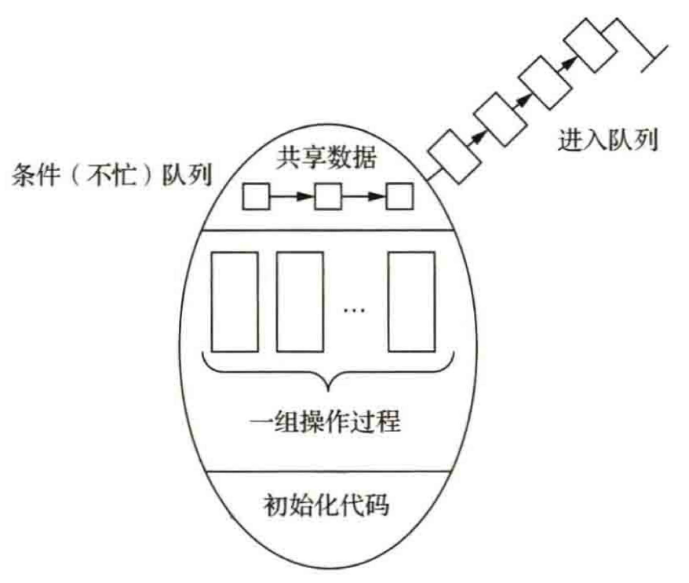  

###### 管程语法

```c  
monitor monitor_name{               
  // /*管程名*/ 
  share variable declarations;      
  // /*共享变量说明*/
  cond declarations;                
  // /*条件变量说明*/
  public:                           
  // /*能被进程调用的过程*/
    void P1(...)                    
    // /*对数据结构操作的过程*/
           {...} 
    void P2(...)
           {...}
    ...
    void (...)
         {...}
    ...;
    {                                 
      // /*管程主体*/
      initialization code;            
      // /*初始化代码*/ 
      ...; 
    }
}
```

###### 管程特性
- 模块化  
  管程是一个基本程序单位，可以单独编译  
- 抽象数据类型  
  管程中不仅有数据，而且有对数据的操作  
- 信息掩蔽  
  管程中的数据结构只被管程中的过程访问，这些过程在管程内部被定义，供管程外的进程调用，管程中的数据结构及过程（函数）的具体实现，外部不可见  

###### 管程和进程

1. 二者都定义了数据结构，但进程定义的是**私有**数据结构——PCB , 管程定义的是**公共**数据结构，如消息队列等  
2. 二者都存在针对各自数据结构的操作，但进程是由**顺序程序执行**有关操作的，而管程则主要进行**同步**操作和**初始化**操作  
3. 设置进程的目的在于实现系统的**并发**性，而管程的设置则是为了解决**共享资源的互斥**使用问题  
4. 进程通过调用管程中的过程来对共享数据结构进行操作，该过程就像通常的子程序被调用一样，因而管程为**被动**工作方式，进程则为**主动**工作方式  
5. 进程之间能**并发**执行，而管程则不能与其调用者并发  
6. 进程具有**动态**性，由创建而诞生，由撤销而消亡，而管程则是OS 中的一个资源管理模块，**仅供进程调用**

#### 条件变量

通过条件变量来实现阻塞进程。由于一个进程被阻塞的原因可能有多个，所以管程中设置多个条件变量，每个条件变量保存一个等待队列，用于记录因该条件变量而阻塞的所有进程。对条件变量只有两个操作：`wait`和`signal`。所以管程调用这两个操作时都**不用**判断条件，直接阻塞或唤醒。

- `x.wait`：当`x`对应的条件不满足时，正在调用管程的进程调用`x.wait`将自己插入`x`条件的等待队列，并释放管程。此时其他进程可以使用该管程。
- `x.signal`：`x`对应的条件发生了变化，则调用`x.signal`，唤醒一个因`x`条件而阻塞的进程。

```C  title:"条件变量"   
monitor Demo {
  共享数据结构 S;
  condition x; //定义一个条件变量×
  init code(){}
  take away(){
    if(S<=0) 
	    x.wait(); 
    // 资源不够,在条件变量×上阻塞等待
    资源足够，分配资源，做一系列相应处理;
  } 
  give_back(){
    归还资源，做一系列相应处理;
    if(有进程在等待) 
      x.signal; //唤醒一个阻塞进程    
  }    
}   
```

条件变量与信号量：

- 相似点：条件变量的$wait/signal$操作类似于信号量的$PV$操作，可以实现进程的阻塞/唤醒。
- 不同点：条件变量是“没有值”的，仅实现了“排队等待”功能（所以一旦调用就不用判断，直接阻塞或释放）；而信号量是“有值”的，信号量的值反映了剩余资源数，而在管程中，剩余资源数用共享数据结构记录  
# 经典的进程同步问题

## 生产者－消费者问题

#### 用记录型信号措解决生产者－消费者问题

假定在生产者和消费者之间的公用缓冲池中，具有$n$个缓冲区，这时可利用互斥信号量mutex实现各进程对缓冲池的互斥使用  
- 利用信号量empty和full分别表示缓冲池中空缓冲区和满缓冲区的数量  

假定这些生产者和消费者相互等效  
- 缓冲池未满，生产者便可**将消息送入缓冲池**  
- 缓冲池未空，消费者便可从缓冲池中**取走一个消息**  

```c  title:"记录型信号 -> the producer-consumer problem"   collapse:true 
int in=0,out=0;  
item buffer[n];
semaphore mutex=1,empty=n,full=0:
void producer(){
  do{
    produce an item nextp;
    ...;
    wait(empty);
    wait(mutex);
    buffer[in]=nextp
    in=(in+1)%n;
    signal(mutex);
    signal(full);
  }while(TRUE);
}

void consumer(){
  do{
    wait(full);
    wait(mutex);
    nextc=bufferf[out];
    out =(out+1)%n
    signal(mutex);
    signal(empty);
    consume the item in nextc;
    ...;
  }while(TRUE);
}
void main(){
  cobegin;
  producer();
  consumer();
  coend;
} 
```
**注意**  
- 在每个进程中用于实现互斥的 `wait(mutex)`  和 `signal(mutex)` 必须成对出现    
- 对同步信号量 `empty` 和 `full` 的 `wait` 和 `signal` 操作，同样需要成对出现，但它们分别处于不同的进程中。例如，  `wait(empty)` 在计算进程中，而 `signal(empty)` 则在打印进程中，计算进程若因执行  `wait(empty)` 而阻塞，则以后将由打印进程唤醒它  
- 每个程序中的多个 `wait` 操作的顺序不能颠倒，应先执行对同步信号措的 `wait` 操作，再执行对互斥信号屉的 `wait` 操作，否则可能会引起进程死锁  

#### AND 信号量解决生产者－消费者问题

- 用 `Swait(empty, mutex)`  来代替 `wait(empty)`  和 `wait(mutex)`    
- 用 `Ssignal(mutex, full)` 来代替 `signal(mutex)` 和 `signal(full)`     
- 用 `Swait(full, mutex)` 来代替 `wait(full)` 和 `wait(mutex)`    
- 用 `Ssignal(mutex, empty)` 来代替  `signal(mutex)` 和 `signal(empty)`   

```c  title:"AND信号量 -> the producer-consumer problem"   collapse:true 
int in=0,out=0;  
item buffer[n];
semaphore mutex=1,empty=n,full=0:
void producer(){
  do{
    produce an item nextp;
    ...;
    Swait(empty,mutex);
    buffer[in]=nextp
    in=(in+1)%n;
    Ssignal(mutex,full);
  }while(TRUE);
}

void consumer(){
  do{
    Swait(full,mutex);
    nextc=bufferf[out];
    out =(out+1)%n
    Ssignal(mutex,empty);
    consume the item in nextc;
    ...;
  }while(TRUE);
}
```


#### 管程解决生产者－消费者问题
先须建立一个管程，并将其命名为$producerconsumer$(简称$PC$) ，其中包括以下两个过程
- `put(x)` 过程：生产者利用该过程将自己生产的产品投放到缓冲池中，并用整型变量count来表示在缓冲池中已有的产品数目，当 `count>=N` 时，表示缓冲池已满，生产者应等待  
- `get(x)` 过程：消费者利用该过程从缓冲池中取出一个产品，当 `count<=O` 时，表示缓冲
池中已无可取用的产品，消费者应等待

对于条件变量 `notfull` 和 `notempty` 操作  
- `cwait (condition)` 过程：当管程被一个进程占用时，其他进程调用该过程时会阻塞，并且会被挂在条件 `condition` 的队列上  
- `csignal (condition)` 过程：唤醒在cwait执行后阻塞在条件 `condition` 队列上的进程，如果这样的进程不止一个，则选择其中一个实施唤醒操作；如果队列为空，则无操作返回

```c  title:"管程 -> the producer-consumer problem"   collapse:true 
monitor producerconsumer {
  item buffer[N];
  int in, out;
  condition notfull, notempty;
  int count;
  public:
      void put(item x){
        if (count>=N) 
          cwait(notfull);
        buffer[in] = x;
        in = (in+1) % N;
        count++;
        csignal(notempty);
      }
      void get(item x){
        if (count<=0) 
          cwait(notempty);
        x = buffer[out];
        out = (out+1) % N;
        count--;
        csignal(notfull);
      }
      {
        in=0;
        out=0;
        count=0;
      }
}
```
生产者和消费者可描述为：
```c  title:"描述"   collapse:true 
void producer(){
  item x;
  while(TRUE){
    ...;
    produce an item in nextp
    PC.put(x);
  }
}
void consumer(){
  item x;
  while(TRUE){
    PC.get(x);
    consume the item in nextc;
    ...;
  }
}
void main(){
  cobegin;
  producer();
  consumer(); 
  coend;
}
```

## 哲学家进餐问题
问题描述为：有 $5$ 个哲学家共用 $1$ 张圆桌，他们分别坐在圆桌周围的 $5$ 把椅子上．在圆桌上有 $5$ 个碗和 $5$ 根筷子，他们的生活方式是**交替地进行思考和进餐**。平时， $1$ 哲学家进行思考，其**饥饿**时便会试图取用**左右两边最靠近自己的筷子**，他只有在**拿到 $2$ 根筷子时才能进餐**；进餐毕，放下筷子继续思考

#### 记录型信号量解决哲学家进餐问题
筷子是临界资源，在一段时间内只允许 $1$ 位哲学家使用。为了实现对筷子的互斥使用，可以用 $1$ 个信号量表示 $1$ 根筷子，由这5根筷子对应的 $5$ 个信号量构成信号量数组
```c
semaphore chopstick[5]=(1,1,1,1,1);
```
所有信号量均被初始化为$1$, 第$i$位哲学家的活动可描述为

```c
do{
  wait(chopstick[i]);
  wait(chopstick[(i+1)%5]);
  ...
  //eat
  ...
  signal(chopstick[i]);
  signal(chopstick[(i+1)%5]);
  ...
  //think
  ...
}while[TRUE];
```

- 哲学家**饥饿时**总是会先去拿他左边的筷子，即执行 `waH(chopstick[i])`   
- 成功后，再去拿他右边的筷子，即执行 `wait(chopstick [(i+ 1)%5])`     
- 又成功后便可进餐  
- 进餐毕，先放下他左边的筷子，再放下他右边的筷子  


虽然上述解法可保证**不会有两个相邻的哲学家同时进餐**，但是有可能引起**死锁**  
- 假如 $5$ 位哲学家**同时饥饿**而各自拿起左边的筷子，这时就会使 $5$ 个信号量 `chopstick` 均为 $0$    
- 当他们再试图去拿右边的筷子时，都将会因无筷子可拿而进行无限期的等待  


**死锁问题解决方法**

1. 至多只允许有 $4$ 位哲学家同时去拿左边的筷子，最终能保证至少有 $1$ 位哲学家能够进餐，并在进餐毕时能释放出他用过的 $2$ 根筷子，从而使更多的哲学家能够进餐  
2. 仅当哲学家的左右两根筷子均可用时，才允许他拿起筷子进餐  
3. 规定奇数号哲学家先拿他左边的筷子，然后再去拿他右边的筷子；而偶数号哲学家则相反。按此规定，  $1$ 号、 $2$ 号哲学家将竞争 $1$ 号筷子；  $3$ 号、 $4$ 号哲学家将竞争 $3$ 号筷子。即 $5$ 位哲学家都先竞争奇数号筷子，获得后，再去竞争偶数号筷子，最后总会有一位哲学家能获得两根筷子而进餐


#### AND 信号量机制解决哲学家进餐问题
每个哲学家先获得两个临界资源（筷子）后方能进餐，这在本质上 $AND$ 同步问题

```c
semaphore chopstick[5]=(1,1,1,1,1);
do{
  ...
  //think
  ...
  Swait(chopstick[(i+1)%5],chopstick[i]);
  ...
  //eat
  ...
  Ssignal(chopstick[(i+1)%5],chopstick[i]);
}while[TRUE];
```


#### 管程解决哲学家进餐问题
一个哲学家只有在左右两根筷子都可用时才被允许拿起筷子。为区分哲学家所处的3个状态。引入枚举类型变量：
```c
enum{
  thinking,hungry,eating
}
state[5];
```
哲学家 $i$ 只有在其左右两个邻居不进餐时才能将变量 `state[i]` 设置为 `eating` ,即 `state[(i+4)%5]!=eating &state[(i+1)%5]!=eating`  
还需要声明条件变量：
```c
condition self [5];
```
其中，哲学家在饥饿且又不能拿到所需筷子时，需要阻塞自己。
对筷子的拿起与否由管程dp来控制，管程dp的定义如下:
```c  title:"管程 -> 哲学家进餐"   collapse:true 
monitor dp{
  enum{
    thinking,hungry,eating
  }
  state[5];
  condition self [5];
  initialization_code(){
    for (int i=0;i<5;i++)
      state[i]=thinking;
  }
  void pickup(int i){
    state[i]=hungry;
    test(i);
    if(state[i] != eating)
      self[i].wait();
  }
  void putdown(int i){
    state[i]=thinking;
    // test left and right neighbors
    test((i+4)%5);
    test((i+1)%5);
  }
  void test(int i){
    if((state[(i+4)%5]!=eating)&&(state[i]==hungry)&&(state[(i+1)%5]!=eating)){
      state[i]=eating;
      selff[i].signal();
    }
  }
}
```

- 哲学家在进餐前必须调用 `pickup` 操作，这有可能会挂起该哲学家进程  
- 成功完成该操作后，哲学家才可进餐  
- 哲学家调用 `putdown` 操作以放下筷子，并开始思考  

哲学家 $i$ 的活动可描述为:

```c
do{
  dp.pickup (i);
  ...
  eat
  ...
  dp.putdown (i);
}while[TRUE]:
```
确保相邻的两个哲学家不会同时进餐，且不会死锁。然而，哲学家可能会饿死

## 读者－写者问题
一个数据文件或记录可被多个进程共享， 我们把只要求读该文件的进程称为"**reader进程**"，其他进程称为"**writer进程**"  

- 允许**多个进程同时读**一个共享对象，因为读操作不会使数据文件混乱  
- 不允许一个writer进程和其他reader进程或write进程**同时访问共享对象**，因为这种访问将会引起混乱  
 
所谓"读者－写者问题" $(reader-writer \quad problem)$  是指保证一个writer进程必须与其他进程互斥地访问共享对象的同步问题

以下两种方法：第一种情况下，**写者**可能饥饿；第二种情况下，**读者**可能饥饿

#### 记录型信号量解决读者－写者问题
- 为了实现 `reader` 与 `writer` 进程在读／写时的互斥，设置互斥信号量 `wmutex`   
- 设置了整型变量  `readcount` , 用于表示正在读的进程数目  

只要有一个 `reader` 进程在读，便不允许 `writer` 进程去写  
因此，仅当 `readcount=0` 表示尚无 `reader` 进程在读时， reader进程才需要执行 `wait(wmutex)` 操作  

若 `wait(wmutex)` 操作成功， reader进程便可去读，相应地做 `readcount+1` 操作  

同理，`reader` 进程仅当在执行了 `readcount-1` 操作后其值为0时，才执行 `signal(wmutex)` 操作，以便让 `writer` 进程写  

又因为 `readcount` 是一个可被多个 `reader` 进程访问的临界资源，因此，也应该为它设置一个互斥信号量 `rmutex`  

```c  title:"记录型信号量 -> reader-writer problem"   collapse:true 
semaphore rmutex=1,wmutex=1;
int readcount=0;
  void reader(){
    do{
      wait(rmutex);
      if (readcount==0)
        wait(wmutex);
      readcount++;
      signal(rmutex);
      ...;
      perform read operation;
      ...;
      wait(rmutex);
      readcount--;
      if(readcount==0)signal(wmutex);
      signal(rmutex);
    }while(TRUE);
  }
  void writer(){
    do{
      wait(wmutex);
      perform read operation;
      signal(wmutex);
    }while(TRUE);
  }
void main(){
  cobegin;
  reader();
  writer();
  coend;
}
```

#### "信号量集"机制解决读者－写者问题
增加了一个限制，即最多只允许**RN**个读者**同时进行读操作**  
为此，又引入了一个信号量 $L$ , 并赋予其初值 $RN$ , 通过执行 `Swait(L, 1, 1)` 操作来控制读者的数目  
- 当有一个读者进行读操作时，就要先执行 `Swait(L,1, 1)` 操作以使 $L$ 的值减1  
- 当有RN个读者进行读操作后， $L$ 便会减为0, 此时第 $RN+1$ 个读者若要进行读操作，则必然会因 `Swait(L,1,1)` 操作失败而阻塞  

```c  title:""信号量集"机制 -> reader-writer problem"   collapse:true 
int RN;
semaphore L=RN,mx=1;
  void reader(){
    do{
      Swait(L,1,1);
      Swait(mx,1,0);
      ...;
      perform read operation;
      ...;
      Ssignal(L,1);
    }while(TRUE);
  }
  void writer(){
    do{
      Swait(mx,1,1;L,RN,0);
      perform read operation;
      Ssignal(mx,1);
    }while(TRUE);
  }
void main(){
  cobegin;
  reader();
  writer();
  coend;
}
```

- `Swait(mx, 1,0)` 语旬起着“开关”的作用。只要无writer进程进行写操作， `mx=1` , `reader` 进程就可以读。但只要有 `writer` 进程进行写操作， `mx=0` , 任何`reader` 进程就都无法进行读操作。 `Swait(mx, 1, 1 ;L,RN,0)` 语句表示，仅当既无 `writer` 进程在写 `mx=1`  ，又无`reader` 进程在读 `(L=RN)` 时， `writer` 进程才能进入临界区写。

## 进程分析

**进程同步分析方法**  
- 找出需要同步的代码片段(关键代码)  
- 分析所找代码片段的执行次序   
- 增加同步信号最并赋初值  
- 在所找代码片段前后加wait(S)和signal(S)操作  


**进程互斥分析方法**  
- 查找临界资源  
- 划分临界区  
- 定义互斥信号量并赋初值  
- 在临界区前后的进入区和退出区中分别加入wait(S)和signal(S)操作  

# 死锁
> 可以引起死锁的主要是需要采用互斥访问方法的不可被抢占的资源。如打印机、数据文件、队列、信号量等
## 资源问题

#### 可重用资源和可消耗资源
**可重用资源**
> 可供用户重复使用多次的资源  

*性质* :
1. 每个可重用资源中的单元，只能分配给一个进程使用，而**不允许多个进程共享**  
2. 进程若要**使用可重用资源**则要按照下列步骤  
   1. 请求资源，如果请求资源失败，则进程将会被阻塞或循环等待  
   2. 使用资源，进程对资源进行操作，如用打印机进行打印  
   3. 释放资源，当进程使用完资源后自己将其释放  
3. 系统中每类可重用资源中的**单元数目是相对固定的**，进程在运行期间既**不能创建**资源，也**不能删除**资源 

**可消耗资源**
> 在进程运行期间由进程动态创建和消耗  

*性质* :
1. 每类可消耗性资源的单元数目在进程运行期间是可以**不断变化**的，有时它可能有许多，有时可能为 0  
2. 进程在运行过程中，可以不断地创造可消耗资源的单元，将它们放入**该资源类的缓冲区**中，以增加该资源类的单元数目  
3. 进程在运行过程中可以请求若干个可消耗资源单元，用于进程自己消耗，并**不再**将它们**返回给该资源类**  
   可消耗资源通常是由**生产者进程创建由消费者进程消耗**的，最典型的可消耗资源就是用于进程间通信的消息等

## 计算机系统中的死锁
> 死锁的起因，通常源于多个进程对资源的争夺，不仅对不可抢占资源进行争夺时会引起死锁，而且对可消耗资源进行争夺时也会引起死锁
#### 竞争不可抢占资源引起死锁
系统中所拥有的不可抢占资源的数量不足以满足多个进程运行的需要，这使得进程在运行过程中，会因争夺资源而陷入僵局 
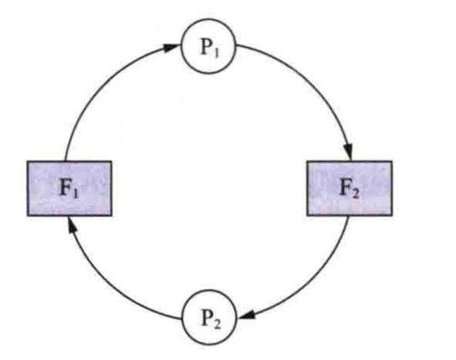  

#### 竞争可消耗资源引起死锁
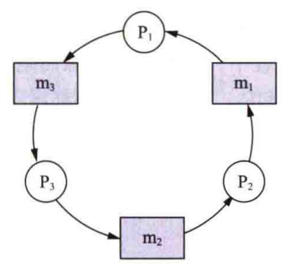  


#### 进程推进顺序不当引起死锁
按照折线 $1、2、3$ ，进程可顺利完成  
**进程推进顺序合法**  
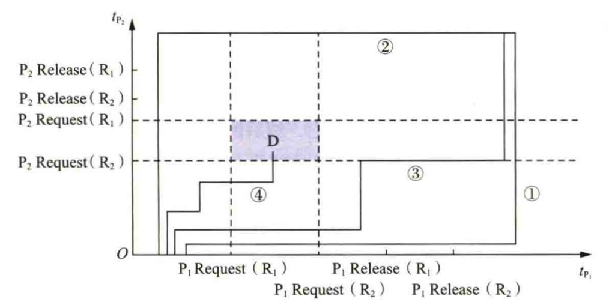  
按照折线 $4$ ，系统处于不安全状态，进程死锁   
**进程推进顺序非法**
## 死锁的定义、必要条件与处理方法
#### 死锁的定义
如果一组进程中的每个进程都在等待仅由该组进程中的其他进程才能引发的事件发生 ，那么该组进程是死锁的
#### 产生死锁的必要条件
1. **互斥条件**  
   进程对所分配到的资源进行**排他性使用**，即在一段时间内，某资源只能被一个进程占用  
   如果此时还有其他进程请求该资源，则请求进程只能等待，直至占有该资源的进程结束释放  
2. **请求和保持条件**   
   进程已经**占有了至少一个资源**，但又提出了**新的资源请求**，而该被请求的资源已被其他进程占有，此时请求进程被阻塞，同时其对自己已占有的资源保持不放  
3. **不可抢占条件**  
   进程已获得的资源在**未使用完之前不能被抢占**，只能在进程使用完时由自己释放  
4. **循环等待条件**  
   该条件指在发生死锁时，必然存在一个**“进程—资源” 循环链**,即进程集合 $\{P_0,P_1,P_2,\dots ,P_n\}$ 中的 $P_0$ 正在等待已被 $P_1$ 占用的资源， $P_1$ 正在等待已被 $P_2$ 占用的资源， $P_n$ 正在等待已被 $P_0$  占用的资源   
#### 死锁的处理方法
**原理**
- 采用某个协议来预防或避免死锁，确保系统永远不会进入死锁状态  
- 允许系统进入死锁状态，但是会检测它，然后恢复  
- 完全忽略这个问题，并假设系统永远不会出现死锁

**方法**
1. **预防死锁**  
   简单和直观的事先预防方法  
   通过**设置某些限制条件**，去**破坏**产生死锁的**一个或几个**必要条件来预防死锁  
   容易实现，已被广泛使用  
2. **避免死锁**  
   属于事先预防方法，在资源的动态分配过程中，用某种方法**防止系统进入不安全状态**，从而避免发生死锁  
3. **检测死锁**  
   无须事先采取任何限制性措施，允许进程在运行过程中发生死锁   
   但可通过**检测机构**及时地检测出死锁的发生，采取适当措施把进程**从死锁中解脱**出来  
4. **解除死锁**  
   当检测到系统中已发生死锁时就采取相应措施，将进程从死锁状态中解脱出来  
   通常采用的措施是**撤销一些进程**，**回收它们的资源**，将回收的资源分配给巳处于阻塞状态的进程，使这些进程能够继续运行 
# 死锁预防
## 破坏“请求和保持”条件
> 系统必须做到：当一个进程在请求资源时，它不能持有不可抢占资源

**第一种协议**

所有进程在开始运行之前，必须**一次性申请**其在整个运行过程中所需的**全部资源**  

优点  
- 简单  
- 易行  
- 安全   

缺点  
- 资源被严重浪费  
- 进程经常会发生饥饿现象


**第二种协议**  

允许一个进程**只获得运行初期所需的资源**后，便开始运行  
进程运行过程中再**逐步释放**已分配给自己的、且已用毕的全部资源，然后再请求新的所需资源  


## 破坏“不可抢占”条件
当一个**已经保持了某些不可抢占资源**的进程提出新的资源请求而不能得到满足时，它**必须释放已经保持的所有资源**，待以后需要时再重新申请 

复杂，需要很大的代价

## 破坏“循坏等待”条件
对系统的所有资源类型进行**线性排序**，并赋予它们不同的序号，设 $$R=(R_1,R_2,R_3,\dots R_m)$$  
一个进程在开始时可以请求某类资源 $R_i$  ，的单元，以后，**当且仅当** $F(R_j)>F(R_i)$ 时，进程才可以请求资源 $R_j$ 的单元 。 如果需要多个同类资源单元，则必须一起请求

**存在的问题**
1. 为系统中各类资源规定**的序号必须相对稳定**，这限制了新类型设备的增加  
2. 作业**使用**各类资源的顺序与系统**规定**的顺序**不同**，造成对资源的**浪费**  
3. 为了方便用户，系统对用户在编程时所施加的限制条件应尽量少，然而这种按规定次序申请资源的方法必然会**限制用户**进行简单、自主的编程


# 死锁避免
## 系统安全状态
系统能按某种进程推进顺序 $P=(P_1,P_2,P_3,\dots P_m)$ ,为每个进程 $P$ 分配其所需的资源，直至满足**每个进程对资源的最大需求**

如果系统无法找到这样一个安全序列，则称系统处于**不安全状态**，有可能进入死锁状态

## 银行家算法
- 新进程在进入系统时，须申明在**运行过程中**可能需要每种**资源类型的最大单元数目**，该数目不应超过系统所拥有的资源总量  
- 当进程请求一组资源时，系统须确定**是否有足够的资源**可分配给该进程  
- 若有，则进一步计算在将这些资源分配给该进程后，系统**是否会处于不安全状态**   
- 如果不会处于不安全状态 ，则将**资源分配**给该进程，否则让该进程等待  

#### 数据结构
1. **可利用资源向量**  $Available$  
   每个元素代表一类可利用的资源数目  
   `Available[j]=k` 表示系统中现有 $R_j$ 类资源 $k$ 个
2. **最大需求矩阵** $Max$   
   n个进程中的每个进程对m类资源的最大需求  
    `Max[i,j]=K` 表示进程 $i$ 需要 $R_j$ 类资源的最大数目为 $K$  
3. **分配矩阵** $Allocation$  
   每类资源当前巳分配给每一进程的资源数  
   `Allocation[i,j]=K` , 则表示进程 $i$ 当前已分得 $R_j$ 类资源的数目为 $K$  
4. **需求矩阵** $Need$   
   每个进程尚需的各类资源数  
   `Need[i,j]=K` ，则表示进程 $i$ 还需要 $R_j$ 类资源 $K$  个才能完成其任务

#### 银行家算法
设 $Request$ 是进程 $P_i$ 的请求向量，如果  `Request_i[j]=K`, 则表示进程 $P_i$ 需要 $K$ 个 $R_j$ 类型的资源 。当 $P_i$ 发出资源请求后，系统会按下列步骤进行检查
1. 如果 `Request_i[j]<=Need[i，j]` ，则转向**步骤2**， 否则认为**出错**，因为所需要资源数已超过宣布的最大值  
2. 如果 `Request_i[j]<=Available[j]`，则转向**步骤3** ；否则表示尚无足够资源， $P_i$ 须等待  
3. 尝试把资源分配给进程 $P_i$ ，并修改下列数据结构中的数值：
  ```c
    Available[j]= Available[j] - Request_i[j]; 
    Allocation[i,j] = Allocation[i,j] + Request_i[j]; 
    Need[i,j] = Need[i,j] - Request_i[j]; 
  ```
4. 执行安全性算法，检查此次资源分配后系统是否处于安全状态
   是，则正式将资源分配给进程 $P_i$ 完成本次分配  
   否，本次分配作废，让进程 $P_i$ 等待 

#### 安全性算法

1. 设置两个向量   
   1. **工作向量Work**  
      表示系统**可提供给进程继续运行所需的各类资源数目**，含有m个元素，在开始执行安全算法时，`Work=Available`    
   2. **完成向量Finish**  
      表示系统**是否有足够的资源**分配给进程，使之运行完成。 开始时  `Finish[i]=FALSE` ,当有足够的资源可分配给进程时， `Finish[i]=TRUE`   
2. 从进程集合中 寻找一个能满足下述条件的进程  
   1. `Finish[i]=FALSE`  
   2. `Need[i,j]<=Work[j]`   
若能找到，则执行**步骤3**;否则，执行**步骤4**    
3. 当进程P获得资源后，可顺利执行直至完成，并释放分配给它的资源，故应执行
  ```c
    Work[j] = Work[j] + Allocation[i,j];
    Finish[i] = TRUE;
    go to step 2 ;
  ```
1. 如果所有进程都满足 `Finish[i]=TRUE` ，则表示系统处于安全状态；否则，系统处安全状态 。


# 死锁的检测与解除
## 死锁的检测
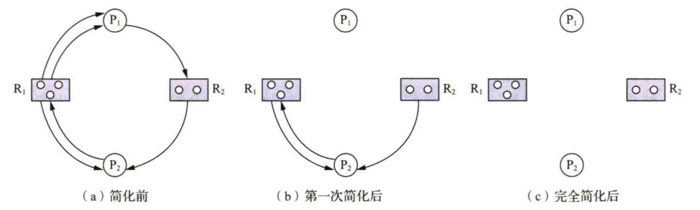  
找出 一个既不阻塞又非独立的进程节点 $P_i$ 。 在顺利的情况下 $P_i$ 可获得所需资源而继续运行，直至运行完毕再释放其所占有的全部资源，这相当于消去 $P_i$ 的请求边和分配边，使之成为孤立的节点


## 死锁的解除
1. **抢占资源**  
   从一个或多个进程中**抢占足够数量的资源**，然后将它们分配给死锁进程．以解除死锁状态   
2. **终止死锁进程**  
   即**终止**系统中的一个或多个**死锁进程**，直至打破循环等待使系统从死锁状态中解脱出来 

**终止所有死锁进程**   
**逐个终止死锁进程**
