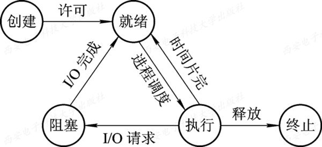
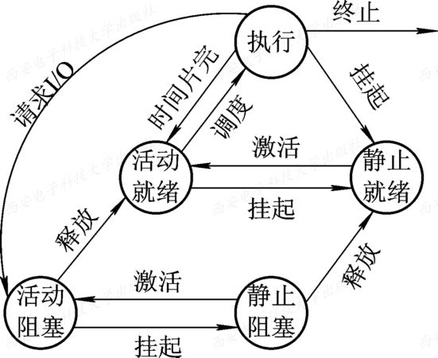
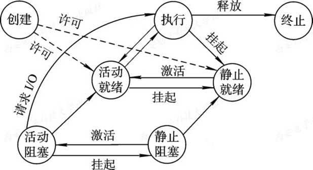

# 进程

> [! success] 定义  
> (1) 进程是程序的一次执行  
> (2) 进程是一个程序及其数据在处理机上顺序执行时所发生的活动  
> (3) 进程是具有独立功能的程序在一个数据集合上运行的过程，它是系统进行资源分配和调度的一个独立单位   

### 进程的特征
- 动态性  
- 并发性  
- 独立性   
- 异步性 

### 进程的特征

- 就绪  
- 执行  
- 阻塞  
- 创建  
- 终止

  

- 挂起操作
    终端用户的需要  
    父进程请求  
    负荷调节的需要  
    操作系统的需要  

  

  

#### 进程的创建
首先由进程申请一个空白PCB，并向PCB中填写用于控制和管理进程的信息；然后为该进程分配运行时所必须的资源；最后，把该进程转入就绪状态并插入就绪队列之中。但如果进程所需的资源尚不能得到满足，比如系统尚无足够的内存使进程无法装入其中，此时创建工作尚未完成，进程不能被调度运行，于是把此时进程所处的状态称为创建状态。

