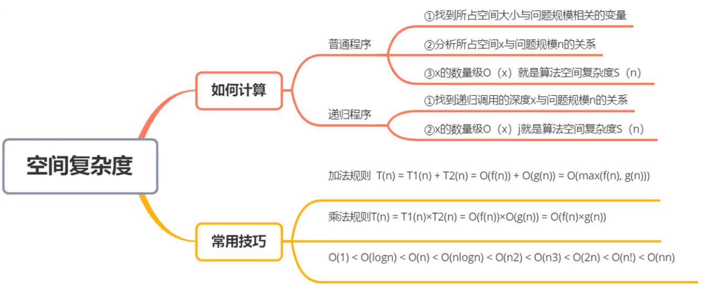

# 数据结构
---
</p>

> - *数据结构、数据对象*
> 数据结构是相互之间存在一种或多种特定**关系**的数据元素的集合。 
> 数据对象是具有**相同性质**的数据元素的集合，是数据的一个子集。
> - *数据*
> 数据是**信息的载体**，是描述客观事物属性的数、字符及所有**能输入到计算机中并被计算机程序识别**和处理的符号的集合。数据是计算机程序加工的原料。
> - *数据元素、数据项*
> **数据元素**是数据的基本单位，通常作为一个整体进行考虑和处理。
> 一个数据元素可由**若干数据项**组成，数据项是构成数据元素的不可分割的**最小单位**。
> 
> - *结构*
> **各个元素**之间的关系
> - *数据类型*
> **原子类型：** 不可再分
> **结构类型：** 可在分
> 抽象数据类型：数据组织及相关操作
</p>

<!-- red -->
### :star::star::star:三要素


##### 逻辑结构

- `集合`

- 线性结构
线性表、栈、队列
</p>数据元素之间是一对一的关系，除了第一个元素，所有元素都有唯一前驱;除了最后一个元素，所有元素都有唯一后继
</p>

- `树`
一对多
</p>

- `图`
多对多 
</p>

##### :star:存储结构 (物理结构)
- 顺序
把逻辑上相邻的元素存储在物理位置上也相邻的存储单元中，元素之间的关系由存储单元的邻接关系来体现。
（随机存取）
- `链式`
逻辑上相邻，物理位置可以不相邻
- `索引`
- `散列`
Hash存储，根据元素关键字计算存储地址

##### 数据的运算
定义:point_right:逻辑结构:point_right:功能
实现:point_right:存储结构:point_right:步骤
### 五个特征
- 有穷性、确定性、可行性、输入、输出
`有穷性` 算法有穷，程序无穷
`可行性` 基本运算执行有限次
##### 算法的定义
1. 步骤
2. 基本操作的总和
3. 解决问题的方法

好算法：`正确性` 、`可读性`、`健壮性`、`高效率与低存储`
##### 效率的度量
<!-- red -->
- **:star:时间复杂度**

所需要的时间：T(n)
> - 如何估算算法时间复杂度
一个算法由`控制结构`(顺序、分支和循环三种)和`基本操作`构成，则算法时间取决于两者的综合效果
> 
> 算法的执行时间 =基本操作(i)的执行次数x基本操作(i)的执行时间
> 算法的执行时间与基本操作执行次数之和成正比。
> 通常，我们只关注起决定性作用的基本操作，一般是最深层循环内的语句
> </p> 
>因此，近似地:算法的时间复杂度用该算法中起决定性作用的`基本操作的执行次数`估算。

例：
```c
i=1
while(i<n)
    i=i*2
```
T(n)=O(log2n)

- **空间复杂度**
临时内存大小：S(n)


例：斐波那契数列
```c
int f(n)
{
    if(n==0 || n==1)
        return 1;
    else
        return f(n-1)+f(n-2)
}
```
T(n)=O(2^n)
S(n)=O(n)
