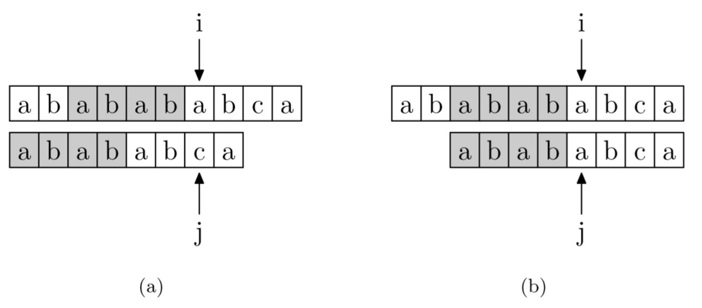

# 串

重点是字符串匹配模式，其他只做了解。

## 基本概念

+ 串：零个或多个字符组成的有限序列。
+ 子串：串中任意个连续的字符组成的子序列。
+ 空串：长度为零的串。
+ 空白串（空格串）：仅由一个或多个空格组成的串。
+ 空串是任意串的子串，任意串是其自身的子串。

串的基本操作是对子串的操作。

## 串定义

### 顺序串

顺序串的结构定义方案

+ 使用单独的变量$length$保存串长。
+ 使用$data[0]$记录串长；使得字符位序与数组下标一致；但是由于$char$类型一个为一字节大小，所以能表示的数字是$0$到$255$，太大的串无法表示，大于的部分会被截断。
+ 没有表示串长的变量，使用$\backslash0$表示串结尾，对应$ASCII$码的$0$号字符。
+ $data[0]$空余，使用单独的变量$length$保存串长，这个比较常用。
+ 可以定长分配也可以用堆分配。

### 链串

如一般的链式存储结构定义一样，定义一个数据与指向下一位的指针。

但是如果你只在每个结点定义了一个字节的数据，但是又包含了四个字节的指针，那么存储利用率会很低。

如果是顺序表数据类型是整数类型，那么这种利用率低的情况确实无可奈何，但是对于串而言，因为一个字节存储一个字符，所以能一个字节存一个字符类型数据，所以为了提升数据存储利用率，可以每个结点存等多个字符。这个就是块链串。

## 模式匹配

模式匹配指在主串中找到与模式串相同的子串并返回其所在位置。

### 朴素模式匹配算法

从主串$T$、模式串$P$（子串）的第一个位置开始比较（$i=0,j=0$），若相等，则$i$，$j$各自$+1$，然后比较下一个字符。若不等，主串指针回溯到上一轮比较位置的下一个位置，子串回溯到$0$，再进行下一次比较。令子串长度为$m$，主串长度为$n$：

+ 匹配成功的最好时间复杂度：$O(m)$：刚好第一个就匹配上了，总对比次数为子串长度。
+ 匹配失败的最好时间复杂度：$O(n-m+1)=O(n-m)=O(n)$：匹配成功之前，每一个与第一个字符都匹配失败。
+ 匹配失败的最坏时间复杂度：$O(nm-m^2+m)= O(nm)$：子串除了最后一个对不上，其余的都能对上，则每次遍历完一边后，又要走回头路；直到匹配成功/失败一共需要比较$m\times(n-m+1)$次。$m$：每次需要移动$m$次，$i$需要移动$n-m+1$次。

暴力匹配算法的最大问题就是对主串一位位进行对比，当后面的匹配失败后只能回溯主串，只移动一位重新匹配。

### KMP算法

#### 原理

$KMP$算法是对朴素模式匹配算法的优化。

朴素模式匹配算法的缺点就是当某些子串与模式串能部分匹配时，主串的扫描指针$i$经常回溯，从而导致时间开销。

主要思想是失配时，只有模式串指针回溯，主串指针不变，找到失配前模式串的最长公共前后缀并跳转到最大公共后缀开始匹配，且最大公共前后缀要小于左端子串长度。

那么如何理解？如主串是$12345612346$，模式串为$12346$，那么我们从$1$开始对比到$5$的时候失配。按照默认暴力匹配法不仅模式串要回溯到第一个，主串也要回溯到第二个即$2$重新对比。

但是我们一眼就能看出来$2$这个位置不需要进行对比，因为我们之前匹配过，字符串中只有最开始位置为$1$，其他位置都不为$1$，所以应该直接跳到没有对比的主串位置进行对比，而不是重复对比之前的内容。这是我们大脑默认处理的过程，$KMP$就是模拟这个处理过程。

主串是未知的，而模式串是已知的，所以对于串匹配的优化必然基于模式串。

由于模式串在最开始就是已知的，所以在失配前主串和模式串必然相等，即我们可以选择模式串中能匹配的部分重新匹配，而不是直接从头开始。

#### 公共前后缀

模式后滑动位数只与模式串本身的最大公共后缀有关，于主串无关。

+ 前缀：对于字符串$A$，$B$，$A=B+S$，且$S$非空，则$B$是$A$的前缀。
+ 后缀：对于字符串$A$，$B$，$A=S+B$，且$S$非空，则$B$是$A$的后缀。
+ $PMT$值：前缀集合和后缀集合的交集中，最长元素的长度。
+ 部分匹配表：$PMT$值集合，字符串所有前后缀的$PMT$值。

当一个位置失配时，那么子串前面的所有字符串都是配对的，所以对于子串前面的部分都是已知的了，需要从模式串的最开始开始对比，而一般的模式匹配要从主串的下一个重新开始匹配，但是如果我们找到了主串当前失配位置的前缀和后缀最大重合的地方，即公共前后缀，$PMT$值，就代表从这里开始就可以匹配了，前面的地方没必要匹配，可以直接多跳几步移动到公共后缀去开始重新匹配。

|  字符串  |         前缀          |         后缀          |   交集    |  PMT  |
| :------: | :-------------------: | :-------------------: | :-------: | :---: |
|   'a'    |           ∅           |           ∅           |     ∅     |   0   |
|   'ab'   |          'a'          |          'b'          |     ∅     |   0   |
|  'aba'   |       'a','ab'        |       'ba','a'        |    'a'    |   1   |
|  'abab'  |    'a','ab','aba'     |    'b','ab','bab'     |   'ab'    |   2   |
| 'ababab' | 'a','ab','aba','abab' | 'a','ba','aba','baba' | 'a','aba' |   3   |

所以字符串'$ababa$'的部分匹配值为$00123$，即可以得到部分匹配值表。

  

如图可知在$a$和$c$处失配，由于前面是匹配的，所以可以直接对齐比较。

#### next数组

假设索引值以$0$为开头，如果是以$1$开始则全部加一即可。

失配移动位数$move$=已匹配字符数$j$-对应的部分匹配值$PM[j-1]$。（从而跳到开始有重复公共前缀的地方）

部分匹配值表就是子串应该跳转的索引值。当这个位失配，则子串应该跳转的索引值是失配位置前一位的$PM$值。

因为纯匹配值表要看前一位的值，所以可以把匹配表数据全部右移一位，这就可以直接看失配位置的表值了，定义为$next$。最开始的一位用$-1$表示，最后一位丢弃。

所以$move=j-next[j]$。即移动位数=匹配位数-本位的跳转值。

所以相当于子串的比较指针$j$回到$j=j-move=j-((j-next[j])=next[j]$。

$next$此时就是$j$失配时应该跳转到的索引值。

所以当$j=0$时，恒定$next[0]=-1$（主串加一）$next[1]=0$。因为只有一个字母没有前一位所以是$-1$，只有两个字母前一位只有一个字母没有前后缀。

<!-- 1. 求$next[j+1]$，则已知前面的所有$next$表值$next[1],next[2]\cdots next[j]$。
1. 假设数组值$next[j]=k_1$（跳转索引），则有$P_1\cdots P_{k_1-1}=P_{j-k_1+1}\cdots P_{j-1}$（前$k_1-1$位字符与后$k_1-1$位字符重合）。
2. 如果$P_{k_1}=P_j$（即最后一位也一样，则得到在之前匹配基础上的更长的公共前后缀），则$P_1\cdots P_{k_1-1}P_{k_1}=P_{j-k_1+1}\cdots P_{j-1}P_j$，则$next[j+1]=k_1+1$，否则进入下一步。
3. 假设$next[k_1]=k_2$、则有$P_1\cdots P_{k_2-1}=P_{k_1-k_2+1}\cdots P_{k1-1}$。
4. 第二第三步联合得到$P_1\cdots P_{k_2-1}=P_{k_1-k_2+1}\cdots P_{k1-1} =P_{j-k_1+1}\cdots P_{k_2-k_1+j-1}=P_{j-k_2+1}\cdots P_{j-1}$，即四段重合。
5. 这时候．再判断如果$P_{k_2}=P_j$，则$P_1\cdots P_{k_2-1}P_{k_2}=P_{j-k_2+1}\cdots P_{j-1}P_j$，则$next[j+1]=k_2+1$，否则再取$next[k_2]=k_3$回到四。
6. 如果遇到$0$还没有结果，则表示前面的全部不重合，赋值为$0+1=1$。

可以通过一定关系不用计算最大公共前后缀得到$next$值：

要计算当前位置的$next$值，就看前一位的$next$值所代表的索引指向的字符是否与前一位的字符相等，若相等，则是前一位的$next$值加一，若不等，则继续看前一位的$next$值指向的字符的$next$指向的字符与前一位字符是否相等，若相等则结果就是这个$next$值加一，否则继续按照$next$索引向前寻找。最后都不等则前一位$next$为$0$，当前位置的$next$为$1$。 -->

#### KMP匹配

$KMP$算法在形式上跟简单的模式匹配算法类似，唯一不同的是当失配时指针$i$不动（主串不动）指针$j$回到$next[j]$的位置重新比较（利用$next$数组跳到指定位置后要在这个位置比较一次），当$j=-1$时代表全部失陪，所以$ij$同时加一，即全部后移一位。

<!-- 即主串第$i$个位置与模式串第一个字符不等时应该从主串$i+1$个位置开始匹配。 -->

#### 算法性能

使用$KMP$算法时需要先计算不同模式串$P$的$next$数组，时间复杂度为$O(m)$，然后使用$KMP$算法计算，时间复杂度为$O(n)$，从而平均时间复杂度为$O(m+n)$。

虽然普通模式匹配算法复杂度$O(mn)$，但是一般情况下接近于$O(m+n)$。

$KMP$算法对于重复部分比较多的模式串匹配效果更好。

### KMP算法优化

$KMP$算法的$next$数组存在一定问题，当当前索引的值匹配失败，那么模式串的其他同样值的地方也一定会匹配失败。

如$goolggoogle$匹配$google$，其中$PMT$表格为：

|  序号   |   0   |   1   |   2   |   3   |   4   |   5   |
| :-----: | :---: | :---: | :---: | :---: | :---: | :---: |
| 模式串  |   g   |   o   |   o   |   g   |   l   |   e   |
| next[j] |  -1   |   0   |   0   |   0   |   1   |   0   |

其中匹配到第四个$l$时与$g$不匹配，按照表格会跳转匹配到第$1$个字符，但是由于序号$1$的字符也是$g$，所以这次跳转就是个浪费的对比。

所以可以直接将模式串所有相同值的部分的$next$值全部取为其$next$值对应索引的$next$值。

所以需要再次递归，将$next[j]$变为$next[next[j]]$直到两者不相等，令更新后数组为$nextval$。

|    序号    |   0   |   1   |   2   |   3   |   4   |   5   |
| :--------: | :---: | :---: | :---: | :---: | :---: | :---: |
|   模式串   |   g   |   o   |   o   |   g   |   l   |   e   |
|  next[j]   |  -1   |   0   |   0   |   0   |   1   |   0   |
| nextval[j] |  -1   |   0   |   0   |  -1   |   1   |   0   |

对于多个字符重复的字符串，则$nextval$的优化程度会更高：

|    序号    |   0   |   1   |   2   |   3   |   4   |
| :--------: | :---: | :---: | :---: | :---: | :---: |
|   模式串   |   a   |   a   |   a   |   a   |   b   |
|  next[j]   |  -1   |   0   |   1   |   2   |   3   |
| nextval[j] |  -1   |  -1   |  -1   |  -1   |   3   |
