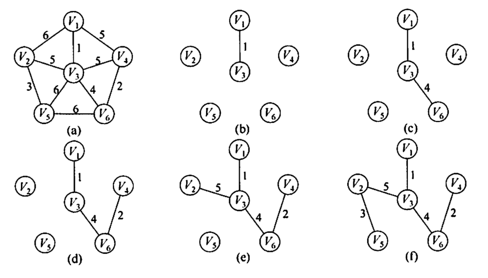
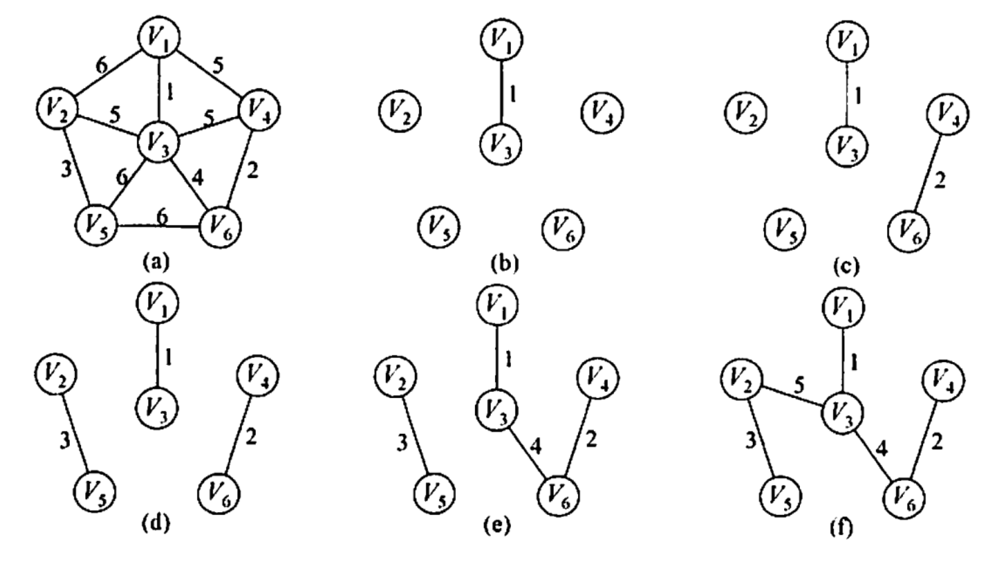
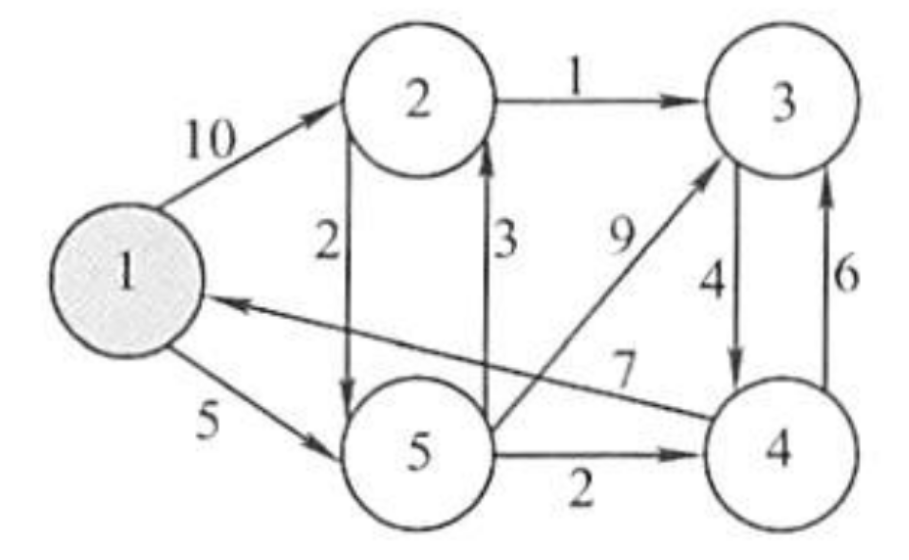
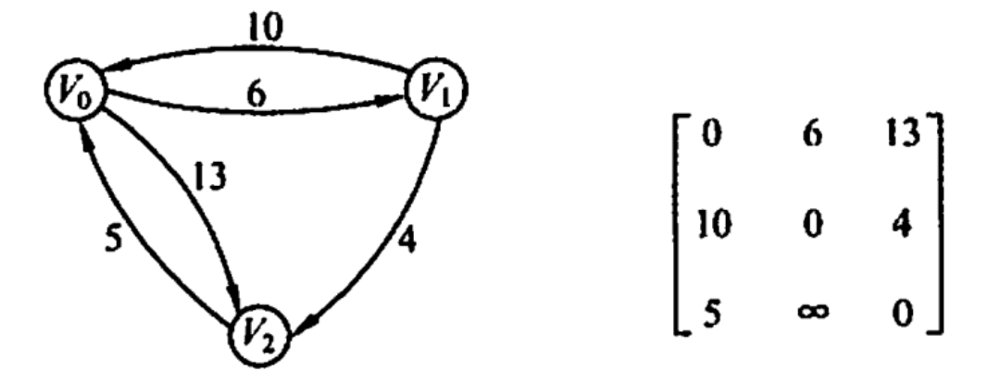
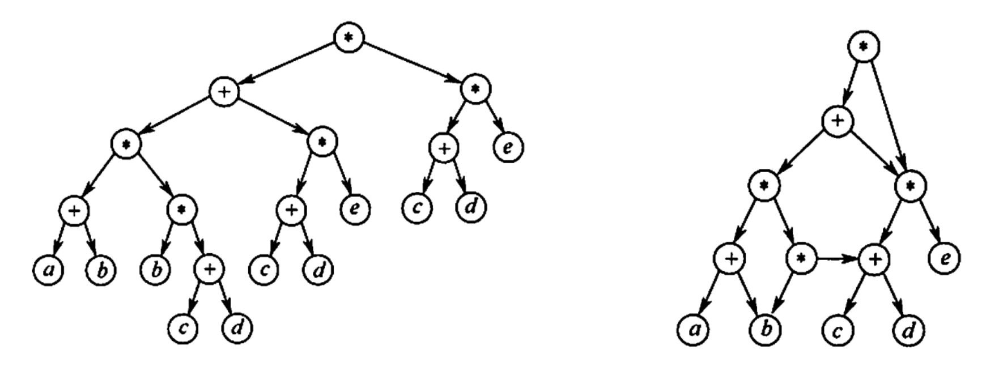

# 图

主要了解概念，算法具体实现不是重点。

## 基本概念

### 图的定义

图是顶点集和边集构成的二元组，即图$G$由顶点集$V$和边集$E$组成，记为$G=(V,E)$，其中$V(G)$表示图$G$中顶点的有限非空集，$E(G)$表示图$G$中顶点之间的关系（边）集合。

若$V=\{v_1,v_2\cdots,v_n\}$，则用$\vert V\vert$表示图$G$中顶点的个数，也称图$G$的阶，$E=\{(u,v)\vert u\in V,v\in V\}$，用$\vert E\vert$表示图$G$中边的条数。

图一定是非空的，即$V$一定是非空集。

### 图的类别

- **无向图**：若$E$是无向边（简称边）的有限集合时，则图$G$为无向图。边是顶点的无序对，记为$(v,w)$或$(w,v)$，因为$(v,w)=(w,v)$，其中$v$、$w$是顶点。可以说顶点$w$和顶点$v$互为邻接点。边$(v,w)$依附于顶点$w$和$v$，或者说边$(v,w)$和顶点$v$、$w$相关联。
- **有向图**：若$E$是有向边（也称弧）的有限集合时，则图$G$为有向图。弧是顶点的有序对，记为$<v,w>$，其中$v$、$w$是顶点，$v$称为弧尾，$w$称为弧头，$<v,w>$称为从顶点$v$到顶点$w$的弧，也称$v$邻接到$w$，或$w$邻接自$v$。$<v,w>\neq<w,v>$。


- **简单图**：不存在重复边，且不存在顶点到自身的边。一般的图默认是简单图。
- **多重图**：图$G$中某两个顶点之间的边数多于一条，又允许顶点通过同一条边与自己关联。


- **无向完全图**：对于无向图$\vert E\vert\in[0,n(n-1)/2]$，无向图中任意两个顶点之间都存在边，即==$\vert E\vert=n(n-1)/2$==。
- **有向完全图**：对于有向图$\vert E\vert\in[0,n(n-1)]$，有向图中任意两个顶点之间都存在方向相反的两条弧，即==$\vert E\vert=n(n-1)$==。


- **稀疏图**：一般$\vert E\vert<\vert V\vert\log\vert V\vert$的图。
- **稠密图**：一般$\vert E\vert>\vert V\vert\log\vert V\vert$的图。


- **树**：不存在回路，且连通的无向图。（与图是逻辑的区别）
- **有向树**：一个顶点的入度为$0$，其余顶点入度均为$1$的有向图。

### 顶点的度

#### 度的定义

对于无向图，顶点$v$的度是指依附于该顶点的边的条数，记为$TD(v)$。

对于有向图，入度是指以顶点$v$为终点的有向边的条数，记为$ID(v)$；出度指以顶点$v$为起点的有向边的条数，记为$OD(v)$；顶点$v$的度就是其入度和出度之和，即$TD(v)=ID(v)+OD(v)$。

有向树：一个顶点的入度为$0$，其他顶点入度均为$1$的有向图。

#### 度的关系

- 对于具有$n$个顶点，$e$条边的无向图，$\sum\limits_{i=1}^nTD(v_i)=2\vert E\vert=2e$，即==无向图的全部顶点的度的和等于边数的两倍==。因为每条边都与两个顶点关联。
- 对于具有$n$个顶点，$e$条边的有向图，$\sum\limits_{i=1}^nID(v_i)=\sum\limits_{i=1}^nOD(v_i)=\vert E\vert=e$。因为每条有向边都有一个起点和终点。
- 对于$n$个顶点的无向图，每个顶点的度最大为$n-1$。因为任意一个顶点可以与其他$n-1$个顶点相联。默认是简单图，即不能自己连向自己。
- 对于$n$个顶点的有向图，每个顶点的度最大为$2n-2$。因为任意一个顶点可以与其他$n-1$个顶点有指向相反的两条边。
- 无向连通图的每个顶点的度都是$2$。

### 顶点的关系

- . 路径：从一个点到另一个点所经过的顶点序列。由顶点和相邻顶点序偶构成的边所形成的序列。
- 回路（环）：第一个顶点与最后一个顶点相同的路径。
- 长度（无权图）：沿路径所经过的边数成为该路径的长度。
- 简单路径：路径中的顶点不重复出现。
- 简单回路：由简单路径组成的回路。（除第一个和最后一个顶点外其余顶点不重复出现的回路）
- 点到点的距离：从顶点$u$到顶点$v$的最短路径若存在，则此路径的长度就是从$u$到$v$的路径，若不存在路径，则记该路径为无穷。

若一个图有$n$个顶点，有大于$n-1$条边，则此图一定有环。

### 图的连通

#### 连通概念

- 连通：在无向图中，若从顶点$v$到顶点$u$有**路径**存在，则称$uv$是连通的。
- 强连通：在有向图中，若从顶点$v$到顶点$u$和从顶点$u$到顶点$v$之间都有**路径**（而不是弧），则称$uv$是强连通。
- 连通图：无向图中任意两个顶点之间都是连通的。
- **强连通图**：有向图中任意两个顶点之间都是强连通的。
- 子图：设有两个图$G=(V,E)$和$G'=(V',E')$，若$V'$是$V$的子集，$E'$是$E$的子集，则$G'$是$G$的子图。但是不是所有的子集都能构成子图，必须满足原图的关系的子集才行，即存在$\varphi'\in\varphi$（如原图中一条边的两个端点子图的点集中没有，则这个图不是子图）。
- 生成子图：若有满足$V(G')=V(G)$的子图$G'$，则$G'$是$G$的生成子图。（即子图包含所有顶点，但不一定包含所有的边）
- 连通分量：无向图$G$中的极大连通子图称为$G$的连通分量；对任何连通图而言，连通分量就是其自身。
- **强连通分量**：有向图$G$中的极大连通子图称为$G$的强连通分量；对任何强连通图而言，强连通分量就是其自身。
- 生成树：包含连通图中全部顶点的一个极小连通子图。若图的顶点为$n$，则其生成树包含$n-1$条边，若去掉生成树的一条边则会变成非连通图，若加上一条边则会形成一个回路。
- 生成森林：在非连通图中，连通分量的生成树构成了非连通图的生成森林。

对于无向图：

- 极大连通子图：用来讨论图的连通分量，要求连通子图包含其所有的边。
  - 连通图的极大连通子图就是它本身。
  - 非连通图中有多个连通分量（不同的点相连从而连通），也就是可以有多个极大连通子图。
- 极小连通子图：用来讨论图的生成树，要保持图连通也要让边数最小的子图。
  - 极小连通子图只在无向图中才有。
  - 极小连通子图中包含图中全部的顶点（和极大不同，极大不要求包含所有的顶点）。
  - 用边将极小连通图中的所有边都连接起
  - 极小连通子图和生成树的概念不是等价的，生成树是包含图中全部顶点的一个极小连通子图。

对于有向图：

- 极大强连通子图：
  - 强连通图的极大强连通子图为其本身。（是唯一的）
  - 非强连通图有多个极大强连通子图。（非强连通图的极大强连通子图叫做强连通分量）
- 不存在极小强连通子图的概念，因为树没有方向性。

无向图研究连通性，有向图研究强连通性。

#### 连通与边点关系

- 对于$n$个顶点的无向图，若其是连通图，则最少需要$n-1$条边，若其是非连通图，则最多有$C_{n-1}^2$条边（$n-1$个顶点构成一个完全图）。
- 对于$n$个顶点的有向图，若其是强连通图，则最少需要$n$条边来形成环路。
- 对于$n$个顶点的环，有$n$棵生成树。因为$n$个顶点的环的生成树的顶点为$n-1$，去掉任意一条边就能得到一棵生成树，环一共有$n$条边，所以可以去掉$n$条，得到$n$棵生成树。
- 对于$n$个顶点、$e$条边的无向图是一个森林，则一共有$n-e$棵树。设一共有$x$棵树，则只需要$x-1$条边就能将森林连接为一整棵树，所以边数$+1=$顶点数（树的性质），即$e+(x-1)+1=n$，解得$x=n-e$。

#### 连通概念关系

- 有向完全图是强连通有向图。（完全就代表所有边都有双向弧，强连通代表所有边都有双向路径，条件更强）
- 生成树是原图的无环子图、极小连通子图且点集相同。（不是连通分量）

如何求/连通分量强连通分量数？

- 当某个顶点只有出弧而没有入孤时，其他顶点无法到达这个项点，不可能与其他顶点和边构成强连通分量（这个单独的顶点构成一个强连通分量）。
- 依次选择无入弧顶点构成连通分量，删除该顶点以及所有以之为结尾的弧。
- 最后得到的每个顶点就是一个强连通分量，其数量就是强连通分量数。

### 图的权

- 边的权：在一个图中，每条边都可以表上具有某种含义的数值，这就是该边的权值。
- 网络（网）：若图中的每条边都有权，这个带权图被称为网。
- 带权路径长度：取沿路径各边的权之和作为此路径的长度。

#### 无权图

若$v[i][j]=0$，表示$v_{i+1}$到$v_{j+1}$是不连通的，若$v[i][j]=1$，表示$v_{i+1}$到$v_{j+1}$是连通的。

#### 网

若$v[i][j]=\infty$，表示$v_{i+1}$到$v_{j+1}$是不连通的，若$v[i][j]=$某权值，表示$v_{i+1}$到$v_{j+1}$是连通的。

## 图的存储结构

### 邻接矩阵

#### 矩阵定义

用一个一维数组保存顶点，用一个二维数组保存边，这个二维数组就是邻接矩阵。

使用一个长宽皆为$\vert v\vert$的二维矩阵$v$，从左上角到右上角，从左上角到左下角，分别标识表示$v_1,v_2\cdots,v_n$。

<!-- 假设矩阵的索引从$0$开始，而顶点编号从$1$开始。 -->

对于无向图$v_{ij}=v_{ji}=1$，表示存在边$(v_i,v_j)$；对于有向图$v_{ij}=1$表示存在边$<v_i,v_j>$。

若$(v_i,v_j)$是$E(G)$中的边：对于无权图，矩阵$A[i][j]$存在就设为$1$，否则是$0$；对于有权图，矩阵$A[i][j]$存在就设为其权重$w_{ij}$，否则是$0$或$\infty$；。

#### 矩阵性质

度的性质：

- 对于无向图，第$i$个顶点的度=第$i$行或第$i$列的非零元素个数。
- 对于有向图，第$i$个顶点的出度=第$i$行的非零元素个数；第$i$个顶点的入度=第$i$列的非零元素个数；第$i$个顶点的度=第$i$行的非零元素个数+第$i$列的非零元素个数。

存储性质：

- 适用于存储稠密图。
- 对于无向图，因为没有方向，所以只有两点连接就是连通的，从而无向图的邻接矩阵都是主对角线对称的。因为对称，所以可以压缩存储。
- 对于无向图，图的边数等于上三角或下三角不包括主对角线的区域内的非零点的数量。
- 对于有向图，图的边数等于矩阵内所有非零点的数量。
- 空间复杂度是$O(\vert V\vert^2)$。
- 邻接矩阵存储图，很容易确定图中任意两个顶点之间是否有边相连，时间复杂度为$O(1)$。但是，要确定图中有多少条边，则必须按行、按列对每个元紊进行检测，所花费的时间代价很大。
- 给定顶点找到其邻边要扫描一行，时间复杂度为$O(\vert V\vert)$。

数学性质：

- 设图$G$的邻接矩阵为$A$，$A^n$的元素$A^n[i][j]$表示由顶点$i$到顶点$j$长度为$n$的路径数量。

设图$G$的邻接矩阵为$A$，矩阵元素为$0$或$1$，则$A^n$的元素$A^n[i][j]$表示由顶点$v_{i+1}$到顶点$v_{j+1}$的长度为$n$的路径的数目。

邻接矩阵的表示方式是唯一的。

### 邻接表

对于稀疏图临界矩阵浪费空间，使用邻接表回更方便。

#### 表定义

邻接表存储方式是顺序存储与链式存储的结合，存储方式和树的孩子表示法类似。

使用一个数组顺序保存图的每一个顶点，称为顶点表，使用链式存储让每一个顶点元素包含一个指向后一条边的指针，称为边表。

```txt
1--2--3
| /| /
|/ |/
5--4
```

```txt
1→2→5^
2→1→5→3→4^
3→2→4^
4→2→5→3^
5→4→1→2^
```

#### 表性质

度的性质：

- 对于无向图，每个顶点的边链表的顶点数就是该顶点的度。
- 对于有向图，每个顶点的边链表的顶点数就是该顶点的出度，而对于入度就只能遍历所有顶点的顶点链表。

存储性质：

- 对于无向图，因为同一条边两端的点会重复存储，所以空间复杂度为$O(\vert V\vert+2\vert E\vert)$，而对于有向图空间复杂度为$O(\vert V\vert+\vert E\vert)$。
- 给定顶点找到其邻边只需要读取其邻接表，时间复杂度为$O(1)$。
- 找到两个顶点是否存在邻边，需要在相应边表中查找另一个顶点。

邻接表的表示方式是不唯一的。

### 十字链表

十字链表置用于存储有向图。可以解决邻接矩阵空间复杂度高和邻接表计算入度入边不方便的问题。

十字链表定义了两种顶点：

- 顶点顶点：用于表示顶点，被一个数组包裹。
  - 数据域。
  - 该顶点作为弧头的第一条弧。
  - 该顶点作为弧尾的第一条弧。
- 弧顶点：被顶点顶点指向的顶点。
  - 弧尾顶点编号。
  - 弧头顶点编号。
  - 权值。
  - 弧头相同的下一条弧。
  - 弧尾相同的下一条弧。

空间复杂度为$O(\vert V\vert+\vert E\vert)$。

十字链表图表示是不唯一的。

### 邻接多重表

邻接多重表用于存储无向图，可以解决邻接矩阵空间复杂度高和邻接表删除插入顶点不方便的问题。

邻接多重表定义了两种顶点：

- 顶点顶点：用于表示顶点，被一个数组包裹。
  - 数据域。
  - 该顶点相连的第一条边。
- 边顶点：被顶点顶点指向的顶点。
  - 边一端编号$i$。
  - 边另一端编号$j$。
  - 权值。
  - 依附于$i$的下一条边。
  - 依附于$j$的下一条边。

空间复杂度为$O(\vert V\vert+\vert E\vert)$。

邻接多重表表示是不唯一的。

## 图的基本操作

### 图查找

#### 查找边

使用邻接矩阵只用根据对应行列的元素是否为$1$或某值就可以了，如果是$0$或无穷，就代表没有该邻边。时间复杂度为$O(1)$。

而使用邻接矩阵需要从一端点出发遍历对应的顶点链表，如果能在链表中找到另一端点的索引，就代表有边。时间复杂度为$O(1)$到$O(\vert V\vert)$。

#### 查找点邻边

对于无向图，邻接矩阵需要遍历对应顶点的那一行，所有数值为$1$或某数值的列就是对应的有边的另一个端点。时间复杂度为$O(\vert V\vert)$。

对于有向图，邻接矩阵需要遍历对应顶点的那一行得到出边以及那一列代表入边，所有数值为$1$或某数值的列就是对应的有边的另一个端点。时间复杂度为$O(\vert V\vert)$。

对于无向图，邻接表只用遍历对应顶点的顶点链表就可以。时间复杂度为$O(1)$到$O(\vert V\vert)$。

对于有向图，邻接表用遍历对应顶点的顶点链表得到出边，而对于入边需要遍历所有邻接表的边顶点。出边时间复杂度为$O(1)$到$O(\vert V\vert)$，入边时间复杂度为$O(\vert E\vert)$。

#### 查找头邻接点

邻接矩阵只用扫描对应的行，找到顶点就可以了。时间复杂度为$O(1)$到$O(\vert V\vert)$。

对于无向图，邻接表只用找到顶点的边顶点的第一个顶点。时间复杂度为$O(1)$。

对于有向图，出边邻接表只用找到顶点的边顶点的第一个顶点。时间复杂度为$O(1)$。而对于入边需要遍历所有的顶点的第一个链表顶点。时间复杂度为$O(1)$到$O(\vert E\vert)$。

#### 查找下一个邻接点

邻接矩阵只用扫描对应的行，找到顶点就可以了。时间复杂度为$O(1)$到$O(\vert V\vert)$。

邻接表只用找到当前顶点的下一个顶点。时间复杂度为$O(1)$。

### 图插入

邻接矩阵只用在最后增加一行一列。时间复杂度是$O(1)$。

邻接表只用在存储顶点的数组的末尾添加一个顶点，指针设置为$NULL$。时间复杂度是$O(1)$。

### 图删除

邻接矩阵的删除元素分为两种方式，如果是直接删除对应元素行与列上的所有元素并移动其他元素，那么时间复杂度就是$O(\vert V\vert^2)$，如果删除对应元素行与列上的所有元素但是不移动其他元素，而是将保存顶点数据的数组中对应顶点的数据变为$NULL$，则时间复杂度就是$O(\vert V\vert)$。

对于无向图，邻接表的删除需要删除该顶点并删除顶点后连接的所有顶点链表元素，时间复杂度为$O(1)$到$O(\vert V\vert)$。

对于有向图，邻接表的删除需要删除该顶点并删除顶点后连接的所有顶点链表元素且还要遍历所有的边并删除，删除出边时间复杂度为$O(1)$到$O(\vert V\vert)$，删除入边时间复杂度为$O(\vert E\vert)$。

### 图遍历

指从图某一顶点出发按照某种搜索方法沿着图中的边对图中所有顶点访问一次且仅访问一次。

树的遍历也可以看作一种特殊图的遍历。

分为广度优先$BFS$与深度优先$DFS$。

广度优先类似层序遍历，深度优先类似先序遍历。

广度优先是每一次遍历都要把所有的相邻顶点全部遍历到，而深度优先是每一次遍历只遍历最近的一个一直深入。

由于邻接矩阵是唯一的，所以其图遍历序列是不唯一的，而对于邻接表是不唯一的，但是对于每一个邻接表的各个顶点的顺序是固定的，所以序列就是固定的。

#### 广度优先遍历

实现条件：

- 找到一个与顶点相邻的所有顶点。
- 标记哪些顶点被访问过。
- 需要一个辅助队列保存顶点是否被访问的数据。

广度优先遍历过程：

1. 选择起始点并访问顶点$v$。
2. 访问$v$的所有未被访问的邻接点。
3. 依次从这些邻接点（在步骤二中访问的顶点）出发，访问它们的所有未被访问的邻接点；依此类推，直到图中所有访问过的顶点的邻接点都被访问。
4. 若图中尚未有顶点被访问，则另选一个未曾被访问的顶点作为起始点重复过程。

性质：

- 因为广度优先算法不需要回退，所以不是一个递归算法。
- 对于非带权图，使用$BFS$可以解决非带权图的单源最短路径问题，因为广度优先搜索按照距离有近到远。
- 邻接矩阵实现时的时间复杂度为$O(\vert V\vert^2)$，邻接表实现时的时间复杂度为$O(\vert V\vert+\vert E\vert)$；空间复杂度为$O(\vert V\vert)$。

相关概念：

- 广度优先生成树：根据广度优先遍历可以将所有第一次访问顶点时的路径组合生成一个广度优先生成树，若图顶点为$n$个，则生成树边一共有$n-1$条。因为保存图的数据结构若是不唯一，则其广度优先生成树也是不唯一的。若邻接矩阵存储则唯一，若邻接表存储则不唯一。
- 广度优先生成森林：若图是不连通的，那会生成连通分量个广度优先生成树，就构成了广度优先生成森林。

#### 深度优先遍历

实现条件：

- 是一个递归算法，所以需要一个工作栈。

深度优先遍历过程：

1. 访问顶点$v$。
2. 依次从$v$的未被访问的邻接点出发，对图进行深度优先遍历。
3. 直至图中和$v$有路径相通的顶点都被访问。
4. 若此时图中尚有顶点未被访问，则从一个未被访问的顶点出发，重新进行深度优先遍历，直到图中所有顶点均被访问过为止。

性质：

- 邻接表的深度优先序列会优先选择每个顶点的第一个相邻顶点，即顶点链中的第一个元素。
- 邻接矩阵方式唯一所以深度优先序列唯一，而邻接表方式不唯一，所以深度优先序列不唯一。
- 使用$DFS$算法递归地遍历一个无环有向图，并在退出递归时输出相应顶点，这样得到的顶点序列是逆拓扑有序。（因为栈的先进后出特性）
- 邻接矩阵实现时的时间复杂度为$O(\vert V\vert^2)$，邻接表实现时的时间复杂度为$O(\vert V\vert+\vert E\vert)$；空间复杂度为$O(\vert V\vert)$。

相关概念：

- 深度优先生成树：根据深度优先遍历可以将所有第一次访问顶点时的路径组合生成一个深度优先生成树，若图顶点为$n$个，则生成树边一共有$n-1$条。因为保存图的数据结构若是不唯一，则其深度优先生成树也是不唯一的。如果无向图非连通，则一个顶点出发只能一次性遍历到该顶点所在连通分量的所有顶点。
- 深度优先生成森林：若图是不连通的，那会生成连通分量个深度优先生成树，就构成了深度优先生成森林。

图的广度优先生成树的高度小于等于深度优先生成树的高度。

#### 图遍历与图连通性

- 若起始顶点到其他各顶点都有路径，那么只需调用一次深度优先或广度优先遍历函数。
- 对强连通图，从任意一顶点出发都只用调用一次深度优先或广度优先遍历函数。
- 遍历时函数调用层数等于该图的连通分量数。（因为存在不同的连通分量需要多次调用才能全部访问到）

## 图的应用

### 最小生成树

一个连通图的生成树包含图的所有顶点，并且只含尽可能少的边。对于生成树来说，若砍去它的一条边，则会使生成树变成非连通图；若给它增加一条边，则会形成图中的一条回路。

#### 最小生成树定义

最小生成树$MST$也是最小代价树。已知生成树就是最小边的能到任意顶点的树，这种树只关心边数，所以有多个不同的生成树。

而最小生成树就是带权生成树的最小权值和的情况。

设$R$为图$G$的所有生成树的集合，若$T$为$R$中边的权值之和最小的生成树，则$T$称$G$的最小生成树。

- 最小生成树边的权值总是唯一且最小的。
- 如果没有权值相同的边，则最小生成树是唯一的。
- 最小生成树的边数=顶点数$-1$。减去一条则不连通，增加一条则会出现回路。
- 若一个连通图本身就是一棵树，则其最小生成树就是其本身。
- 只用连通图才有生成树，非连通图只有生成森林。

构建最小生成树的算法都利用的性质：假设$G=(V,E)$是一个带权连通无向图，$U$是顶点集$V$的一个非空子集。若$(u,v)$是一条具有最小权值的边，其中$u\in U$，$v\in V-U$，则必存在一棵包含边$(u,v)$的最小生成树。

获取最小生成树的$Prim$算法和$Kruskal$算法都是基于贪心算法的策略。每次都加入一条边逐渐生成一棵生成树：

```txt
function(G) {
  T=NULL;
  while T未形成一棵生成树 {
    找到最小代价边(u,v)且加入T不会形成回路;
    T=T∪(u,v);
  }
}
```

$MST$唯一性定理：$MST$没有使用无向网中相同权值的边，那么$MST$一定唯一。（连通图的任意一个环中所包含的边的权值均不相同）

#### Prim算法

非常类似找到图最短路径的迪杰斯特拉算法。

普里姆算法：从某个顶点开始构建生成树，每次将代价最小的新顶点纳入生成树，直到所有顶点都纳入为止。

- 假设$G=\{V,E\}$是连通图，其最小生成树$T=(U,E_T)$，$E_T$是最小生成树中边的集合。
- 初始化：向空树$T=(U,E_T)$中添加图$G=(V,E)$的任一顶点$u_0$，使$U=\{u_0\}$，$E_T=\varnothing$。
- 循环（重复下列操作直至$U=V$）：从图$G$中选择满足$\{(u,v)|u\in U,v\in V-U\}$且具有最小权值的边$(u,v)$，加入树$T$，置$U=U\cup\{v\}$，$E_T=E_T\cup\{(u,v)\}$。

  


- 需要遍历$\vert V\vert$个顶点，每次要遍历其他所有顶点。
- 时间复杂度为$O(\vert V\vert^2)$。
- 适用于边稠密图。

#### Kruskal算法

克鲁斯卡尔算法：每次选择一条权值最小的边，使这条边的两头连通，若本就连通的就不选，直到所有的顶点都连通。

- 假设$G=(V,E)$是连通图，其最小生成树$T=(U, E_T)$。
- 初始化：$U=V,E_T=\varnothing$。即每个顶点构成一棵独立的树，$T$此时是一个仅含$\vert V\vert$个顶点的森林。
- 循环（重复下列操作直至$T$是一棵树）：按$G$的边的权值递增顺序依次从$E-E_T$中选择一条边，若这条边加入$T$后不构成回路，则将其加入$E_T$，否则舍弃，直到$E_T$中含有$n-1$条边。

  


- 使用堆来存放边（所以可以二分查找），所以每次旋转最小权值的边只需要$O(\log\vert E\vert)$的时间。
- 时间复杂度为$O(\vert E\vert\log_2\vert E\vert)$。
- 适用于边稀疏顶点多的图。

### 最短路径

- 单源最短路径：单个顶点到图的其他顶点的最短路径。
  - $BFS$算法（无权图）。
  - $Dijkstra$算法（带权图、无权图）。
- 每对顶点间最短路径：每对顶点之间的最短路径。
  - $Floyd$算法（带权图、无权图）。

最短路径一定是简单路径（不存在环）。但是无论有没有环的有向图与是否存在最短路径无关。

#### BFS算法

广度优先算法可以计算无权图的单源最短路径。

实际上无权图可以视为一种特殊的带权图，只是每条边的权值全部为$1$。

广度优先算法基本上就是对广度优先遍历的改进。定义两个数组，索引号就代表元素的序号，一个数组表示从起点开始到该点的最短路径长度，另一个数组表示从起点开始到该点的最短路径的上一个顶点的索引值。

#### Dijkstra算法

即迪杰斯特拉算法。用于计算单源最短路径（要计算从源到其他所有各顶点的最短路径长度）。

1. 从$v_0$开始，初始化三个数组：标记各顶点是否已找到最短路径$final$；最短路径长度$dist$；最短路径上的前驱$path$。从$v_0$开始，所以将$final[0]=true$，$dist[0]=0$，$path[0]=-1$，然后将$v_0$直连的点的$dist$初始化为直连路径长度，对应的$path=0$，但是不要将对应的$final=true$，因为还没有确定对应的直连路径就是最短路径。其他顶点的$dist=\infty$。
2. 遍历所有顶点，找到还没确定最短路径，且最短路径长度值最小的的一个顶点，这就确定了下一个最短路径的顶点，令其各顶点是否已找到最短路径的值为$true$。
3. 检查所有邻接这个顶点的其他顶点，若其点还没有找到最短路径，则更新最短路径长度值与最短路径上前驱的值。
4. 重复步骤二再次循环遍历所有顶点并找到没确定最短路径则最短路径长度最小的顶点。重复次数为$n-1$次。

  


| 顶点  | 第一轮 |  第二轮  |   第三轮    |   第四轮    |
| :---: | :----: | :------: | :---------: | :---------: |
| 2权重 |   10   |    8     |     8√      |
| 2路径 | v1→v2  | v1→v5→v2 |  v1→v5→v2   |
| 3权重 |   ∞    |    14    |     13      |     9√      |
| 3路径 |        | v1→v5→v3 | v1→v5→v4→v3 | v1→v5→v2→v3 |
| 4权重 |   ∞    |    7√    |
| 4路径 |        | v1→v5→v4 |
| 5权重 |   5√   |
| 5路径 | v1→v5  |
| 集合  | {1,5}  | {1,5,4}  |  {1,5,4,2}  | {1,5,4,2,3} |

$Dijkstra$算法与$Prim$算法类似，都是优先与最短的路径结合。

时间复杂度为$O(\vert V\vert^2)$。

当权值中含有负权值的时候$Dijkstra$算法会失效。

#### Floyd算法

是一种动态规划算法，将问题的求解分为多个阶段。

对于$n$个顶点的图$G$，求任意一对顶点$v_i$到$v_j$之间的最短路径可分为如下阶段：

1. 初始化：不允许在其他顶点中转，求最短路径。
2. 若允许在$v_0$中转，求最短路径。
3. 若允许在$v_0$、$v_1$中转，求最短路径。
4. ...
5. 若允许在$v_0$、$v_1\cdots v_{n-1}$中转，求最短路径。

算法需要遍历$n$次，每次遍历都需要查看$n\times n$的矩阵中是否有更优的中转点。

即判断若$A^{(k-1)}[i][j]>A^{(k-1)}[i][k]+A^{(k-1)}[k][j]$是否成立，若成立则$A^{(k)}[i][j]=A^{(k-1)}[i][k]+A^{(k-1)}[k][j]$，$path^{(k)}[i][j]=k$，否则$A^{(k)}$和$path^{(k)}$保持原样。其中$A^{(k)}$表示的是允许$v_0\cdots v_k$个点中转后各顶点的最短路径长度，$path^{(k)}$表示允许$v_0\cdots v_k$个点中转后两个点之间的中转点。


  


| 中转点 |  -1   |       |       |   0   |       |       |   1   |       |       |   2   |       |       |
| :----: | :---: | :---: | :---: | :---: | :---: | :---: | :---: | :---: | :---: | :---: | :---: | :---: |
| &emsp; |  v0   |  v1   |  v2   |  v0   |  v1   |  v2   |  v0   |  v1   |  v2   |  v0   |  v1   |  v2   | v0 | v1 | v2 |
|   v0   |   0   |   6   |  13   |   0   |   6   |  13   |   0   |   6   | $10$  |   0   |   6   |  10   |
|   v1   |  10   |   0   |   4   |  10   |   0   |   4   |  10   |   0   |   4   |  $9$  |   0   |   4   |
|   v2   |   5   |   ∞   |   0   |   5   | $11$  |   0   |   5   |  11   |   0   |   5   |  11   |   0   |

$-1$代表是初始状态。

$0$代表用$0$进行中转，以$0$行和$0$列的数据都不用变，因为$0$行的数据表示$v0$到$v1$、$v2$的距离，$0$列的数据表示从$v1$、$v2$到$v0$的距离，这些不会以$0$进行中转。可以优化的只有$12$和$21$两个位置。同理对角线的元素都不用优化，固定为$0$因为是简单路径。$12$位置从$v0$中转是这个点对应行列的$v1v0+v0v2=10+13=23>4$，所以不用优化。$21$位置原来为正无穷，所以可以优化为$v2v0+v0v1=11$。

$1$代表用$1$进行中转，以$1$行和$1$列的数据都不用变，$02$位置若以$v1$中转则$v0v1+v1v2=6+4=10<13$，所以优化为$10$。$20$位置若以$v1$中转则$v2v0+v0v1=5+6=11>5$，不用优化。

$2$可以优化的位置为$10$、$01$，$v1v2+v2v0=4+5=9>10$，所以优化为$10$，$v0v2+v2v1=10+11=21>6$，不用优化。

此时保存的数据就是各点之间的最短路径长度。

时间复杂度为$O(\vert V\vert^3)$，空间复杂度为$O(\vert V\vert^2)$。

$Floyd$算法复杂度高，所以基本上都是四个顶点以下的图，能解决带负权值的问题，但是不能解决带有负权回路的图，即有负权值的边组成回路，这种图可能没有最短路径。

### 有向无环图

若一个有向图中不存在环，则是有向无环图，简称$DAG$图。

#### 表达式应用

有向无环图可以运用到表达式的表达上，用树表示表达式，将操作数共同的顶点部分删除并将边合并到一起，这就形成了图，从而能精简表达式。

顶点中不可能出现重复的操作数。表达式树不唯一。

1. 把各个单个的操作数不重复的排成一排。
2. 标出各个运算符的生效顺序。
3. 按顺序加入运算符，并注意对运算符的优先级进行分层。
4. 当构建完成后从底向上逐层检查同层的运算符是否可以合并。

表达式：$((a+b)*(b*(c+d))+(c+d)"e)*((c+d)*e)$

  


首先从第六层层有$c+d$与第五层有$c+d$重合，将第六层的$c+d$删掉，将第五层的乘号指向右边的加号上。第五层都有一个$b$，所以将加号和乘号都指向同一个$b$。然后往上面看还有相同的$(c+d)*e$，将其中一个删掉，连接到一起。

#### 拓扑排序

$AOV$网：用$DAG$图表示一个工程，顶点表示活动，有向边$<v_i,v_j>$表示活动$v_i$必须先于活动$v_j$进行。

拓扑排序：在图论中，由一个有向无环图的顶点组成的序列，当且仅当满足下列条件时，称为该图的一个拓扑排序：

1. 每个顶点出现且只出现一次。
2. 若顶点$A$在序列中排在顶点$B$的前面，则在图中不存在从顶点$B$到顶点$A$的路径。

或定义为：拓扑排序是对有向无环图的顶点的一种排序，它使得若存在一条从顶点$A$到顶点$B$的路径，则在排序中顶点$B$出现在顶点$A$的后面。每个$AOV$网都有一个或多个拓扑排序序列。

简单来说就是找到工程执行的先后顺序。

拓扑排序的实现：

1. 从$AOV$网中选择一个没有前驱的入度为$0$的顶点并输出。
2. 从网中删除该顶点和所有以它为起点的有向边。
3. 重复步骤一和二直到当前的$AOV$网为空或当前网中不存在无前驱的顶点（存在环路所以不能拓扑排序）为止。

逆拓扑排序的实现：

1. 从$AOV$网中选择一个没有后继的出度为$0$的顶点并输出。
2. 从网中删除该顶点和所有以它为起点的有向边。
3. 重复步骤一和二直到当前的$AOV$网为空或当前网中不存在无前驱的顶点为止。

若两个结点之间不存在祖先或子孙关系，则它们在拓扑序列中的关系是任意的（即前后关系任意)，因此使用栈和队列都可以保存结点，因为进栈或队列的都是入度为$0$的结点，此时入度为$0$的所有结点是没有关系的。

时间复杂度若使用邻接表为$O(\vert V\vert+\vert E\vert)$，若使用邻接矩阵则是$O(\vert V\vert^2))$。

图和拓扑序列的关系：

- 如果有向图顶点不能排成一个拓扑序列，则有向图含有顶点大于$1$的强连通分量（即存在非自身环路）。
- 有向无环图的唯一拓扑序列不能唯一确定该图。

#### 关键路径

在带权有向图中，以顶点表示时间，以有向边表示活动，以边上的权值表示完成该活动的开销，称之为用边表示活动的网络，简称$AOE$网。

- 只有在某顶点所代表的事件发生后，从该顶点出发的各有向边所代表的活动才能开始。
- 只有在进入某顶点的各有向边所代表的活动都已经结束时，该顶点所代表的事件才能发生，活动也可以并行进行。
- 只有一个入度为$0$的顶点，即开始顶点（源点），表示整个工程的开始。
- 只有一个出度为$0$的顶点，称为结束顶点（汇点），表示整个工程的结束。

- 从源点到汇点的有向路径可能有多条，所有路径中，具有最大路径长度的路径称为关键路径（即决定完成整个工程所需的最小时间），而关键路径上的活动称为关键活动。
- 事件的最早发生时间：决定了所有从该事件开始的活动能够开工的最早时间。一个事件的最早发生时间与以该事件为始的弧的活动的最早开始时间相同。
- 活动的最早开始时间：指该活动弧的起点所表示的事件最早发生时间。
- 事件的最迟发生时间：在不推迟整个工程完成的前提下，该事件最迟必须发生的时间。一个事件的最迟发生时间等于$\min${以该事件为尾的弧的活动的最迟开始时间，最迟结束时间与该活动的持续时间的差}。
- 活动的最迟开始时间：指该活动弧的终点所表示的事件的最迟发生时间与该活动所需时间之差。
- 活动的时间余量：在不增加完成整个工程所需总时间的情况下，活动可以拖延的时间。

求关键路径的步骤：

1. 求所有事件的最早发生时间$ve$。根据拓扑排序序列，依次按照所有路径的最大值求出各个顶点的最早发生时间。
2. 求所有事件的最迟发生时间$vl$。根据逆拓扑排序序列，回退依次将每个顶点按第一步计算的整个工程的时间减去本顶点需要处理的时间，得到每个活动都最晚应该发生的时间，交叉的顶点取最小值。
3. 求所有活动的最早发生时间$e$。根据第二步可以得到每个活动发生的最早时间。
4. 求所有活动的最迟发生时间$l$。根据$vl$求每个顶点不影响整个工程的情况下最晚可以什么时候开始。
5. 求所有活动的时间余量$d$。将$l-e$得到$d$，余量为$0$的活动就是关键活动，表示如果该活动拖延就会影响整个工程的进度。

关键活动在关键路径上。

- 关键活动时间增加，整个工程工期延长。
- 关键活动时间减少，整个工程工期缩短。
- 关键活动时间减少，可能变为非关键活动。
- 若有多条关键路径，则必须提高所有关键路径关键活动才能缩短工期。
- 键路径是从源点到汇点路径长度量长的路径。

#### 环判定

无向图回路的判断：

1. 在图的邻接表表示中，首先统计每个顶点的度，然后重复寻找一个度为$1$的顶点，将度为$1$和$0$的顶点从图中删除，并将与该顶点相关联的顶点的度减$1$，然后继续反复寻找度为$1$的。如果最后存在点没有被删除，即在寻找过程中若出现若干顶点的度都为$2$，则这些顶点组成了一个回路；否则，图中不存在回路。
2. 利用深度优先搜索$DFS$，在搜索过程中判断是否会出现后向边（$DFS$中，连接顶点$u$到它的某一祖先顶点$v$的边），即在$DFS$对顶点进行着色过程中，若出现所指向的顶点已经着色，则此顶点是一个已经遍历过的顶点（祖先），出现了后向边，则图中有回路。
3. 利用$BFS$，在遍历过程中，为每个节点标记一个深度$deep$，如果存在某个节点为$v$，除了其父节点$u$外，还存在与$v$相邻的节点$w$使得$deep[v]<=deep[w]$（可以通过相邻点上升返祖）的，那么该图一定存在回路。
4. 用$BFS$或$DFS$遍历，最后判断对于每一个连通分量当中，如果边数$m>=$节点个数$n$成立，那么改图一定存在回路。因此在$DFS$或$BFS$中，我们可以统计每一个连通分量的顶点数目$n$和边数$m$两个直值，如果$m>=n$则返回假，直到访问完所有的节点才返回真。

有向图回路的判断：

1. 与无向图类似，若在$DFS$中出现后向边，即存在某一顶点被第二次访问到，则有回路出现。
2. 同样，利用拓扑排序的思想，通过这一步骤来执行拓扑排序，即重复寻找一个入度为$0$的顶点，将该顶点从图中删除，并将该顶点及其所有的出边从图中删除（即与该点相应的顶点的入度减$1$），最终若途中全为入度为$1$的点，则这些点至少组成一个回路。
