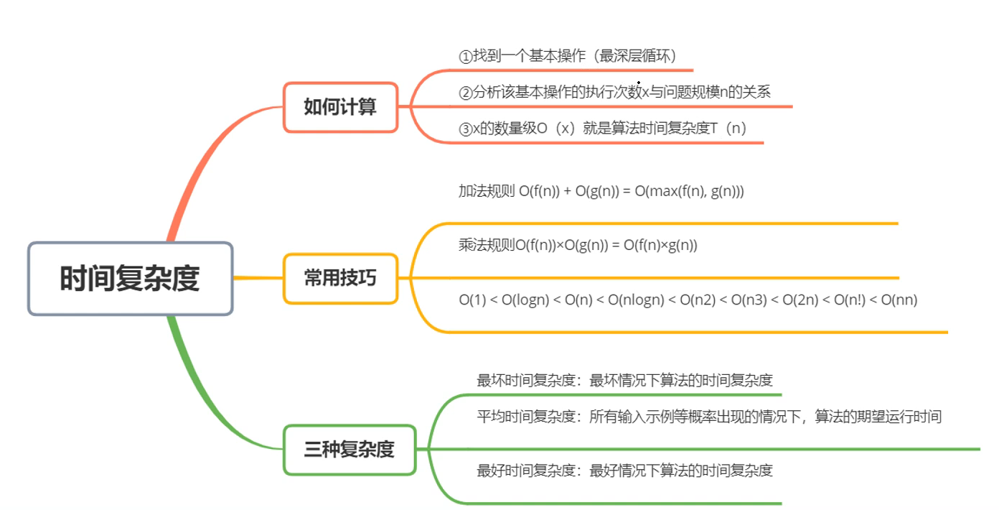
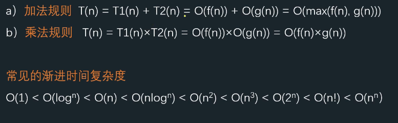
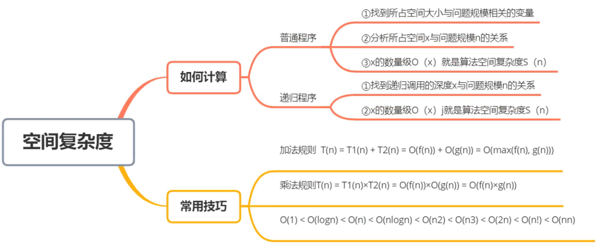

# 绪论
## 概念
###### 数据
   - 能被计算机识别并输入给计算机处理的符号集合

###### 数据元素
   - 数据的基本单位，通常作为整体处理，也称为记录、元素、结点、顶点
   - 可由数据项组成
   - 数据的个体

###### 数据项
   - 构成数据元素不可分隔的最小单位

> **数据 > 数据元素 > 数据项**
> 学生表 > 个人记录 > 学号、姓名

###### 数据对象
   - 性质相同的数据元素的集合，是数据的子集

## 数据结构

- 数据元素之间的关系称为**结构**
- 是指**相互之间存在一种或多种特定关系**的数据元素集合
- 或者说，数据结构是**带结构**的数据元素的集合
  
### 逻辑结构

##### 划分方法一
- 线性结构
  - 线性表
  - 栈
  - 队列
  - 串
- 非线性结构
  - 树
  - 图

##### 划分方法二
- 集合关系
- 线性结构
  一对一
- 树形结构
  一对多
- 图状结构
  多对多

### 存储结构(物理结构)
- 数据元素及其关系在计算机内存中的表示


> 逻辑结构是数据结构的抽象、存储结构是数据结构的实现
> 两者综合建立数据元素之间的结构关系

##### 四种基本存储结构

- 顺序
  **连续**存储单元、**依次**存储数据元素
  逻辑结构由**存储位置**表示
  如：数组

- 链式
  **任意**存储单元
  逻辑结构由**指针**(地址)表示

- 索引
  存储结点信息同时建立**索引表**(目录)

- 散列
  根据关键字计算结点存储地址

### 运算和实现
- 对数据元素可施加的操作及对应存储结构上的实现

## 数据类型和抽象数据类型
##### 数据类型

- 作用：约束变量或常量的**取值范围**、**操作**


> 定义：性质相同的**值的集合**以及定义于集合上的**一组操作**的总称
> 数据类型=值的集合+值集合上的一组操作

##### 抽象数据类型(*A*bstract *D*ata *T*ype,ADT)

> 一个数学模型以及定义在此数学模型上的一组操作
>
> **抽象数据类型定义**
> 可用(D,S,P)**三元组**表示
> **D:** 数据对象
> **S:** D上的关系集
> **P:** 对D的基本操作集

- 从问题抽象出的**数据模型**(逻辑结构)
- 定义在数据模型上的一组**抽象运算**(相关操作)
- 不考虑计算机内具体存储结构和运算的具体实现算法

## 算法

> 定义：问题求解方法和步骤的描述，指令的有限序列。
> 每个指令表示一个或多个操作
> 解决问题的方法和步骤
>
> **程序=数据结构+算法**

#### 特性

- 有穷：有穷步、有穷时间
- 确定：指令有确定含义
- 可行
- 输入：0~n
- 输出：1~n

#### 要求(优秀)

- 正确
- 可读
- 健壮
- 高效

#### 时间复杂度

所需要的时间：T(n)
> - 如何估算算法时间复杂度
一个算法由`控制结构`(顺序、分支和循环三种)和`基本操作`构成，则算法时间取决于两者的综合效果
> 
> 算法的执行时间 =基本操作(i)的执行次数x基本操作(i)的执行时间
> 算法的执行时间与基本操作执行次数之和成正比。
> 通常，我们只关注起决定性作用的基本操作，一般是最深层循环内的语句
> </p> 
>因此，近似地:算法的时间复杂度用该算法中起决定性作用的`基本操作的执行次数`估算。

例：
```c
i=1
while(i<n)
    i=i*2
```
T(n)=O(log2n)

#### 空间复杂度
临时内存大小：S(n)


例：斐波那契数列
```c
int f(n)
{
    if(n==0 || n==1)
        return 1;
    else
        return f(n-1)+f(n-2)
}
```
T(n)=O(2^n)
S(n)=O(n)
