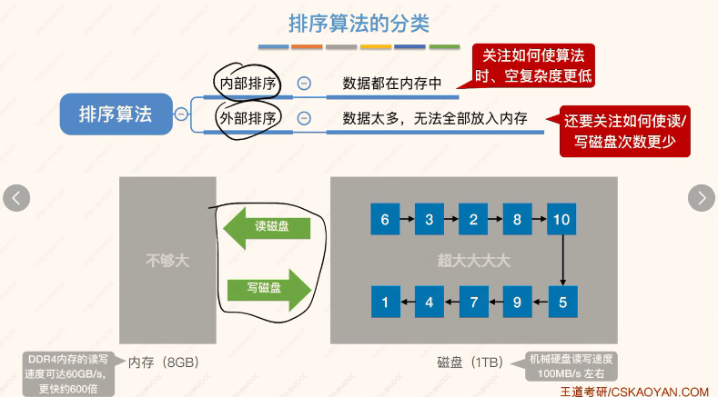

##### 虚段、排序代码（除了堆排序其他都要掌握）、置换排序

判断1分

娃儿

娃儿

判空

括号匹配

计算

二叉树  画图

节点，高度，
节点数量

1 2 4 16

自创顺序

位置不变

先跟:树和二叉树相同
根、左右

后跟：左右跟

哈夫曼树

十字链表

判断：

最小需要几个节点

查找，二分查找、快排代码

折半查找-平衡二叉树

分块查找

一个点：

效率

二叉

平衡二叉树

不需要

调整

效率

红黑书

B树

B+树

对比

查找长度

双散列

开放定址

# 08-14
排序
  
  
  
  

折半
  

  

比较次数减少，移动元素次数没有减少
  

希尔排序？
  
不稳定
，考点
  

冒泡排序->适用于链表、顺序表
  
  

快速排序
low==high
  
  
  
  
一趟和一次的区别
简单排序
  

堆排序
  
先从上到下，再从下到上（都可以）
  

代码不用掌握，可能会考
  
大根堆->递增
小根堆->递减
  
不稳定
  
和判定树不同
考：**对比关键字次数**

归并排序考代码
稳定的
  
  
  
$\log_2n=\log_3n$
  
  
  

外部排序、内部排序
  
  
  
  
结果：
  
  
  
多路平衡归并

  

平衡->尽可能多的放一起
不平衡->都可以
败者树
  
存放失败节点序号
记住：
  
置换
  
  
  
  

最佳归并树-哈夫曼树
  
 

  
  

  
8+1-》增加一个虚段
  
  

