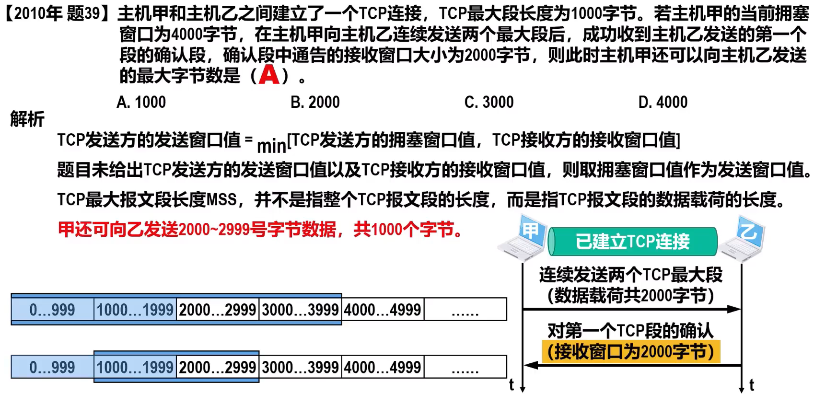

# 第一章 概述
### 计算机分层
  
  
### 时延
  
  

[计算](https://www.bilibili.com/video/BV1o441197Kw?t=391.9)  
[非常重要](https://www.bilibili.com/video/BV1c4411d7jb?t=1313.0&p=13)

# 第二章 物理层

### 信道的极限容量
  
  
  
  
  

---  

# 第三章 数据链路层

### 码分复用
  

### CSMA/CD
  

### 最小帧长
  

### 距离
[大题，非常重要](https://www.bilibili.com/video/BV1hE411C7R4?t=1100.1)

### CSMA/CA
  

### 以太网交换机、PDU
  

## 真题
1. [2015-35](https://www.bilibili.com/video/BV1G54y1d7bP?t=151.9&p=17)
2. 

# 第四章 网络层

### 划分子网
  

# 第五章 运输层
### TCP报文首部格式
  
  

### TCP流量控制
  

### TCP拥塞控制
  
  
  

### 超时重传
  
  

# 第六章 应用层
### DNS解析
  

### FTP
  

### HTTP1.1
  

