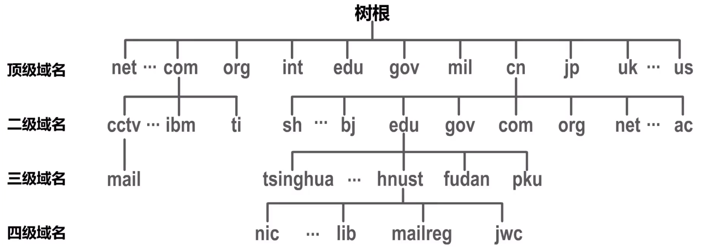
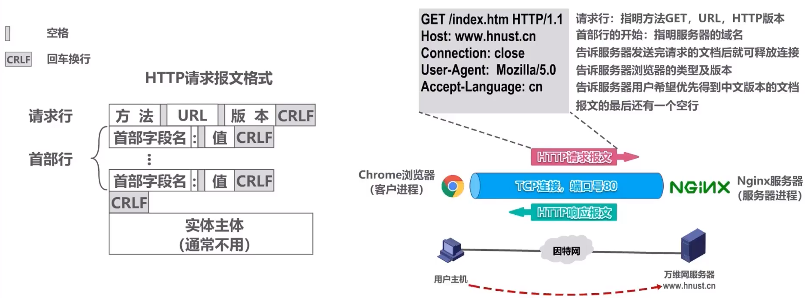
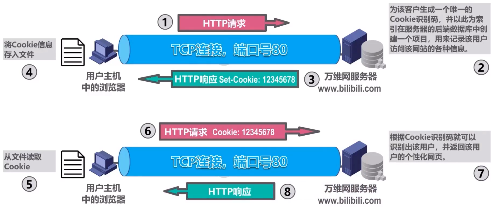

# 概述
- 应用层是计算机网络体系结构的**最顶层**，是**设计和建立计算机网络的最终目的**，也是计算机网络中发展最快的部分  
  - 早期基于文本的应用（电子邮件、远程登录、文件传输、新闻组）  
  - 20世纪90年代将因特网带入干家万户的万维网WWW  
  - 当今流行的即时通信、P2P文件共享及各种音视频应用  
  - 计算设备的小型化和“无处不在”，宽带住宅接入和无线接入的日益普及和迅速发展，为未来更多的新型应用提供了广阔的舞台

# 客户/服务器方式和对等方式
- 网络应用程序运行在处于网络边缘的不同的端系统上，通过彼此间的通信来共同完成某项任务   
- 开发一种新的网络应用首先要考虑的问题就是**网络应用程序在各种端系统上的组织方式和它们之间的关系**  
  目前流行的主要有以下两种：  
  - **客户/服务器**(**C**lient//**S**erver,**C/S**)方式   
  - **对等**(**P**eer-**t**o-**P**eer,**P2P**)方式  

**客户/服务器**(**C**lient//**S**erver,**C/S**)方式   
  - 客户和服务器是指通信中所涉及的两个应用进程   
  - 客户/服务器方式所描述的是进程之间服务和被服务的关系  
  - **客户是服务请求方，服务器是服务提供方**   
  - **服务器总是处于运行状态，并等待客户的服务请求。服务器具有固定端口号（例如HTTP服务器的默认端口号为80），而运行服务器的主机也具有固定的IP地址**    
- C/S方式是因特网上传统的、同时也是最成熟的方式，很多我们熟悉的网络应用采用的都是C/S方式包括万维网WWW、电子邮件、文件传输FTP等  
- 基于C/S方式的应用服务通常是**服务集中型**的，即应用服务集中在网络中比客户计算机少得多的服务器计算机上   
  - 由于一台服务器计算机要为多个客户机提供服务，在C/S应用中，**常会出现服务器计算机跟不上众多客户机请求的情况**  
  - 为此，在C/S应用中，常用**计算机群集**（或服务器场）构建一个强大的**虚拟服务器**  

**对等**(**P**eer-**t**o-**P**eer,**P2P**)方式
- 在P2P方式中，**没有固定的服务请求者和服务提供者**，分布在网络边缘各端系统中的应用进程是对等的，被称为**对等方。对等方相互之间直接通信**，每个对等方既是服务的请求者，又是服务的提供者   
- 目前，在因特网上流行的P2P应用主要包括P2P文件共享、即时通信、P2P流媒体、分布式存储等   
- 基于P2P的应用是**服务分散型**的，因为服务不是集中在少数几个服务器计算机中，而是分散在大量对等计算机中，这些计算机并不为服务提供商所有，而是为个人控制的桌面计算机和笔记本电脑，它们通常位于住宅、校园和办公室中     
- P2P方式的最突出特性之一就是它的**可扩展性**。因为系统每增加一个对等方，不仅增加的是服务的请求者，同时也增加了服务的提供者，**系统性能不会因规模的增大而降低**  
- P2P方式**具有成本上的优势**，因为它通常不需要庞大的服务器设施和服务器带宽。为了降低成本，服务提供商对于将P2P方式用于应用的兴趣越来越大 

# 动态主机配置协议DHCP

**DHCP的作用**
  

#### DHCP的工作过程  
  

- 客户端 -> 服务端    
  - $DHCP\quad   DISCOVER$  
- 服务端 -> 客户端  
  - $DHCP\quad  OFFER$  
    - 事务ID  
    - 配置信息：子网掩码、地址租期、默认网关、DNS服务器  
    - 使用ARP确保所选IP地址末被网络中其他主机占用  
- 客户端 -> 服务端    
  - $DHCP\quad  REQUEST$  
    - 事务ID  
    - DHCP客户端的MAC地址  
    - 接受的租约中的IP地址   
    - 提供此租约的DHCP服务器端的IP地址
- 服务端 -> 客户端  
  - $DHCP\quad  ACK$  
  - 使用ARP检测所分配到的IP地址是否已被网络中其他主机占用：  
    - 若被占用：给DHCP服务器发送“DHCP  DECLINE”报文撤销IP地址租约，并重新发送“DHCP DISCOVER”报文  
    - 若未被占用：可以使用租约中的IP地址与网络中其他主机通信了

**DHCP中继代理**
  

# 域名系统DNS
- 早在1983年，因特网就开始采用**层次结构的命名树**作为主机的名字（即域名）并使用**分布式的域名系统**DNS  
- DNS使**大多数域名都在本地解析**，仅少量解析需要在因特网上通信，因此系统效率很高  
- 由于DNS是分布式系统，即使单个计算机出了故障，也不会妨碍整个系统的正常运行  

**因特网采用层次树状结构的域名结构**
- 域名的结构由若干个分量组成，各分量之间用“点”隔开，分别代表不同级别的域名     
  - 每一级的域名都由英文字母和数字组成，不超过63个字符，不区分大小写字母  
  - 级别最低的域名写在最左边，而级别最高的顶级域名写在最右边  
  - 完整的域名不超过255个字符  
- 域名系统既不规定一个域名需要包含多少个下级域名，也不规定每一级的域名代表什么意思  
- 各级域名由其上一级的域名管理机构管理，而最高的顶级域名则由因特网名称与数字地址分配机构ICANN进行管理

#### 域名分类  

- 顶级域名TLD(Top Level Domain)分为以下三类：  
  - **国家顶级域名nTLD**  
    - 采用IS03166的规定。如cn表示中国，us表示美国，uk表示英国、等等  
  - **通用顶级域名gTLD**  
    - 最常见的通用顶级域名有七个，即：com（公司企业）、net(网络服务机构）、org（非营利性组织）、int（国际组织）、edu（美国教育结构）、gov（美国政府部门）、mil（美国军事部门）  
  - **反向域arpa**  
    - 用于反向域名解析，即IP地址反向解析为域名
- 在**国家顶级域名下注册的二级域名均由该国家自行确定**。例如，顶级域名为jp的日本，将其教育和企业机构的二级域名定为ac和co,而不用edu和com
- **我国**则将**二级域名**划分为以下**两类**：  
  - **类别域名**   
    - 共七个：ac（科研机构）、com(工、商、金融等企业)、edu（教育机构）gov（政府部门）、net（提供网络服务的机构）、mil（军事机构）和org（非营利性组织）  
  - **行政区域名**  
    - 共34个，适用于我国的各省、自治区、直辖市。例如：bj为北京市、Sh为上海市、js为江苏省，等等 
  -    
     -  这种按等级管理的命名方法便于维护名字的唯一性，并且也容易设计出一种高效的域名查询机制。需要注意的是，域名只是个逻辑概念，并不代表计算机所在的物理地点

#### 映射关系  

- 域名和IP地址的映射关系必须保存在域名服务器中，供所有其他应用查询。显然不能将所有信息都储存在一台域名服务器中。DNS使用**分布在各地的域名服务器**来实现域名到P地址的转换
- 域名服务器可以划分为以下四种不同的类型：   
  - **根域名服务器**   
    - 根域名服务器是最高层次的域名服务器。每个根域名服务器都知道所有的顶级域名服务器的域名及其P地址。因特网上共有13个不同P地址的根域名服务器。尽管我们将这13个根域名服务器中的每一个都视为单个的服务器，但“每台服务器”实际上是由许多分布在世界各地的计算机构成的**服务器群集**。当本地域名服务器向根域名服务器发出查询请求时，路由器就把查询请求报文转发到离这个DNS客户最近的一个根域名服务器。这就加快了DNS的查询过程，同时也更合理地利用了因特网的资源。**根域名服务器通常并不直接对域名进行解析，而是返回该域名所属顶级域名的顶级域名服务器的IP地址**
  - **顶级域名服务器**  
    - 这些域名服务器负责**管理在该顶级域名服务器注册的所有二级域名**。当收到DNS查询请求时就给出相应的回答（可能是最后的结果，也可能是下一级权限域名服务器的P地址）
  - **权限域名服务器**  
    - 这些域名服务器负责**管理某个区的域名**。每一个主机的域名都必须在某个权限域名服务器处注册登记。因此权限域名服务器知道其管辖的域名与引P地址的映射关系。另外，权限域名服务器还知道其下级域名服务器的地址
  - **本地域名服务器**  
    - 本地域名服务器不属于上述的域名服务器的等级结构。当一个主机发出DNS请求报文时，这个报文就首先被送往该主机的本地域名服务器。**本地域名服务器起着代理的作用，会将该报文转发到上述的域名服务器的等级结构中**。每一个因特网服务提供者ISP,一个大学，甚至一个大学里的学院，都可以拥有一个本地域名服务器，它有时也称为**默认域名服务器**。本地域名服务器离用户较近，一般不超过几个路由器的距离，也有可能就在同一个局域网中。本地域名服务器的P地址需要直接配置在需要域名解折的主机中

#### 域名解析的过程  
> [!tip]- 递归查询
>     

> [!tip]- 迭代查询  
>   

> [!tip]- 高速缓存  
>   

- 为了提高DNS的查询效率，并减轻根域名服务器的负荷和减少因特网上的DNS查询报文数量，在域名服务器中广泛地使用了**高速缓存**。高速缓存用来存放最近查询过的域名以及从何处获得域名映射信息的记录  
- 由于域名到P地址的映射关系并不是永久不变，为保持高速缓存中的内容正确，域名服务器**应为每项内容设置计时器并删除超过合理时间的项**(例如，每个项目只存放两天)  
- 不但在本地域名服务器中需要高速缓存，在用户主机中也很需要。许多用户主机在启动时从本地域名服务器下载域名和IP地址的全部数据库，维护存放自己最近使用的域名的高速缓存，并且只在从缓存中找不到域名时才向域名服务器查询。同理，主机也需要保持高速缓存中内容的正确性

# 文件传送协议FTP
- 将某台计算机中的文件通过网络传送到可能相距很远的另一台计算机中，是一项基本的网络应用，即文件传送  
- **文件传送协议FTP**(File Transfer Protocol)是因特网上使用得最广泛的文件传送协议  
  - FTP**提供交互式的访问**，允许客户**指明文件的类型与格式**(如指明是否使用ASCI码)，并允许**文件具有存取权限**(如访问文件的用户必须经过授权，并输入有效的口令)  
  - **FTP屏蔽了各计算机系统的细节，因而适合于在异构网络中任意计算机之间传送文件**  
- 在因特网发展的早期阶段，用FTP传送文件约占整个因特网的通信量的三分之一，而由电子邮件和域名系统所产生的通信量还要小于FTP所产生的通信量。只是到了1995年，万维网WWW的通信量才首次超过了FTP

- FTP的常见用途是在计算机之间传输文件，尤其是用于批量传输文件  
- FTP的另一个常见用途是让网站设计者将构成网站内容的大量文件批量上传到他们的Web服务器  

#### FTP的基本工作原理  
  

- **主动模式**  
<!-- >    -->

  - 建立数据通道时，FTP服务器主动连接FTP客户  
  - **控制连接**在整个会话期间一直**保持**打开，用于传送FTP相关控制命令   
  - **数据连接**用于文件传输，在每次文件传输时才建立，传输**结束就关闭**  

- **被动模式**  
<!-- >    -->

  - 建立数据通道时，FTP服务器被动等待客户的连接  

# 电子邮件
- 电子邮件(E-mail)是因特网上**最早流行**的一种应用，并且仍然是当今因特网上最重要、最实用的应用之一  
- 传统的电话通信属于实时通信，存在以下两个缺点：  
  - 电话通信的主叫和被叫双方必须同时在场  
  - 一些不是十分紧迫的电话也常常不必要地打断人们的工作或休息  
- 而电子邮件与邮政系统的寄信相似  
  - 发件人将邮件发送到自己使用的**邮件服务器**  
  - 发件人的邮件服务器将收到的邮件按其目的地址转发到收件人邮件服务器中的收件人邮箱  
  - 收件人在方便的时候访问收件人邮件服务器中自己的邮箱，获取收到的电子邮件  
- 电子邮件使用方便、传递迅速而且费用低廉。它不仅可以传送文字信息，而且还可附上声音和图像   
- 由于电子邮件的广泛使用，现在许多国家已经正式取消了电报业务。在我国，**电信局的电报业务也因电子邮件的普及而濒剩临消失**  
- 电子邮件系统采用**客户/服务器方式**   
- 电子邮件系统的三个主要组成构件：**用户代理，邮件服务器**，以及**电子邮件所需的协议**  
  - **用户代理**是用户与电子邮件系统的接口，又称为**电子邮件客户端软件**  
  - **邮件服务器**是电子邮件系统的基础设施。因特网上所有的SP都有邮件服务器，其功能是**发送和接收邮件**，同时还要负责维护用户的邮箱  
  - **协议**包括邮件**发送协议**(例如SMTP)和邮件**读取协议**（例如POP3,IMAP）    

#### 简单邮件传送协议SMTP基本工作原理
> (Simple Mail Transfer Protocol)  

  

电子邮件的信息格式并不是由SMTP定义的，而是在RFC822中单独定义的。这个RFC文档已在2008年更新为RFC5322。一个电子邮件有**信封**和**内容**两部分。而内容又由**首部**和**主体**两部分构成   

- **SMTP协议只能传送ASCII码文本数据**，不能传送可执行文件或其他的二进制对象  
- SMTP不能满足传送多媒体邮件(例如带有图片、音频或视频数据)的需要。并且许多其他非英语国家的文字(例如中文、俄文、甚至带有重音符号的法文或德文)也无法用SMTP传送   
- 为解决SMTP传送非ASCII码文本的问题，提出了**多用途因特网邮件扩展MIME**(Multipurpose Internet Mail Extensions)    
  - 增加了**5个新的邮件首部字段**，这些字段提供了有关邮件主体的信息  
  - 定义了**许多邮件内容的格式**，对多媒体电子邮件的表示方法进行了标准化  
  - 定义了**传送编码**，可对任何内容格式进行转换，而不会被邮件系统改变  
- 实际上，MIME不仅仅用于SMTP,也用于后来的同样面向ASCII字符的HTTP

#### 邮件读取协议  

- 常用的邮件读取协议有以下两个：  
  - **邮局协议POP**(Post Office Protocol),POP3是其第三个版本，是因特网正式标准非常简单、功能有限的邮件读取协议。用户只能以**下载并删除方式**或**下载并保留方式**从邮件服务器下载邮件到用户方计算机。**不允许用户在邮件服务器上管理自己的邮件**。（例如创建文件夹，对邮件进行分类管理等）  
  - **因特网邮件访问协议IMAP**(Internet Message Access Protocol),,IMAP4是其第四个版本，目前还只是因特网建议标准  
  功能比POP3强大的邮件读取协议。**用户在自己的计算机上就可以操控邮件服务器中的邮箱**，就像在本地操控一样，因此MAP是一个联机协议  
- POP3和IMAP4都采用**基于TCP连接的客户/服务器方式**。POP3使用熟知端口110,IMAP4使用熟知端口143

#### 基于万维网的电子邮件
- 通过**浏览器**登录（提供用户名和口令）**邮件服务器万维网网站**就可以撰写、收发、阅读和管理电子邮件。这种工作模式与引MAP很类似，不同的是用户计算机无需安装专门的用户代理程序，只需要使用通用的万维网浏览器
- 邮件服务器网站通常都提供非常强大和方便的邮件管理功能，用户可以在邮件服务器网站上管理和处理自己的邮件，而不需要将邮件下载到本地进行管理    

# 万维网WWW
- 万维网WWW(World Wide Web)**并非某种特殊的计算机网络**。它是一个大规模的、联机式的信息储藏所，**是运行在因特网上的一个分布式应用**  
- 万维网利用网页之间的**超链接**将不同网站的网页链接成一张逻辑上的信息网
- 浏览器最重要的部分是**渲染引擎**，也就是**浏览器内核**。负责对网页内容进行解析和显示  
  - 不同的浏览器内核对网页内容的解析也有不同，因此同一网页在不同内核的浏览器里的显示效果可能不同  
  - 网页编写者需要在不同内核的浏览器中测试网页显示效果  
- 为了方便地访问在世界范围的文档，万维网使用统一资源定位符UL来指明因特网上任何种类“资源”的位置  
- URL的一般形式由以下四个部分组成：  

**万维网的文档**
  

#### 超文本传输协议HTTP
> (HyperText Transfer Protocol))

- HTTP定义了浏览器（即万维网客户进程）怎样向万维网服务器请求万维网文档，以及万维网服务器怎样把万维网文档传送给浏览器      
- HTTP/1.0采用**非持续连接**方式。在该方式下，每次浏览器要请求一个文件都要与服务器建立TCP连接当收到响应后就立即关闭连接  
  - **每请求一个文档就要有两倍的RTT的开销**。若一个网页上有很多引用对象（例如图片等），那么请求每一个对象都需要花费2RTT的时间  
  - 为了减小时延，**浏览器通常会建立多个并行的TCP连接同时请求多个对象**。但是，这会大量占用万维网服务器的资源，特别是万维网服务器往往要同时服务于大量客户的请求，这会使其负担很重      
- HTTP/1.1采用**持续连接**方式。在该方式下，万维网服务器在发送响应后仍然保持这条连接，使同一个客户（浏览器）和该服务器可以继续在这条连接上传送后续的TTP请求报文和响应报文。这并不局限于传送同一个页面上引用的对象，而是只要这些文档都在同一个服务器上就行  
  - 为了进一步提高效率，HTTP/1.1的持续连接还可以使用**流水线**方式工作，即浏览器在收到HTTP的响应报文之前就能够连续发送多个请求报文。这样的一个接一个的请求报文到达服务器后，服务器就发回一个接一个的响应报文。这样就节省了很多个RTT时间，使TCP连接中的空闲时间减少，提高了下载文档的效率  

#### HTTP的报文格式
- HTTP是**面向文本**的，其报文中的每一个**字段**都是一些**ASCII码串**，并且每个字段的**长度**都是**不确定**的  

**请求报文** 
 
   

|  方法   |                    描述                     |
| :-----: | :-----------------------------------------: |
|   GET   |              请求URL标志的文档              |
|  HEAD   |           请求URL标志的文档的首部           |
|  POST   |              向服务器发送数据               |
|   PUT   |          在指明的URL下存储一个文档          |
| DELETE  |              删除URL标志的文档              |
| CONNECT |               用于代理服务器                |
| OPTIONS |              请求一些选项信息               |
|  TRACE  |              用来进行环回测试               |
|  PATCH  | 对PUT方法的补充，用来对已知资源进行局部更新 |

**响应报文** 

  

| 状态码(五大类33种) |                      描述                      |
| :----------------: | :--------------------------------------------: |
|        1xx         |    表示通知信息，如请求收到了或正在进行处理    |
|        2xx         |            表示成功，如接受或知道了            |
|        3xx         | 表示重定向，即要完成请求还必须采取进一步的行动 |
|        4xx         | 表示客户的差错，如请求中有错误的语法或不能完成 |
|        5xx         |   表示服务器的差错，如服务器失效无法完成请求   |

#### 使用Cookie在服务器上记录用户信息
- 早期的万维网应用非常简单，仅仅是用户查看存放在不同服务器上的各种静态的文档。因此HTTP被设计为一种**无状态**的协议。这样可以简化服务器的设计  
- 现在，用户可以通过万维网实现各种复杂的应用，如网上购物、电子商务等。这些应用往往需要万维网服务器能够识别用户  
- Cookie提供了一种机制使得万维网服务器能够“记住”用户，而无需用户主动提供用户标识信息。也就是说，**Cookie是一种对无状态的HTTP进行状态化的技术**
  

#### 万维网缓存与代理服务器
- 在万维网中还可以使用缓存机制以提高万维网的效率  
- 万维网缓存又称为**Web缓存**(Web Cache),可位于客户机，也可位于中间系统上，位于中间系统上的Web缓存又称为**代理服务器**(Proxy Server)  
- Web缓存把最近的一些请求和响应暂存在本地磁盘中。**当新请求到达时，若发现这个请求与暂时存放的请求相同，就返回暂存的响应，而不需要按URL的地址再次去因特网访问该资源**      
- 若Web缓存的命中率比较高大大减少了该链路上的通信量因而减少了访问因特网的时延

> [!tip]- 文件未过期  
>   

> [!tip]- 原始服务器文件已更改  
>   

