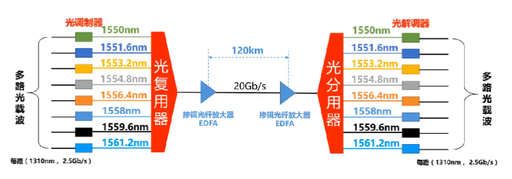
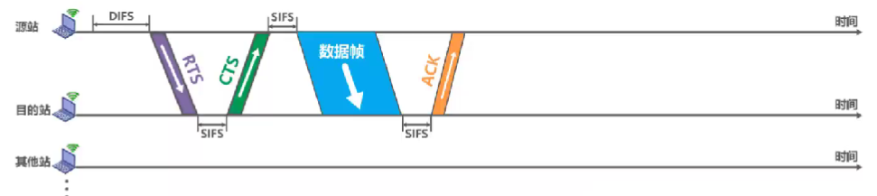

<<<<<<< HEAD
# 数据链路层概述

 - **链路(Link)**
  从一个结点到相邻结点的一段物理线路，而中间没有任何其他的交换结点
 - **数据链路(Data Link)**
  把实现通信协议的硬件和软件加到链路上，就构成了数据链路
 - 数据链路层以**帧**为单位传输和处理数据
 
 ### 三个重要问题

 ##### 封装成帧

  

 ##### 差错检测

- 帧在传输过程中遭遇干扰后可能会出现误码
- 在封装时将计算得出的检错码封装在帧尾
- 根据帧尾中的检错码检测帧中是否有误码
 
 ##### 可靠传输
 - 如果实现发送方发送什么，接收方就能收到什么，就称为可靠传输

--- 
# 封装成帧

-  封装成帧是数据链路层给上层交付的协议数据单元添加帧头和帧尾是之成为帧
     - 帧头和帧尾中包含重要的控制信息
    

     - 帧头和帧尾的作用之一就是**帧定界**（ppp有MAC没有）

- 透明传输是**数据链路层对上层交付的传输数据没有任何限制**，就好像数据链路层不存在一样
  - 面向字节的物理链路使用字节填充（字符填充）的方法实现透明传输
  - 面向比特的物理链路使用比特填充的方法实现透明传输
    

 - 在上层交付的协议**数据单元中包含了帧定界字符**时：
   - 在发送帧之前对帧的数据部分进行扫描，每**出现一个帧定界符或转义字符**就在其前面插入一个转义字符

为提高帧是传输效率，应使**帧的数据部分的长度尽可能的大**
每一种数据链路层协议都规定了帧的数据部分的长度上限，即**最大传送单元MTU**

# 差错检测

### 比特差错
 实际的通信链路都不是理想的，比特在传输过程中可能产生差错：1变成0，0变成1
### 误码率
 一段时间内，传输错误的比特占传输比特总数的比率称为误码率
 
### 差错检测码
检测数据传输过程中是否产生了比特差错，是数据链路层要解决的重要问题之一

### 奇偶校验
  

- 在待发送的数据后面**添加1位奇偶校验位**，使整个数据（包括所添加的校验位在内）中“1”的个数为奇数（奇校验）或偶数（偶校验）  
- 如果有**奇数个位发生误码**，则奇偶性发生变化，**可以检查出误码**  
- 如果有**偶数个位发生误码**，则奇偶性不发生变化，**不能检查出误码（漏检）**  

### 循环冗余校验CRC
- 双方约定好一个**生成多项式G**（x）    
- 发送方基于待发送的数据和生成多项式计算出差错检测码（**冗余码**），将其添加到待传输数据后面一起传输    
- 接收方通过生成多项式来计算收到的数据是否产生了误码  
<!--   

   -->
  

- **算法要求生成多项式必须包含最低次项**   
- **检错码**只能检测出帧在传输过程中出现了差错，但不能定位错误，因此**无法纠正错误**  
- 要想纠正传输中的差错，可以使用冗余信息更多的**纠错码**进行**前向纠错**。但纠错码的开销比较大，在**计算机网络中较少使用**。
- 优点  
  - 漏检率非常低  
  - 易于用硬件实现  
  - 广泛应用于数据链路层  
 
 
# 可靠传输的基本概念

- 使用**差错检测技术**（循环校验CRC），接收端就可以检测帧在传输过程中是否产生了误码

- 数据链路层向上层提供的服务类型  
  - **可靠传输服务**：实现发送端**发什么，接收端收什么**  
  - **不可靠传输服务**：**仅丢弃有误码的帧**  

- 一般情况下，**有线链路**的误码率比较低，为了减小开销，并**不要求数据链路层**向上提供**可靠**传输服务。即使出现了误码，可靠传输的问题由其上层处理  

- **无线链路**易受干扰，误码率比较高，因此**要求数据链路层**必须向上层提供**可靠**传输服务
- **比特差错**只是传输差错中的一种

- 从整个计算机网络体系结构来看，传输差错还包括**分组丢失**、**分组失序**以及**分组重复**
- 可靠传输服务并不仅局限于数据链路层，其他各层均可选择实现可靠传输
    

<!-- 
使用差错检测技术（循环校验CRC），接收端就可以检测帧在传输过程中是否产生了误码

- 传输差错   
  - 分组丢失  
  - 分组失序  
  - 分组重复  
- 以上差错一般不出现在数据链路层，而是其上层  
- 可靠传输服务不局限于数据链路层，其他各层均可选择实现可靠传输  
    -->

 
### 停止-等待协议SW(**S**top-and-**W**ait)

###### 正常情况与发送方数据丢失重传
    
  - 接收方收不到数据分组，就不会发送ACK或NAK。如果不采取其他措施，发送方就会一直处于等待接收方ACK或NAK的状态
  - 为解决该问题，可以在发送方发送完一个数据分组时启动一个**超时计时器**。若到了超时计时器所设置的**重传时间**而发送方仍收不到接收方的任何ACK或NAK,则重传原来的数据分组，这就叫做**超时重传**
  - 一般可将重传时间选为略大于“从发送方到接收方的平均往返时间”

###### 接收方确认信息丢失重传
  

- 为避免分组重复这种传输错误，必须给每个分组带上序号  
- 对于停止等待协议，由于每发送一个数据分组就停止等待只要保证每发送一个新的数据分组，其发送序号与上次发送的数据分组的序号不同就可以了，因此用一个比特来编号就够了  

###### 接收方确认信息超时重传
  

> [! todo]- 注意事项
> - 接收端检测到数据分组有误码时，将其丢弃并等待发送方的超时重传。但对于误码率较高的点对点链路，为使发送方**尽早重传**，也可**给发送方发送NAK分组**  
> - 为了让接收方能够判断所收到的数据分组是否是重复的，需要给**数据分组编号**。由于停止等待协议的停等特性，**只需1个比特编号就够了**，即编号0和1  
> - 为了让发送方能够判断所收到的ACK分组是否是重复的，需要给**ACK分组编号**，所用比特数量**与数据分组编号所用比特数量一样**。数据链路层一般不会出现ACK分组迟到的情况，因此在**数据链路层实现停止-等待协议可以不用给ACK分组编号**  
> - 超时计时器设置的**重传时间**应仔细选择。一般可将重传时间选为**略大于“从发送方到接收方的平均往返时间”**  
>    - 在数据链路层点对点的往返时间比较确定，重传时间比较好设定  
>    - 然而在运输层，由于端到端往返时间非常不确定，设置合适的重传时间有时并不容易  

###### 信道利用率

$$U=\frac{T_D}{T_D+RTT+T_A}$$
  

> [! cite]- 例如
> 假设信道长度2000km,数据分组长度1500B,发送速率10Mbit/s。(忽略TA,因为TA一般都远小于TD)
> $\Large U\approx\frac{T_{D}}{T_{D}+RTT}=\frac{\frac{1500*8 bit}{10*10^6 bit /s}}{\frac{1500*8 bit}{10*10^6 bit /s} + \frac{2000 *10^3 bit}{2*10^8 m/s}}\approx5.66\%$  
>   
> 若提高发送速率到100Mb/s  
> $\Large U\approx\frac{T_{D}}{T_{D}+RTT}=\frac{\frac{1500*8 bit}{100*10^6 bit /s}}{\frac{1500*8 bit}{100*10^6 bit /s} + \frac{2000 *10^3 bit}{2*10^8 m/s}}\approx 0.6\%$

- 当往返时延RTT远大于数据帧发送时延TD时（例如使用卫星链路），信道利用率非常低  
- 若出现重传，则对于传送有用的数据信息来说，信道利用率还要降低  
- 为了克服停止-等待协议信道利用率很低的缺点，就产生了另外两种协议，即后退N帧协议GBN和选择重传协议SR

### 回退N帧协议GBN(**G**o-**B**ack-**N**)`要考`
  

###### 无差错
1. 采用3个比特给分组编序号，即序号0~7  
2. 发送窗口的尺寸$W_T$的取值：$1 < W_T \le 2^3-1$，本例取$W_T$=5
3. 接收窗口的尺寸WR的取值：$W_R$=1
  

###### 累积确认
- 接收方**不一定**要对收到的数据分组**逐个发送确认**，而是可以在收到几个数据分组后（由具体实现决定）**对按序到达的最后一个数据分组发送确认**。ACKn表示序号为及以前的所有数据分组都已正确接收

> 即使确认分组丢失，发送方也可能不必重传

###### 有差错
  

- 发送方收到重复的确认，就知道之前所发送的数据分组出现了差错，于是可以不等超时计时器超时就立刻重传！  
- 至手收到几个重复确认就立刻重传，由具体实现决定  
- 在本例中，尽管序号为6,7,0,1的数据分组正确到达接收方，但由于5号数据分组误码不被接受，它们也“受到牵连”而不被接受，发送方还要重传这些数据分组，这就是所谓的Go-back-N(回退N顺)  

> 接收方无法分辨新、旧数据分组

### 选择重传协议SR`要考`
  

1. 采用3个比特给分组编序号，即序号0~7  
2. 发送窗口的尺寸$W_T$的取值：$1 < W_T \le 2^3-1$，本例取$W_T$=5
3. 接收窗口的尺寸WR的取值：$W_R=W_T=4$
  

 - 发送方的发送窗口尺寸$W_T$必须满足：$1 < W_T \le 2^{n-1}$ ，其中n是构成分组序号的比特数量
   - 若$W_T=1$：与停止-等待协议相同  
   - 若$W_T> 2^{n-1}$：造成接收方无法分辨新、旧数据分组的问题

- 接收方的接收窗口尺寸$W_R$必须满足：$1 < W_R \le W_T$
	- 若$W_R=1$:与回退N帧协议相同
	- 若$W_R > W_T$无意义

# 点对点协议ppp

是目前使用最广泛的点对点数据链路层协议 **(提供不可靠传输服务)**

PPP协议为在点对点链路传输各种协议数据报提供了一个标准方法：

|                            |                                      |
| :------------------------: | :----------------------------------: |
| 对各种协议数据报的封装方法 |               封装成帧               |
|      链路控制协议LCP       | 用于建立、配置以及测试数据链路的连接 |
|    一套网络控制协议NCPs    | 其中的每一个协议支持不同的网络层协议 |

   

 
 
### 帧格式
  

- 标志(**F**lag)字段：PPP帧的定界符，取值为0x7E
- 地址(**A**ddress)字段：取值为OxFF,预留（目前没有什么作用）
- 控制(**C**ontrol)字段：取值为0x03,预留（目前没有什么作用）
- 协议(**P**rotocol)字段：指明帧的数据部分送交哪个协议处理
- 帧检验序列(**F**rame **C**heck **S**equence)字段：CRC计算出的校验位

|  取值  |   协议   |                                            格式                                             |
| :----: | :------: | :-----------------------------------------------------------------------------------------: |
| 0x0021 | IP数据报 |  |
| 0xC021 | LCP分组  |  |
| 0x8021 | NCP分组  |  |

### 透明传输

##### 面向字节的异步链路

字节填充法，插入转义字符

- `发送方`  
     

    - 出现的每一个**7E**（PPP帧的定界符）字节转变为2字节序列 **(7D，5E)**    
    - 出现的每一个**7D**（转义字符）字节转变为2字节序列 **（7D，5D）**  
    - 出现的每一个ASCLL码控制字符（**数值小于0x20的字符**），则在该字符前插入一个7D字节，同时将该字符的编码**加上0x20**  
- `接收方`  
  - 进行反变换即可  

 ##### 面向比特的同步链路

 比特填充法，插入比特0
  发送方：
   对帧的数据部分进行扫描。只要发现五个连续的比特1，则立刻填充1个比特0
  接收方：
   对帧的数据部分进行扫描。只要发现五个连续的比特1，则立刻删除1个比特0

### 差错检测 `要考`
   

- 每收到一个PPP帧就进行CRC检验  
- 若正确则收下，若错误则丢弃  
- **向上不提供可靠传输服务**  
  

  

# 媒体接入控制的基本概念

共享信道要着重考虑的一个问题是：如何协调多个发送和接收站点对一个共享传输媒体的占用，即**媒体接入控制MAC**

### 媒体接入控制 `要考`
- 静态划分信道
  - 频分多址
  - 时分多址
  - 码分多址

预先固定分配好信道，非常不灵活，对于冲突性数据传输信道利用率会很低
通常在无线网络的物理层中使用

- 动态接入控制
  - 受控接入
    - 集中控制
      有一个主站以循环方式轮询每个站点有无数据发送，只有被问到的站点才能发送数据
    - 分散控制
      个站点平等，连接成环形网络，令牌（特殊帧）沿环形站传递，接收到令牌才能发送数据
  - 随机接入
  各站点竞争、随机在信道上发送数据
  如果两个及以上站点在同一时刻发送数据，则产生碰撞，发生了冲突，全部发送失败
 

# 静态划分信道

### 信道复用
- 复用：通过一条物理线路同时传输多路用户信号
  - 当网络中传输媒体的传输容量大于多条单一信道传输的总通信量时，可利用复用技术在一条物理线路上建立多条通信信道来充分利用传输媒体的带宽
    

 ### 频分复用FDM
     

   **将传输线路的频带资源划分成多个子频带，形成多个子信道，各子信道之间需要留出隔离频带，以免造成子信道干扰**
 - 当多路信号输入一个多路复用器时  
   复用器将每路信号调制到不同频率的载波上  
 - 接收端接收时  
   由相应的分用器通过滤波将各路信号分开，将合成的复用信号恢复成原始的多路信号  
  **频分复用的所有用户同时占用不同的频带资源并进行通信**
 
 
 ### 时分复用TDM

  
**把时间划分为时隙，TDM将传输线路的宽带资源按时隙轮流分配给不同的用户，每对用户只在分配的时隙里使用线路传输数据**

- 时分复用技术将时间划分成了一段段等长的时分复用帧，每个时分复用的用户在每个时分复用帧中占用固定序号的时隙，==每个用户占用的时隙是周期性出现的==，其周期就是时分复用帧的长度
- 时分复用的所有用户在不同的时间占用同样的频带宽度
 ### 波分复用WDM
  
   
### 码分复用CDM 
- 该技术用于多址接入，常用名词：码分多址CDMA
- 频分复用FDM和时分复用TDM同样可用于多址接入，对应的名词是频分多址FDMA和时分多址TDMA

##### 复用和多址
- 复用是将单一媒体的频带资源划分成很多子信道，这些子信道之间相互独立，互不干扰。 从整体频带资源上看，每个子信道只占用该媒体频带资源的一部分
- 多址（多点接入）处理的是动态分配信道给用户。这在用户仅暂时占用信道的应用中是必须的，而所有的移动通信系统基本都属于这种情况。相反在信道永久性地分配给用户的应用中，多址是不需要的（无线广播、电视广播站）。

- 某种程度上，FDMA、TDMA、CDMA可用看成FDM、TDM、CDM的应用   于FDM和TDM不同，CDM的每一个用户可以在**同样的时间使用同样的频带进行通信**

- 由于各用户使用经过挑选的不同码型，因此各用户之间不会造成干扰    

- 这种系统发送的信号有很强的抗干扰能力，频谱类似于白噪声，最初为军事通信，价格和体积大幅度下降后广泛用于民用的移动通信
   
- 在CDMA中，每一个比特时间再划分为m个短的时隙，称为**码片**。通常m的值为64或128  （后面假设为8）
   
- 使用CDMA的每一个站被指派唯一的**m bit码片序列**
  如果发送**比特1**，则发送它自己的**m bit 码片序列**
  如果发送**比特0**，则发送他自己的**m bit码片序列的二进制反码**
> [! example] 例：
 某个站点的码片序列0001 1011
 发送比特1：0001 1011
 发送比特0：1110 0100
  将0写为-1，1写为+1
 站点的码片序列：（-1-1-1+1 +1-1+1+1）

### 挑选原则

1. 分配给每个站的**码片序列必须各不相同，实际常采用伪随机码序列**
2. 分配给每个站的**码片序列必须相互正交**（规格化内积为0）
   - 分向量S表示站S的码片序列，令向量T表示其他任何站的码片序列。
   - 两个不同站的码片序列正交，就是向量S和T的规格化内积为0
   - **任何一个码片向量和其他各站码片反码的向量内积也是0**  
   - **任何一个码片向量和其该码片反码的向量内积也是-1**  
  

--- 
# 随机接入—CSMA/CD协议 `要考要考`

### 载波监听 
多址接入/碰撞检测  CS MA—CD
##### 多址接入MA
   多个站连接再一条总线上，竞争使用总线
##### 载波监听CS
- 每个站再发送帧之前先要检测总线上是否有其他站点再发送帧（“先听后说”）：
  - 若检测到总线空闲96比特时间，则发送这个帧
  - 若检测到总线忙，则继续检测并等待总线转为空闲96比特时间，然后发送这个帧
  - 96比特时间  
    - 发送96比特所耗费的时间，也称为帧间最小间隔  
    - 使接收方检测出一个帧的结束，也使其他站点公平竞争信道并发送帧
  

##### 碰撞检测CD
- 每一个发送帧的站边发送边检测碰撞（“边听边说”）：
- 一旦发现总线上出现碰撞，退避一段随机时间后再次发送（“一旦冲突，立即停说，等待时机，重新再说”）
##### 实例
   主机C使用总线发送帧的过程中，B也要发送帧
    

- **强化碰撞措施**
 当发送帧的站点一旦检测到碰撞，立即停止发送帧后继续发送32或48比特的人为干扰信号，以便有足够多的碰撞信号使足够多的站点都能检测出碰撞

 
 ### 争用期（碰撞窗口）：要考要补充
  
  
  主机最多经过2τ（即δ→0）的时长就可检测到本次发送是否遭受了碰撞
  
  以太网的端到端往返传播使用2τ为**争用期**或**碰撞窗口**
  
  经过争用期这段时间还没有检测出碰撞，才能肯定这次发送不会发生碰撞
  
  每一个主机再自己发送帧之后的一小段时间内，存在遭遇碰撞的可能性。这一段时间使不确定的，它取决于另一个发送帧的主机到本主机的距离，但不会超过总线的端到端往返传播时延，即一个争用期时间。
  
  在以太网中发送帧的主机越多，端到端往返传播时延越大，发生碰撞的概率就越大。因此**共享式以太网不能连接太多的主机，使用的总线也不能太长**
   10Mb/s以太网把争用期定为512比特发送时间，即51.2μs，因此其总线长度不能超过5120m，但考虑到信号衰减等，以太网规定总线长度不能超过2500m

 ### 最小帧长：要考
  以太网规定**最小帧长为64字节**，即512比特，数据载荷最小帧长46字节
    

 
  512比特即为争用期
  如果发送的数据非常少，需要填充字节使帧不小于64字节
  以太网的**最小帧确保主机可在帧发送完成之前就检测到该帧的发送过程中是否遭遇了碰撞**
   如果在争用期内检测到碰撞，就立即中止发送，这时已经发送出去的数据一定小于64字节，因此长度小于64字节的帧都是由于碰撞而异常中止的无效帧
 ### 最大帧长：要考
  以太网v2的MAC帧最大长度1518字节，其中数据载荷最大长度1500字节，头部和尾部共18字节
  插入VLAN后：（首部和尾部共22字节）
    

 ### 截断二进制指数退避算法：要考
    

- 若连续多次发送碰撞，就表明可能有较多的主机参与竞争信道，但上述退避算法可**使重传需要推迟的平均时间随重传次数而增大（动态退避）**，因而**减小发生碰撞的概率**，有利于整个系统的稳定
- **当重传达16次仍不能成功时**，表明同时打算发送帧的主机太多，以至于连续发生碰撞，则**丢弃该帧**，并向高层报告

 ### 信道利用率：要考
    

- 在理想情况下：
  - 各主机发送帧都不会产生碰撞   
  - 总线一旦空闲就有某个主机立即发送帧  
  - 发送一帧占用总线的时间为T₀ + τ ，而帧本身的发送时间是T₀
  - 极限信道利用率Smax= T₀ /（T₀+τ）=1/（1+τ/T₀）
 使a=τ/T₀
   Smax=1/(1+a)  参数a尽量小，以提高信道利用率
   τ应该尽量小→以太网端到端的距离应受到限制，不应太长
   T₀应尽量大→以太网帧的长度尽量长
 ### 帧发送流程：要考
   

 ### 帧接收流程：要考
   

# 随机接入—CSMA/CA协议要考

**在无线局域网中可使用载波监听多址接入CSMA**，即在发送帧之前先对传输媒体进行载波监听，若发现有其他站在发送帧，就推迟发送以免发送碰撞
 
 - **在无线局域网不能使用碰撞检测CD**
   - 由于无线信道的传输条件特殊，其信号强度的动态范围非常大，无线网卡上接收到的信号强度远小于发送信号的强度（差百万倍）。**如果在无线网卡上实现碰撞检测CD，对硬件的要求非常高**

即使能在硬件上实现，由于无线电波传播的特殊性（**存在隐蔽站问题，进行检测的意义不大**）要考
     

### 802.11无线局域网：要考
- 使用CSMA/CA协议，在CSMA的基础上增加了一个碰撞避免CA功能，而不再实现碰撞检测功能
- 由于不可能避免所有的碰撞，并且无线信道误码率较高，802.11标准还使用了数据链路层确认机制（停止-等待协议）来保证数据被正确接收
- 802.11的MAC层标准定义了两种不同的媒体接入控制方式
  - `分布式协调功能DCF`
   没有中心控制站点，每个站点使用CSMA/CA协议通过争用信道获取发送权（默认）
  - `点协调功能PCF`
   使用集中控制的接入算法（在接入点AP实现集中控制），是802.11定义的可选方式（实际较少使用）
  
标准规定所有站点**持续检测信道空闲一段时间**才能发送帧，称为：**帧间间隔IFS**

- IFS长度取决于发送帧的类型:
  1. 高优先级  
  2. 低优先级
- 两种常用帧间间隔：
  1. 短帧间间隔（28μs）  
  2. DCF帧间间隔（128μs）  
  3. 最短帧间间隔SIFP（分隔属于一次对话的各帧）

### 工作原理：
  

  

 当信道是空闲时，且发送的数据帧不是成功发送完上一个数据帧之后立即连续 发送的数据帧，则不使用退避算法
- 以下情况必须使用退避算法：
   - 发送数据帧之前信道在忙状态
   - 重传数据帧
   - 成功发送完上一个数据帧之后连续发送下一个数据帧（避免一个站长时间占用信道）

### 退避算法：
    

### 信道预约和虚拟载波监听：
  为了**减少碰撞的概率**，802.11标准允许发送数据的站点**对信道进行预约**
  RTS：请求发送RTS：源地址、目的地址、通信持续时间
  CTS：响应控制帧：通信持续时间
  ACK：确认帧
    

### 虚拟载波监听机制：
  只需要RTS、CTS中其中一个即可
  
  
  
  
MAC地址、IP地址、ARP地址
  

# MAC地址 `要考`

当多个主机连接在同一广播信道上，要实现两个主机间的通信，每个主机要有唯一的数据链路层地址

- 每个主机发送的帧中必须携带标识发送主机和接收主机的地址，用于媒体接入控制，称为MAC地址
   - MAC地址一般固化在网卡（网络适配器）中，也称为硬件地址
   - windows也称物理地址（MAC不属于物理层）
- 每个网络适配器都有全球唯一的MAC地址，而交换机和路由器有更多的网络接口也就是更多的MAC地址
- MAC地址是对网络上各接口的唯一标识，而不是对网络上各设备的唯一标识
### IEEE  802局域网的MAC地址格式：
  
  
  

  
  

  
  
  
  
IP地址

ARP地址

# 集线器和交换机

### 集线器
##### 半双工
 使用双绞线和集线器HUB的星型以太网：
    

  使用集线器的以太网在逻辑上仍然是一个总线网，各站共享总线资源，使用的还是CSMA/CD协议
  集线器只工作在物理层，只做简单的转发比特。碰撞检测由各站网卡检测
  集线器一般有少量的容错能力和网络管理能力（网卡出错集线器检测出来后从内部断开和故障网卡的连线，以太网仍然能正常工作）
 
 使用集线器HUB在物理层扩展以太网：
    

 由集线器互连的主机之间发送单播帧会传输给总线上的各个主机
 由交换机互连的主机会直接转发给目的主机

### 以太网交换机
##### 全双工
    

  具有并行性，可同时连通多对接口，使多对主机能同时通信，无碰撞（不使用CSMA/CD协议）
  具有多速率接口，10Mb/s，100Mb/s，1Gb/s接口的多种组合
  工作在数据链路层（包括物理层），它收到帧后在交换表中查找帧的目的MAC地址对应的接口号。然后转发
  即插即用，自学习算法

- 两种转发方式  
  - 存储转发  
  - 直通交换：采用基于硬件的交叉矩阵（交换时延非常小，但不检查帧是否由错误）

两者对比：

# 以太网交换机自学习和转发帧的流程
相互连接的两台以太网交换机各自连接三台主机，构成交换式以太网

A→B
  

B→A
  
  
 
 
E→A
  

 每条记录都有有效时间，到期自动删除是因为：
  MAC地址于交换机接口的对应关系并不是永久性的（更换主机或网卡）
 
# 以太网交换机的生成树协议STP

# 虚拟局域网VLAN
 以太网交换机工作在**数据链路层（包括物理层）**
 使用一个或多个以太网交换机互连起来的交换式以太网都属于**同一个广播域**
- 巨大广播域的**弊端**  
  - 广播风暴
   
  
  - 难以维护和管理  
  - 潜在的安全问题  

- 分割广播域的方法  
  - 使用路由器隔离  
  - 虚拟局域网VLAN  
  将局域网内设备**划分成与物理位置无关的逻辑组的技术，这些逻辑组具有某些共同的需求**

# 虚拟局域网VLAN实现机制

 ### IEEE802.1Q
  对于以太网的MAC帧格式进行了扩展，插入了**4字节的VLAN标记**
   

- VLAN标记的最后12比特称为VLAN标识符VID，唯一标识了以太网帧属于哪一个VLAN
  - VID取值范围0~4095（0~2¹²-1）  
  - 0和4095不要来表示VLAN,所以有效取值为1~4094
- 802.1Q由交换机处理
 ### 交换机的端口类型
  Access
  Trunk
  Hybrid

=======
# 数据链路层概述

 - **链路(Link)**
  从一个结点到相邻结点的一段物理线路，而中间没有任何其他的交换结点
 - **数据链路(Data Link)**
  把实现通信协议的硬件和软件加到链路上，就构成了数据链路
 - 数据链路层以**帧**为单位传输和处理数据
 
 ### 三个重要问题

 ##### 封装成帧

  

 ##### 差错检测

- 帧在传输过程中遭遇干扰后可能会出现误码
- 在封装时将计算得出的检错码封装在帧尾
- 根据帧尾中的检错码检测帧中是否有误码
 
 ##### 可靠传输
 - 如果实现发送方发送什么，接收方就能收到什么，就称为可靠传输

--- 
# 封装成帧

-  封装成帧是数据链路层给上层交付的协议数据单元添加帧头和帧尾是之成为帧
     - 帧头和帧尾中包含重要的控制信息
    

     - 帧头和帧尾的作用之一就是**帧定界**（ppp有MAC没有）

- 透明传输是**数据链路层对上层交付的传输数据没有任何限制**，就好像数据链路层不存在一样
  - 面向字节的物理链路使用字节填充（字符填充）的方法实现透明传输
  - 面向比特的物理链路使用比特填充的方法实现透明传输
    

 - 在上层交付的协议**数据单元中包含了帧定界字符**时：
   - 在发送帧之前对帧的数据部分进行扫描，每**出现一个帧定界符或转义字符**就在其前面插入一个转义字符

为提高帧是传输效率，应使**帧的数据部分的长度尽可能的大**
每一种数据链路层协议都规定了帧的数据部分的长度上限，即**最大传送单元MTU**

# 差错检测

### 比特差错
 实际的通信链路都不是理想的，比特在传输过程中可能产生差错：1变成0，0变成1
### 误码率
 一段时间内，传输错误的比特占传输比特总数的比率称为误码率
 
### 差错检测码
检测数据传输过程中是否产生了比特差错，是数据链路层要解决的重要问题之一

### 奇偶校验
  

- 在待发送的数据后面**添加1位奇偶校验位**，使整个数据（包括所添加的校验位在内）中“1”的个数为奇数（奇校验）或偶数（偶校验）  
- 如果有**奇数个位发生误码**，则奇偶性发生变化，**可以检查出误码**  
- 如果有**偶数个位发生误码**，则奇偶性不发生变化，**不能检查出误码（漏检）**  

### 循环冗余校验CRC
- 双方约定好一个**生成多项式G**（x）    
- 发送方基于待发送的数据和生成多项式计算出差错检测码（**冗余码**），将其添加到待传输数据后面一起传输    
- 接收方通过生成多项式来计算收到的数据是否产生了误码  
<!--   

   -->
  

- **算法要求生成多项式必须包含最低次项**   
- **检错码**只能检测出帧在传输过程中出现了差错，但不能定位错误，因此**无法纠正错误**  
- 要想纠正传输中的差错，可以使用冗余信息更多的**纠错码**进行**前向纠错**。但纠错码的开销比较大，在**计算机网络中较少使用**。
- 优点  
  - 漏检率非常低  
  - 易于用硬件实现  
  - 广泛应用于数据链路层  
 
 
# 可靠传输的基本概念

- 数据链路层  
  - **可靠传输服务**：实现发送端**发什么，接收端收什么**  
  - **不可靠传输服务**：**仅丢弃有误码的帧**  

- 一般情况下，**有线链路**的误码率比较低，为了减小开销，并**不要求数据链路层**向上提供**可靠**传输服务。即使出现了误码，可靠传输的问题由其上层处理  

- **无线链路**易受干扰，误码率比较高，因此**要求数据链路层**必须向上层提供**可靠**传输服务
- **比特差错**只是传输差错中的一种

- 从整个计算机网络体系结构来看，传输差错还包括**分组丢失**、**分组失序**以及**分组重复**
- 可靠传输服务并不仅局限于数据链路层，其他各层均可选择实现可靠传输
    

<!-- 使用差错检测技术（循环校验CRC），接收端就可以检测帧在传输过程中是否产生了误码

- 传输差错   
  - 分组丢失  
  - 分组失序  
  - 分组重复  
- 以上差错一般不出现在数据链路层，而是其上层  
- 可靠传输服务不局限于数据链路层，其他各层均可选择实现可靠传输  
    -->

 
# 停止-等待协议SW
  
  

# 回退N帧协议GBN

`要考`

# 选择重传协议SR

`要考`

# 点对点协议ppp

是目前使用最广泛的点对点数据链路层协议 **(提供不可靠传输服务)**

PPP协议为在点对点链路传输各种协议数据报提供了一个标准方法：
| 对各种协议数据报的封装方法 |               封装成帧               |
| :------------------------: | :----------------------------------: |
|      链路控制协议LCP       | 用于建立、配置以及测试数据链路的连接 |
|    一套网络控制协议NCPs    | 其中的每一个协议支持不同的网络层协议 |
   

 
 
### 帧格式
  
  

### 透明传输

##### 面向字节的异步链路

字节填充法，插入转义字符

- `发送方`  
     

    - 出现的每一个**7E**（PPP帧的定界符）字节转变为2字节序列 **(7D，5E)**    
    - 出现的每一个**7D**（转义字符）字节转变为2字节序列 **（7D，5D）**  
    - 出现的每一个ASCLL码控制字符（**数值小于0x20的字符**），则在该字符前插入一个7D字节，同时将该字符的编码**加上0x20**  
- `接收方`  
  - 进行反变换即可  

 ##### 面向比特的同步链路

 比特填充法，插入比特0
  发送方：
   对帧的数据部分进行扫描。只要发现五个连续的比特1，则立刻填充1个比特0
  接收方：
   对帧的数据部分进行扫描。只要发现五个连续的比特1，则立刻删除1个比特0

### 差错检测 `要考`
   

- 每收到一个PPP帧就进行CRC检验  
- 若正确则收下，若错误则丢弃  
- **向上不提供可靠传输服务**  
  

  

# 媒体接入控制的基本概念

共享信道要着重考虑的一个问题是：如何协调多个发送和接收站点对一个共享传输媒体的占用，即**媒体接入控制MAC**

### 媒体接入控制 `要考`
- 静态划分信道
  - 频分多址
  - 时分多址
  - 码分多址

预先固定分配好信道，非常不灵活，对于冲突性数据传输信道利用率会很低
通常在无线网络的物理层中使用

- 动态接入控制
  - 受控接入
    - 集中控制
      有一个主站以循环方式轮询每个站点有无数据发送，只有被问到的站点才能发送数据
    - 分散控制
      个站点平等，连接成环形网络，令牌（特殊帧）沿环形站传递，接收到令牌才能发送数据
  - 随机接入
  各站点竞争、随机在信道上发送数据
  如果两个及以上站点在同一时刻发送数据，则产生碰撞，发生了冲突，全部发送失败
 

# 静态划分信道

### 信道复用
- 复用：通过一条物理线路同时传输多路用户信号
  - 当网络中传输媒体的传输容量大于多条单一信道传输的总通信量时，可利用复用技术在一条物理线路上建立多条通信信道来充分利用传输媒体的带宽
    

 ### 频分复用FDM
     

   **将传输线路的频带资源划分成多个子频带，形成多个子信道，各子信道之间需要留出隔离频带，以免造成子信道干扰**
 - 当多路信号输入一个多路复用器时  
   复用器将每路信号调制到不同频率的载波上  
 - 接收端接收时  
   由相应的分用器通过滤波将各路信号分开，将合成的复用信号恢复成原始的多路信号  
  **频分复用的所有用户同时占用不同的频带资源并进行通信**
 
 
 ### 时分复用TDM

  
**把时间划分为时隙，TDM将传输线路的宽带资源按时隙轮流分配给不同的用户，每对用户只在分配的时隙里使用线路传输数据**

- 时分复用技术将时间划分成了一段段等长的时分复用帧，每个时分复用的用户在每个时分复用帧中占用固定序号的时隙，==每个用户占用的时隙是周期性出现的==，其周期就是时分复用帧的长度
- 时分复用的所有用户在不同的时间占用同样的频带宽度
 ### 波分复用WDM
  
   
### 码分复用CDM 
- 该技术用于多址接入，常用名词：码分多址CDMA
- 频分复用FDM和时分复用TDM同样可用于多址接入，对应的名词是频分多址FDMA和时分多址TDMA

##### 复用和多址
- 复用是将单一媒体的频带资源划分成很多子信道，这些子信道之间相互独立，互不干扰。 从整体频带资源上看，每个子信道只占用该媒体频带资源的一部分
- 多址（多点接入）处理的是动态分配信道给用户。这在用户仅暂时占用信道的应用中是必须的，而所有的移动通信系统基本都属于这种情况。相反在信道永久性地分配给用户的应用中，多址是不需要的（无线广播、电视广播站）。

- 某种程度上，FDMA、TDMA、CDMA可用看成FDM、TDM、CDM的应用   于FDM和TDM不同，CDM的每一个用户可以在**同样的时间使用同样的频带进行通信**

- 由于各用户使用经过挑选的不同码型，因此各用户之间不会造成干扰    

- 这种系统发送的信号有很强的抗干扰能力，频谱类似于白噪声，最初为军事通信，价格和体积大幅度下降后广泛用于民用的移动通信
   
- 在CDMA中，每一个比特时间再划分为m个短的时隙，称为**码片**。通常m的值为64或128  （后面假设为8）
   
- 使用CDMA的每一个站被指派唯一的**m bit码片序列**
  如果发送**比特1**，则发送它自己的**m bit 码片序列**
  如果发送**比特0**，则发送他自己的**m bit码片序列的二进制反码**
> [! example] 例：
 某个站点的码片序列0001 1011
 发送比特1：0001 1011
 发送比特0：1110 0100
  将0写为-1，1写为+1
 站点的码片序列：（-1-1-1+1 +1-1+1+1）

### 挑选原则

1. 分配给每个站的**码片序列必须各不相同，实际常采用伪随机码序列**
2. 分配给每个站的**码片序列必须相互正交**（规格化内积为0）
   - 分向量S表示站S的码片序列，令向量T表示其他任何站的码片序列。
   - 两个不同站的码片序列正交，就是向量S和T的规格化内积为0
   - **任何一个码片向量和其他各站码片反码的向量内积也是0**  
   - **任何一个码片向量和其该码片反码的向量内积也是-1**  
  

--- 
# 随机接入—CSMA/CD协议 `要考要考`

### 载波监听 
多址接入/碰撞检测  CS MA—CD
##### 多址接入MA
   多个站连接再一条总线上，竞争使用总线
##### 载波监听CS
- 每个站再发送帧之前先要检测总线上是否有其他站点再发送帧（“先听后说”）：
  - 若检测到总线空闲96比特时间，则发送这个帧
  - 若检测到总线忙，则继续检测并等待总线转为空闲96比特时间，然后发送这个帧
  - 96比特时间  
    - 发送96比特所耗费的时间，也称为帧间最小间隔  
    - 使接收方检测出一个帧的结束，也使其他站点公平竞争信道并发送帧
  

##### 碰撞检测CD
- 每一个发送帧的站边发送边检测碰撞（“边听边说”）：
- 一旦发现总线上出现碰撞，退避一段随机时间后再次发送（“一旦冲突，立即停说，等待时机，重新再说”）
##### 实例
   主机C使用总线发送帧的过程中，B也要发送帧
    

- **强化碰撞措施**
 当发送帧的站点一旦检测到碰撞，立即停止发送帧后继续发送32或48比特的人为干扰信号，以便有足够多的碰撞信号使足够多的站点都能检测出碰撞

 
 ### 争用期（碰撞窗口）：要考要补充
  
  
  主机最多经过2τ（即δ→0）的时长就可检测到本次发送是否遭受了碰撞
  
  以太网的端到端往返传播使用2τ为**争用期**或**碰撞窗口**
  
  经过争用期这段时间还没有检测出碰撞，才能肯定这次发送不会发生碰撞
  
  每一个主机再自己发送帧之后的一小段时间内，存在遭遇碰撞的可能性。这一段时间使不确定的，它取决于另一个发送帧的主机到本主机的距离，但不会超过总线的端到端往返传播时延，即一个争用期时间。
  
  在以太网中发送帧的主机越多，端到端往返传播时延越大，发生碰撞的概率就越大。因此**共享式以太网不能连接太多的主机，使用的总线也不能太长**
   10Mb/s以太网把争用期定为512比特发送时间，即51.2μs，因此其总线长度不能超过5120m，但考虑到信号衰减等，以太网规定总线长度不能超过2500m

 ### 最小帧长：要考
  以太网规定**最小帧长为64字节**，即512比特，数据载荷最小帧长46字节
    

 
  512比特即为争用期
  如果发送的数据非常少，需要填充字节使帧不小于64字节
  以太网的**最小帧确保主机可在帧发送完成之前就检测到该帧的发送过程中是否遭遇了碰撞**
   如果在争用期内检测到碰撞，就立即中止发送，这时已经发送出去的数据一定小于64字节，因此长度小于64字节的帧都是由于碰撞而异常中止的无效帧
 ### 最大帧长：要考
  以太网v2的MAC帧最大长度1518字节，其中数据载荷最大长度1500字节，头部和尾部共18字节
  插入VLAN后：（首部和尾部共22字节）
    

 ### 截断二进制指数退避算法：要考
    

- 若连续多次发送碰撞，就表明可能有较多的主机参与竞争信道，但上述退避算法可**使重传需要推迟的平均时间随重传次数而增大（动态退避）**，因而**减小发生碰撞的概率**，有利于整个系统的稳定
- **当重传达16次仍不能成功时**，表明同时打算发送帧的主机太多，以至于连续发生碰撞，则**丢弃该帧**，并向高层报告

 ### 信道利用率：要考
    

- 在理想情况下：
  - 各主机发送帧都不会产生碰撞   
  - 总线一旦空闲就有某个主机立即发送帧  
  - 发送一帧占用总线的时间为T₀ + τ ，而帧本身的发送时间是T₀
  - 极限信道利用率Smax= T₀ /（T₀+τ）=1/（1+τ/T₀）
 使a=τ/T₀
   Smax=1/(1+a)  参数a尽量小，以提高信道利用率
   τ应该尽量小→以太网端到端的距离应受到限制，不应太长
   T₀应尽量大→以太网帧的长度尽量长
 ### 帧发送流程：要考
   

 ### 帧接收流程：要考
   

# 随机接入—CSMA/CA协议要考

**在无线局域网中可使用载波监听多址接入CSMA**，即在发送帧之前先对传输媒体进行载波监听，若发现有其他站在发送帧，就推迟发送以免发送碰撞
 
 - **在无线局域网不能使用碰撞检测CD**
   - 由于无线信道的传输条件特殊，其信号强度的动态范围非常大，无线网卡上接收到的信号强度远小于发送信号的强度（差百万倍）。**如果在无线网卡上实现碰撞检测CD，对硬件的要求非常高**

即使能在硬件上实现，由于无线电波传播的特殊性（**存在隐蔽站问题，进行检测的意义不大**）要考
     

### 802.11无线局域网：要考
- 使用CSMA/CA协议，在CSMA的基础上增加了一个碰撞避免CA功能，而不再实现碰撞检测功能
- 由于不可能避免所有的碰撞，并且无线信道误码率较高，802.11标准还使用了数据链路层确认机制（停止-等待协议）来保证数据被正确接收
- 802.11的MAC层标准定义了两种不同的媒体接入控制方式
  - `分布式协调功能DCF`
   没有中心控制站点，每个站点使用CSMA/CA协议通过争用信道获取发送权（默认）
  - `点协调功能PCF`
   使用集中控制的接入算法（在接入点AP实现集中控制），是802.11定义的可选方式（实际较少使用）
  
标准规定所有站点**持续检测信道空闲一段时间**才能发送帧，称为：**帧间间隔IFS**

- IFS长度取决于发送帧的类型:
  1. 高优先级  
  2. 低优先级
- 两种常用帧间间隔：
  1. 短帧间间隔（28μs）  
  2. DCF帧间间隔（128μs）  
  3. 最短帧间间隔SIFP（分隔属于一次对话的各帧）

### 工作原理：
  

  

 当信道是空闲时，且发送的数据帧不是成功发送完上一个数据帧之后立即连续 发送的数据帧，则不使用退避算法
- 以下情况必须使用退避算法：
   - 发送数据帧之前信道在忙状态
   - 重传数据帧
   - 成功发送完上一个数据帧之后连续发送下一个数据帧（避免一个站长时间占用信道）

### 退避算法：
    

### 信道预约和虚拟载波监听：
  为了**减少碰撞的概率**，802.11标准允许发送数据的站点**对信道进行预约**
  RTS：请求发送RTS：源地址、目的地址、通信持续时间
  CTS：响应控制帧：通信持续时间
  ACK：确认帧
    

### 虚拟载波监听机制：
  只需要RTS、CTS中其中一个即可
  
  
  
  
MAC地址、IP地址、ARP地址
  

# MAC地址 `要考`

当多个主机连接在同一广播信道上，要实现两个主机间的通信，每个主机要有唯一的数据链路层地址

- 每个主机发送的帧中必须携带标识发送主机和接收主机的地址，用于媒体接入控制，称为MAC地址
   - MAC地址一般固化在网卡（网络适配器）中，也称为硬件地址
   - windows也称物理地址（MAC不属于物理层）
- 每个网络适配器都有全球唯一的MAC地址，而交换机和路由器有更多的网络接口也就是更多的MAC地址
- MAC地址是对网络上各接口的唯一标识，而不是对网络上各设备的唯一标识
### IEEE  802局域网的MAC地址格式：
  
  
  

  
  

  
  
  
  
IP地址

ARP地址

# 集线器和交换机

### 集线器
##### 半双工
 使用双绞线和集线器HUB的星型以太网：
    

  使用集线器的以太网在逻辑上仍然是一个总线网，各站共享总线资源，使用的还是CSMA/CD协议
  集线器只工作在物理层，只做简单的转发比特。碰撞检测由各站网卡检测
  集线器一般有少量的容错能力和网络管理能力（网卡出错集线器检测出来后从内部断开和故障网卡的连线，以太网仍然能正常工作）
 
 使用集线器HUB在物理层扩展以太网：
    

 由集线器互连的主机之间发送单播帧会传输给总线上的各个主机
 由交换机互连的主机会直接转发给目的主机

### 以太网交换机
##### 全双工
    

  具有并行性，可同时连通多对接口，使多对主机能同时通信，无碰撞（不使用CSMA/CD协议）
  具有多速率接口，10Mb/s，100Mb/s，1Gb/s接口的多种组合
  工作在数据链路层（包括物理层），它收到帧后在交换表中查找帧的目的MAC地址对应的接口号。然后转发
  即插即用，自学习算法

- 两种转发方式  
  - 存储转发  
  - 直通交换：采用基于硬件的交叉矩阵（交换时延非常小，但不检查帧是否由错误）

两者对比：

# 以太网交换机自学习和转发帧的流程
相互连接的两台以太网交换机各自连接三台主机，构成交换式以太网

A→B
  

B→A
  
  
 
 
E→A
  

 每条记录都有有效时间，到期自动删除是因为：
  MAC地址于交换机接口的对应关系并不是永久性的（更换主机或网卡）
 
# 以太网交换机的生成树协议STP

# 虚拟局域网VLAN
 以太网交换机工作在**数据链路层（包括物理层）**
 使用一个或多个以太网交换机互连起来的交换式以太网都属于**同一个广播域**
- 巨大广播域的**弊端**  
  - 广播风暴
   
  
  - 难以维护和管理  
  - 潜在的安全问题  

- 分割广播域的方法  
  - 使用路由器隔离  
  - 虚拟局域网VLAN  
  将局域网内设备**划分成与物理位置无关的逻辑组的技术，这些逻辑组具有某些共同的需求**

# 虚拟局域网VLAN实现机制

 ### IEEE802.1Q
  对于以太网的MAC帧格式进行了扩展，插入了**4字节的VLAN标记**
   

- VLAN标记的最后12比特称为VLAN标识符VID，唯一标识了以太网帧属于哪一个VLAN
  - VID取值范围0~4095（0~2¹²-1）  
  - 0和4095不要来表示VLAN,所以有效取值为1~4094
- 802.1Q由交换机处理
 ### 交换机的端口类型
  Access
  Trunk
  Hybrid

>>>>>>> 1299d0bb0c8456a9501eb38932396018211ec015
