# 因特网概述
网络、互（连）联网和因特网
- 网络：
        若干结点+连接结点的链路
- 互联网：（internet）
        通过路由器互联起来构成了覆盖范围更大的网络，网络的网络
- 因特网：（Internet）
        世界上最大的互连网络
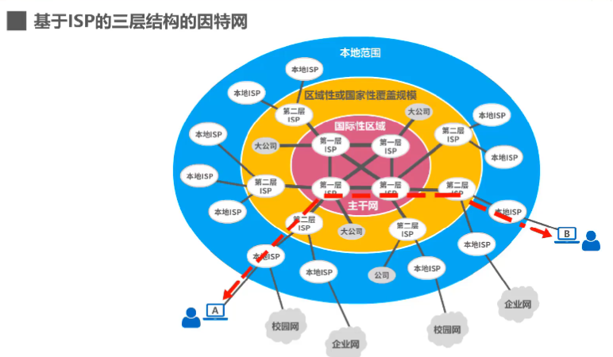
## 因特网标准化工作：

- 面向公众

## 计算机功能

- 数据通信   
- 资源共享（硬件、软件、数据）   
- 分布式处理   
- 提高可靠性   
- 负载均衡   

## 因特网的组成
- 边缘部分：
 由所有连接在因特网上的主机组成，用户直接使用，用来通信和资源共享。
- 核心部分：
 由大量网络和连接这些网络的路由器组成，为边缘部分提供服务。
- 功能组成：
 通信子网：数据通信
 资源子网：资源共享、数据处理    

## 计算机组成

- 组成部分：硬件、软件、协议    
- 工作方式：边缘部分（用户直接使用，包括与方式）、核心部分（为边缘部分服务）    
- 功能组成：通信子网（数据通信）、资源子网（资源共享数据处理）    

# 三种交换方式

### 电路交换 ==（电话）==

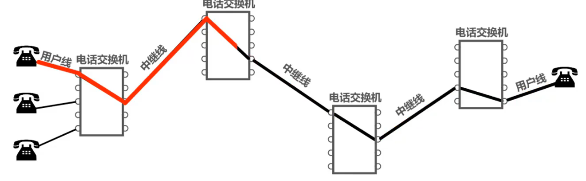  

- 交换：按照某种方式动态地分配传输路线的资源
- 三个步骤   
 建立连接（分配通信资源）  
通话（一直占用通信资源）  
释放连接（归还通信资源）  
#### 优点
通信时延小  
有序传输  
没有冲突  
适用范围广（传输模拟信号和数字信号）  
实时性强  
控制简单   
#### 缺点
建立连接时间长  
线路独占，使用效率底  
灵活性差  
难以规格化  
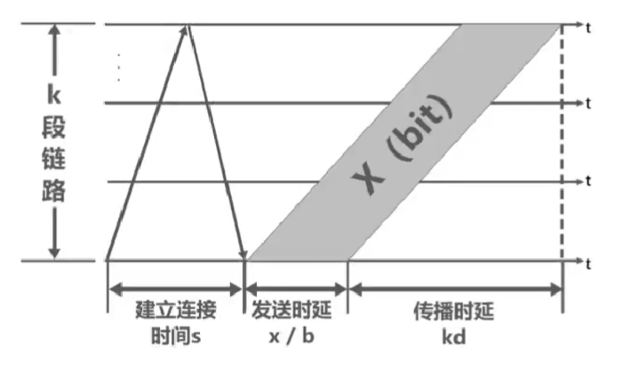
**电路交换的时延=s+x/b+kd**

### 分组交换 ==(计算机)==
- 分组交换机：路由器，互连网络，转发接收到的分组  
    数据分组->包（数据段+首部：分组的目的地址）  
- 发送方：构造分组，发送分组  
- 路由器：缓存分组，转发分组*(存储转发)*  
- 接收方：接收分组，还原报文  

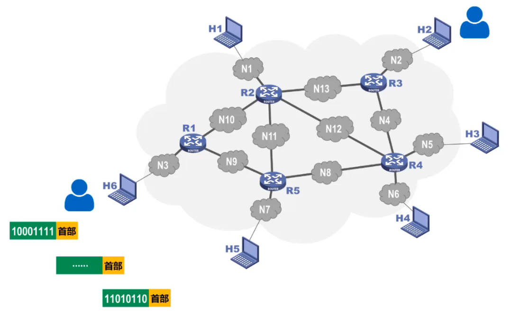  

#### 优点
无需建立连接  
线路利用率高  
简化了存储管理  
加速传输  
减少出错概率和重发数据量  
#### 缺点
引起了转发时延  
需要额外的信息量  
对于数据报服务，存在失序、丢失、重复分组  
对于虚拟电路服务，存在呼叫建立、数据传输、虚电路释放  
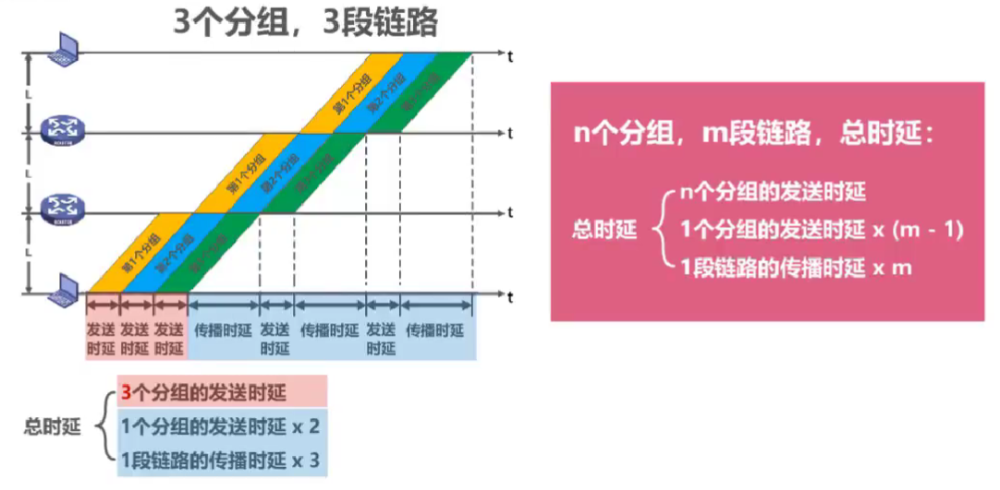
**分组交换的时延$\frac{p}{b}*(\frac{x}{p}+k-1)+kd$**
<!-- $=p/b * （x/p + k-1） + kd$ -->
### 报文交换
与分组交换类似，不再使用
#### 优点
无需建立连接  
动态分配线路  
提高线路可靠性  
提高线路利用率  
提供多目标服务  
#### 缺点
引起转发时延  
需要大量存储缓存空间  
需要传输额外信息量  

## 对比
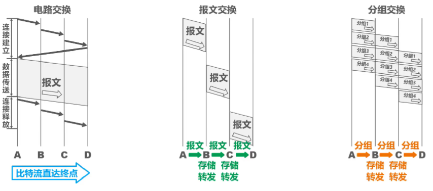

# 计算机网络的定义和分类

#### 计算机网络的简单定义

- 互连  
  计算机之间用有线或者无线的方式进行数据通信  
- 自治  
  独立的计算机，有自己的硬件和软件，可单独运行使用  
- 集合  
  至少两台计算机

#### 计算机网络的较好定义

- 计算机网络主要由一些**通用，可编程的硬件**互连而成，这些硬件并非为了实现某一特定目标，这些可编程的硬件能够用来**传送多种不同类型的数据**，并能**支持广泛的和日益增长的应用**
- 而用来传送多种不同类型的数据，并能支持广泛的和日益增长的应用  
- 连接的永久包括智能手机等智能硬件  

#### 计算机网络的分类
- 按交换技术分类  
    电路交换网络 、报文交换网络  、分组交换网络  
- 按使用者分类  
    公用网  、专业网  
- 按传输介质分类  
    有线网络  、无线网络  
- 按覆盖范围分类  
    广域网`WAN`  、城域网MAN  、局域网`LAN`  、个域网`PAN`
- 按拓扑结构分类  
  - 总线型网络  
    建网容易、增减结点方便、节省线路；重负载时通信效率不高，一处故障全网瘫痪    
  - 星型网络  
    集中控制管理    
  - 环形网络    
    单向传输  
  - 网状型网络    
    可靠性高，复杂    

# 计算机网络的性能指标
## 速率
比特：数据量的单位，二进制数字中发1或0  

$8 bit=1Byte$  
$KB=2^{10}B$  
$MB=K*KB=2^{10}*2^{10}B=2^{20}B$  
$GB=K*MB=2^{10}*2^{20}B=2^{30}B$  
$TB=K*GB=2^{10}*2^{30}B=2^{40}B$  

速率：连接在计算机网络上的主机在数字信道传送比特的速率，也称**比特率**或**数据率**

$bit/s(b/s,bps)$  
$kb/s=10^3b/s(bps)$  
$Mb/s=k*kb/s=10^3*10^3b/s=10^6b/s(bps)$  
$Gb/s=k*Mb/s=10^3*10^6b/s=10^9b/s(bps)$  
$Tb/s=k*Gb/s=10^3*10^9b/s=10^{12}b/s(bps)$  

> 例1：数据块，大小为100Mb，网卡发送速率为100Mbps，发送完需要多少时间？  
> 
> $\frac{100MB}{100Mb/s}=\frac{2^{20}B}{10^6b/s}=\frac{2^{20}*8b}{10^6b/s}=8.388608s$  
> $\approx\frac{B}{b/s}=8s$  

## 带宽

- 一条通信线路的“频带宽度”越宽，其所传输数据的“最高数据率”也越高。

###### 在模拟信号系统中的意义

信号所包含的各种不同频率成分所占据的频率范围
单位：Hz
带宽3.1kHz
###### 在计算机网络中的意义

用来表示网络的**通信线路**所能传送数据的能力，因此网络带宽表示在单位时间内从网络中的某一点到另一点所能通过的“**最高数据率**”；单位与速率单位相同
单位：b/s

## 吞吐量
- 在**单位时间内通过某个网络（信道、接口）的数据量**
- 经常用于对现实世界中的网络的一种测量，以便知道实际上到底有多少数据量能够通过网络
- 吞吐量**受网络的带宽或额定速率的限制**
## 时延
网络时延：（可能发送时延为主导也可能传播时延为主导，计算后哪个大哪个占主导）
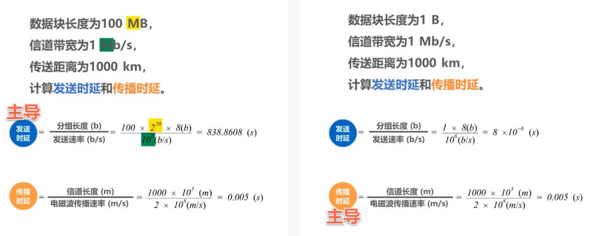  

#### 发送时延
> 源主机将分组发往传输线路
<!-- - **==分组长度(b)/发送速率(b/s)==** -->
$$\Large发送时延=\frac{分组长度(b)}{发送速率(b/s)}$$

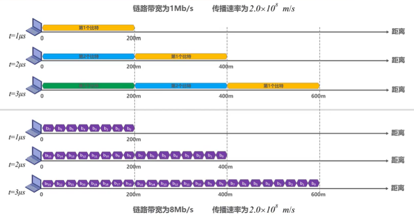
**信号前端传播的距离：信号传播速度\*发送时延**

#### 传播时延
> 代表分组的电信号在链路上传输

$$\Large传播时延=\frac{信道长度(m)}{电磁波（信号）传播速率(m/s)}$$

- 电磁波传输速率   
	自由空间：3  ×10⁸ m/s  
	铜       线：2.3×10⁸ m/s  
	光       纤：2.0×10⁸ m/s  

> [!QUESTION]- 例题  
> 两主机间链路长度60m
> 链路带宽10Mb/s
> 信号传播速率2.0×10⁸m/s
> 一个主机发送1b信息给另一个主机，共耗费多长时间
> 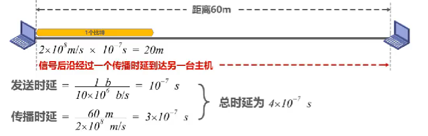
> n bit信息：
> 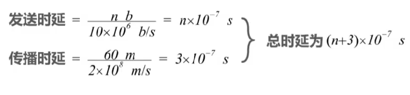
    
#### 处理时延
> 路由器收到分组后，对其进行存储转发 ==(不方便计算)==

排队时延：算成处理时延
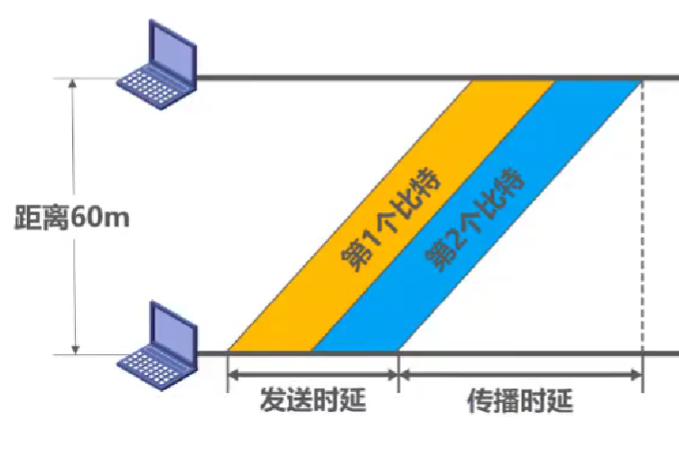

## 时延带宽积

传播时延×带宽
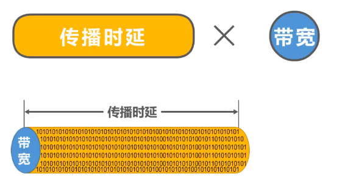
以比特为单位的链路长度

## 往返时间RTT

从源主机发送分组开始，直到源主机收到来自目的主机的确认分组为止

$RTT$越大，在收到确认前可以发送的数据越多  

$RTT$=往返传播时延+末端处理时延  

## 利用率

- 信道利用率：用来表示信道有百分之几的时间是被利用的（有数据通过）
- 网络利用率：全网络的信道利用率加权平均

$$
\begin{align*}
D_0&: \text{网络空闲时的时延} \\
D&: \text{当前网络时延} \\
D&=\frac{D_0}{1-U}\\
U&:\text{利用率}
\end{align*}
$$

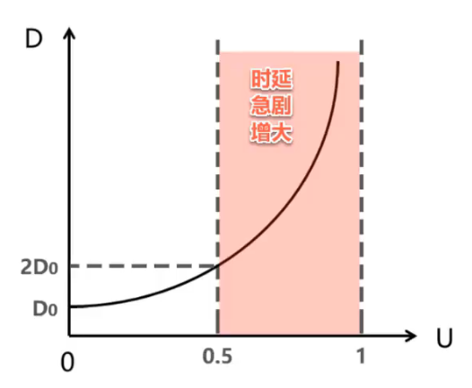

当某信道利用率增大时，该信道引起的时延也也会迅速增加，所以信道利用率并非越高越好，控制在50%或合理范围内

## 丢包率（分组丢失率）

- 一定时间范围内，传输过程中**丢失的分组数量与总分组数量的比率**
可分为：接口丢包率、结点丢包率、链路丢包率、路径丢包率、网络丢包率等

###### 丢失主要的两种情况
- 传输过程中出现**误码**，被结点丢弃
- 到达队列已满的分组交换机是被丢弃，通信量较大时可能造成**网络拥塞**
  
丢包率反映了网络的拥塞情况，丢包率较高时会使网络应用无法正常工作。

# 计算机网络体系结构

### 常见的计算机网络体系结构
<!-- 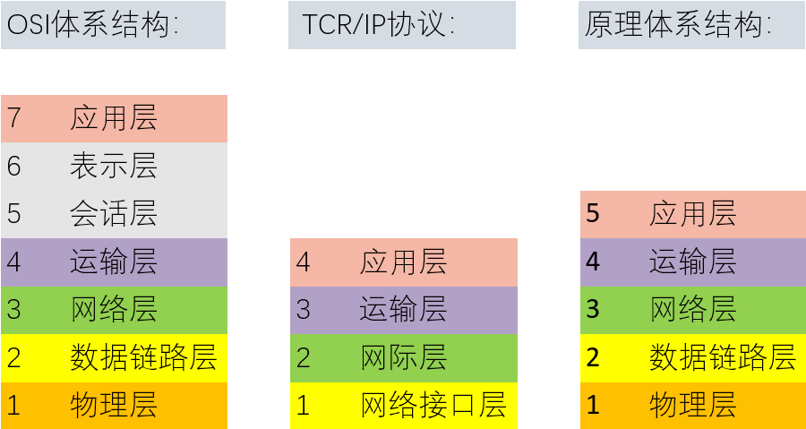 -->
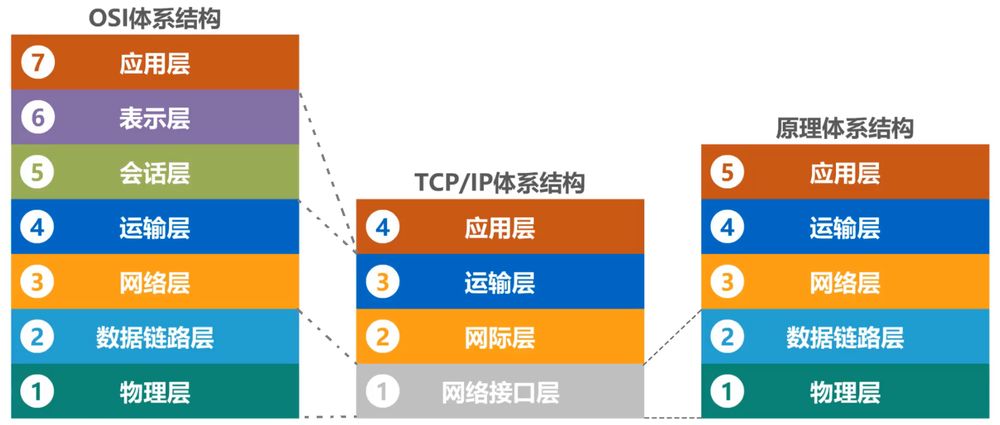  

- 路由器一般只包含网络接口层和网际层
<!-- TCP/IP:
应用层：	HTTP、SMTP、DNS、RTP
运输层：	TCP、UDP：向上提供可靠传输
网际层：	IP：向上向下互连（核心）
    IP协议直接为ICMP协议提供服务，ICMP封装后需要IP再次封装
网络接口层：	网络接口1，网络接口2… -->
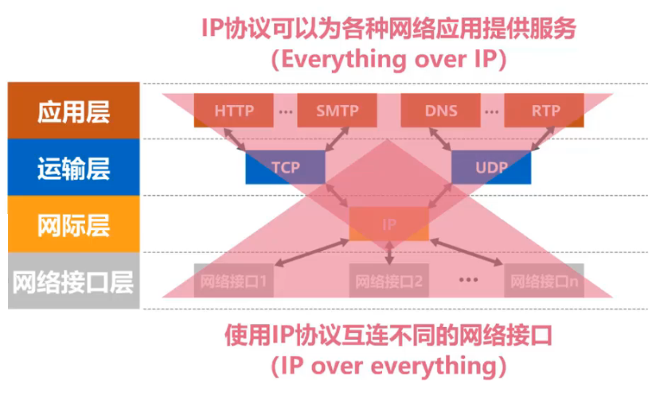  
 
### 计算机网络体系结构分层的必要性
##### 物理层
- 解决使用何种信号传递比特的问题  
传输媒介（介质，不算在物理层）  
物理接口  
信号表示  
##### 数据链路层
- 解决分组在一个网络（一段链路）上传输的问题  
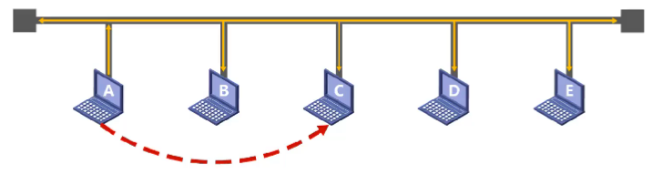
如何标识网络中的各主机（主机编址，MAC地址）  
如何从信号所表示的一连串比特流中区分出地址和数据  
如何协调各主机争用总线  
##### 网络层
- 解决分组在多个网络上传输（路由）的问题  
如何标识各网络以及网络中各主机（网络和主机共同编址的问题，如：IP地址）  
路由器如何转发分组，如何进行路由选择  
##### 运输层
- 解决进程之间基于网络的通信问题  
如何解决进程之间基于网络的通信问题  
出现传输错误时，如何处理  
##### 应用层
- 解决通过应用进程的交互实现特定网络应用的问题  
通过应用进程间的交互完成特定的网络应用  
  - 支持万维网的HTTP协议  
  - 支持电子邮件的SMTP协议  
  - 支持文件传送的FTP协议  

### 计算机网络体系结构分层的作用
###### 应用层
- 用户与网络的界面  
- 直接为用户的应用进程（例如电子邮件、文件传输和终端仿真）提供服务  
- HTTP、SMTP、FTP、DNS  

###### 表示层
 
- 规范交换信息的表示方式；数据格式转换  
- 加密和解密  
- 数据压缩和恢复  
- JPEG、ASCII

###### 会话层

- 负责在数据传输中建立和维护计算机网络中两台计算机之间的通信连接（会话）  
- 使用校验点同步（SYN）或恢复通信；ADSP、ASP  

###### 传输层

- 负责端到端通讯  
- 传输单位为报文段（TCP）或用户数据报（UDP）  
- 可靠传输，不可靠传输  
- 差错控制  
- 流量控制  
- 复用分用  
- TCP、UDP  

###### 网络层

- 传输分组，传输单位是数据报或分组  
- 路由选择  
- 流量控制  
- 差错控制  
- 规划IP地址(ipv4和ipv6变化只会影响网络层)  
- 拥塞控制   
- 网际互联  
- IP、ICP、IGMP、ARP、RARP、OSPF   

###### 数据链路层

- 负责点到点通讯  
- 将数据报组装成帧，传输单位为帧  
- 成帧（帧的开始和结束）  
- 透明传输  
- 差错校验(一般丢弃，纠错由传输层解决)  
- 流量控制  
- 访问（接入）控制（控制信道的控制）  
- SDLC、HDLC、PPP、STP  

###### 物理层

- 简单将数据转变为物理电信号，在物理媒体上实现比特流的透明传输，传输单位为比特  
- 定义接口特性  
- 定义传输模式（单工、半双工、双工）  
- 定义传输速率  
- 比特同步  
- 比特编码；Rj45、802.3  

#### 原理体系结构
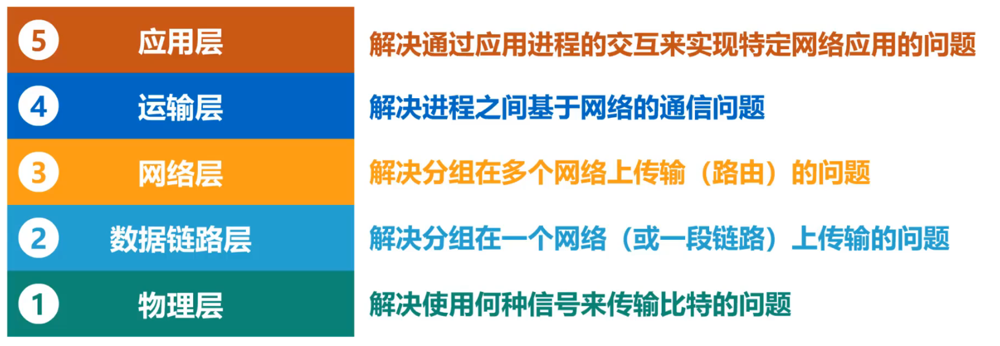  

####  OSI
<!-- 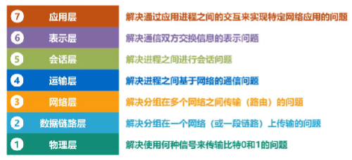   -->
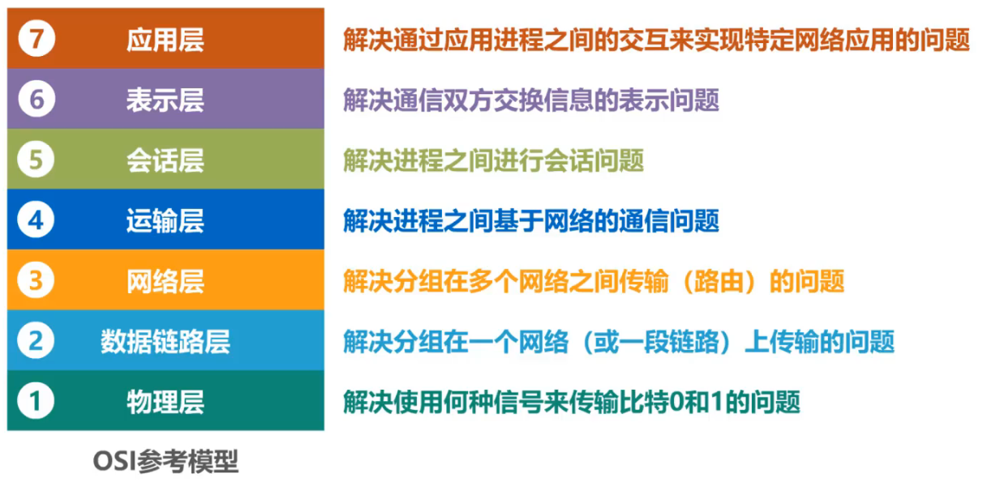  

### 计算机网络体系结构分层思想举例
<!-- 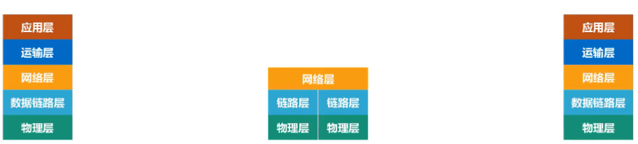
     -->

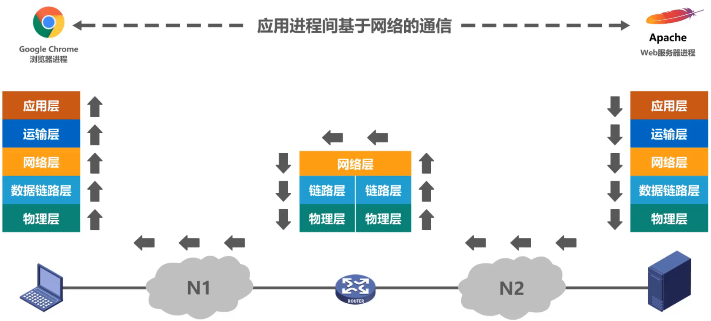  

##### 发送机$\rightarrow$
> [! info] 应用层构建HTTP报文 `| HTTP|`  $\rightarrow$
运输层添加TCP首部 `|HTTP|TCP|`$\rightarrow$  （区分应用进程，实现可靠传输）
网络层添加为IP数据报 `| HTTP | TCP | IP |`  $\rightarrow$  （使IP数据段可以在网络传输）
数据链路层给IP数据报添加首部和尾部ETH使之成为帧 `| ETH | HTTP | TCP | IP | ETH |` $\rightarrow$ （为使帧在一段链路或一个网络上传输，被相应的目的主机接收）
物理层（以太网）把帧看做比特流，添加前导码  `| ETH | HTTP | TCP | IP | ETH | 前导码|`  $\rightarrow$(让目的主机做好接受帧的准备)
##### 传输媒体$\rightarrow$
> [! info] 物理层将添加前导码的比特流变化成相应的信号发送到传输媒体
##### 路由器$\rightarrow$
> [! info] 物理层将信号变换为比特流，去掉前导码`| ETH | HTTP | TCP | IP | ETH |`$\rightarrow$ 
链路层去掉首部和尾部ETH交付IP数据报 `| HTTP | TCP | IP |`$\rightarrow$ 
网络层解析IP数据报首部，提取网络地址，确定转发端口，进行转发$\rightarrow$ 
再次封装
##### 传输媒体$\rightarrow$
##### Web服务器
> [! info] 解析HTTP报文，给主机发回HTTP响应报文与上面过程相似

### 计算机网络体系结构中的专用术语

##### 实体
- 实体：任何可发送或接收信息的硬件或软件进程
- 对等实体：收发双方相同层次中的实体
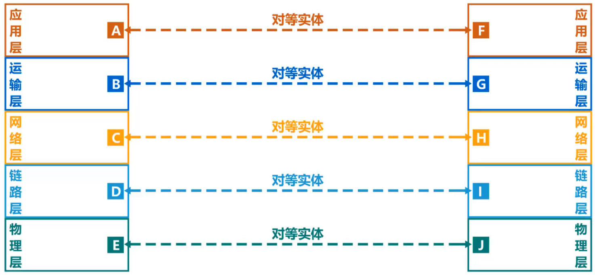  

##### 协议`（水平的）`
控制两个对等实体进行逻辑通信的规则的集合
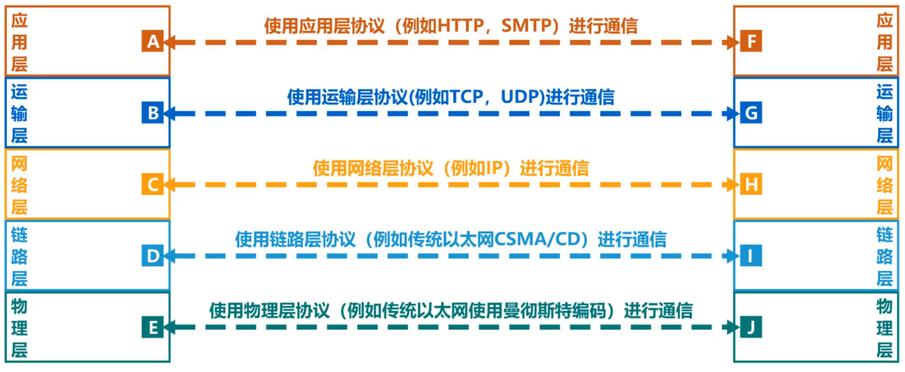  

- 三要素   
语法：定义所交换信息的格式  
语义：定义收发双方所要完成的操作  
同步：定义收发双方的时序关系  
<!-- 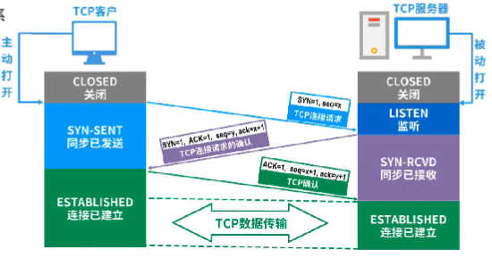 -->
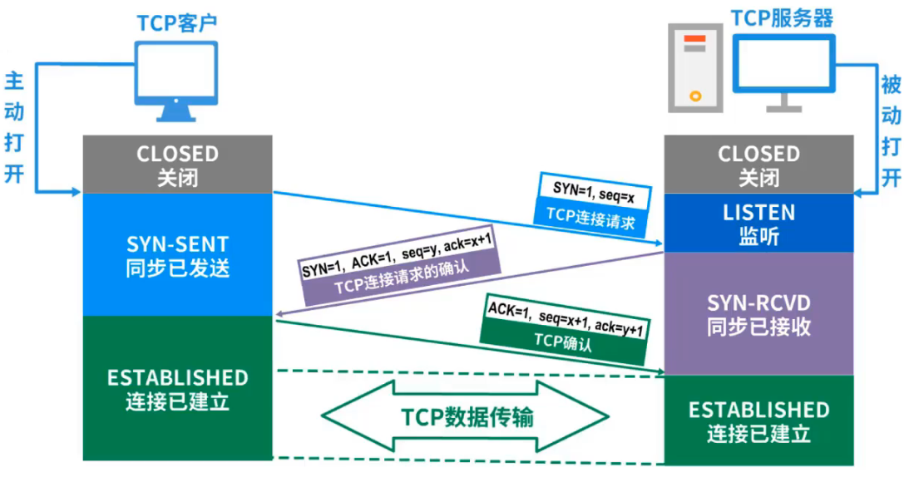  

##### 服务`（垂直的）`
- 在协议控制下，两个对等实体间的逻辑通信使得本层能够向上一层提供服务

- 要实现本层协议，需要使用下一层所提供的服务

- 实体看得见相邻下层所提供的服务，但并不知道实现该服务的具体协议 $\rightarrow$  下面的协议对上面的实体是**透明**的

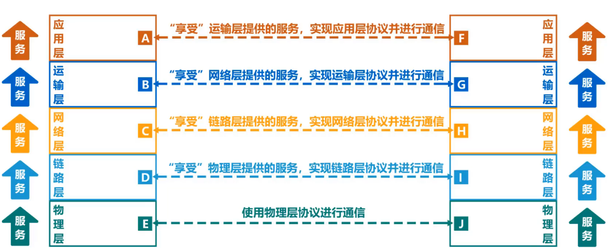  

- 服务访问点
  **在同一系统中相邻两层的实体交换信息的逻辑接口**，用于区分不同的服务类型
  - 数据链路层的服务访问点为帧的“类型”字段
  - 网络层的服务访问点为IP数据报首部中的“协议字段”
  - 运输层的服务访问点为“端口号”

- 服务原语
上层使用下层所提供的服务必须通过与下层**交换一些命令**，这些命令称为服务原语

- 协议数据单元PDU
  **对等层次之间传送的数据包**称为该层的协议数据单元
- 服务数据单元SDU
  **同一系统内，层与层之间交换的数据包**称为服务数据单元
- 多个SDU可以合成为一个PDU;一个SDU可以划分为多个PDU
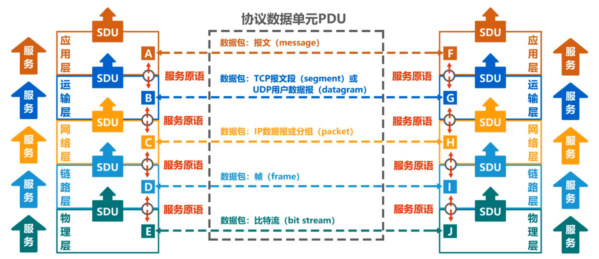  

    

