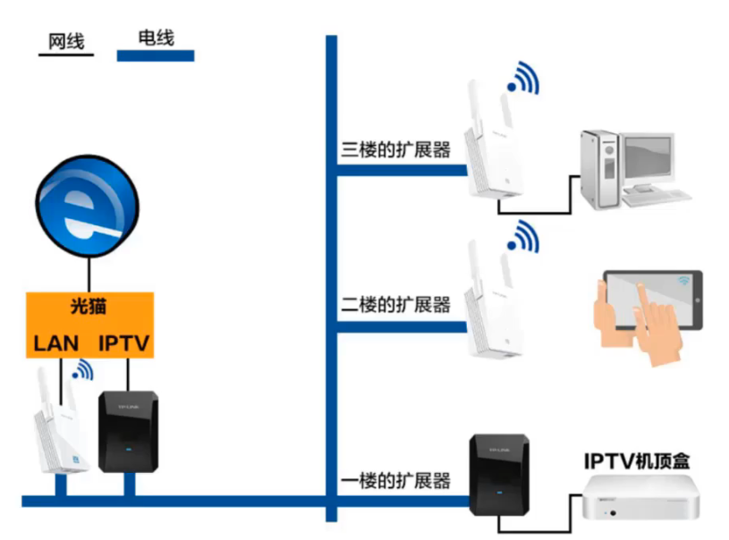
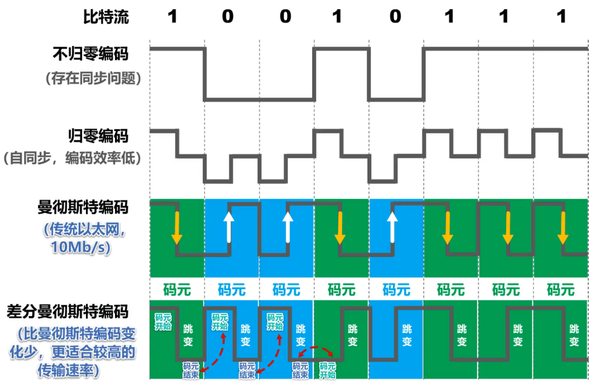

# 物理层的基本概念

**物理层考虑的是怎样在连接各种计算机的传输媒体上传输数据比特流**

**物理层为数据链路层屏蔽了各种传输媒体的差异，使数据链路层只需要考虑如何完成本层的协议和服务，而不需要考虑网络具体的传输媒体是什么**

### 传输媒体
- 导引型传输媒体：双绞线、同轴电缆、光纤
- 非导引型传输媒体：微波通信（2~40GHz）
### 物理层协议的主要任务
##### 机械特性
指明接口所用接线器发**形状**和**尺寸**，**引脚数目**和**排列**，固定和锁定装置。
##### 电气特性
指明在接口电缆上的各条线上出现的**电压的范围**
##### 功能特性
指明某条线上出现的某一电平的**电压表示何种意义**
##### 过程特性
指明对于不同功能的各种可能**事件的出现顺序**

# 物理层下的传输媒体

### 导引型传输媒体

##### 同轴电缆

- 基带同轴电缆（50Ω）
  数字传输，过去用于局域网
- 宽带同轴电缆（75Ω）
  模拟传输，目前用于有线电视

##### 双绞线

- 绞合的作用
  - 抵御部分来自外界的电磁波干扰
  - 减少相邻导线的电磁干扰
- 无屏蔽双绞线UTP电缆
    
- 屏蔽双绞线STP电缆
  

- 类别
    

##### 光纤
- 优点
  - 通信容量大（25000~30000GHz的带宽）
  - 传输损耗小，远距离传输更加经济
  - 抗雷电和电磁干扰性能好。在大电流脉冲干扰的环境下尤为重要
  - 无串音干扰，保密性好，不容易被窃听
  - 体积小，重量轻

- 缺点
  - 切割需要的专用设备
  - 光电接口价格较贵
- 多模光纤
    <!--    -->

      
  - 信号失真（脉冲展宽）
  - 适合近距离传输
  - 发送光源：发光二极管；接收检测：光电二极管
- 单模光纤
   

  - 没有模式色散
  - 适合长距离传输且衰减小，光源要求高
  - 发送光源：激光发生器；接收检测：激光检波器
##### 电力线

  

### 非导引型传输媒体
##### 无线电波
  

##### 微波：直线传播
##### 红外线
- 点对点无线传输
- 直线传输，中间不能有障碍物，传输距离短
- 传输速率低(4Mb/s~16Mb/s)

##### 可见光

# 传输方式

##### 串行传输`（远距离传输）`

一个个比特依次发送，只需要一条传输线路

##### 并行传输`（内部传输）`

一次发送n个比特，发送端和接收端需要n条传输线路

##### 同步传输
  

数据块以稳定的比特流的形式传输，字节之间没有间隔，接收端在每个比特信号的中间时刻进行检测，在传输过程中产生的判别时刻的累计误差使接收端判别错位
- 接收双方时钟同步的办法
  - 外同步
  在收发双方之间添加一条单独的时钟信号线
  - 内同步
  发送端将时钟同步信号编码到发送数据中一起传输（曼彻斯特编码）

##### 异步传输
  

- 字节之间异步（字节之间的时间间隔不固定）
- 字节中的每个比特仍要同步（各比特的持续时间是相同的）

##### 单向通信（单工）
只需要一条信道
##### 双向交替通信（半双工）
两条信道
##### 双向同时通信（全双工）
两条信道
  

  

# 编码与调制

<!-- `消息` $\rightarrow$ 运送消息的实体 $\rightarrow$ `数据` $\rightarrow$数据的电磁表示$\rightarrow$ `信号` $\rightarrow$信源发出的原始电信号  $\rightarrow$ `基带信号` -->
  

- 基带信号
数字基带信号
模拟基带信号
  

仅对数字基带信号的波形进行变换，称为**编码**（以太网，曼彻斯特编码4B/5B）

把数字基带信号的频率范围搬移到较高的频带，称为**调制**（产生的是模拟信号）
<!-- - 信道：
数字信道
模拟信道 -->

- 码元
  在使用时间域的波形表示数字信号时，代表不同离散数值的基本波形。 `码元就是构成信号的一段波形`
  

### 常用编码
  
- 不归零编码（存在同步问题）  
  需要额外一根传输线来传输时钟信号，使发送方和接收方同步  
- 归零编码  
  每个码元传输结束后信号都要“归零”所以接收方只要在信号归零后进行采样即可，不需要单独的时钟信号  
  实际上，归零编码相当于把时钟信号用“归零”方式编码在了数据之内，这称为“自同步”信号  
- 曼彻斯特编码  
  码元中间时刻的跳变既表示时钟，又表示数据。  
- 差分曼彻斯特编码  
  跳变仅表示时钟  
码元开始处电平是否发生变化表示数据  

### 基本调制方法
  

### 混合调制
相位和振幅结合起来一起调制称为正交振幅调制QAM
- 正交振幅调制QAM
  - QAM-16
      
    - 12种相位
    - 每种相位有1或2种振幅可选
    - 可以调制出16种码元（波形）每种码元可以对应表示4个比特
    - 码元与4个比特的对应关系采用格雷码
    - 任意两个相邻码元只有1个比特不同

# 信道的极限容量

- 信号波形失真因素
码元传输速率
信号传输距离
噪声干扰
传输媒体质量

#### 奈氏准则
在假定的理想条件下，**为了避免码间串扰，码元传输速率是有上限的**

> [! danger] 理想低通信道的**最高码元传输速率**=2W Baud = 2码元/秒
理想带通信道的最高码元传输速率 = W Baud = W 码元/秒
 W ：信道带宽（单位为Hz）
 Baud：波特，即码元/秒

- 码元传输速率又称为：波特率、调制速率、波形速率、符号速率。它与比特率的关系
  - 当一个码元携带1比特的信息量时，则波特率（码元/秒）与比特率（比特/秒）在数值上是相等的；
  - 当**一个码元携带n比特的信息量**时，则波特率转换成比特率时，数值要乘以n

要提高信息传输的最高码元速率（比特率），就必须设法使每一个码元能携带更多个比特的信息量，采取多元制
实际的信道所能传输的最高码元速率，要明显低于奈氏准则给出的上限数值

信道的极限传输速率受限于实际信号在信道中传输时的**信噪比**，并且噪声功率相对信号功率越大，影响就越大

#### 香农公式
带宽受限且有高斯白噪声干扰的信道的极限信息传输速率

> [! danger] $$c=W*\log_2(1+\frac{S}{N})$$
c：信道的极限传输速率  
W：信道宽度（单位：b/s）  
S：信道内所传信号的平均功率  
N：信道内的高斯噪声功率  
S/N：信噪比，使用分贝（dB）做单位 $= 10*\log_{10}(\frac{S}{N})(dB)$

- 信道宽带或信道中信噪比越大，信息的极限传输速率越高
- 在实际信道上能够达到信息传输速率要比该公式的极限传输速率低不少。这是因为在实际信道中，信号还受其他损伤，如：各种脉冲干扰、信号在传输中的衰减和失真等，这些因素香农公式并未考虑

在信道宽度一定的情况下根据奈氏准则和香农公式，要想**提高信息的传输速率**就 必须 采用**多元制**（更好的调制方式）和努力**提高信道中的信噪比**
自从香农公式发表后，各种**新的信号处理和调制方法就不断出现**，其目的都是为了尽可能地**接近香农公式给出的传输速率极限**

