# 网络层概述

### 网络层的主要任务：
- 实现网络互连
- 进而实现数据包在各网络之间的传输
 设备：路由器
### 网络层解决的问题：
- 向运输层提供怎样的服务
  可靠或不可靠？
  TCP/IP是无连接、不可靠的数据报服务
  ATM、帧中继、X.25是面向连接、可靠的虚电路服务
- 寻址问题
  TCP/IP的网际层使用IP地址
- 路由选择问题
  用户或网络管理员进行人工配置（规模小，网络拓扑不变，小型互联网）
  实现各种路由选择协议，路由选择算法（大）
  
- Internet是用户最多的互联网，它使用**TCP/IP协议栈**
- TCP/IP协议栈的网络层使用核心协议**网际协议IP**，所以TCP/IP协议栈中网络层常称为**网际层**
  - 地址解析协议ARP
  - 网际控制报文协议ICMP
  - 网际组管理协议IGMP

# 网络层提供的两种服务要考

### 面向连接的虚电路服务
- **可靠通信由网络来保证**
 
- 必须**建立网络层的连接—虚电路VC**（以保证通信双方所需的一切网络资源）
 
- 通信双方**沿着已建立的虚电路发送分组**（分组沿着这条逻辑连接按照存储转发方式传送）
 
- 目的主机的地址仅在连接建立阶段使用，之后每个**分组的首部只需携带一条虚电路的编号**（构成虚电路的每一条链路都有一个虚电路编号）
 
- 这种通信方式如果再使用可靠传输的网络协议，就可使所发送的分组最终正确到达接收方（无差错按序到达、不丢失、不重复）
 
- **通信结束后需要释放之前所建立的虚电路**
 
- 广域分组交换网络都使用面向连接的虚电路服务

### 无连接的数据报服务

- **可靠通信应当由用户主机来保证**
 
- **不需要建立网络层连接**
 
- **每个分组可走不同的路径**
 
- 每个分组的**首部必须携带目的主机的完整地址**
 
- 传送的分组**可能误码、丢失、重复、失序**
 
- 由于**网络本身不提供端到端的可靠传输服务**，网络中的路由器可以做的比较简单而且价格低廉（与电信网的交换机相比较）
 
- 因特网采用了这种设计思想，**将复杂的网络处理功能置于因特网的边缘（用户主机和其内部的运输层）**，而将相对简单的尽最大努力的分组交付功能置于因特网核心
 
- 好处：
  - 网络的造价降低
  - 运行方式灵活，能适应多种应用

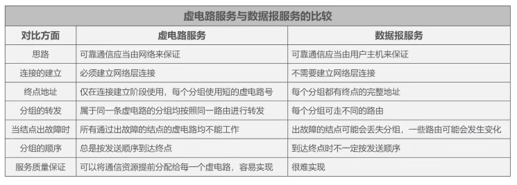  

# IPv4地址概述

IPv4地址就是给因特网（Internet）上的每一台主机（或路由器）的每一个接口分配一个在全世界范围内是唯一的32比特的标识符
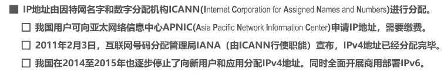  

IPv4地址的编址方法：
 分类编址1981
 划分子网1985
 无分类编址1993

IPv4的表示方法：点分十进制表示方法
 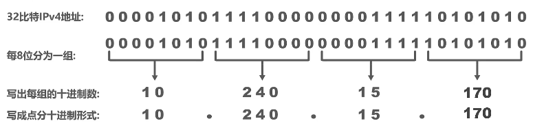  

 
10.254.15.240
172.16.191.247
192.168.165.7

# 分类编址的IPv4地址要考

- 只有A类、B类、C类地址可分配给网络中的主机或路由器的各接口
- **A类网络号0和127**不能分配给主机或路由器的各接口
- **主机号为全0的地址是网络地址**，不能分配给主机或路由器的各接口
- **主机号为全1的地址是广播地址**，不能分配给主机或路由器的各接口
0~127：A类
128~191：B类
192~223：C类

### A类地址
 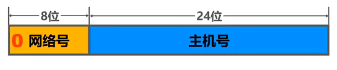  

 最小网络号0，保留不做指派
 第一个可指派的网络号为1，网络地址为1.0.0.0
 - 最大网络号为127做为本地环回测试地址，不指派
   - 最小本地回环测试地址为127.0.0.1
   - 最大本地回环测试地址为127.255.255.254
 - 最后一个可指派的网络号为126，网络地址为126.0.0.0
 可指派的网络数量为2⁸-2=126（减去最小网络号0和最大网络号127）
 每个网络中可分配是IP地址数量为2²⁴-2=16777214（减去主机号全为0的网络地址 主机号全为1的广播地址）
 
### B类地址
 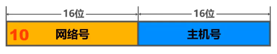  

 最小网络号也是第一个可指派的网络号**128.0**
 网络地址为**128.0.0.0**
 最大网络号也是最后一个可指派的网络号**191.255**
 网络地址为**191.255.0.0**
 可指派的网络数量为2¹⁴=16384
 每个网络中可分配的IP地址数量为2¹⁶-2=65534（减2减去主机号全为0的网络地址和全为1 的广播地址）
### C类地址
 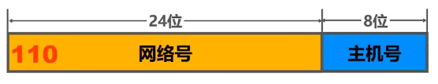  

 最小网络号也是第一个可指派的网络号**192.0.0**
 网络地址为**192.0.0.0**
 最大网络号也是最后一个可指派的网络号**223.255.255**
 网络地址为**223.255.255.0**
 可指派的网络数量为2²¹=2097152
 每个网络中可分配的IP地址数量为2⁸-2=254（减2减去主机号全为0的网络地址和全为1 的广播地址）
 
### D类地址
 1110：多播地址
 
### E类地址
 1111：保留以后使用

0.0.0.0特殊的IPv4地址，只能作为源地址使用，表示“再本网络上的本主机”，封装有DHCP Discovery报文的IP分组源地址使用0.0.0.0
255.255.255.255特殊的IPv4地址，只能作为目的地址使用，表示“只本网络上进行转发（各路由器均不转发）”
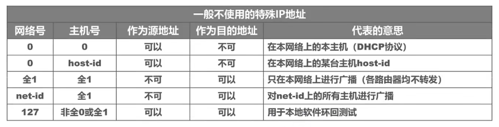  

> [! example]一些私有地址
A类地址：10.0.0.0--10.255.255.255
B类地址：172.16.0.0--172.31.255.255
C类地址：192.168.0.0--192.168.255.255

# 划分子网的IPv4地址

 - 为新增网络申请新的网络号会带来以下弊端：
   - 需要等待时间和花费更多的费用
   - 会增加其他路由器中路由表记录的数量
   - 浪费原有网络中剩余的大量IP地址

**从主机号部分借用一部分作为子网号**

- 如果未标记子网号部分，计算机如何知道分类地址中主机号有多少比特被用作子网号？
  - 32比特的子网掩码可以表明分类IP地址的主机号部分被借用了几个比特作为子网号  
    - 子网掩码使用连续的比特1来对应网络号和子网号  
    -  子网掩码使用连续的比特0来对应主机号  
    -  将划分子网的IPv4地址与其相对应的子网掩码进行逻辑与运算就可以得到IPv4地址所在子网的网络地址
 
 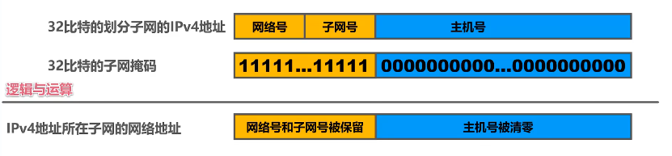  

例：IP地址180.80.77.55
   子网掩码255.255.252.0
   求广播地址
 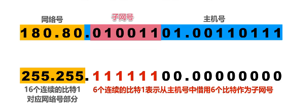  

  目的地址的网络号可能是：180.80.76.0~180.80.79.255
  广播地址为主机号全为1，则是180.80.79.255

# 无分类编址的IPv4地址
 1993，IETF发布**无分类域间路由选择CIDR**
### CIDR
 CIDR消除了传统的A、B、C类地址，以及划分子网的概念
 CIDR可以更加有效分配IPv4的地址空间，并且可以在新的IPv6使用之前允许因特网的规模继续增长
 知道CIDR地址块128.14.35.7/20
 可以知道最小地址、最大地址、地址数量、聚合C类网数量、地址掩码
 
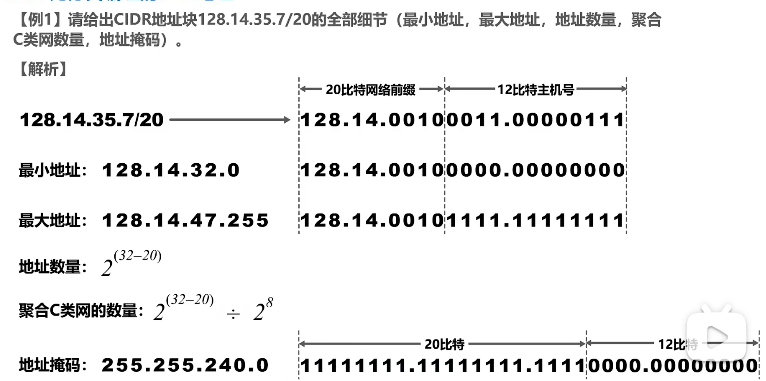  

 
 ### 路由聚合
 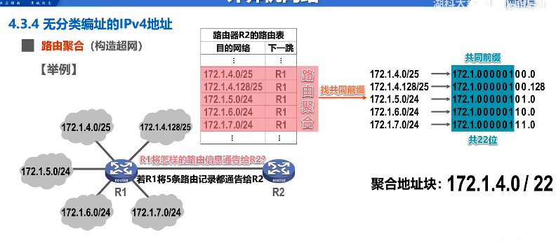  

 
 路由器查表转发分组时发现有多条路由可选，则选择网络前缀最长的那条，称为最长前缀匹配（因为这样的路由更具体）
 
# IPv4地址的应用划分

### 定长的子网掩码FLSM
 使用同一个子网掩码划分子网
 每个子网分配的IP地址数量相同，造成IP地址浪费
 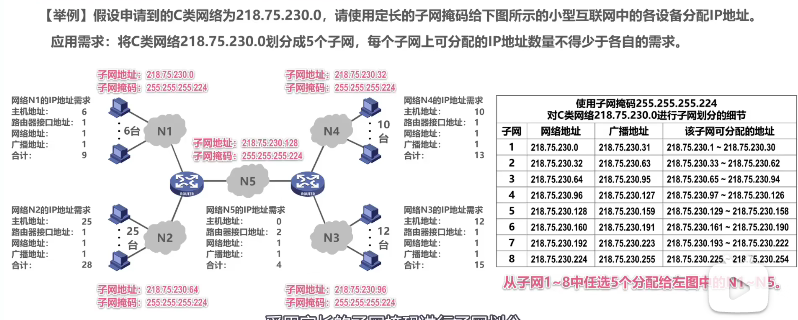  

### 变长的子网掩码VLSM要考要考
 使用不同的子网掩码划分子网
 每个子网分配的IP地址数量可以不同，尽可能减少IP地址的浪费
 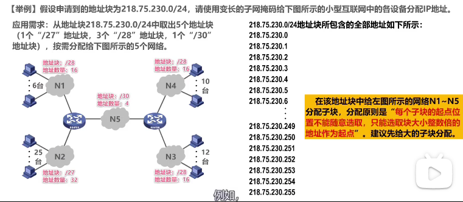  

# IP数据报的发送和转发过程要考

忽略ARP协议获取目的主机或路由器接口的MAC地址的过程
忽略以太网交换机自学习和转发帧的过程
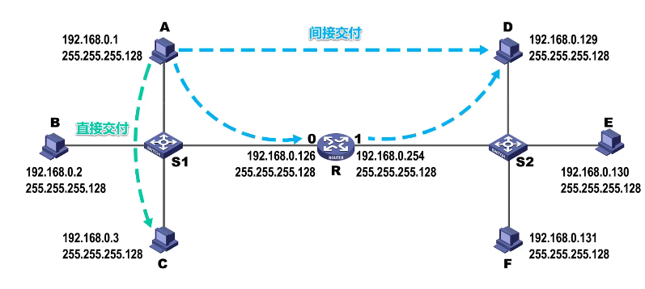  

- **源主机**如何知道**目的主机**是否和自己在同一个网络中
 **目的主机ip地址**与**源主机子网掩码**相与
 若**目的主机网络地址**与**源主机网络地址**不相等则不在同一个网络中
- 主机如何知道路由器的存在，把IP数据报交给那个路由器进行转发？
  - 用户为了本网络中的主机能和其他网络中的主机进行通信，就必须给其指定本网络中的一个路由器，由该路由器帮忙进行转发。
    - 所指定的路由器被称为**默认网关**
      - 将路由器的IP地址指定给该接口所直连网络中的各个主机作为默认网关
  - 本网络中的主机与其他网络中的主机进行通信时，将IP数据报传输给默认网关，由默认网关帮主机将IP数据报转发出去

### 路由器收到IP数据报如何转发？
 1. 检查IP数据报是否出错：
  若出错则直接丢弃该IP数据报并通告源主机
  若没有出错则进行转发
 2. 根据IP数据报的目的地址在路由表中查找匹配的条目：
  若找到匹配的条目，则转发给条目中指示的下一跳
  若找不到，则丢弃该IP数据报并通告源主机
    

  路由器对该IP数据报进行查表转发
  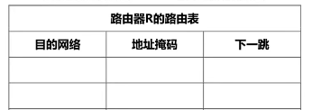  

  给路由器的接口配置IP地址和子网掩码时，路由器就知道自己的该接口与哪个网络是直连的
  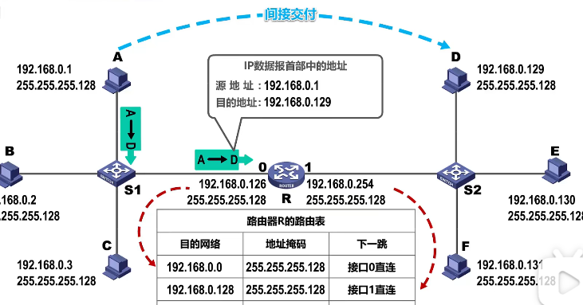  

  路由表中可能由用户或网络管理员配置的静态路由
  也可以是路由器使用路由协议自动获取到的动态路由
   
  接下来路由器根据IP数据报的目的地址在自己的路由表中查找匹配的路由条目，逐条检查路由条目，将目的地址与路由条目中的地址掩码相与得到目的网络地址
 路由器隔离广播域、冲突域
  

主机发送IP数据报

路由器转发IP数据报

# 静态路由配置及其可能产生的路由环路问题

# 路由选择协议概述要考

# 路由信息协议RIP的基本工作原理要考

 **路由信息协议RIP**是内部网关协议IGP中最小广泛使用的协议之一
 RIP要求自治系统AS内每个路由器都要维护他自己到AS内其他每一个网络记录。这是一组距离，称为**距离向量D-V**
 RIP使用跳数作为度量来衡量到达目的网络的距离
 路由器到直连网络的距离定义为1
 路由器到非直连网络的距离定义为所经过的路由器数加1
 允许一条路径最多包含15个
 ‘距离‘等于16时相当于不可达，因此RIP只适用于小型互联网
  **思科：路由器到直连网络的距离定义为0**
 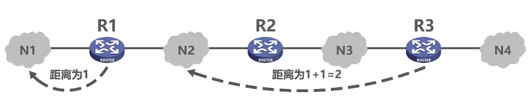  

RIP认为好的路由就是'距离短'的路由，也就是所**通过路由器数量最少**的路由
 
 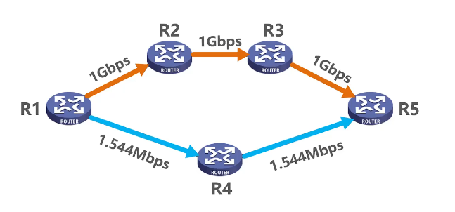  

RIP认为R1到R5的好路由是R1->R4->R5

当到达同一目的地网络有多条“距离相等”的路由器时，可以进行等价负载均衡
  

 RIP包含以下三个要点：
  | 和谁交换信息 | 仅和相邻路由器交换信息 |
  | :----------: | :--------------------: |
  | 交换什么信息 |      自己的路由表      |
  | 何时交换信息 |  周期性交换（每30秒）  |

### RIP基本工作过程：
 1. 路由器刚开始工作时，**只知道**自己**直连网络的距离为1**
 2. 每个路由器仅和**相邻路由器周期性地交换**并**更新路由信息**
 3. 若干次交换和更新后，每个路由器都知道**到达本AS（自治网络）内各网络的最短距离**和**下一跳地址**，称为收敛
 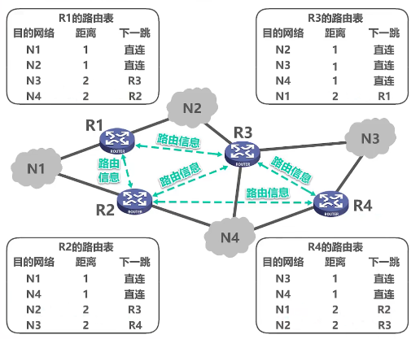  

C路由表中下一跳都为? 可以认为D不关心路由器C的这些内容
当C到了更新报文发送的周期就封装自己路由表中的相关路由信息到RIP更新报文中发送给路由器D
D只需要知道自己到这些网络的距离比C大1，然后改造自己的路由表
 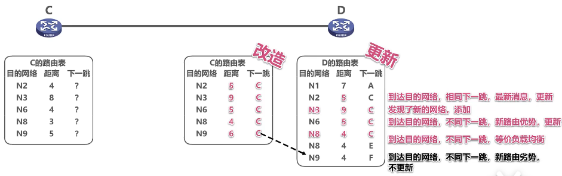  
<!--    -->

 ### 坏消息传播得慢
 又称为**路由环路**或**距离无穷计数**。这是距离向量算法的一个固有问题
   

 
 N1故障后R1要等待更新周期到了之后将N1不可达传递给R2
 R2的路由表更新信息先到R1会误导R1，使R1认为N1可达且距离为2
 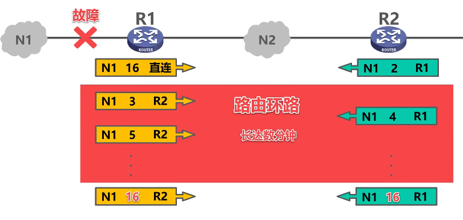  

- 解决措施：
  - 限制**最大路径距离**为15（16表示不可达）  
  - 当路由表发生变化时就立即发送更新报文（**触发更新**），而不是周期性发送  
  - 让路由器记录收到  某特定路由信息的接口  ，而不让同一路由信息  再  通过此接口方向  反方向传送（**水平分割**）

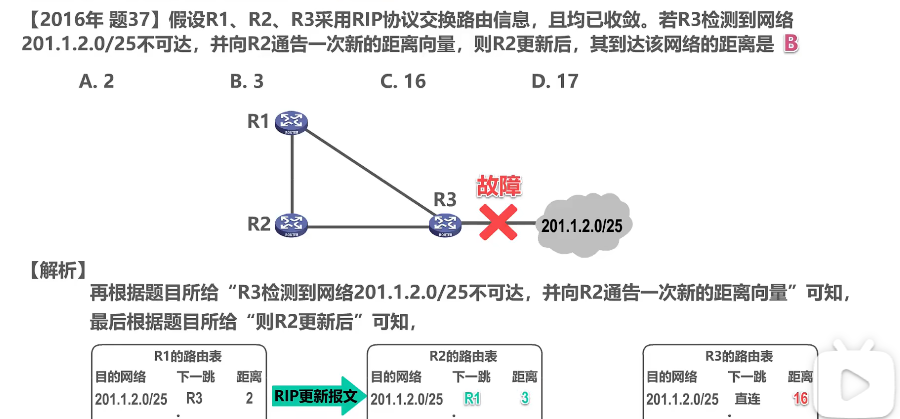  

# 开放最短路径优先OSPF的基本工作原理要考

# 边界网关协议BGP的基本工作原理要考

 

# IPv4数据报的首部格式要考要考
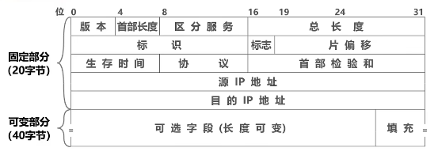  

 每一行都由32比特（4字节）构成
 每格称为字段或域
 每个字段或某些字段的组合用来表达IP协议的相关功能
 
### 版本：
 占4比特，表示IP协议的版本
 通信双方使用的IP协议的版本必须一直，目前广泛使用的IP协议版本号为4（IPv4）
### 首部长度：
 占4比特，表示IP数据报首部的长度，该字段的取值以4字节为单位
 最小十进制取值为5，表示IP数据报首部只有20字节固定部分
 最大十进制取值为15，表示IP数据报包含20字节固定部分和最大40字节可变部分
### 可选字段：
 长度从1字节到40字节不等。用来支持排错、测量及安全等措施。
 可选字段增加了IP数据报的功能，但这同时使IP数据报的首部长度变成可变的，这增加了每一个路由器处理IP数据报的开销，实际上可选字段很少使用
### 填充字段：
 确保首部长度为4字节的整数倍，使用全0进行填充
### 区分服务：
 占8比特，用来获取更好的服务
 该字段在旧标准中叫作服务类型，但实际上一直没有被使用过
 1998年，因特网工程任务组IETF把这个字段改名为区分服务
 利用该字段的不同数值可提供不同等级的服务质量
 只有在使用区分服务时，该字段才起作用，一般情况不使用
### 总长度：
 占16比特，表示IP数据报的总长度（首部+数据载荷）
 最大取值为十进制的65535，以字节为单位（实际应用很少传输这么长的IP数据报）
 首部长度=首部长度×4（字节）
 总长度=总长度（字节）
 数据载荷=总长度—首部长度
 用于IP数据报分片： 以太网规定最大传输单元MTU值为1500字节，在封装成帧时：当IP数据报长度超过MTU时，无法封装，需要进行分片，再将个分片IP数据报封装成帧
### 标识：
 占16比特，属于同一个数据报的个分片数据报应该具有相同的标识
 IP软件维持一个计数器，每产生一个数据报，计数器值加1，并将此值赋给标识字段
### 标志：
 占3比特，各比特含义：
  DF位：1→不允许分片
  0→允许分片
  MF位：1→后面还有分片
  0→这是最后一个分片
  保留位：必须位0
### 片偏移：（必须是整数）
 占13比特，指出分片数据报的数据载荷部分偏移起在原数据报的位置有多少个单位
 片偏移以8个字节为单位

### 对IPv4数据报进行分片：
 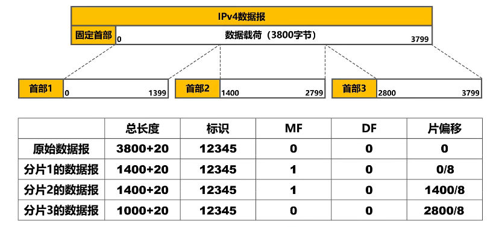  

分片2的IP数据报在经过，某个网络时还需要再进行分片：
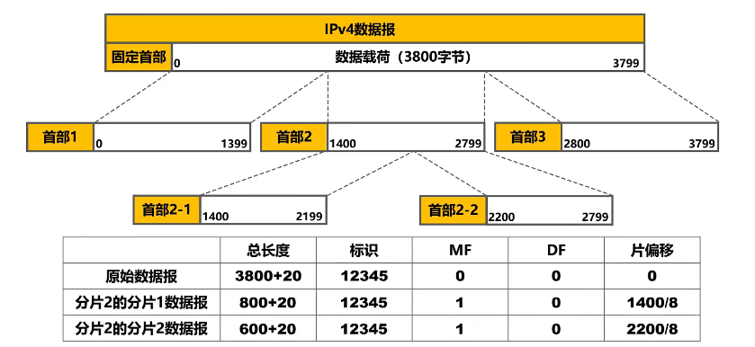  

### 生存时间TTL：
 占8比特，最初以秒为单位，最大生存周期为255秒；路由器转发IP数据报时，将IP数据报首部中的该字段的值减去IP数据报在本路由器上所耗费的时间，若不为0就转发，否则就丢弃
 
 现在以跳数为单位，路由器转发IP数据报时，将IP数据报首部中的该字段的值减1，若不为0就转发，否则就丢弃
 
 作用：防止IP数据报在网络中永久兜圈
   

### 协议：
 占8比特，指明IPv4数据报的数据部分是何种协议数据单元
 常用的一些协议和相应的协议字段值：
 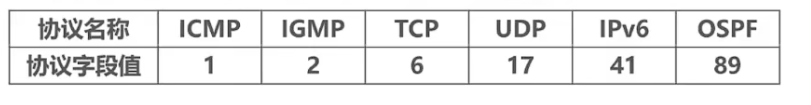  

### 首部检验和：
 占16比特，用来检测首部在传输过程中是否出现差错。比CRC检验码简单，称为因特网检验和
 IP数据报每经过一个路由器都有重新计算首部检验和，因为某些字段（生存时间、标志、片偏移）的取值可能发生变化
 由于IP层本身不提供可靠传输服务，并且计算首部检验和很耗时，因此在IPv6中路由器不再计算首部校验和，从而更快转发IP数据报
### 源IP地址和目的IP地址：
 各占32比特，用来填写发送该IP数据报的源主机的IP地址和接收该IP数据报的目的主机的IP地址

# 网际控制报文协议ICMP要考

# 虚拟专用网VPN与网络地址转换NAT要考
虚拟
