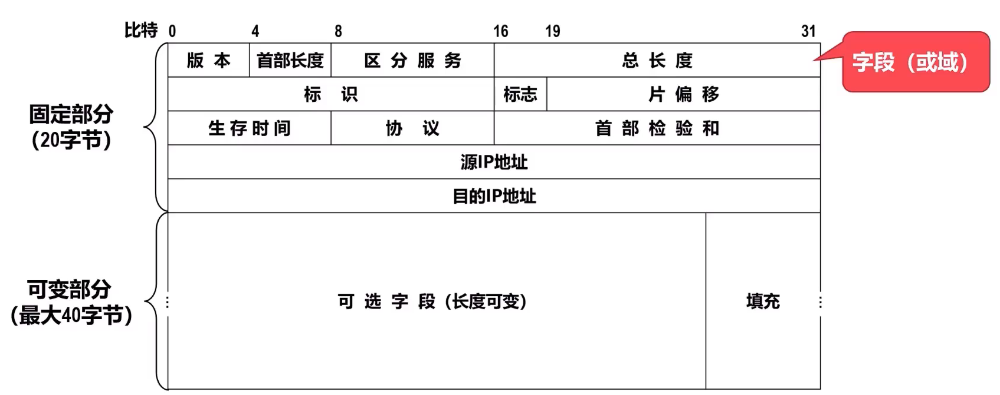
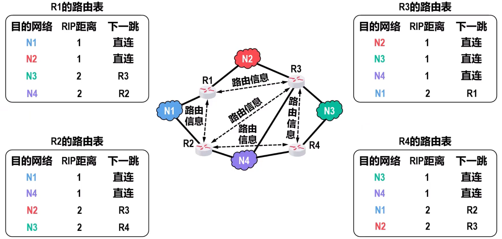
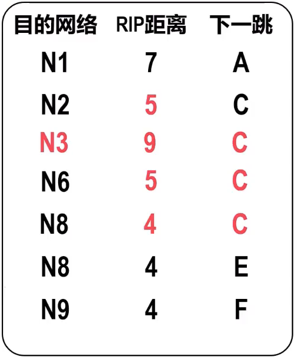
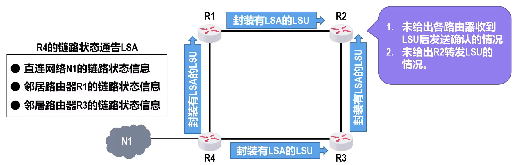
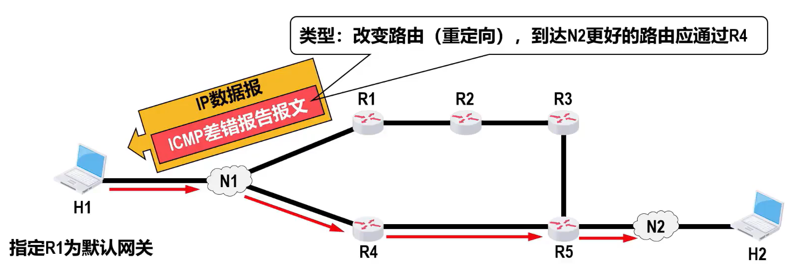
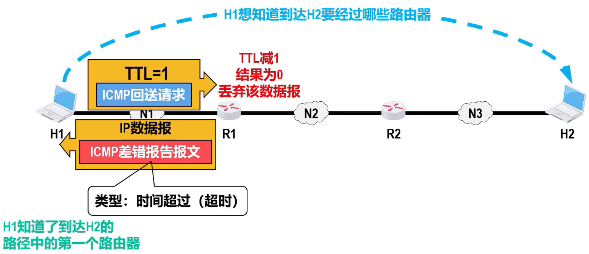

# ( ・ิω・ิ)网络层概述
### 分组转发和路由选择
网络层的主要任务就是**将分组从源主机经过多个网络和多段链路传输到目的主机**，可以将该任务划分为**分组转发**和**路由选择**两种重要的功能   
  

### 向其上层提供的两种服务

##### 面向连接的虚电路服务
- **可靠通信由网络自身来保证**   
- 必须**建立网络层的连接—虚电路VC**（以保证通信双方所需的一切网络资源）  
- 通信双方**沿着已建立的虚电路发送分组**（分组沿着这条逻辑连接按照存储转发方式传送）  
- 虚电路表示这是一条逻辑上的连接分组沿着这条逻辑连接按照存储转发方式传送，而不是真正建立了一条物理连接  
- 而采用电路交换的电话通信，则是先建立一条真正的物理连接。因此分组交换的虚连接与电路交换的连接只是类似，但并不完全一样  

  

- 分组的首部仅在连接建立阶段使用完整的目的主机地址，之后每个**分组的首部只需携带一条虚电路的编号**（构成虚电路的每一条链路都有一个虚电路编号）
 
- 这种通信方式如果再使用可靠传输的网络协议，就可使所发送的分组最终正确到达接收方（无差错按序到达、不丢失、不重复）
 
- **通信结束后需要释放之前所建立的虚电路**
 
- 很多广域分组交换网都使用面向连接的虚电路服务。例如，曾经的X.25和逐渐过时的帧中继FR、异步传输模式ATM等

##### 无连接的数据报服务

- **可靠通信应当由用户主机来保证**  
- **不需要建立网络层连接**  
- **每个分组可走不同的路径**  

<!--    -->
  

- 每个分组的**首部必须携带目的主机的完整地址**  
- 传送的分组**可能误码、丢失、重复、失序**  
- 由于**网络本身不提供端到端的可靠传输服务**，网络中的路由器可以做的比较简单而且价格低廉（与电信网的交换机相比较）  
- 因特网采用了这种设计思想，**将复杂的网络处理功能置于因特网的边缘（用户主机和其内部的运输层）**，而将相对简单的尽最大努力的分组交付功能置于因特网核心  
- 好处：
  - 网络的造价降低
  - 运行方式灵活，能适应多种应用

<!-- 
### 网络层的主要任务
- 实现网络互连
- 进而实现数据包在各网络之间的传输  
 设备：路由器
### 网络层解决的问题
- 向运输层提供怎样的服务  
  可靠或不可靠？  
  TCP/IP是无连接、不可靠的数据报服务  
  ATM、帧中继、X.25是面向连接、可靠的虚电路服务   
    
 
- 寻址问题
  TCP/IP的网际层使用IP地址
  

- 路由选择问题  
用户或网络管理员进行人工配置（规模小，网络拓扑不变，小型互联网）  
实现各种路由选择协议，路由选择算法（大）  
  

- **Internet**是用户最多的互联网，它使用**TCP/IP协议栈**
- TCP/IP协议栈的网络层使用核心协议**网际协议IP**，所以TCP/IP协议栈中网络层常称为**网际层**
  

# 网络层提供的两种服务 `要考`

### 面向连接的虚电路服务
- **可靠通信由网络来保证**
 
- 必须**建立网络层的连接—虚电路VC**（以保证通信双方所需的一切网络资源）
 
- 通信双方**沿着已建立的虚电路发送分组**（分组沿着这条逻辑连接按照存储转发方式传送）

  

- 目的主机的地址仅在连接建立阶段使用，之后每个**分组的首部只需携带一条虚电路的编号**（构成虚电路的每一条链路都有一个虚电路编号）
 
- 这种通信方式如果再使用可靠传输的网络协议，就可使所发送的分组最终正确到达接收方（无差错按序到达、不丢失、不重复）
 
- **通信结束后需要释放之前所建立的虚电路**
 
- 很多广域分组交换网都使用面向连接的虚电路服务。例如，曾经的X.25和逐渐过时的帧中继FR、异步传输模式ATM等

### 无连接的数据报服务

- **可靠通信应当由用户主机来保证**
 
- **不需要建立网络层连接**
 
- **每个分组可走不同的路径**

  

- 每个分组的**首部必须携带目的主机的完整地址**
 
- 传送的分组**可能误码、丢失、重复、失序**
 
- 由于**网络本身不提供端到端的可靠传输服务**，网络中的路由器可以做的比较简单而且价格低廉（与电信网的交换机相比较）
 
- 因特网采用了这种设计思想，**将复杂的网络处理功能置于因特网的边缘（用户主机和其内部的运输层）**，而将相对简单的尽最大努力的分组交付功能置于因特网核心
 
- 好处：
  - 网络的造价降低
  - 运行方式灵活，能适应多种应用 -->

<!-- ### 虚电路服务与数据报服务的比较
   -->

# 网际协议IP

## 异构网络连接
- **网络的异构性**是指传输介质、数据编码方式、链路控制协议及不同的数据单元格式和转发机制，即**物理层与数据链路层**均不同  
- **路由器**要求**物理层、数据链路层、网络层协议不同**，由于路由器无法处理上层数据所以要求上层的协议必须相同   

##  $IPv4$ 
**$IPv4$ 地址**就是给因特网（Internet）上的**每一台主机（或路由器）的每一个接口**分配一个在全世界范围内是**唯一的32比特的标识符**  
- IP地址由因特网名字和数字分配机构ICANN进行分配   
  - 我国用户可向亚太网络信息中心APNIC申请IP地址，需要缴费  
  - 2011年2月3日，互联网号码分配管理局1ANA(由ICANN行使职能)宣布， $IPv4$ 地址已经分配完毕   
  - 我国在2014至2015年也逐步停止了向新用户和应用分配 $IPv4$ 地址。同时全面开展商用部署1Pv6   
- 1PV4地址的编址方法经历了如下三个历史阶段
    

-  $IPv4$ 的表示方法：点分十进制表示方法
  

#### 分类编址的 $IPv4$ 地址 **要考**

**网络号**：
- 标志主机（或路由器）的接口所连接到的网络  
- 同一个网络中，不同主机（或路由器）的接口的Pv4地址的网络号必须相同，表示它们属于同一个网络  

**主机号**：
- 标志主机（或路由器）的接口  
- 同一个网络中，不同主机（或路由器）的接口的PV4地址的主机号必须各不相同，以便区分各主机（或路由器）的接口  

  

**分类**：
  

- 只有A类、B类、C类地址可分配给网络中的主机或路由器的各接口
- **A类网络号0和127**不能分配给主机或路由器的各接口
- **主机号为全0的地址是网络地址**，不能分配给主机或路由器的各接口
- **主机号为全1的地址是广播地址**，不能分配给主机或路由器的各接口

> [!DANGER] 分类
> 0 ~ 127：A类  
> 128 ~ 191：B类  
> 192 ~ 223：C类

> [!DANGER] 私有地址  
> A类：10.0.0.0 ~ 10.255.255.255  
> B类：172.16.0.0 ~ 172.31.255.255  
> C类：192.168.0.0 ~ 192.168.255.255

**A类地址**

  

- 可指派的网络数量为 $2^{8-1}-2=126$ （减去最小网络号0和最大网络号127）  
- 每个网络中可分配是IP地址数量为 $2^{24}-2=16777214$ （减去主机号全为0的网络地址 主机号全为1的广播地址）  
 
**B类地址**
  

- 可指派的网络数量为 $2^{16-2}=16384$ （减去最小网  
- 每个网络中可分配的IP地址数量为 $2^{16}-2=65534$ （减去最小网（减2减去主机号全为0的网络地址和全为1 的广播地址）  
 **C类地址**
  

- 可指派的网络数量为 $2^{24-3}=2097152$  
-  $2^{8}-2=254$（减2减去主机号全为0的网络地址和全为1 的广播地址） 
 
 **D类地址**  
 1110：多播地址
 
 **E类地址**  
 1111：保留以后使用

> [!tip]- 总结
>   

 **特殊地址**  
<!--    -->
  

#### 划分子网的 $IPv4$ 地址

 - 为新增网络申请新的网络号会带来以下弊端  
   - 需要等待时间和花费更多的费用  
   - 会增加其他路由器中路由表记录的数量  
   - 浪费原有网络中剩余的大量IP地址  

**从主机号部分借用一部分作为子网号**
  

- **32比特的子网掩码可以表明分类IP地址的主机号部分被借用了几个比特作为子网号**    
  - 子网掩码使用**连续的比特1来对应网络号和子网号**    
  -  子网掩码使用**连续的比特0来对应主机号**  
  -  将划分子网的** $IPv4$ 地址**与其相对应的**子网掩码**进行**逻辑与运算**就可以得到 $IPv4$ 地址**所在子网的网络地址**  

> [!DANGER]- 例题
> 网络的地址为218.75.230.0，使用子网掩码255.255.255.128进行子网划分
>   
> 网络的地址为218.75.230.0,使用子网掩码255.255.255.192对其进行子网划分
>   

> [!DANGER] 默认的子网掩码  
> A类 : $255.0.0.0 \rightarrow /8$   
> B类 : $255.255.0.0 \rightarrow /16$    
> C类 : $255.255.255.0 \rightarrow /24$

#### 无分类编址的 $IPv4$ 地址
- 划分子网在一定程度上缓解了因特网在发展中遇到的困难，但是**数量巨大的C类网**因为**其地址空间太小**并**没有得到充分使用**，而因特网的1P地址仍在加速消耗，**整个 $IPv4$ 地址空间面临全部耗尽的威胁**  
- 因特网工程任务组ETF又提出了采用**无分类编址**的方法来解决P地址紧张的问题，同时成立IPv6工作组负责研究新版本IP以彻底解决IP地址耗尽问题  
- 1993年，IETF发布了**无分类域间路由选择CIDR**的RFC文档：RFC1517~1519和1520  
	- CIDR**消除了传统的A类、B类和C类地址，以及划分子网的概念**  
	- CIDR**可以更加有效地分配 $IPv4$ 的地址空间**，并且可以在新的1Pv6使用之前允许因特网的规模继续增长  
  

**CIDR**  
CIDR使用“斜线记法”，或称CIDR记法。即在 $IPv4$ 地址后面加上斜  线“/”，在斜线后面写上网络前缀所占的比特数量
> [!EXAMPLE] 128.14.35.7/20  
> 网络前缀占用的比特数量：20  
> 主机编号占用的比特数量：32-20=12  

- 只要知道CDR地址块中的任何一个地址，就可以知道该地址块的全部细节  
  - 地址块的最小地址  
  - 地址块的最大地址  
  - 地址块中的地址数量  
  - 地址块聚合某类网络(A类、B类或C类)的数量  
  - 地址掩码（也可继续称为子网掩码）

<!--    -->

 
**路由聚合**
 
<!--    -->
  

- 网络前缀越长，地址块越小，路由越具体  
- 若路由器查表转发分组时发现有多条路由可选，则选择网络前缀最长的那条，这称为**最长前缀匹配**，因为这样的路由更具体  
 
##  $IPv4$ 地址的应用规划

#### 定长的子网掩码FLSM
- 使用同一个子网掩码划分子网
- 每个子网分配的IP地址数量相同，造成IP地址浪费

> 要求  
>   

> 应用需求：将C类网络218.75.230.0划分成5个子网，每个子网上可分配的1P地址数量不得少于各自的需求
> 
> **从子网1~8中任选5个分配给N1~N5**  

#### 变长的子网掩码VLSM要考要考
- 使用不同的子网掩码划分子网
- 每个子网分配的IP地址数量可以不同，尽可能减少IP地址的浪费

> 要求  
>   

> 应用需求：从地址块218.75.230.0/24中取出5个地址块(1个“/27”地址块，3个“/28”地址块，1个“/30”地址块)，按需分配给的5个网络  
>   

##  $IPv4$ 地址与MAC地址

####  $IPv4$ 地址与MAC地址的封装位置
  

#### 数据包传送过程中Pv4地址与MAC地址的变化情况
在数据包的传送过程中  
- **源P地址和目的P地址保持不变**  
- **源MAC地址和目的MAC地址逐链路（或逐网络）改变**

  

####  $IPv4$ 地址与MAC地址的关系
仅使用MAC地址进行通信，会出现以下主要问题:
- 因特网中的每台路由器的**路由表**中就必须**记录**因特网上**所有主机和路由器各接口的MAC地址**  
- 手工给各路由器配置路由表几乎是不可能完成的任务，即使使用路由协议让路由器通过相互交换路由信息来自动构建路由表，也会因为**路由信息需要包含海量的MC地址信息而严重占用通信资源**  
- **包含海量MC地址的路由信息需要路由器具备极大的存储空间，并且会给分组的查表转发带来非常大的时延**

因特网的网际层使用P地址进行寻址，就可使因特网中各路由器的路由表中的路由记录的数量大大减少，因为只需记录部分网络的网络地址，而不是记录每个网络中各通信设备的各接口的MC地址
- 路由器收到P数据报后，根据其首部中的目的P地址的网络号部分，基于自己的路由表进行查表转发  
- 查表转发的结果可以指明IP数据报的下一跳路由器的P地址，但无法指明该P地址所对应的MAC地址。因此，在数据链路层封装该P数据报成为帧时，帧首部中的目的MAC地址字段就无法写，该问题需要使用网际层中的**地址解析协议ARP**来解决      

## 地址解析协议ARP
**注意事项**  
1. 由于ARP协议的主要用途是从网际层使用的P地址解析出在数据链路层使用的MAC地址。因此，有的教材将ARP协议划归在**网际层**，而有的教材将ARP协议划归在**数据链路层**。这两种做法都是可以的  
2. 除了本节课介绍的ARP请求报文和响应报文，**ARP协议还有其他类型的报文**，例如用于检查P地址冲突的“无故ARP”(Gratuitous ARP)  
3. 由于ARP协议很早就制定出来了(1982年11月)，当时并没有考虑网络安全问题。因此，ARP协没有安全验证机制，存在**ARP欺骗和攻击**等问题  

  
  
  

## IP数据报的发送和转发流程
**忽略**  
- ARP协议获取目的主机或路由器接口的MAC地址的过程  
- 以太网交换机自学习和转发帧的过程   

  

**源主机**如何知道**目的主机**是否和自己在同一个网络中
- **目的主机ip地址**与**源主机子网掩码**相与  
- 若**目的主机网络地址**与**源主机网络地址**不相等则不在同一个网络中   
    

**源主机**如何知道交给**哪个路由器**转发
- 交给默认网关
    

**路由器**收到某个正确的P数据报（首部各字段合法且传输过程中无误码），应该**如何转发**  
- 基于**IP数据报首部中的目IP地址**在路由表中进行查询   
  - 若找到匹配的路由条目，则按该路由条目的指示进行转发   
  - 否则丢弃该P数据报，并向发送该P数据报的源主机发送差错报告  
  
  

路由器不转发广播IP数据报，即**路由器隔离广播域**。如果因特网中数量巨大的路由器收到广播IP数据报后都进行转发，则会造成巨大的广播风暴，严重浪费因特网资源  
  

##  $IPv4$ 数据报的首部格式
-  $IPv4$ 数据报的首部格式及其内容是实现 $IPv4$ 协议各种功能的基础   
- 在 $TCP/IP$ 标准中，各种数据格式常常以32比特(即4字节)为单位来描述  
- 固定部分是指每个 $IPv4$ 数据报都必须要包含的部分  
- 某些 $IPv4$ 数据报的首部，除了包含20字节的固定部分，还包含一些可选的字段来增加Pv4数据报的功能 
-  $IPv4$ 数据报首部中的各字段或某些字段的组合，用来表达Pv4协议的相关功能

  

- **版本**  
  - 占4比特，表示IP协议的版本  
  - 通信双方使用的IP协议的版本必须一直，目前广泛使用的IP协议版本号为4（ $IPv4$ ）
- **首部长度**    
  - 占4比特，取值**以4字节为单位**，表示IP数据报首部的长度  
  - **最小取值**为二进制的`0101`，即十进制的5，再乘以4字节单位，**表示 $IPv4$ 数据报首部只有20字节固定部分**  
  - **最大取值**为二进制的`1111`，即十进制的15，**表示 $IPv4$ 数据报包含20字节固定部分和最大40字节可变部分**  

- **可选字段**    
  - 长度从1字节到40字节不等。用来支持排错、测量及安全等措施。
  - 可选字段增加了IP数据报的功能，但这同时使IP数据报的首部长度变成可变的，这增加了每一个路由器处理IP数据报的开销  
  - 实际上可选字段很少使用
- **填充字段**  
  - **确保首部长度为4字节的整数倍**，使用全0进行填充  
  - 当首部长度(20字节固定部分+可变部分)的长度不是4字节整数倍时，填充相应数量的全0字节以确保Pv4数据报的首部长度是4字节的整数倍
- **区分服务**  
  - 占8比特，用来获取更好的服务  
  - 该字段在旧标准中叫作服务类型，但实际上一直没有被使用过  
  - 1998年，因特网工程任务组IETF把这个字段改名为区分服务  
  - 利用该字段的不同数值可提供不同等级的服务质量  
  - 只有在使用区分服务时，该字段才起作用，一般情况不使用  
- **总长度**  
  - 长度为16个比特，该字段的取值**以字节为单位**，用来表示**IPV4数据报的长度(首部长度+数据载荷长度)**  
  - 最大取值为十进制的65535，以字节为单位（实际应用很少传输这么长的IP数据报）
        

  <!-- - 首部长度=首部长度×4（字节）
  - 总长度=总长度（字节）
  - 数据载荷=总长度—首部长度
  - 用于IP数据报分片： 以太网规定最大传输单元MTU值为1500字节，在封装成帧时：当IP数据报长度超过MTU时，无法封装，需要进行分片，再将个分片IP数据报封装成帧 -->

**IPv4数据报分片**  
- 标识、标志、片偏移共同用于IPv4数据报分片
  
- **标识**  
  - 长度为16比特，属于同一个数据报的**各分片数据报应该具有相同的标识**  
  - IP软件维持一个计数器，每产生一个数据报，计数器值加1，并将此值赋给标识字段
- **标志**  
  - 占3比特  
  - DF位  
    - 1→**不允许**分片   
    - 0→**允许**分片  
  - MF位    
    - 1→**后面还有分片**    
    - 0→这是**最后一个分片**  
  - 最高位
    - 保留位→必须为0  
- **片偏移**    
（必须是整数）
  - 长度为13比特，**以8个字节为单位**，指出分片数据报的**数据载荷部分偏移起在原 $IPv4$ 数据报的位置有多少个单位**

**对 $IPv4$ 数据报进行分片**  
> 某个IPV4数据报总长度为3820字节，采用20字节固定首部，根据数据链路层要求，需要将该IPV4数据报分片为长度不超过1420字节的数据报片  

  

 

分片2的IP数据报在经过某个网络时还需要再进行分片：
  

- **生存时间TTL**  
  - 长度为8个比特，最大取值为二进制的`11111111`，即十进制的255。该字段的取值最初以秒为单位。因此，Pv4数据报的最大生存时间最初为255秒。路由器转发PV4数据报时，将其首部中该字段的值减去该数据报在路由器上所耗费的时间，若结果不为0就转发，否则就丢弃
  - 生存时间字段后来改为以**跳数**为单位，**路由器转发IP数据报时，将IP数据报首部中的该字段的值减1，若不为0就转发，否则就丢弃**
  - 作用：**防止被错误路由的PV4数据报无限制地在因特网中兜圈**
      

- **协议**  
  - 长度为8比特，指明 $IPv4$ 数据报的数据部分是何种协议数据单元 $PDU$  
     
    
  - 常用的一些协议和相应的协议字段值  
      

- **首部检验和**  
  - 长度为16比特，用来检测首部在传输过程中**是否出现差错**   
  - IP数据报每经过一个路由器都要**重新计算首部检验和**，因为某些字段（生存时间、标志、片偏移）的取值可能发生变化  
  - 发送
      
  - 接收
      
  - 上述检验和的计算方法不仅用于IP协议，还用于运输层的用户数据报协议`UDP`和传输控制协议`TCP`,常被称为**因特网检验和**。这种检验和的检错性能虽然不如CRC,但更易用软件实现
  - 由于IP层本身不提供可靠传输服务，并且计算首部检验和很耗时，因此在IPv6中路由器不再计算首部校验和，从而更快转发IP数据报  
- **源IP地址和目的IP地址**  
  - 各占32比特，用来填写发送该IP数据报的源主机的IP地址和接收该IP数据报的目的主机的IP地址

# 静态路由配置
- 静态路由配置是指用户或网络运维人员使用路由器的相关命令给路由器**人工配置路由表**    
- 人工配置方式**简单、开销小**、但**不能及时适应网络状态(流量、拓扑等)的变化**，一般只在小规模网络中采用   

  

#### 默认路由
- 默认路由条目中的目的网络`0.0.0.0/0`，其中`0.0.0.0`表示任意网络，而网络前缀"`/0`"(相应的地址掩码为`0.0.0.0`)是最短的网络前缀  
- 路由器在查找转发表转发IP数据报时，遵循“最长前缀匹配”的原则，因此**默认路由条目的匹配优先级最低**  

  

#### 特定主机路由
- 特定主机路由条目中的目的网络`192.168.2.1/32`，其中`192.168.2.1`是特定主机的1P地址，而网络前缀“`/32`”(相应地址掩码为`255.255.255.255`)是最长的网络前缀
- 路由器在查找转发表转发P数据报时，遵循“最长前缀匹配”的原则，因此**特定主机路由条目的匹配优先级最高**

  

#### 可能出现的问题
- 路由条目配置错误，甚至导致出现路由环路  
- 聚合路由条目时可能引入不存在的网络  

# 路由选择协议  要考
## 路由选择分类
#### 静态路由选择
- 采用人工配置的方式给路由器添加网络路由、默认路由和特定主机路由等路由条目  
- 静态路由选择简单、开销小，但不能及时适应网络状态(流量、拓扑等)的变化  
- 静态路由选择一般只在小规模网络中采用  
#### 动态路由选择
- 路由器通过路由选择协议自动获取路由信息  
- 动态路由选择比较复杂、开销比较大，但能较好地适应网络状态的变化  
- 动态路由选择适用于大规模网络  
## 因特网采用分层次的路由选择协议
**特点**
- **自适应**  
因特网采用**动态路由**选择，能较好地适应网络状态的变化  
- **分布式**  
因特网中的**各路由器**通过相互间的信息交互，**共同完成路由信息的获取和更新**  
- **分层次**  
将整个因特网划分为许多较小的**自治系统**(**A**utonomous **S**ystem,**AS**)  
在自治系统内部和外部采用不同类别的路由选择协议，分别进行路由选择  

  

- 外部网关协议EGP和内部网关协议IGP只是路由选择协议的分类名称，而不是具体的路由选择协议
- 外部网关协议和内部网关协议名称中使用的是“网关”这个名词，是因为在因特网早期的RFC文中没有使用“路由器”而使用的是“网关”这一名词
## 路由信息协议RIP的基本工作原理 要考
#### 路由信息协议RIP的相关基本概念

- **路由信息协议RIP**是内部网关协议IGP中最小广泛使用的协议之一
- RIP要求自治系统AS内每个路由器都要维护他自己到AS内其他每一个网络记录。这是一组距离，称为**距离向量D-V**
- RIP使用跳数作为度量来衡量到达目的网络的距离
  - 路由器到直连网络的距离定义为1
  - 路由器到非直连网络的距离定义为所经过的路由器数加1
  - 允许一条路径最多包含15个
  - ‘距离‘等于16时相当于不可达，因此RIP只适用于小型互联网

  

> 思科：路由器到直连网络的距离定义为0

- RIP认为好的路由就是'距离短'的路由，也就是所**通过路由器数量最少**的路由
 
   

RIP认为R1到R5的好路由是R1->R4->R5

当到达同一目的地网络有多条“距离相等”的路由器时，可以进行等价负载均衡
  

RIP包含以下三个要点  
- **和谁交换信息**  
  仅和**相邻路由器**交换信息  
- **交换什么信息**  
  自己的**路由表**  
  即本路由器到所在自治系统AS中各网络的最短RP距离，以及到各网络应经过的下一跳路由器  
- **何时交换信息**  
  **周期性交换**（每30秒）  
  为了加快RP的收敛速度，当网络拓扑发生变化时，路由器要及时向相邻路由器通告拓扑变化后的路由信息，这称为**触发更新**  

#### RIP的基本工作过程 
 1. 路由器刚开始工作时，**只知道**自己**直连网络的距离为1**
 2. 每个路由器仅和**相邻路由器周期性地交换**并**更新路由信息**
 3. 若干次交换和更新后，每个路由器都知道**到达本AS（自治网络）内各网络的最短距离**和**下一跳地址**，称为收敛

  

#### RIP的距离向量算法
  

**更新理由：**  
- 到达目的网络，**相同的下一跳**，**最新消息**，要更新    
- 发现了新的网络，添加  
- 到达目的网络，**不同的下一跳，新路由优势**，要更新  
- 到达目的网络，**不同的下一跳**，RIP距离相等，**可以等价负载均衡**，添加

**不更新理由：** 
- 到达目的网络，**不同的下一跳，新路由劣势**，不更新

> [!cite]- D中路由表  
>   
>   
<!--    -->
**时间参数**  
- 路由器每隔**大约30秒**向其所有相邻路由器发送路由更新报文  
- 若**180秒**（默认）没有收到某条路由条目的更新报文，则把该路由条目标记为无效（即把P距离设置为16，表示不可达），若再过一段时间(如120秒)，还没有收到该路由条目的更新报文，则将该路由条目从路由表中删除  

#### RIP存在的问题

**坏消息传播得慢**  
  

 又称为**路由环路**或**距离无穷计数**。这是距离向量算法的一个固有问题

**解决措施**  
- 限制**最大路径距离为15**（16表示不可达）  
- 当路由表发生变化时就立即发送更新报文（**触发更新**），而不是周期性发送  
- 让路由器记录收到  某特定路由信息的接口  ，而不让同一路由信息  再  通过此接口方向  反方向传送（**水平分割**）

> 使用上述措施仍无法彻底解决问题。因为在距离向量算法中，每个路由器都缺少到目的网络整个路径的完整信息，无法判断所选的路由是否出现了环路

#### RIP版本和相关报文的封装
- 现在较新的RIP版本是1998年11月公布的**RIP2**[RFC2453],已经成为因特网标准协议。与RIP1相比，RIP2可以支持变**长子网掩码和CIDR**。另外，RIP2还提供**简单的鉴别**过程并支持**多播**  
- RIP相关报文使用运输层的用户数据报协议UDP进行封装，使用的**UDP端口号为520**   
	- 从**RIP报文封装**的角度看，RIP属于TCP/IP体系结构的**应用层**  
	- 但RIP的核心功能是**路由选择**，这属于TCP/IP体系结构的**网际层**  

#### RIP的优缺点
**优点**  
- 实现**简单**，路由器开销小  
- 如果一个路由器发现了RP距离更短的路由，那么这种更新信息就传播得很快，即“**好消息传播得快**”  

**缺点**    
- RIP限制了**最大RIP距离为15**，这就限制了使用RIP的自治系统AS的规模  
- 相邻路由器之间交换的路由信息是路由器中的**完整路由表**，因而随着网络规模的扩大，开销也随之增大  
- “坏消息传播得**慢**”，使更新过程的收敛时间过长。因此，对于规模较大的自治系统AS,应当使用 $OSPF$ 协议  

## 开放最短路径优先 $OSPF$    要考
####  $OSPF$ 的相关基本概念
- 开放最短路径优先(Open Shortest Path First, $OSPF$ )协议是为了**克服路由信息协议RIP的缺点**在1989年开发出来的  
  - “**开放**”表明0SPF协议不是受某一厂商控制，而是**公开发表**的  
  - “**最短路径优先**”是因为使用了Dijkstra提出的**最短路径算法**(Shortest Path First,SPF)  
  
- “开放最短路径优先”只是一个路由选择协议的名称，但这**并不表示其他的路由选择协议不是“最短路径优先”**。实际上，用于自治系统AS内部的各种路由选择协议(例如IP),都要寻找一条“最短”的路径  
-  $OSPF$ 是基于**链路状态**的，而不像RIP是基于距离向量的  
-  $OSPF$ 基于链路状态并采用最短路径算法计算路由，从算法上保证了**不会产生路由环路**  
- ** $OSPF$ 不限制网络规模，更新效率高，收敛速度快**  

**链路状态**(Link State,**LS**)  
- 本路由器都和哪些路由器相邻，以及相应链路的“代价(cos)”  
- “代价”用来表示费用、距离、时延和带宽等，这些都由网络管理人员来决定  
  - 思科路由器中 $OSPF$ 协议计算代价的方法是：100Mb/s除以链路带宽  
  - 计算结果小于1的值仍记为1，大于1且有小数的，舍去小数  
  

** $OSPF$ 路由器邻居关系的建立和维护**
-  $OSPF$ 相邻路由器之间通过交互**问候(Hello)分组**来建立和维护邻居关系  
- 问候(Helo)分组封装在**IP数据报**中，发往**组播地址224.0.0.5**，IP数据报首部中的协议号字段的取值为**89**，表明IP数据报的数据载荷为 $OSPF$ 分组    

> [!danger]  $OSPF$ 分组直接使用网际层的IP数据报进行封装，而不像RIP报文需要使用运输层用户数据报协议UDP封装。从数据包按网络体系结构逐层封装的角度看， $OSPF$ 属于网际层协议，而RP属于应用层协议（但其核心功能是路由选择，属于网际层）

- 问候(Hello)分组的**发送周期为10秒**  
- 若**40秒**未收到来自邻居路由器的问候(Hello)分组，则认为邻居路由器不可达  
- 每个路由器都会建立一张**邻居表**  

  

**链路状态通告**
- 使用 $OSPF$ 的每个路由器都会产生链路状态通告(Link State Advertisement,.LSA)  
- LSA中包含以下两类链路状态信息  
  - 直连网络的链路状态信息  
  - 邻居路由器的链路状态信息  
  

**链路状态更新分组**
- 链路状态通告LSA被封装在**链路状态更新**(Link State Update,LSU)分组中，采用可靠的洪泛法(Flooding)进行发送  
- 洪泛法的要点是路由器**向自己所有的邻居路由器发送链路状态更新分组**，收到该分组的各路由器又将该分组转发给自己所有的邻居路由器（但其上游路由器除外），以此类推  
- 可靠是指收到链路状态更新分组后要发送确认，**收到重复的更新分组无需再次转发**，但要发送一次确认  
  

**链路状态数据库**
- 使用0SPF的每一个路由器都有一个**链路状态数据库**(Link State Database,LSDB),用于**存储链路状态通告LSA**  
- **通过各路由器洪泛发送封装有各自链路状态通告LS的链路状态更新分组LSU,各路由器的链路状态数据库LSDB最终将达到一致**  
  

**基于链路状态数据库进行最短路径优先计算**
使用0SPF的各路由器，**基于链路状态数据库L$DB进行最短路径优先计算**，构建出各自到达其他各路由器的最短路径，即**构建各自的路由表**  
  

####  $OSPF$ 的五种分组类型
  

####  $OSPF$ 的基本工作过程
  

#### 多点接入网络中的 $OSPF$ 路由器
  

- 为了减**少所发送问候分组和链路状态更新分组的数量**， $OSPF$ 采用以下措施  
  - 选举**指定路由器** $(Designated Router,DR)$ 和**备用的指定路由器** $(Backup Designated Router,BDR)$    
  - **所有的非DR/BDR只与DR/BDR建立邻居关系**    
  - **非DR/BDR之间通过DR/BDR交换信息**   

  

####  $OSPF$ 划分区域
为了使 $OSPF$ 协议能够**用于规模很大的网络**， $OSPF$ **把一个自治系统AS再划分为若干个更小的范围**，称为**区域**(area)  

  
划分区域的好处就是把利用洪泛法交换涟路状态信息的范围局限于每一个区域，而不是整个自治系统AS,这样就减少了整个网络上的通信量  

- 自治系统边界路由器 $(AS Border Router,ASBR)$ :R6 $\Rightarrow$ 至其他自治系统  
- 区域内路由器 $(Internal Router,IR)$ :区域1内的R1和R2,区域2内的R8区域3内的R9  
- 区域边界路由器 $(Area Border Router,ABR)$ :R3、R4和R7  

采用划分区域的方法，虽然使交换信息的种类增多了，同时也使 $OSPF$ 协议更加复杂了，但这样做能使每一个区域内部交换路由信息的通信量大大减小，因而使 $OSPF$ 协议能够用于规模更大的自治系统AS  

## 边界网关协议BGP  要考
#### BGP的相关基本概念
- 边界网关协议 $(Border Gateway Protocol,BGP)$ 属于外部网关协议EGP这个类别，用于**自治系统AS之间的路由选择协议**  
- 由于在不同AS内度量路由的“代价”(距离、带宽、费用等)可能不同，因此**对于AS之间的路由选择，使用统一的“代价”作为度量来寻找最佳路由是不行的**  
- AS之间的路由选择还必须考虑相关**策略**(政治、经济、安全等)

> [!tip] tip
> 自治系统之间的路由选择协议应当允许使用多种路由选择策略。这些策略包括政治、经济、安全等，它们都是由网络管理人员对每一个路由器进行设置的。但这些策略并不是自治系统之间的路由选择协议本身  
>
> BGP只能是力求寻找一条能够到达目的网络且比较好的路由（即不能兜圈子），而并非要寻找一条最佳路由  

- 在配置BGP时，每个AS的管理员要选择至少一个路由器作为该AS的“**BGP发言人**”  
- 一般来说，两个BGP发言人都是通过一个共享网络连接在一起的，而BGP发言人往往就是**BGP边界路由器**  
- 使用TCP连接交换路由信息的两个BGP发言人，彼此称为对方的**邻站**(neighbor)或**对等站**(peer)  
- BGP发言人除了运行BGP协议外，还必须运行自己所在AS所使用的内部网关协议IGP,例如RIP或OSPF  
- BGP发言人交换网络可达性的信息，也就是**要到达某个网络所要经过的一系列自治系统**

  

当BGP发言人相互交换了网络可达性的信息后，各BGP发言人就**根据**所采用的**策略**，从收到的路由信息中**找出到达各自治系统的较好的路由**，也就是构造出树形结构且**不存在环路的自治系统连通图**  
    

**BGP适用于多级结构的因特网**
  

#### BGP-4的四种报文
  

## 路由器的基本工作原理
**路由器**是一种具有多个输入端口和输出端口的**专用计算机**，其任务是**转发分组**  
   

- 路由表一般仅包含从目的网络到下一跳的映射
- **路由表需要对网络拓扑变化的计算最优化**  
- 转发表是从路由表得出的  
- **转发表的结构应当使查找过程最优化**  

交换结构的速率对于路由器的性能是至关重要的。因此，人们对交换结构进行了大量研究，以提高路由器的转发速率  
实现交换结构的三种基本方式是：通过**存储器**、通过**总线**以及通过**互连网络**。这三种交换结构可实现的路由器转发速率依次提高   

# 网际控制报文协议ICMP 要考

## 网际控制报文协议ICMP概述
- 为了更有效地转发P数据报以及提高P数据报交付成功的机会，TCPP体系结构的网际层使用了网际控制报文协议 $(Internet Control Message Protocol,ICMP)$ `[RFC792]`  
- 主机或路由器使用ICMP来发送差错报告报文和询问报文  
- ICMP报文被封装在IP数据报中发送  
  

## ICMP报文种类
#### 差错报告报文  
> 用来向主机或路由器报告差错情况 

**常见的ICMP差错报告报文有以下五种**
- **终点不可达**  
  - **当路由器或主机不能交付P数据报时，就向源点发送终点不可达报文**。具体可再根据ICMP的代码字段细分为目的网络不可达、目的主机不可达、目的协议不可达、目的端口不可达、目的网络未知、目的主机未知等13种  
  > [!cite]- 图示
  >   

- **源点抑制**
  - **当路由器或主机由于拥塞而丢弃IP数据报时，就向发送该P数据报的源点发送源点抑制报文**，使源点知道应当把IP数据报的发送速率放慢  
  > [!cite]- 图示
  >   

- 时间超过 **（超时）**  
  - 当路由器收到一个目的P地址不是自己的P数据报时，会将其首部中**生存时间TTL字段的值减1**。若结果不为0，则路由器将该数据报转发出去；**若结果为0，路由器不但要丢弃该数据报，还要向发送该P数据报的源点发送时间超过（超时）报文**  
  > [!cite]- 图示
  >   
 
  - **当终点在预先规定的时间内未能收到一个数据报的全部数据报分片时，就把已收到的数据报片都丢弃，也会向源点发送时间超过（超时）报文**  
- **参数问题**  
  - 当路由器或目的主机收到P数据报后发现其首部中有不正确的字段值时，就丢弃该数据报，并向发送该数据报的源点发送参数问题报文  
- 改变路由 **（重定向）**  
  - 路由器把改变路由报文发送给主机，让主机知道下次应将P数据报发送给另外的路由器，这样可以通过更好的路由到达目的主机  
  > [!cite]- 图示
  >   

以下情况**不应发送ICMP差错报告报文：**  
- 对ICMP差错报告报文不再发送ICMP差错报告报文    
- 对第一个分片的P数据报片的所有后续数据报片都不发送ICMP差错报告报文    
- 对具有多播地址的IP数据报都不发送ICMP差错报告报文    
- 对具有特殊地址(例如127.0.0.0或0.0.0.0)的IP数据报不发送ICMP差错报告报文  

#### 询问报文  
> 用来向主机或路由器询问情况  

**回送请求和回答**  

由主机或路由器向一个特定的目的主机或路由器发出  
收到此报文的主机或路由器必须给发送该报文的源主机或路由器发送ICMP回送回答报文  
这种询问报文**用来测试目的站是否可达以及了解其有关状态**  

**时间戳请求和回答**  

用来请求某个主机或路由器回答当前的日期和时间  
在CMP时间戳回答报文中有一个32比特的字段，其中写入的整数代表从1900年1月1日起到当前时刻一共有多少秒  
这种询问报文**用来进行时钟同步和测量时间**  

## ICMP的典型应用
**分组网间探测**
> (**P**acket **I**nter**N**et **G**roper,**PING**)

- 分组网间探测PING用来**测试主机回或路由器之间的连通性**   
  - PING是TCP/IP体系结构的**应用层直接使用网际层ICMP**的一个例子，它并不使用运输层的TCP或UDP   
  - PING应用所**使用的ICMP报文类型为回送请求和回答**  

**跟踪路由**
> (traceroute)

- 跟踪路由应用traceroute,用于**探测IP数据报从源主机到达目的主机要经过哪些路由器**
- 在不同操作系统中，traceroutel应用的命令和实现机制有所不同：  
  - 在**UNIX**版本中，具体命令为“**traceroute**”，其在运输层使用**UDP协议**，在网络层使用**ICMP报文类型只有差错报告报文**  
  - 在**Windows**版本中，具体命令为“**tracert**”，其**应用层直接使用网际层的ICMP协议**，所使用的**ICMP报文类型有回送请求和回答报文以及差错报告报文**  

第一个路由器TTL=1，第二个TTL=2 ... 以此类推  
直到：
  

# 虚拟专用网VPN与网络地址转换NAT 要考
## 虚拟专用网
> (**V**irtual **P**rivate **N**etwork,**VPN**)

- **利用公用的因特网**作为本机构各专用网之间的通信载体，这样形成的网络又称为虚拟专用网  
  
- 给专用网内各主机配置的P地址应该是该**专用网所在机构可以自行分配的IP地址**，这类IP地址仅在机构内
部有效，称为**专用地址**(Private Address),不需要向因特网的管理机构申请。
- `[RFC 1918]` 规定了以下三个CIDR地址块中的地址作为专用地址：
  - $10.0.0.0\sim 10.255.255.255$ (CIDR地址块$10/8$)  
  - $172.16.0.0\sim 172.31.255.255$ (CIDR地址块$172.16/12$)  
  - $192.168.0.0\sim 192.168.255.255$ (CIDR地址块$192.168/16$)  
  - 很显然，全世界可能有**很多不同机构的专用网具有相同的专用IP地址**，但这并不会引起麻烦，因为这些专用地址仅在机构内部使用  
- **因特网中的所有路由器，对目的地址是专用地址的IP数据报一律不进行转发，这需要由因特网服务提供者ISP对其拥有的因特网路由器进行设置来实现**

在R1和R2上进行相应的VPN配置
  
- 虽然两个专用网内的主机间发送的数据报是通过公用的因特网传送的，但从效果上就好像是本机构的专用网上传送一样，这也是虚拟专用网中“虚拟”的含义  
- IP数据报在因特网中可能要经过多个网络和路由器，但从逻辑上看，路由器R1和R2之间好像是一条直通的点对点链路，因此也被称为**IP隧道技术**  
- 同一机构内不同部门的内部网络所构成的VPN,又称为**内联网VPN**  
- 有时，一个机构的虚拟专用网VPN需要某些外部机构（通常是合作伙伴）参加进来，这样的VPN就称为**外联网VPN**  
- 在外地工作的员工需要访问公司内部的专用网时，只要在任何地点接入因特网，运行驻留在员工PC中的VPN软件，在员工的PC和公司的主机之间建立VPN隧道，就可以访问专用网中的资源，这种虚拟专用网又称为**远程接入VPN**

## 网络地址转换
- 尽管因特网采用了无分类编址方法来减缓PV4地址空间耗尽的速度，但由于**因特网用户数量的急剧增长**，特别是**大量小型办公室**和**家庭网络**接入因特网的需求不断增加，**IPV4地址空间即将耗尽的危险仍然没有解除**(实际上，因特网号码分配管理局引ANN于2011年2月3日宣布，IPV4地址已经分配完毕)  
- **网络地址转换**(**N**etwork **A**ddress **T**ranslation,**NAT**)技术于1994年被提出，用来缓解IPv4地址空间即将耗尽的问题  
  - NAT能使**大量使用内部专用地址的专用网络用户共享少量外部全球地址来访问因特网上的主机和资源**  
  - 这种方法需要在专用网络连接到因特网的路由器上**安装NAT软件**。装有NAT软件的路由器称为NAT路由器，它**至少要有一个有效的外部全球地址** $IP_G$ 。这样，所有使用内部专用地址的主机在和外部因特网通信时，都要**在NAT路由器上将其内部专用地址转换成** $IP_G$

#### 最基本的NAT方法
$IPG$**：临时全球地址**  
发送：
  
接收：
  

#### 网络地址与端口号转换方法
- 由于目前绝大多数基于TCPP协议栈的网络应用，都使用运输层的传输控制协议TCP或用户数据报协议UDP,为了**更加有效地利用NAT路由器中的全球IP地址**，现在常将NAT转换和运输层端口号结合使用  
  - 这样就可以使内部专用网中使用专用地址的**大量主机，共用NAT路由器上的1个全球IP地址**，因而可以同时与因特网中的不同主机进行通信  
- 将NAT和运输层端口号结合使用，称为**网络地址与端口号转换**（Network Address and Port Translation,NAPT）  
  - 现在很多家用路由器将家中各种智能设备(手机、平板、笔记本电脑、台式电脑、物联网设备等)接入因特网，这种路由器实际上就是一个**NAPT路由器**，但往往并不运行路由选择协议

发送：
  
接收：
  

- 尽管NAT(和NAPT)的出现在很大程度上缓解了IPv4地址资源紧张的局面，但**NAT(和NAPT)对网络应用并不完全透明**，会对某些网络应用产生影响    
- NAT(和NAPT)的一个重要特点就是**通信必须由专用网内部发起，因此拥有内部专用地址的主机不能直接充当因特网中的服务器**     
- 对于目前P2P这类需要外网主机主动与内网主机进行通信的网络应用，在通过NAT时会遇到问题，需要网络应用自身使用一些特殊的**NAT穿透技术**来解决   

# 多播技术
## 在局域网上进行硬件多播
- **多播**(Multicast,也称为组播)是一种实现“**一对多**”通信的技术，与传统单播“一对一”通信相比，多播可以**极大地节省网络资源**   
- 在**因特网上进行的多播**，称为**IP多播**     

- 当多播组的成员数量很大时，采用多播方式可以显著地减少网络中各种资源的消耗  

## 在因特网上进行引 IP 多播需要的两种协议

## 网际组管理协议 IGMP

## 多播路由选择协议

# 移动 IP 技术

# IPv6

## IPv6 引进的主要变化

## IPv6 数据报的基本首部和扩展首部

## IPv6 地址

## 从 IPv4 向 IPv6 过渡

## 网际控制报文协议 ICMPv6

# 软件定义网络 SDN