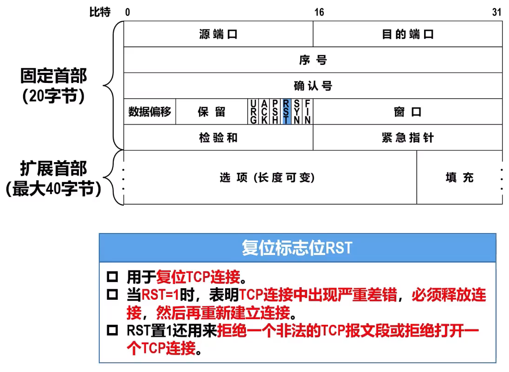

# (o゜▽゜)o概述
## 进程间基于网络的通信
- 计算机网络体系结构中的物理层、数据链路层和网络层，它们共同解决了将主机通过异构网络互联起来所面临的问题，实现了**主机到主机的通信**  
- 然而在计算机网络中实际进行**通信的真正实体，是位于通信两端主机中的进程**  
- 如何**为运行在不同主机上的应用进程提供直接的逻辑通信服务**，就是**运输层的主要任务**。运输层协议又称为端到端协议   

  

- 运输层向应用层实体屏薇了下面网络核心的细节(例如网络拓扑、所采用的路由选择协议等)，它使应用进程看见的就**好像是在两个运输层实体之间有一条端到端的逻辑通信信道**   
- 根据应用需求的不同，**因特网的运输层**为应用层提供了两种不同的运输层协议，即**面向连接的TCP和无连接的UDP**,这两种协议就是本章要讨论的主要内容  

## TCP/IP体系结构运输层中的两个重要协议
  
#### TCP
- **传输控制协议**(**T**ransmission **C**ontrol **P**rotocol,**TCP**)为其上层提供的是**面向连接**的**可靠**的数据传输服务  
- 使用TCP通信的双方，在传送数据之前**必须首先建立TCP连接**(逻辑连接，而非物理连接)数据传输结束后**必须要释放TCP连接**  
- TCP为了实现可靠传输，就必须使用很多措施，例如**TCP连接管理、确认机制、超时重传、流量控制**以及**拥塞控制**等  
- TCP的**实现复杂**，TCP报文段的**首部比较大，占用处理机资源比较多**

#### UDP
- **用户数据报协议**(**U**ser **D**atagram **P**rotocol,**UDP**)为其上层提供的是**无连接**的**不可靠**的数据传输服务  
- 使用UDP通信的双方，在传送数据之前**不需要建立连接**   
- UDP不需要实现可靠传输，因此**不需要使用实现可靠传输的各种机制**   
- UDP的**实现简单**，UDP用户数据报的**首部比较小**

> [! cite]- 因特网中的一些典型应用所使用的TCP/IP应用层协议和相应的运输层协议
>   

## 运输层端口、复用与分用
#### 运输层端口号
- 运行在计算机上的进程是使用**进程标识符**(**P**rocess **Id**entification,**PID**)来标识的  
  - 然而，因特网上的计算机并不是使用统一的操作系统，而**不同操作系统**(Windows、Linux、MacOS)又**使用不同格式的进程标识符**  
  - 为了使运行不同操作系统的计算机的应用进程之间能够基于网络进行通信，就必须**使用统一的方法对TCP/IP体系的应用进程进行标识**  
- TCP/IP体系结构的运输层使用**端口号**来标识和区分应用层的不同应用进程。端口号的**长度为16比特，取值范围是0~65535**

  
端口号只具有本地意义，即端口号只是为了标识本计算机网络协议栈应用层中的各应用进程。在因特网中不同计算机中的相同端口号是没有关系的，即相互独立。另外，TCP和UDP端口号之间也是没有关系的 

#### 发送方的复用和接收方的分用
  

  

#### 运输层端口号应用举例
  
> [! cite]- 说明：   
> 1.对于本应用实例，应将重点放在端口号、TCP/IP应用层常用协议所使用的运输层协议(UDP和TCP)和熟知端口号上   
> 2.为了简单起见，在本应用实例中省略了很多相关过程。例如，之前曾介绍过的地址解析协议ARP,以及后续将介绍的TCP连接管理、相关应用层协议的工作原理等  

  
  

# TCP和UDP的对比
#### 无连接的UDP和面向连接的TCP
> “连接”指逻辑连接关系，而不是物理连接

  

#### UDP和TCP对单播、多播和广播的支持情况
  

#### UDP和TCP对应用层报文的处理
  

#### UDP和TCP对数据传输可靠性的支持情况
  

#### UDP首部和TCP首部的对比
  

#### 对比
- **TCP**  
  - 无连接  
  - 支持“一对一”、“一对多”、“多对一”和“多对多”交互通信  
  - 面向应用报文  
  - 尽最大努力交付，即不可靠；不使用流量控制和拥塞控制  
  - 首部开销小，仅8字节  
- **UDP**
  - 面向连接  
  - 每一条TCP连接只能有两个端点EP，只能是一对一通信  
  - 面向字节流  
  - 可靠传输，使用流量控制和拥塞控制   
  - 首部最小20字节，最大60字节

# TCP
## TCP报文首部格式
  

> [! tip]- 序号和确认号实例：   
>   

  

  

  
> [! tip]- 检验和实例：   
>   
> - 接收方通过检验和字段的值判断TCP报文段在传输过程中是否误码的方法  
>   1. 给接收到的TCP报文段前面添加一个12字节的伪首部  
>   2. 将伪首部、TCP首部以及数据载荷这三部分划分成若干个2字节的字  
>   3. 对划分出的全部2字节的字进行反码算数运算求和，并将求和结果取反码  
>   4. 若步骤③得到的结果为0，则表示TCP报文段在传输过程中没有误码。否则，表示出现了误码。

  
  
  
  
  
  
  

## TCP运输层管理连接
#### “三报文握手”建立TCP连接
- **TCP是面向连接**的协议，它基于运输连接来传送TCP报文段  
  - TCP运输连接的建立和释放，是**每一次面向连接的通信中必不可少的过程**  
- TCP运输连接有以下三个阶段：  
  - 通过 **“三报文握手”来建立TCP连接**  
  - 基于已建立的TCP连接**进行可靠的数据传输**  
  - 在数据传输结束后，还要通过“四报文挥手”来释放TCP连接
- “三报文握手”**建立TCP连接的目的**在于解决以下三个主要问题：  
  - 使TCP双方能够**确知对方的存在**  
  - 使TCP双方能够**协商一些参数**(例如最大报文段长度、最大窗口大小、时间戳选项等)    
  - 使TCP双方能够**对运输实体资源进行分配和初始化**。运输实体资源包括缓存大小、各状态变量、连接表中的项目等

双方创建**传输控制块TCB**
- TCP连接表  
- 指向发送和接收缓存的指针  
- 指向重传队列的指针  
- 当前的发送和接收序号
- ...

**客户端**：发送TCP连接请求报文段进入**同步已发送状态**

- TCP连接请求报文段和TCP连接请求确认报文段首部中的同步标志位SYN的值必须设置为1  
- 序号seq字段被设置了一个初始值x,作为TCP客户进程所选择的初始序号

> [!tip] 注意：  
> - TCP规定同步标志位SYN被设置为1的报文段（例如TCP连接请求报文段和TCP连接请求确认报文段）不能携带数据，但要消耗掉一个序号  
> - 按上述规定，TCP连接请求报文段不能携带数据（即没有数据载荷），但是会消耗掉序号x  
> - 因此，TCP客户进程下一次发送的TCP报文段的数据载荷的第一个字节的序号为X+1  

**服务端**：发送TCP连接请求确认报文段进入**同步已接收状态**
- TCP连接请求确认报文段首部中的同步标志位SYN和确认标志位ACK的值都设置为1  
- 序号seq字段被设置了一个初始值y,作为TCP服务器进程所选择的初始序号  
- 确认号ack字段的值被设置为x+1,这是对TCP客户进程所选择的初始序号x的确认  

> [!tip] 注意：  
> - TCP规定同步标志位SYN被设置为1的报文段（例如TCP连接请求报文段和TCP连接请求确认报文段）不能携带数据，但要消耗掉一个序号  

**客户端**：发送针对TCP连接请求确认报文段的普通TCP确认报文段，并进入**连接已建立状态**
- 确认标志位ACK的值被设置为1，表明这是一个普通的TCP确认报文段  
- 因为TCP客户进程之前发送的TCP连接请求报文段的序号为x,该报文段虽然不能携带数据，但要消耗掉一个序号。因此TCP客户进程发送的第二个报文段的序号为x+1  
- 确认号ack字段的值被设置为y+1,这是对TCP服务器进程所选择的初始序号y的确认

> [!tip] 注意：  
> - TCP规定普通的TCP确认报文段可以携带数据，但如果不携带数据，则不消耗序号  
> - 如果该报文段不携带数据，则TCP客户进程要发送的下一个数据报文段的序号仍为x+1  

**全程：**  

**使用“三报文握手”而不是“两报文握手”建立TCP连接的原因**
  
采用“三报文握手”而不是“两报文握手”来建立TCP连接，是为了防止已失效的TCP连接请求报文段突然又传送到了TCP服务器进程，因而导致错误

#### “四报文挥手”释放TCP连接
**客户端**：发送TCP连接释放报文段并进入**终止等待1**状态
- TCP连接释放报文段首部中的终止标志位FIN和确认标志位ACK的值都被设置为1。表明这是一个TCP连接释放报文段，同时也对之前收到的TCP报文段进行确认  
- 序号seq字段的值设置为u,它等于TCP客户进程之前已经传送过的数据的最后一个字节的序号加1  
- 确认号ack字段的值设置为v,它等于TCP客户进程之前已收到的数据的最后一个字节的序号加1

> [!tip] 注意：  
> - TCP规定终止标志位FIN等于1的TCP报文段即使不携带数据，也要消耗掉一个序号

**服务端**：发送TCP普通确认报文段并进入**关闭等待状态**
- 确认标志位ACK的值被设置为1，表明这是一个TCP普通确认报文段  
- 序号seq字段的值设置为v,它等于TCP服务器进程之前已传送过的数据的最后一个字节的序号加1。这也与之前收到的TCP连接释放报文段中的确认号V匹配   
- 确认号ack字段的值设置为u+1,这是对TCP连接释放报文段的确认  

> [!error] 此时从TCP客户进程到TCP服务器进程这个方向的连接就释放了  
> 此时的TCP连接属于**半关闭状态**  
> - TCP客户进程已经没有数据要发送了。但TCP服务器进程如果还有数据要发送，TCP客户进程仍要接收也就是从TCP服务器进程到TCP客户进程这个方向的连接并未关闭  
> - 半关闭状态可能会持续一段时间。

**服务端**：发送TCP连接释放报文段并进入**最后确认状态**  
- TCP连接释放报文段首部中的终止标志位FIN和确认标志位ACK的值都被设置为1。表明这是一个TCP连接释放报文段，同时也对之前收到的TCP报文段进行确认  
- 序号seq字段的值假定被设置为w,这是因为在半关闭状态下TCP服务器进程可能又发送了一些数据   
- 确认号ack字段的值被设置为u+1,这是对之前收到的TCP连接释放报文段的重复确认  

**客户端**：发送TCP普通确认报文段并进入**时间等待状态**
- 确认标志位ACK的值设置为1，表明这是一个TCP普通确认报文段  
- 序号seq字段的值设置为u+1,这是因为TCP客户进程之前发送的TCP连接释放报文段虽然不携带数据，但要消耗掉一个序号  
- 确认号ack字段的值设置为w+1,这是对所收到的TCP连接释放报文段的确认    

MSL是**最长报文段寿命**(Maximum Segment Lifetime)的英文缩写词，[RFC793]建议为2分钟。也就是说，TCP客户进程进入时间等待(TIME-WAIT)状态后，还要经过4分钟才能进入关闭(CLOSED)状态
对于现在的网络，MSL取为2分钟可能太长了，因此TCP允许不同的实现可根据具体情况使用更小的MSL值。

**全程：**  

**使用“四报文挥手”而不是“三四报文挥手”释放TCP连接的原因**
  
- 处于时间等待(TIME-WAIT)状态后要经过2MSL时长，可以**确保TCP服务器进程能够收到最后一个TCP确认报文段而进入关闭(CLOSED)状态**  
- 另外，TCP客户进程在发送完最后一个TCP确认报文段后，再经过2MSL时长，就可以**使本次连接持续时间内所产生的的所有报文段都从网络中消失**。这样就可以使下一个**新的TCP连接中不会出现旧连接中的报文段**

**TCP客户端出现故障无法发送数据服务端如何发现**
- TCP保活计时器  

## TCP流量控制
#### 基本概念
  
- TCP为应用程序提供了**流量控制**(Flow Control)机制，以**解决因发送方发送数据太快而导致接收方来不及接收，造成接收方的接收缓存溢出的问题**    
- 流量控制的基本方法：**接收方根据自己的接收能力（接收缓存的可用空间大小）控制发送方的发送速率**  

#### 流量控制方法
  
  
  
为了打破由于非零窗口通知报文段丢失而引起的双方互相等待的死锁局面，TCP为每一个连接都设有一个**持续计时器**  
- 只要TCP连接的一方收到对方的零窗口通知，就启动持续计时器  
- 当持续计时器超时时，就发送一个零窗口探测报文段，仅携带1字节的数据  
- 对方在确认这个零窗口探测报文段时，给出自己现在的接收窗口值  
- 如果接收窗口值仍然是0，那么收到这个报文段的一方就重新启动持续计时器  
- 如果接收窗口值不是0，那么死锁的局面就可以被打破了

  
- TCP规定：即使接收窗口值为0，也必须接受零窗口探测报文段、确认报文段以及携带有紧急数据的报文段  
- 零窗口探测报文段也有重传计时器，当重传计时器超时后，零窗口探测报文段会被重传  

## TCP拥塞控制
#### 基本概念
- 在某段时间，若**对网络中某一资源的需求超过了该资源所能提供的可用部分，网络性能就要变坏**，这种情况就叫作**拥塞**(congestion)  
  - 计算机网络中的链路容量（带宽）、交换节点中的缓存和处理机等都是网络的资源  
- 若**出现拥塞而不进行控制**，整个网络的**吞吐量将随输入负荷的增大而下降**  
  

#### 基本方法
**流量控制与拥塞控制的区别**
  
  

**开环控制**  
- 试图用良好的设计来解决问题  
- 从一开始就保证问题不会发生  
- 一旦系统启动并运行起来，就不需要中途修正
> [!tip] 当网络的流量特征可以准确规定且性能要求可以事先获得时，适合使用开环控制

**闭环控制**  
- 基于反馈的控制方法，包括以下三个部分：  
  - 监测网络拥塞在何时、何地发生  
  - 把拥塞发生的相关信息传送到可以采取行动的地方  
  - 调整网络的运行以解决拥塞问题
> [!tip] 当网络的流量特征不能准确描述或者当网络不提供资源预留时，适合使用闭环控制
因特网采用的就是闭环控制方法

###### 闭环控制  
- 衡量网络拥塞的指标  
  - 由于缓存溢出而丢弃的分组的百分比  
  - 路由器的平均队列长度  
  - 超时重传的分组数量  
  - 平均分组时延和分组时延的标准差  
  - ...  
   > 指标上升。拥塞程度增大

- 根据拥塞信息的反馈形式，可将闭环拥塞控制算法分为  
  - 显式反馈算法  
    - **从拥塞节点（即路由器）向源点**提供关于网络中拥塞状态的显式反馈信息   
  - 隐式反馈算法  
    - **源点自身**通过对网络行为的观察（例如超时重传或往返时间RTT）来推断网络是否发生了拥塞。**TCP采用的就是隐式反馈算法**

> [!tip] 拥塞控制并不仅仅是运输层要考虑的问题。显式反馈算法就必须涉及网络层。虽然些网络体系结构(如ATM网络)主要在网络层实现拥塞控制，但因特网主要利用隐式反馈在运输层实现拥塞控制 

- 进行拥塞控制是需要付出代价的
  - 可能需要在节点之间**交换信息和各种命令**，以便选择拥塞控制的策略并实施控制，这样会产生额外开销
  - 可能需要**预留一些资源**用于特殊用户或特殊情况，这样就降低了网络资源的共享程度  
  - 然而，为了确保网络性能的稳定，不会因为输入负载的增长而导致网络性能的恶化甚至出现崩溃，使用拥塞控制而付出一定的代价是值得的  

#### TCP的四种拥塞控制方法
- 为了集中精力讨论拥塞控制算法的基本原理，假定如下条件  
  - **数据是单方向传送**的，而另一个方向只传送确认  
  - 接收方总是有足够大的接收缓存空间，因而发送方的发送窗口的大小仅由网络的拥塞程度来决定，也就是**不考虑接收方对发送方的流量控制**   
  - 以**TCP最大报文段MSS**(即TCP报文段的数据载荷部分)的个数作为讨论问题的单位，而不是以字节为单位(尽管TCP是面向字节流的)  
 
- **cwnd的维护原则**：只要网络**没有出现拥塞拥塞窗口就再增大**一些，但只要网络**出现拥塞，拥塞窗口就减少**一些  
- **判断网络出现拥塞的依据**：没有按时收到应当到达的TCP确认报文段而产生了**超时重传**  
-  当 $cwnd<ssthresh$ 时，使用慢开始算法  
-  当 $cwnd>ssthresh$ 时，停止使用慢开始算法而改用拥塞避免算法  
-  当 $cwnd=ssthresh$ 时，既可使用慢开始算法，也可使用拥塞避免算法

###### 慢开始和拥塞避免
**慢开始**
> (slow-start)

  

**拥塞避免**
> (congestion avoidance)

<!--    -->
  

拥塞窗口cwnd的值随传输轮次RTT的变化关系图
  
- “慢开始”是指一开始向网络注入的报文段少，而并不是指拥塞窗口cwWd的值增长速度慢  
- “拥塞避免”也并非指完全能够避免拥塞，而是指在拥塞避免阶段将cwd值控制为按线性规律增长，使网络比较不容易出现拥塞

###### 快重传和快恢复
  
- 采用快重传算法可以让发送方尽早知道发生了个别TCP报文段的丢失  
- “快重传”是指**使发送方尽快（尽早）进行重传，而不是等重传计时器超时再重传**  
  - 这就要求**接收方不**要等待自己发送数据时才进行**捎带确认**，而是**要立即发送确认**，即使**收到了失序的报文段**也**要立即**发出对已收到的报文段的**重复确认**    
  - **发送方**一旦**收到3个连续的重复确认**，就将相应的报文段**立即重传**，而不是等该报文段的重传计时器超时再重传

**快重传**
> (fast retransmit)

  
- 对于个别丢失的报文段，发送方不会出现超时重传，也就不会误认为出现了拥塞而错误地把拥塞窗口cwd的值减为1。实践证明，使用快重传可以使整个网络的吞吐量提高约20%

**快恢复**
> (fast recovery)

- 与快重传算法配合使用的是快恢复算法，发送方**一旦收到3个重复确认**，就知道现在只是丢失了个别的报文段，于是不启动慢开始算法，而是**执行快恢复算法**  
  - **发送方将慢开始门限ssthresh的值和拥塞窗口cwnd的值都调整为当前cwnd值的一半，并开始执行拥塞避免算法**  
  - 也有的快恢复实现是把快恢复开始时的cwnd值再增大一些，即cwnd=新ssthresh+3   
      - 既然发送方收到了3个重复的确认，就表明有3个数据报文段已经离开了网络  
      - 这3个报文段不再消耗网络资源而是停留在接收方的接收缓存中  
      - 可见现在网络中不是堆积了报文段而是减少了3个报文段，因此可以适当把cwd值增大一些

**总结**
  
**流程图**
  

#### TCP拥塞控制与网际层拥塞控制的关系
- 路由器的**输入缓存**(可看作缓存队列，以下**简称为队列**)通常都按照“**先进先出FFO**”的规则来处理到达的P数据报。由于**队列长度总是有限的**，因此当**队列已满时**，之后**再到达的所有P数据报都将被丢弃**，这就叫作**尾部丢弃策略**  

**全局同步**
  
- 为了避免网络中出现全局同步问题，在1998年提出了**主动队列管理**(Active Queue Management,**AQM**)  
  - 所谓“主动”，就是**在路由器的队列长度达到某个阈值但还未满时就主动丢弃IP数据报**，而不是要等到路由器的队列已满时才不得不丢弃后面到达的P数据报，这样就太被动了  
  - 应当在**路由器队列长度达到某个值得警惕的数值**时，也就**是网络出现了某些拥塞征兆**时，就**主动丢弃到达的数据报来造成发送方的超时重传**，进而降低发送方的发送速率，因而有可能**减轻网络的拥塞程度**,甚至不出现网络拥塞  
- 主动队列管理AQM可以有不同的实现方法，其中曾流行多年的就是随机早期检测（Random Early Detection,RED）,也称为**随机早期丢弃**(Random Early Drop,RED或Random Early Discard,RED)  
  - 路由器需要维护两个参数来实现RED：**队列长度最小门限**和**最大门限**。当每一个P数据报到达路由器时，RED就按照规定的算法计算出当前的平均队列长度  
    - 若**平均队列长度小于最小门限**，则把新到达的IP数据报**存入**队列进行排队  
    - 若**平均队列长度大于最大门限**，则把新到达的IP数据报**丢弃**  
    - 若**平均队列长度在最小门限和最大门限之间**，则**按照某一丢弃概率把新到达的IP数据报丢弃**（这体现了丢弃P数据报的随机性）  

## TCP可靠传输
  
<!--    -->
  
 

- 表明接收方期望收到下一个数据的序号是31，而序号到30为止的数据已经全部正确接收了
- 表明接收方自己的接收窗口wnd的尺寸为20字节

> [!tip] 注意： $ack_n$ 在选择重传协议与TCP协议中并不完全相同  
> 在选择重传协议中， $ack_n$ 表明序号到n为止的数据已正确接收，现在期望收到序号为n+1的数据  
> 在TCP协议中， $ack_n$ 表明序号到n-1为止的数据已正确接收，现在期望收到序号为n的数据  

- 为了简单起见，假定网络不存在拥塞问题，也就是发送方在构造自己的发送窗口swnd时，仅考虑接收方的接收窗口wnd,而不考虑发送方自己的拥塞窗口cwnd  
- 由于本例中接收方告诉发送方自己的接收窗口wnd的值为20，因此发送方将自己的发送窗口swnd的值也设置为20  
- 发送方在没有收到接收方确认的情况下，可以把序号落入发送窗口内的数据依次全部发送出去  
- 凡是已经发送过的数据，在未收到确认之前都必须暂时保留，以便在超时重传时使用  

  
- 使用三个指针P1、P2、P3分别指向相应的字节序号：  
  - P1指向发送窗口内已发送但还未收到确认的第一个数据的序号  
  - P2指向发送窗口内还未发送的第一个数据的序号  
  - P3指向发送窗口前沿外的第一个数据的序号  
- 用P1、P2和P3这三个指针来描述发送窗口的相关信息：  
  - 小于P1的就是已发送并已收到确认的部分  
  - 大于等于P3的就是不允许发送的部分  
  - P3-P1=发送窗口尺寸  
  - P2-P1=已发送但还未收到确认的字节数量  
  - P3-P2=允许发送但当前还未发送的字节数量（又称为可用窗口或有效窗口）
 
   

> [!tip] 补充说明： 
> - 虽然发送方的发送窗口是根据接收方的接收窗口设置的，但在同一时刻，**发送方的发送窗口并不总是和接收方的接收窗口一样大**，这是因为：  
>   - 网络传送窗口值需要经历一定的时间滞后，并且这个时间还是不确定的  
>   - 发送方还可能根据网络当时的拥塞情况适当减小自己的发送窗口尺寸  
> - **对于不按序到达的数据应如何处理，TCP并无明确规定**   
>   - 如果接收方把不按序到达的数据一律丢弃，那么接收窗口的管理将会比较简单，但这样做对网络资源的利用不利，因为发送方会重复传送较多的数据  
>   - TCP通常对不按序到达的数据先临时存放在接收窗口中，等到字节流中所缺少的字节收到后，再按序交付上层的应用进程  
> - TCP要求接收方**必须有累积确认**（这一点与选择重传协议不同）**和捎带确认机制**。这样可以减小传输开销。接收方可以在合适的时候发送确认，也可以在自己有数据要发送时把确认信息顺便捎带上   
>   - **接收方不应过分推迟发送确认**，否则会导致发送方不必要的超时重传，这反而浪费了网络资源。TCP标准规定确认推迟的时间不应超过0.5秒。若收到一连串具有最大长度的报文段，则必须每隔一个报文段就发送一个确认[RFC1122]  
>   - **捎带确认实际上并不经常发生**，因为大多数应用程序很少同时在两个方向上发送数据   
> - **TCP的通信是全双工通信**。通信中的每一方都在发送和接收报文段。因此，每一方都有自己的发送窗口和接收窗口。在谈到这些窗口时，一定要弄清楚是哪一方的窗口

## TCP超时重传
> TCP超时重传时间RTO的选择是TCP最复杂的问题之一

> [!example]- RTO较小 
>   

> [!example]- RTO较大 
>   

  
  
- **不能直接使用略大于某次测量得到的往返时间RTT样本的值**作为超时重传时间RTO  
- 但是，可以利用每次测量得到的RTT样本计算加**权平均往返时间RTTs**,这样可以得到比较平滑的往返时间  $$RTT_{s1}=RTT_{1}$$  $$新的RTT_{s}=(1-\alpha)×旧的RTT_{s}+\alpha ×新的RTT样本$$ 在上式中， $0≤\alpha <1$    
  - 若 $\alpha$ 很接近于0,则新RTT样本对RTTs的影响不大  
  - 若 $\alpha$ 很接近于1，则新RTT样本对RTTs的影响较大   
已成为建议标准的[RFC6298]推荐的 $\alpha$ 值为1/8，即0.125  
- 显然，**超时重传时间RTO的值应略大于加权平均往返时间RTTs的值**(而不是某个RTT样本的值)  
- [RFC6298]建议使用下式来计算超时重传时间RTO: $$RTO=RTT_S +4 \times RTT_D$$  
  - > [!tip] 加权平均往返时间 $RTT_S$  
  > $RTT_{s1}=RTT_1$   
  > 新的 $RTT_S=(1-\alpha)×$ 旧的 $RTT_S+\alpha ×$ 新的RTT样本  
  > 在上式中， $0≤\alpha <1$ ,已成为建议标准的[RFC6298]推荐的 $\alpha$ 值为1/8，即0.125  
  - > [!tip]  $RTT$ 偏差的加权平均 $RTT_D$   
  > $RTT_{D1}=RTT_1 /2$    
  > 新的 $RTT_D=(1-\beta)×$ 旧的 $RTT_D+\beta ×|RTT_S-新的RTT样本|$     
  > 在上式中， $0≤\beta <1$ ,已成为建议标准的[RFC6298]推荐的 $\beta$ 值为1/4，即0.25  
- 如果所测量到的RTT样本不正确，那么所计算出的 $RTT_S$ 和 $RTT_D$ ,自然就不正确，进而所计算出的RTO也就不正确   
- 然而，RTT的测量确实是比较复杂的

> RTT的测量是比较复杂的 

  
通过上述两个例子可以看出：当发送方出现超时重传后，收到确认报文段时是无法判断出该确认到底是对原数据报文段的确认还是对重传数据报文段的确认也就是无法准确测量出RTT,进而无法正确计算RTO
  

## TCP选择确认
- 在之前介绍TCP的快重传和可靠传输时，TCP接收方**只能对按序收到的数据中的最高序号给出确认**。当发送方**超时重传**时，接收方之前**已收到的未按序到达的数据也会被重传**   
- 只传送缺少的数据而不重传已经正确到达只是未按序到达的数据
  - TCP可以使用**选择确认**(Selective ACK,SACK)[RFC2018]（建议标准）

  
  
SACK相关文档并没有指明发送方应当怎样响应SACK。因此大多数的TCP实现还是重传所有未被确认的数据块
