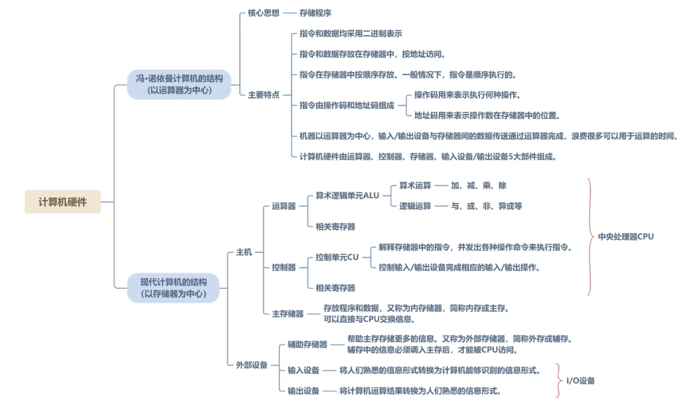
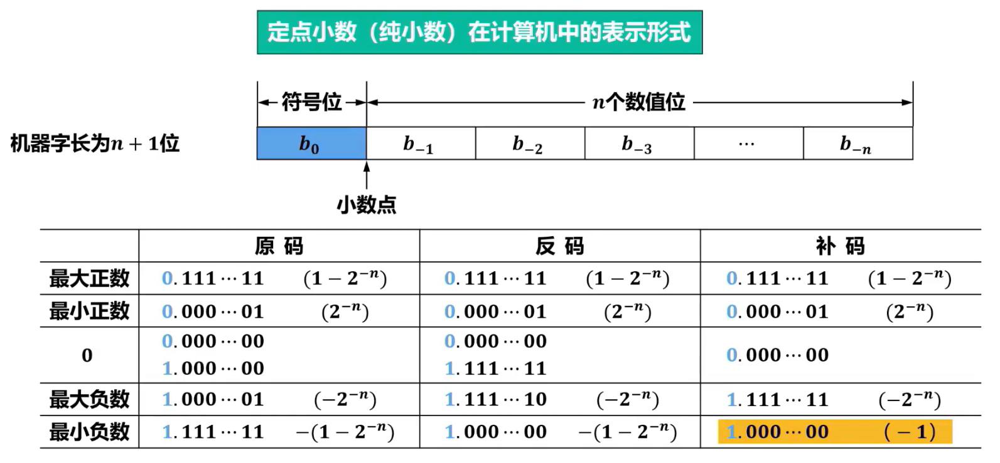
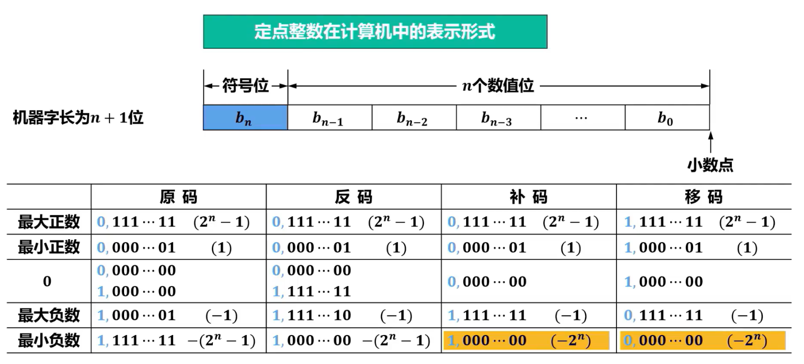
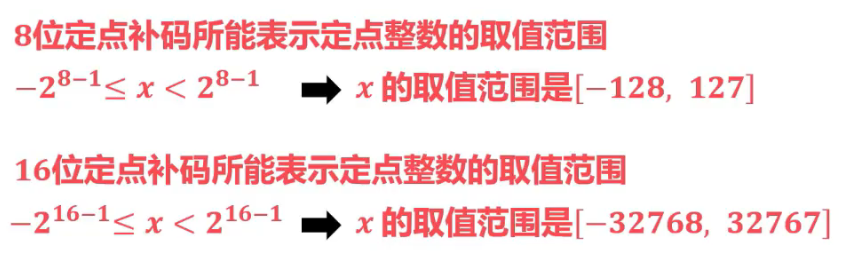

# 总结
[text](<F:.need/408/408/计算机组成原理第3版 唐朔飞.pdf>)
<!-- ![[计算机组成原理第3版 唐朔飞.pdf]] -->
# 第一章 计算机系统概述
--- 
> [!example] [第一章](/408/principles/base.md)

# 第二章 数据的表示和运算
--- 
> [!example] [第二章](/408/principles/dataRepre.md)

  
  
  

### 溢出