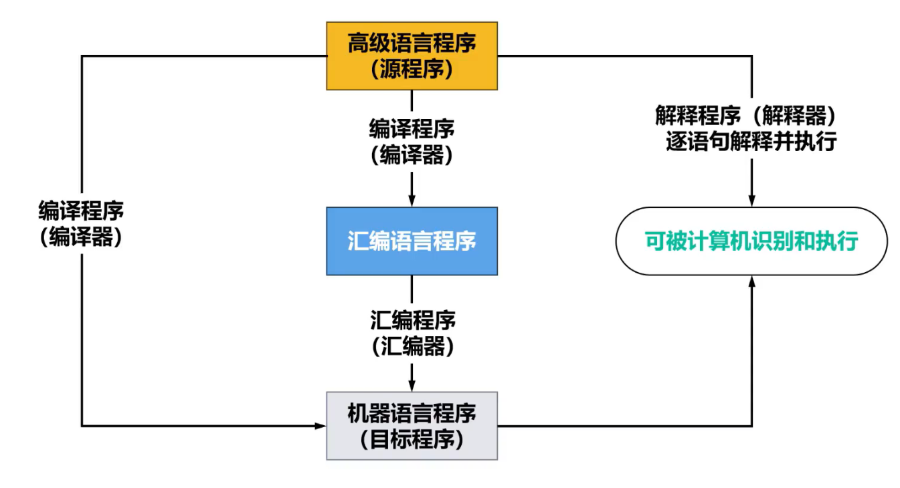
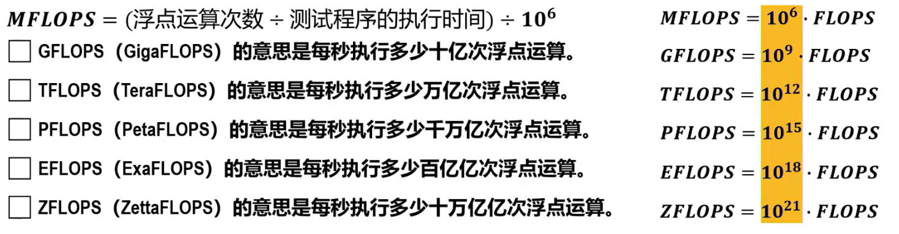

# 计算机系统概述

### 系统简介
--- 

### 发展历程 
--- 
- 图灵机  
- 香农  
- 阿卡那索夫  

> 特点：体积越小，功耗越低，可靠性越高，速度越快

###### 冯诺依曼计算机主要特点
> 存储程序
- 构成程序的指令和数据均采用==二进制==表示。
- ==指令和数据存放在存储器==中，按地址访问。
- ==指令==在存储器中==按顺序存放==。一般情况下，指令是==顺序执行==的。
- 指令由==操作码==和==地址码==组成:
  - 操作码用来表示执行何种操作。
  - 地址码用来表示**操作数**在存储器中的位置。
- 机器==以运算器为中心==，输入输出设备与存储器间的数据传送通过运算器完成。
- 计算机硬件由==运算器==、==控制器==、==存储器==、==输入设备/输出设备==5大部件组成。

**结构：(以运算器为中心)**

每次输入\输出(I\O)操作都需要运算器参与，浪费可以用于运算的时间。

###### 现代计算机
以存储器为中心

- 可以让输入\输出(I\O)设备直接与存储器交换数据，以提高整体效率
- **存储器**
  - 主存  
    直接与CPU交换信息  
  - 辅存  
    信息调入主存后才能被CPU访问  
- **运算器**
  - 核心为算数逻辑单元ALU  
  - 主要功能：算术运算、逻辑运算  
- **控制器**
  - 核心：CU  
  - 用于==解释==存储器中的==指令==，==并发出各种操作命令==来执行指令  

### 计算机软件
--- 

分为系统软件、应用软件

#### 发展

### 计算机系统分层思想
--- 
>[!tip]  
> 为**简化对计算机系统的研究和实现**，可**采用分层思想将计算机系统划分成一个层次结构的系统**
> 系统中**每一层都向其上层提供一个简洁和抽象的接口**
> **每一次的实现细节**对其上层都是“**透明**”的

- 逻辑电路层
  - 硬件系统底层，由逻辑门、寄存器等==逻辑电路==组成
- 微程序层
  - 一条机器指令编写成一个==微程序==、每个微程序包含若干==微指令==、每个微指令对应一条或多条==微操作==
- 指令集体系结构层ISA
  - 定义某计算机可执行的所有==机器指令集合==
- 操作系统层
  - ==对计算机的硬件资源和软件资源进行统一管理和调度==，提高计算机系统的使用效率
  - 设计时需要掌握具体机器的==指令集==和==汇编语言==以及适于编写操作系统软件的==高级语言==
- 汇编语言层
  - 使用汇编语言进行编程，要求程序员==对实际机器内部组成和指令系统非常熟悉==
- 高级语言层
  - 无需掌握机器底层技术细节，只需掌握某种高级语言的语法规则和算法与数据结构
- 各类应用程序

### 软件和硬件逻辑功能等价性
--- 
- 在特定条件下，用软件实现的逻辑功能也可以通过硬件电路实现，反之亦然
    >[!tip]  对于一些特定的计算或控制任务，可以选择将其**使用软件编程**来实现，也可以选择**设计专用硬件电路**来实现，使二者的结果在**功能上等效**

- 软件和硬件的逻辑功能等价性（计算机体系结构和工程中的基本原则之一）
  - 软件实现逻辑功能$\rightarrow$通用处理器(CPU)
  - 硬件实现逻辑功能$\rightarrow$专用硬件路线

### 计算机基本工作原理
--- 
<!--  -->

#### 运算器

运算器ALU
- 累加器ACC
- 乘商寄存器MQ
- 操作数寄存器X

|  ALU  |      加       |      减       |        乘         |       除        |
| :---: | :-----------: | :-----------: | :---------------: | :-------------: |
|  ACC  | 被加数 和 | 被减数 差 |     乘积高位      | 被除数 余数 |
|  MQ   |               |               | 乘数 乘积低位 |       商        |
|   X   |     加数      |     减数      |      被除数       |      除数       |

M:主存储器中某个存储单元的地址
(M):地址为M的存储单元中的内容

- 加法操作过程
    > (M)$\rightarrow$X
    > (ACC)+(X)$\rightarrow$ACC
    > > 取出(M)(加数)，送到操作数寄存器X中
    > >
    > > 将(ACC)(被加数)与(X)(加数)相加，结果(和)保留在累加器ACC中

- 减法操作过程
    > (M)$\rightarrow$X
    > (ACC)-(X)$\rightarrow$ACC

- 乘法操作过程
    > (M)$\rightarrow$X
    > (ACC)$\rightarrow$X
    > (M)*(MQ)$\rightarrow$ACC // MQ
    > 高位ACC，低位MQ

- 除法操作过程
    > (M)$\rightarrow$X
    > (ACC)/(X)$\rightarrow$MQ
    > (M)*(MQ)$\rightarrow$ACC // MQ

#### 主存储器

包含
- 存储体
- 存储器地址寄存器MAR
- 存储器数据寄存器MDR

###### 存储体

- 由多个==存储单元==组成
- ==存储单元==由若干个==存储元件==组成
  - 每个存储元件能存储==一位二进制数"0"或"1"==
- 一个存储单元中可存储一串二进制信息，称这串二进制信息为一个==存储字==，这串==二进制信息的位数==称为==存储字长==
- 存储单元地址$\rightarrow$每个存储单元一个编号
- 存储器==地址寄存器MAR==，用来存放==欲访问的存储单元的地址==
  - MAR的位数（长度），决定了==存储单元的数量== ， 与地址码长度相等
	
- 存储器数据寄存器MDR，用来存放从存储体的某个存储单元取出的信息或者准备往某个存储单元存入的信息
  - MDR的位数（长度），与存储字长相等

<!-- !!! success "主存" -->

> [!tip] 主存（内存）的这种按存储单元的地址来实现对其写入和读取的存取操作。需要在CPU中的控制器的控制下进行。

###### 控制器

控制器是计算机的神经中枢，指挥各部件自动、协调地工作

1. 控制从主存中读取一条指令，称为==取指==过程（阶段）
2. 对指令进行分析，指出该指令要完成何种操作，并按寻址特征指明操作数的地址，称为==分析==过程（阶段）
3. 根据指令的操作码和操作树所在的地址完成某种操作，称为==执行==过程（阶段）

- 程序计数器==PC用来存放当前欲执行指令的地址==
  - ==PC与MAR之间有一条直接通路==
  - ==PC自动形成下一条指令的地址==（自动加1功能）

- 指令寄存器IR用来存放当前的指令
  - IR的内容来自MDR
  - IR中的操作码(用OP(IR)表示)会送至CU(用OP(IR)$\rightarrow$CU)，用来分析指令
  - IR中的地址码(用Ad(IR)表示)作为操作数
- 控制单元==CU用来分析当前指令所需要完成的操作。并发出各种微操作命令序列==，用以控制所有被控对象
> [!example] [工作原理详解](/408/principles/instruct/machina.md)

### 计算机系统的性能指标
--- 
- 用来衡量计算机系统在各种操作和任务中的工作效率、执行速度以及处理能力的标准
- 帮助人们评估计算机系统的整体表现

#### 硬件与计算机系统性能的关系
硬件决定了系统的计算能力、数据传输速率和存储容量
- CPU的时钟频率决定了CPU每秒钟可以执行的指令数量
- 内存带宽会影响数据的读写速率

#### 软件与计算机系统性能的关系
合理的算法和代码实现可以更有效的利用硬件资源
- 操作系统的调度算法会影响多任务处理的效率，从而影响系统的响应时间
- 图像处理任务中，优化的软件算法可以减轻CPU和内存的负担，提高图形处理速度
- 软件层面的并行计算可以更好利用多核处理器提高吞吐量

> [!danger] 综上所述，计算机系统的性能指标涵盖了硬件和软件两个层面，他们之间密切相关。==`优化硬件可以提供更强大的计算和传输能力`==，而 ==`优化软件可以更有效地利用这些硬件资源`== ，从而共同实现更好的系统性能。正确的硬件选择可以为软件提供更好的执行环境，反之亦然。

#### 硬件相关性能指标

##### 基本性能指标

###### 机器字长

机器字长是指==CPU一次能够处理的二进制数据的位数==，也就是构成二进制数据的比特（bit）数量

- 机器字长与CPU内部用于==整数运算的ALU的位数==以及==通用寄存器的宽度==相等
- 主要影响：
  - 字长越长，==数的表示范围==就越大、==精度==也越高
  - 字长越长，==计算精度==也越高
  - 字长还会影响==计算速度==

###### 主存容量

- 主存储器（内存）能够存储的最大信息量

> [!info] 主存包含M个存储单元，每个存储单元存储N个二进制位
> $$主存容量=N*M(位或b)$$
> 

- ==增加主存（内存）容量可以减少程序运行期间对辅存（外村）的访问==，由于==访问内存的速度远大于访问外存的速度==，因为可以提高程序的执行速度，进而提高计算机系统的性能
 

###### 吞吐量

- 计算机系统在**单位时间内能够处理的信息量**
- 主要因素
  - CPU的处理能力
  - 内存（主存）的访问速度
  - 外存（辅存：硬盘）的访问速度

###### 响应时间

- 从向计算机系统**提交作业开始**，到系统**完成作业为止**所需要的时间

> [!danger] CPU执行时间和系统CPU时间很难区分，无特别说明基于**CPU执行时间**进行计算机性能评价

##### 运算速度相关

###### CPU时钟频率和时钟周期

- 计算机执行指令：取指$\rightarrow$分析$\rightarrow$执行
- 上述每个过程需要特定的==控制信号==进行控制
  - 控制信号的发出时机、持续时间等都需要相应的定时信号来调控
- CPU时钟信号是一个**基本定时信号**，他是一种固定频率的**脉冲信号**，用于驱动计算机内部各组件协调工作
  - 这种脉冲信号的频率被称为**CPU时钟频率**(Clock Rate)，基本单位为赫兹(Hz)
  - **CPU时钟周期**(Clock Cycle或CLock Tick，简称clock或tick)是**CPU时钟频率的倒数**，基本单位为秒
 
  > [!danger] 对于同类型计算机，同一指令执行所需的CPU时钟周期的数量是一样的，因此CPU的时钟频率越高，该指令单执行速度就越快

###### CPI

- 执行一条指令所需要的时钟周期数量
- 由于不同指令功能不同，相同功能的指令也可能有不同的寻址方式，所以**每条指令执行所需要的时钟周期数量也可能不同**
  - 一条指令的CPI：该指令执行所需要的时钟周期数量
  - 一类指令（如：算术运算类指令）的CPI：构成该指令的所有指令执行所需要时钟周期数量的==平均值==
  - 一个程序的CPI：构成该程序的所有指令执行所需要时钟周期数量的平均值

> [!danger] $CPI=程序执行所需时钟周期数量\div 程序所包含的指令数量$
> 如果知道某个程序共有$n$类不同类型的指令、每类指令单$CPI$($CPI_i$)、每类指令的数量在程序所包含的指令数量中所占比例($P_i$)，则该程序的$CPI$计算如下：
> $$\sum_{i=1}^n (CPI_i\times P_i )$$
> 

###### CPU执行时间

- **真正用于用户程序的执行时间**，而不包括为执行用户程序而花费在操作系统、访问主存、访问辅存、访问外部设备上的时间

<!-- > [!info] CPU执行时间=( $CPI \times$程序所包含指令数量)$\times$ 时钟周期=(  $CPI\times$ 程序所包含的指令数量) $\div$ 时钟频率 -->
> [!info] 同一个程序在CPU执行时间少的计算机上运行速度更快

###### IPC
- 每个时钟周期能够执行的指令数量
- IPC是CPI的倒数，与CPU架构、指令集、指令流水线技术等密切相关
- 目前IPC的值已经可以大于1

###### MIPS
- 每秒执行多少百万条指令

> [!danger] `用MIPS对不同的机器进行性能比较有时是不准确的`
不同机器的指令集不同，并且指令单功能也不同，在某种机器上的某一条指令单功能，可能在另一种机器上需要用多条指令实现
不同机器的CPI和时钟周期也不同，因而同一条指令在不同机器上所用的时间也不同

###### MFLOPS
- 每秒执行多少百万次浮点运算

- `买高铁票怕饿着` $\rightarrow$ `MGTPEZ`每次升$10^3$
> [!danger] MFLOPS不能全面反映计算机系统的性能。MFLOPS仅反映浮点运算速度，其值与所使用的测试程序相关，不同测试程序中包含的浮点运算量不同，测试得到的结果也不相同。

> [!cite]- 基准程序 
> 

<!-- > [!example] [例题](/408/principles/example/exam.md) -->