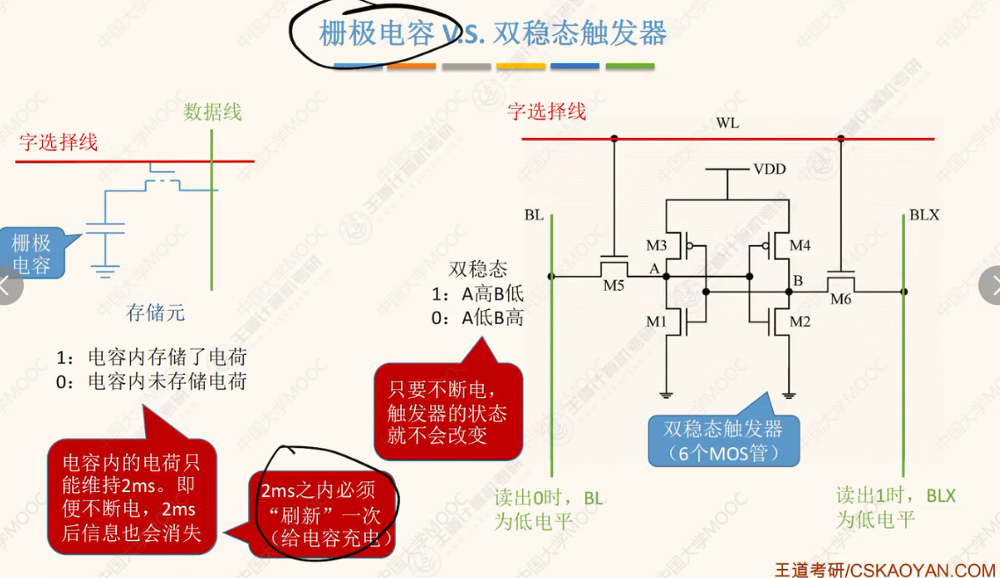
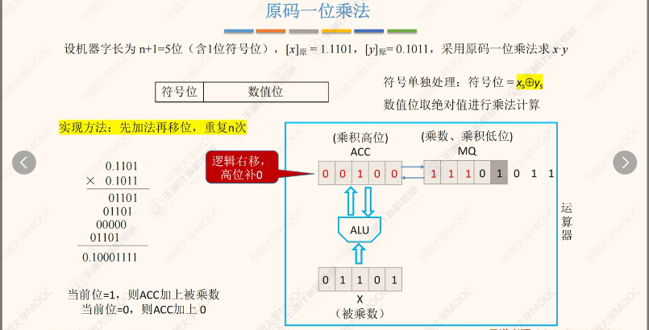
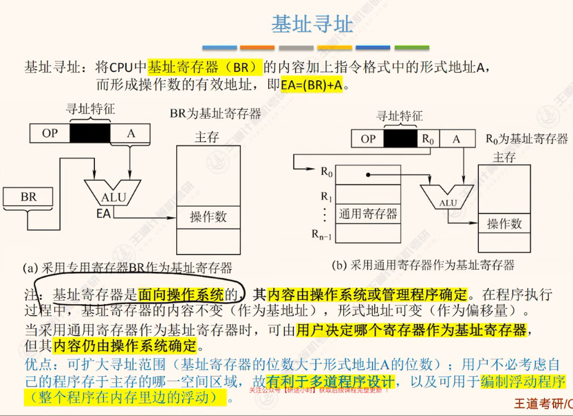
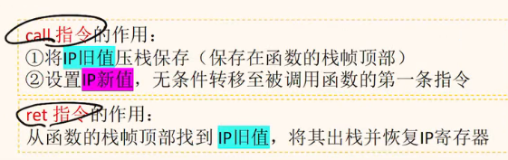
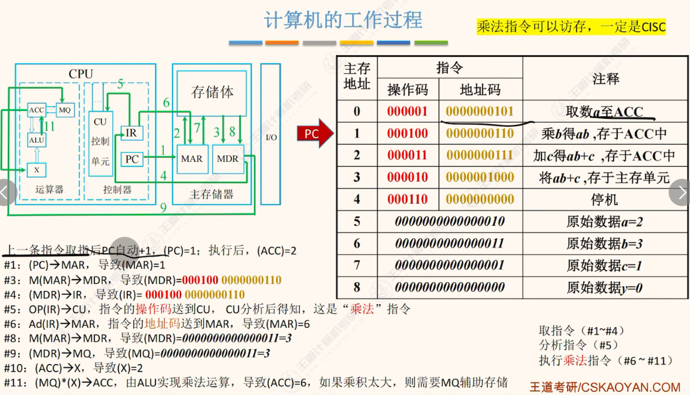
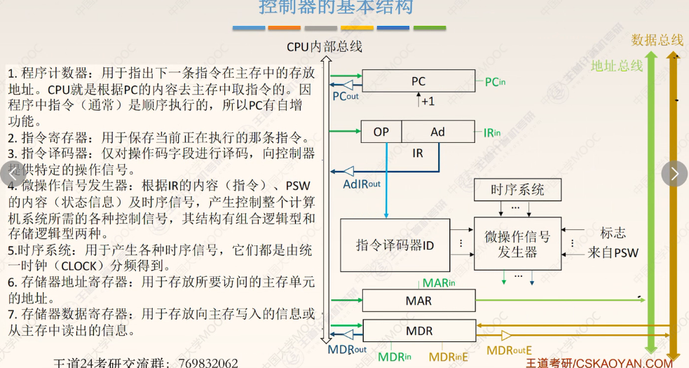

# 08-22

  
  
为了区分D/S

  
3个概念区分

  

  
  
  
  

  

  
  
记住特点

<!--    -->
  
DRAM局限性
  
两个字节

  

  
高频考点
  

  
  
ROM特性

  

  
自举装入系统->开机

  

  

  

  

  
考公式

  

  

  

  

  
  
  
  
  
需要考一个

  
  
  

  

  

  

  

  
  
  
需要重视

  

  

LRU算法

  

  

  
多级Cache很重要  

  

  

  
  

# 08-28
  

**二地址指令**
  

三地址指令概念

  

  
  

  

  

  

汇编语言
  

  

有效地址EA
  

会考：
  

寻址
  

  

  
  
  
  
  
  

基址
  
  

  
  

变址
  

  

  

相对寻址
  

### PC指向下一条指令存储地址
  
- 指令字长
  

  
  
  
  

最后三条非常重要
  

比较
  

堆栈寻址
  
  

  

  
  

汇编
  

  

  

  
  

汇编
  

  

  

  

  

  

CISC、RISC
  

  

工作过程
  

# CPU
  

  

  

  

大题
  

  

节拍、CPU周期 常考
  

  

流程图
  
  

