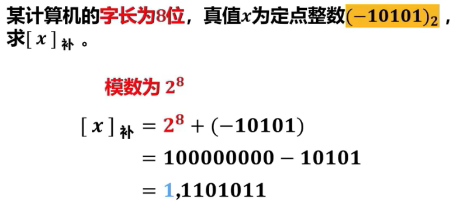
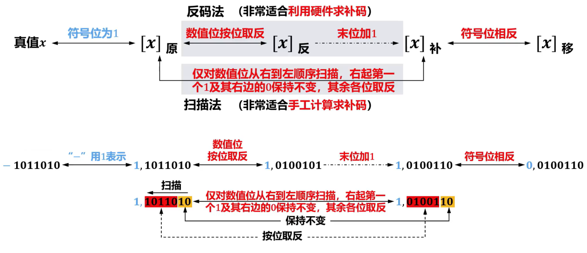
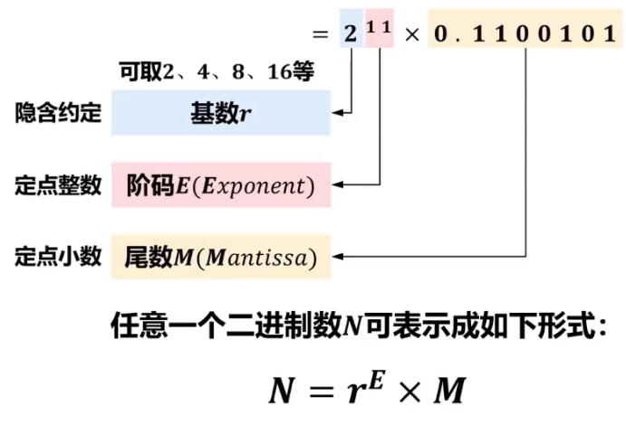
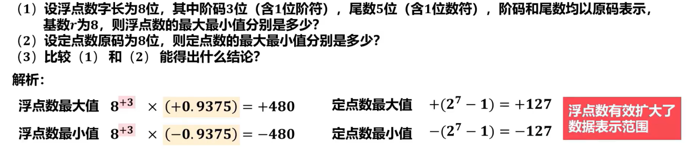
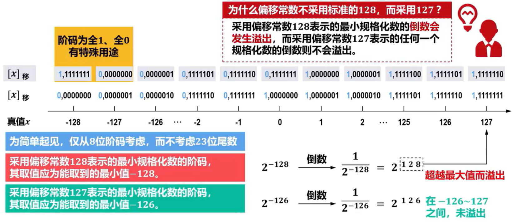
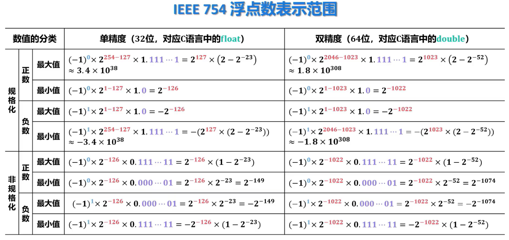

# ᕕ( ᐛ )ᕗ数据的表示与运算

## 数据表示的相关基本概念


--- 
## 进位计数制及其数据之间的相互转换
十进制(Decimalism)  
二进制(Binary)  
八进制(Octal)  
十六进制(Hexadecimal)  

- 进制转换  
    
    
    
    


--- 
## 定点数编码

### 原码

- 原码表示又称为==带符号的绝对值表示==  
  真值$x=+1110\qquad [x]_原=\textcolor{skyblue}{0},1110$   
  真值$x=-1110\qquad [x]_原=\textcolor{skyblue}{1},1110$   
  真值$x=+0.1110\qquad [x]_原=\textcolor{skyblue}{0}.1110$   
  真值$x=-0.1110\qquad [x]_原=\textcolor{skyblue}{1}.1110$  
- 定义  
    x为定点整数，n为x的原码中表示中数值位的位数（比特数量）  
$$
[x]_原=
\begin{cases}
\textcolor{skyblue}{0},x&\qquad0\leq x< 2^n\\
\textcolor{skyblue}{2^n}+|x|&\qquad-2^n<x\leq 0 \\
\end{cases}
$$
- 定点小数
$$
[x]_原=
\begin{cases}
x&\qquad0\leq x< 1\\
\textcolor{skyblue}{1}+|x|&\qquad-1<x\leq 0 \\
\end{cases}
$$
> [! success] 优点:直观</p>缺点:真值0有两种不同的表示</p>$\ \qquad$符号位不能直接参与运算</p>`目前仅用于表示浮点数的尾码`


### 补码
- 定点整数的补码
$$
[x]_补=
\begin{cases}
\textcolor{skyblue}{0},x&\qquad0\leq x< 2^n\\
\textcolor{skyblue}{2^{n+1}}+x&\qquad-2^n<x\leq 0 \quad(\textcolor{red}{mod\ 2^{n+1}})\\
\end{cases}
$$
> [!info]-  计算
> 
> 

> [!danger]- 补码比原码多表示一位
> $[x]_补=\textcolor{skybule}{1},000\ 0000\ ,\ x=-128$
>  $[x]_补=\textcolor{skybule}{0},000\ 0000\ ,\ x=0$
>  $[x]_原=\textcolor{skybule}{1},000\ 0000\ ,\ x=-0$
>  $[x]_原=\textcolor{skybule}{0},000\ 0000\ ,\ x=+0$

- 定点小数的补码
  - 定点小数用**原码**表示，因此不涉及定点小数的补码表示

$$
[x]_补=
\begin{cases}
x&\qquad0\leq x< 1\\
\textcolor{skyblue}{2}+x&\qquad-1<x\leq 0 \quad(\textcolor{red}{mod\ 2})\\
\end{cases}
$$

> [! success] 优点:减法运算可以转换成加法运算</p>$\ \qquad$真值0在补码中只有一种表示</p>$\ \qquad$符号位可直接参与运算(符号位的进位作为模自动舍弃)</p>缺点:表示比原码更复杂


### 反码
- 用于由反码求补码或由补码求反码的==中间过渡==
  - 正数的反码:符号位为0，数值位就是它本身
  - 负数的反码:符号位为1，数值位就是真值数值按位取反
- 定点整数的反码
$$
[x]_反=
\begin{cases}
\textcolor{skyblue}{0},x&\qquad0\leq x< 2^n\\
\textcolor{skyblue}{(2^{n+1}-1)}+x&\qquad-2^n<x\leq 0 \quad(\textcolor{red}{mod\ 2^{n+1}})\\
\end{cases}
$$
- 定点小数的反码
$$
[x]_反=
\begin{cases}
x&\qquad0\leq x< 1\\
{2-2^{-n}}+x&\qquad-1<x\leq 0 \quad(\textcolor{red}{mod\ 2})\\
\end{cases}
$$
> [! success] 优点:符号位可以参与运算</p>缺点:表示比原码更复杂</p>$\ \qquad$最高位产生的进位加到运算结果的低位(循环进位)</p>$\ \qquad$真值0在反码中有两种不同的表示

<!-- > [! cite]- 反码在计算机中很少被使用
>  -->

### 移码
- 就是在**真值上加一个常数“2”**
  - 在数轴上，移码所表示的范围对应真值在数轴上的范围向轴的正方向移动$2^n$个单位
  - 移码**只用于定点整数**的表示
- 移码定义
$$[x]_移=x+2^n\qquad-2^n\leq x<2^n$$

> [! success] 优点:真值0在移码中只有一种表示</p>$\ \qquad$保持了真值原有的大小顺序，可直接比较大小</p>$\ \qquad$最小值为全0，最大值为全2，符合人类习惯

> 浮点数的阶码用移码表示，能方便的比较阶码的大小


### 原、反、补、移码的转换
- 正数

- 负数

  


--- 
## 浮点数的表示

> [! danger] 在计算机中，定点小数主要用于表示浮点数的尾数，并没有高级语言数据类型与之相对应


### 浮点数的表示形式和表示范围

- 定点数的表示
  
- 定点数表示数据范围影响因素
  1. `机器字长`：字长越长，表示的数据范围就越大
  2. 采用的`机器码`：**补码和移码能表示对数据范围比原码和反码多一个最小负数**

- 实际上，计算机中处理的数不一定都是纯小数或纯整数，因此并不能直接用定点小数或定点整数表示

- 将浮点数直接表示在寄存器中
  - 小数点的位置由寄存器中指定数位的内容给出
  - 正负号由寄存器中指定数位的内容给出

#### 二进制浮点数采用 `类似十进制科学记数法` 的表示方法
  

  
- 浮点数在机器中的表示形式
    
  - 阶码可采用原码、补码、反码、移码表示
  - 尾数可采用原码、补码、反码表示  
  - 对应浮点数表示范围略有不同
    
  

   

- 受机器字长限制，浮点数仍然存在溢出现象  
  - 浮点数阶码大于最大阶码，`上溢`，机器**停止运算**，显示溢出标志
  - 浮点数阶码小于最小阶码，`下溢`，数据不能精确表示，尾数强制为0，按机器0处理，**可以继续运行**
- 当浮点数在正负数区域中，但不在某个数轴刻度上时，出现精度溢出，只能用近似值表示  

  

- 一旦浮点数的位数确定后，合理分配阶码E和尾数M的位数，直接影响浮点数的表示范围和精度
  - 短实数(32位)：阶码取8位(含1位阶符)，尾数M取24位(含1位数符)
  - 长实数(64位)：阶码E取11位(含1位阶符),尾数M取53位(含1位数符)。
  - 临时实数(80位)：阶码E取15位(含1位阶符)，尾数M取65位(含1位数符)

### 浮点数规格化

- 同一浮点数可能存在多种表示形式，也就是会有不同的阶码和尾数的组合 
- 通常要求浮点数在数据表示时对尾数进行规格化处理，即使得尾数的最高数值位必须是一个有效值  
  - 优点  
    - 使浮点数的表示`形式唯一`   
    - 使浮点数的表示`精度最高 `
    -   
 

- 对于非规格化尾数，需要对其进行**规格化操作**，即根据具体形式通过将非规格化**尾数的数值**部分进行**左移或右移**，并**相应减少或增加阶码值**的操作进行规格化，对应的规格化方法分别称为向左规格化（简称**左规**）和向右规格化（简称**右规**）。
- 对于**基数r不同的浮点数**，因其规格化数的形式不同，规格化过程也不同  
  
  
- 基数  r 不同，对数的表示范围和精度等都有影响。一般来说：
  - `基数 r 越大`，可表示的`浮点数范围越大`，而且所表示的数的`个数越多`。但浮点数的`精度反而下降`
  -   

  <!-- -   -->
  - [浮点数规格化例题](/408/principles/example/exam.md#浮点数规格化)

### IEEE 754浮点数标准

  主要包括两种基本的浮点数格式
  - 32位单精度浮点数  
    C语言中的loat型
      


  - 64位双精度浮点数
    C语言中的double型
     
  - 符号：0表正数；1表负数  
    阶码：定点整数，用`移码`表示  
    尾数：定点小数，用`原码`表示   

在IEEE 754 浮点数标准中，32位单精度浮点数的`8位阶码尽管采用移码表示`，但采用偏移常数是$2^7-1=127$，而不是标准移码的$2^7=128$
  

定点小数，用原码表示。**符号位**前移到最左侧。`相邻左侧隐藏一个1`，表示数值而不表示符号。尾数实际有24位，但不保存隐藏的那个1，只保存23位，节省的比特位可用于提高尾数的精度。`完整的尾数形式为1.M`
- 非规格化数可用于处理阶码下溢，使得出现比最小规格化数还小的数时程序也能继续进行下去
  

[IEEE 754单精度32位浮点数与真值转换](/408/principles/example/exam.md#ieee754单精度32位浮点数与真值转换)
  

- 十进制小数转换成二进制小数时，可能出现无限循环小数，只能转换到符合精度要求的位数（精度缺失）。通常只能采用**舍入的方式近似表示**，因此会带来数据表示的误差。
- 在对误差敏感的情况下，建议采用十进制浮点进行运算

  

--- 
## C语言中数据类型及转换
  

#### 整型变量的取值范围

  

#### 转换

- char、short、int、long这4种整型数据的表示范围不一样，很可能数据转换后精度缺失，此时就只能尽量保持转换前后的机器码相同或机器码部分相同

###### 相同字长
  

  

  


###### 小字长转大字长
- 原数据为无符号类型，进行0扩展
  
  


- 原数据为有符号类型，进行符号扩展
  

  

###### 大字长转小字长
编译器会将机器码截短处理  
- 表示范围缩小  
- 很可能出错  

  

###### 总结
  

#### int、float、double之间的转换
- int型数据是32位有符号整数，用补码表示
- f1oat和double型数据分别是32位和64位浮点数，它们的阶码用移码表示、尾数用原码表示
- 表示范围和精度也不相同，编译器只能保证数值尽量相等，大多数情况下只是近似值

  


###### float → double
由于double型数据的阶码和尾数的位数都L比floati型大，因此其表示范围更大、精度更高，转换后的double型数据与原f1oat型数据的值**完全相等**

###### double → float
- 大数转换：可能发生溢出
```c
double d=1234567890123456;
float f (float)d;
```

- 高精度数转换：发生舍入
```c
double d=1.123456789;
float f (float)d;
```
###### float/double → int
- 小数部分：向0方向截断
- 大数转换：可能发生溢出

###### int → float
- 两种类型都是32位，各自的数据组合（状态）数量相同，但二者在数轴上表示的数据并不完全重叠
  - 由于float型浮点数的尾数包括隐藏位在内共24位，当int型数据的高8位(24~31位)数据为非0时无法精确转换成24位浮点数的尾数，此时发生精度溢出。


###### int → double

double型数据的尾数包含隐藏位在内有53位，`可以精确表示`所有32位整数

