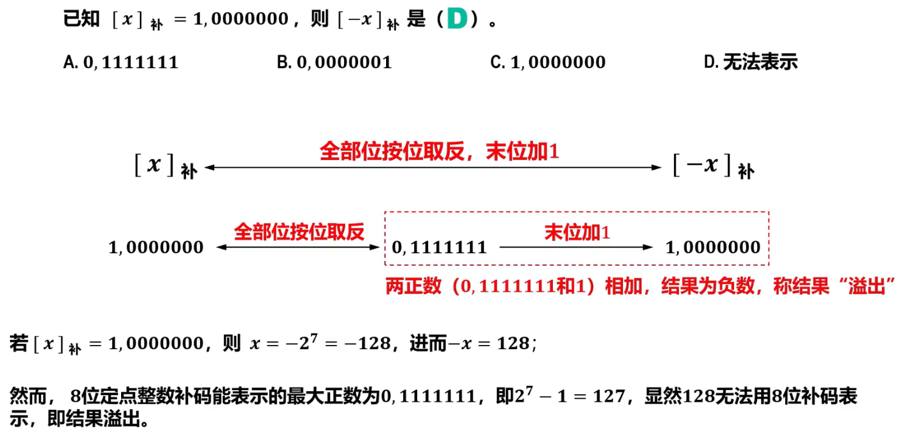
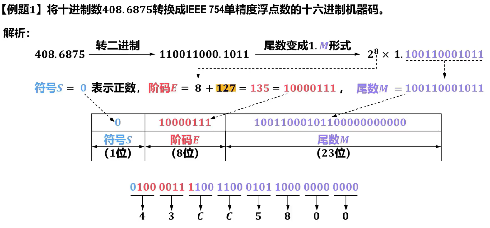

# 第一章 计算机系统概述 
### 指令地址

### 存储体容量

### CPU执行时间


### MIPS计算

### 程序运行速度计算1


### 程序运行速度计算2

### 程序运行速度计算3


--- 
# 第二章 数据的表示和运算

### 进制转换

  

### 运算结果溢出
  
### 最小补码
  

### 最大值
  

<!-- ### 浮点数表示范围
   -->

### 浮点数规格化
  
  
  

### IEEE754单精度32位浮点数与真值转换
  
  
  


--- 
# 第三章 存储器层次结构
### 逻辑位移的应用
  
  
  

  

### 逻辑位移的应用2
  

```c
/*定义相关位的为掩码*/
#define b0_mask (1<<0)
#define b2_mask (1<<2)
#define b3_mask (1<<3)
#define b5_mask (1<<5)
/*将b0和b5的内容清0而不影响其他各位*/
regData &=~(b0_mask | b5_mask);
/*将b2和b3的内容置1而不影响其他各位*/
regData |= (b2_mask | b3_mask);
```
### 负数算术位移
  


### 补码加减法运算

 
  
  

### 综合题
  

### 大题
  
  
  
  

### 补码表示范围
  
  
> [! danger] 8位补码所表示的真值x的范围：-128≤x≤127 </p>  16位补码所表示的真值x的范围：-32768≤x≤32767

<!-- ### 原码除法运算（不恢复余数法） -->


--- 
# 第四章 指令系统
### 主存中数据的存放
  
  

### DRAM芯片引脚
  


--- 
# 第五章 中央处理器


--- 
# 第六章 总线


--- 
# 第七章 输入\输出系统


--- 