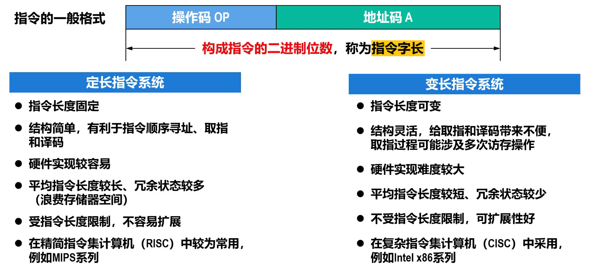

# 概述
- 计算机是按照程序员事先编制好的**程序**进行工作的   
- 程序会被“翻译”(编译、汇编或解释)成一系列相应的**指令**，这些指令告诉计算机如何执行特定的任务   
  - 指令是计算机硬件能够理解和执行的基本命令。这些命令包括算术运算、逻辑运算、数据传送、跳转等操作      
  - 每条指令必须显式或隐式地提供以下信息：  
    1. 执行的操作  
    2. 操作数的来源  
    3. 操作结果的存放处  
    4. 下一条指令的地址
- 一台计算机中所有指令的集合称为该计算机的**指令集**，也称为**指令系统**  
  
- 指令系统是计算机软、硬件系统的设计基础  
  - 软件设计人员需要根据指令系统设计计算机的**系统软件**  
  - 硬件设计人员需要根据指令系统设计计算机的**硬件逻辑电路**  

# 指令格式
## 一般格式和指令字长
  
  
**由于存储器的基本编址单位为字节，而指令是存储在存储器中的，因此，无论是定长指令系统还是变长指令系统，指令字长都是字节的整数倍** 
- **指令字长**越长，则占用**主存空间**就越大，所耗费的**访存时间**也就越长  
- 根据**指令字长**与**机器字长**的关系，指令可分为以下三类：  
  - **半字长指令** $\quad$ CPU进行1次访存，可读取2条  
  - **单字长指令** $\quad$ CPU进行1次访存，可读取1条  
  - **多字长指令** $\quad$ 需要进行多次访存
- 为了提高速度，一般会将最常用的指令设计为较短的指令格式。

##  指令中的地址码字段
根据指令类型和寻址方式，地址码可能是： 
- 操作数  
- 操作数的地址  
  - 主存地址  
  - 寄存器编号  
  - 外部设备端口的地址  
  - 用于计算地址的偏移量  

<!--    -->

**三地址指令**  
  
- 指令字长为 $8+8+8+8=32$ 位  
- 操作数的寻址范围为 $2^8=256$    
- 如果操作数的寻址范围更大，则需要地址码的位数就会更大，指令就会更长  
- 因此，三地址指令的地址码字段中的3个地址码、全部用于存储单元地址的情况并不多见，较为常见的是全部为寄存器(例如MPS的指令)，这样可以减少指令长度  

**二地址指令**  
  
- 与三地址指令相同，二地址指令同样是为**双目运算类**设计的  
- 但是，二地址指令为了压缩指令字长，将**运算结果**直接存放到**源操作数1的地址** $A_1$ 中
  
- Intel x86系列计算机主要采用RR（寄存器寄存器）型指令和RS（寄存器存储器）型指令  
- MIPS计算机主要采用RR（寄存器寄存器）型指令  

**一地址指令**  
  
**或**
  
- 例如x86架构中Mul BL指令，会将AL寄存器中的数据与BL寄存器中的数据相乘，结果存放在AX寄存器中  
- 隐含操作数双目运算，进一步缩短了双目运算类指令的长度  

**零地址指令**  
- 指令本身**不需要操作数**，例如以下x86指令  
  - 空指令NOP  
  - 等待指令WAIT  
  - 停机指令HLT  
  - 程序返回指令RET  
- 指令**需要一个操作数**，该操作数隐含于CPU内的某个寄存器，例如以下x86指令  
  - 用于将加法运算结果调整为压缩BCD格式的指令DAA  
  - 用于将减法运算结果调整为压缩BCD格式的指令DAS
## 指令中的操作码字段
- 操作码指定进行什么**操作（运算）**  
- 不同指令的**操作码的编码值是不同的**，例如  
  - `0000 0001` 表示加法操作  
  -  `0010 1011` 表示减法操作  
- 根据**操作码的长度**（操作码字段的二进制位数）**是否固定**，可分为以下两种操作码：  
  - **定长操作码**  
    - 操作码的长度固定，并且其在指令中的**位置也是固定**的  
    - 指令**译码**简单，**硬件**实现**简单**  
    - 指令系统的规模（指令系统所包含的指令数量），决定了操作码的位数  
    - 若指令系统所包含的**指令数量为x,操作码的位数为n**,则x和n应满足如下关系：$$\log_2x\leq n$$  
  - **变长操作码**  
    - 操作码的**长度可变**，并且其在指令中的**位置也不固定**  
    - 可以有效**减少操作码的平均长度**，用较短的指令字长表示了**更多的指令**，并且给地址码留出了更多位数，以**增大寻址空间**  

变长操作码的常见实现方法一**扩展操作码技术**
> [! danger] 操作码的长度随地址码字段中地址码数量的减少而增加

  
多地址指令扩展：
  

# 寻址方式
## 概述
- 寻址方式是指寻找**指令**或**指令中操作数**的**有效地址**的方式
  - **有效地址**可以是**主存地址**，也可以是**虚拟地址**（采用虚拟存储器技术）  

  
> [! abstract] 寻址方式是指令系统的重要组成部分，它对指令的格式和功能设计都有较大的影响。灵活高效的寻址方式不仅能够为程序员提供多样化的程序设计手段，还能显著提升程序的运行速度和存储空间的利用率 

## 指令寻址方式
- 通常情况下，构成程序的所有机器指令 **（指令序列）在主存中按顺序存放**  
- 大多数情况下，**程序按照指令序列顺序执行**  
  - 如果知道指令序列中第一条指令的有效地址，在该有效地址的基础上增加一条指令所占用主存单元的数量，就可以得到下一条指令的有效地址。这种寻找指令有效地址的方法就称为**指令的顺序寻址**  

## 操作数寻址方式

# 操作类型

# 复杂指令集和精简指令集

