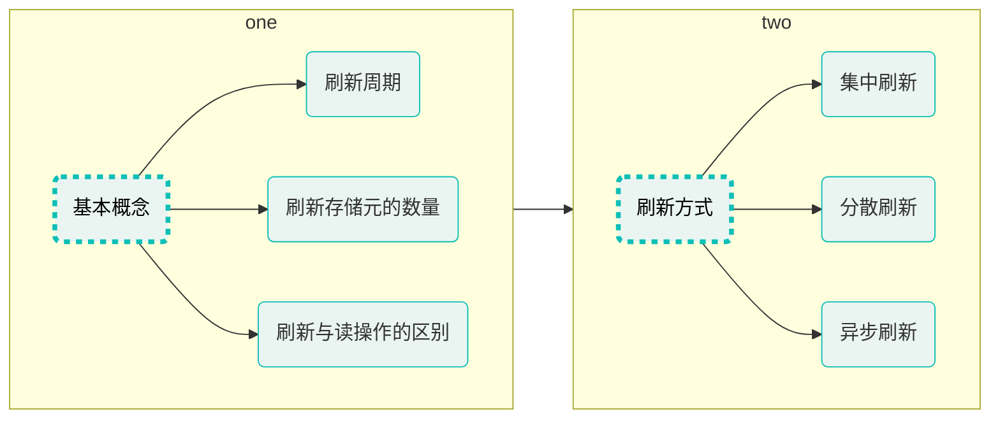

# 存储器概述

- 现代计算机**以存储器为中心**，它是计算机中**存放指令和数据**的主要部件   
  - 存储器的容量越大，能存储的信息越多  
  - 提高存储系统的访问速度，是提高计算机处理信息速度的重要措施  
- 因此，开发具有**大容量**、**高速度**和**低成本**的**存储系统**是计算机技术发展的关键目标之一  


## 存储器分类
  

#### 存储介质


##### 磁存储器

- 以磁性材料作为存储介质  
- 利用磁化单元的不同磁化方向来存储数据0和1  
- 主要包括磁芯、磁盘、磁带存储器  
- 磁盘、磁带中都包含有机械装置，因此体积大、存取速度慢、但其单位容量成本最低  

##### 光存储器

- 利用介质的光学特性读出数据  
	- 例如CD-ROM、DVD-ROM都以刻痕的形式将数据存储在盘面上，用激光束照射盘面，靠盘面的不同反射率来读出信息  
- 光盘存储器成本低廉、适用于电子出版物的发行  

##### 半导体存储器

- 用半导体器件组成的存储器  
- 存取速度快、体积小、性能可靠，但单位容量成本相对较高  

#### 存取方式


##### 顺序存储器

- 存储单元中的内容**只能依地址顺序访问**  
	- **存取速度与存储单元的位置有关**  
- 磁带存储器就是典型的顺序存储器  

##### 随机存储器

- **可按给定的任何一个存储单元的地址对其内容进行存取**  
	- **存取速度与存储单元的位置无关**  
- 早期的磁芯存储器和当前广泛使用的半导体存储器都是随机存储器  

##### 直接存储器

- **不必经过顺序搜索就能在存储器中直接存取信息**  
	- **兼有随机存储器和顺序存储器的访问特性**  
- 典型的如磁盘存储器。由于磁盘存在机械寻道和旋转延迟，因此数据访问时间和磁头与目标扇区的距离有关  

#### 可改写性

##### 读写存储器

- 既能读出也能写入信息

##### 只读存储器

- **存储的内容不允许被改变，只能读出**  
- 常见的有光盘存储器  
- 还有半导体只读存储器，信息只能读出、**不能随意写入**   
主要用来存放一些不需要修改的程序(例如B1OS)和常量  

#### 可保存性

##### 易失性存储器

- 断电后所保存的信息会丢失

##### 非易失性存储器

- 断电后所保存的信息不丢失

#### 功能和存取速度

  

##### 寄存器存储器

- CPU内部的多个寄存器（例如MAR、MDR、ACC、MQ等）   
- 用于存放地址、数据以及运算的中间结果  
- **速度与CPU匹配，容量极小**  

##### 高速缓冲存储器

- 寄存器与主存之间的一个**高速小容量**存储器  
- 用于**缓冲CPU与主存之间的性能差异**，提高存储系统的访问速度  
- 存放内容一般是即将或经常要使用的指令和数据  

##### 主存储器

- 用于存放指令和数据  
CPU可以通过主存地址**随机**地读写主存  
- **存取速度低于高速缓存，但一般高于辅存**  
- **容量远大于高速缓存，但一般远小于辅存**  


##### 辅助存储器

- 存放当前暂不参与运行的程序和数据，以及一些需要长期保存的信息   
- **容量很大，但存取速度相对较低**    


## 存储器性能指标和存储系统层次结构

### 存储容量

- 存储容量是指存储器可以存储的二进制信息的总量

  

### 存取速度

##### 存取时间

- 启动一次存储器操作到该操作完成所经历的时间 **(可能不同)**  
	- 读出时间  
	- 写入时间  

##### 存取周期

- 连续两次访问存储器操作（读操作或写操作）之间所需要的最短时间间隔  
- 对于主存，存取周期除包括存取时间外，还包括存储器状态的稳定恢复时间，因此存取周期略大于存取时间  

  

##### 存储器带宽

- 单位时间内存储器所能传输的信息量(单位：b/s或B/s)
- 它是衡量数据传输速率的重要指标，与一次传输的数据位的多少和存取时间的长短有关
	- 一般而言，数据位宽越大、存取时间越短，则存储器带宽越高

### 存储系统层次结构

  

- **上层存储器可为下层存储器做缓冲**，将最经常使用的数据的副本调度到上层，使得CPU只需要访问上层的快速小容量存储器即可获得大部分数据。可以有**效提高存储系统的访问速度，缓解CPU与主存（内存）、主存(内存)与辅存（外存）的性能差异**    
- 另外，**使用大容量辅存**（外存），**缓解了主存（内存）容量不足的问题**  

> [! todo] 基于这种层次结构，就可构建出满足应用需求的存储容量大、存取速度快、成本低的存储系统  

## 主存的基本结构

- 主存是机器指令直接操作的存储器，需要基于**主存地址**对其进行**随机访问**
    
 

  

- 输入地址、获取数据
    

- 输入数据、选择地址、写入
    

> [! todo] 随着硬件技术的发展内存都制成大规模集成电路芯片，而将MAR和MDR集成到了CPU中

## 用于地址译码的译码结构

### 单译码结构

- 若主存的存储体包含64个存储单元，每个存储单元只能存储1个二进制位，请给出只使用一个译码器就能寻址这64个存储单元的方案（即译码器的地址输入线和译码输出线各需要几条）  

> [! question] 若存储体包含64k个存储单元，则译码器的地址输入线和译码输出线各需要几条？
>译码输出线：$64k$ 条
>地址输入线：$16$ 条 ($2^{16} =64 k$)

- 随着存储容量（存储体中存储单元的数量）的增大，译码输出线也随之增多，这样，译码电路的开销就不容忽视，过多的译码输出线也会占用较多的晶圆面积，为生产制造带来困难

- 因此，**单译码结构只适用于容量很小的存储芯片**（例如容量在几百个存储单元以内的存储芯片）

### 双译码结构

  

- **在大容量存储器中普遍采用双译码结构**

## 主存中数据的存放

### 机器字长与存储字长的区别

- 机器字长   
	**CPU一次能够处理**的二进制数据的**位数**  
- 存储字长  
	主存中的**一个存储单元**所能存储的二进制**位数**  
> **存储字长与机器字长不一定相同**，例如机器字长为32位的计算机，所采用的存储字长可以是16位、32位或64位

### 地址访问模式

- 主存通常按字节进行编址，而存储字长（主存中的一个存储单元所能存储的二进制位数）是字节的2的整数次幂倍(例如1字节，2字节，4字节等)
- 以机器字长为32位的计算机为例，对主存的访问既可以按字节访问，也可以按16位半字访问，还可以按32位字访问。因此，可将主存地址分为：
	- 字节地址
	- 半字地址
	- 字地址

  

###### Intel x86汇编语言访问不同存储单元举例
> (假设数据段寄存器DS的值为0)

``` nasm
MOV AL,[0x4]
	;将地址0x4开始的1字节存储单元的内容送入8位寄存器AL,结果为[AL]=0x00
MOV AX,[0x4]
	;将地址0x4开始的2字节存储单元的内容送入16位寄存器AX,结果为[AX]=0xEF00
MOV EAX,[0x4]
	;将地址0x4开始的4字节存储单元的内容送入32位寄存器EAX,结果为[EAX]=0xABCDEF00
```

- 从上述程序可以看出，不**同的地址访问模式**（字节访问、半字访问、字访问）**所使用的主存地址实际上都是字节地址**，CPU在执行指令的时候可以将字节地址的低2位用于访问控制：  
	- 采用字节访问摸式，字节地址的低2位用于选择字存储单元中的哪一个字节  
	- 采用半字访问摸式，字节地址的倒数第2位用于选存储单元中的哪个半字  

### 大端和小端方式
  

###### 小端
- 将数据的低字节保存在主存的低地址中，而数据的高字节保存在主存的高地址中  
- 这样可以将主存地址的高低与数据的位权有效地结合起来，高地址存储的数据部分的权值高，低地址存储的数据部分的权值低，符合逻辑  
- Intel x86、IA64、RISC-V等处理器采用小端方式  
###### 大端
- 将数据的高字节保存在主存的低地址中，而数据的低字节保存在主存的高地址中  
- 符合人类的正常思维  
- PowerPC处理器采用大端方式：ARM、MIPS等处理器同时支持大端方式和小端方式  

> [! tip]
> 1. 上述两种方式并没有绝对的优劣之分，它们在不同的处理器架构和应用场景中都有各自的适用性和优势  
> 2. 除处理器外，大小端方式还涉及外部设备设计、网络数据传输、音视频文件保存等  
> 3. 小端与大端方式的区别不仅存在于处理器的寄存器、存储器中，在指令集、系统总线等各个层次中也可能存在差别  

### 数据的边界对齐
- **主存空间**通常**按字节**进行**编址**   
- 高级语言中**不同数据类型的变量**所包含的**字节数量可能不同**  
	- 编译器在为这些变量分配主存空间时，理论上可以从主存空间的**任何一个字节地址开始**  
	- 当一个多字节变量被编译器**分布在不同的字存储单元中**时，访问该变量就需要**多个存取周期**  
	- 为了**提高数据访问效率**，应该要考虑数据变量、数据结构在**主存空间中的边界对齐问题**  

##### 假设存储字长为32位，为C语言不同数据类型的变量分配主存空间
>   

###### 数据的边界未对齐
  

- 对存储空间的利用率最高
- 存在访问性能问题，例如：
	- 变量c的8个字节分布在3个存储单元中（访问该变量需要3个存取周期）
	- 变量的2个字节分布在2个存储单元中（访问该变量需要2个存取周期）


###### 数据的边界对齐
  

- 有效提升了访问性能，例如：
	- 变量c的8个字节分布在2个存储单元中(访问该变量需要2个存取周期)
	- 变量的2个字节分布在1个存储单元中（访问该变量需要1个存取周期）
- 造成存储空间的浪费

##### 边界对齐的规则

- 字节数据不存在边界对齐问题（因为主存空间就是按字节编址的）  
- 半字(2字节)数据的起始字节地址的最低1位为0(即地址是2的整数倍)  
- 单字(4字节)数据的起始字节地址的最低2位为00(即地址是4的整数倍)  
- 双字(8字节)数据的起始字节地址的最低3位为000(即地址是8的整数倍)  

  


# 静态随机存取存储器SRAM
- 随机存取存储器RAM的一种 
- 所谓“静态”，是指这种RAM只要保持通电，其内部所存储的数据就可以保持不变，而不需要进行周期性地刷新。相比之下，动态随机存取存储器DRAM则需要  
- 一旦断电，SRAM和DRAM内部存储的数据还是会消失的，也就是说SRAM和DRAM属于易失性存储器这与属于非易失性存储器的只读存储器ROM(Read-OnlyMemory)是不同的    
## 存储元
> 存储元(存储1个二进制位的单元)一般采用多个金属-氧化物半导体场效应晶体管MOSFET来构建，MOSFET常简称为MOS管

##### mos管
  

##### 存储元电路
  

##### 上电后初始状态
> (行选通X和列选通Y都为无效信号)

  

- 实际上，a点和b点上升到高电平的时间不可能完全相同  
- 本例中假设a点首先上升到高电平  
- 此时，α点高电平(1)和b点低电平(0)，形成一个稳定状态，可用这个状态表示数据1  
- 若最初b点先上升到高电平，则会形成另一个稳定状态，即a点低电平(0)和b点高电平(1)，该状态表示数据0  
- 综上所述，上电后初始状态随机（即存储元的存储内容随机）
##### 读操作
> (行选通X和列选通Y都为有效信号)

  
  
- 读操作不会破坏原有数据  

##### 写操作
> (行选通X和列选通Y都为有效信号)

  


##### 信息的保持
> (行选通X和列选通Y都为无效信号)

  

#### 总结
- **上电后的初始状态随机**（即存储元的存储内容随机）  
- **读操作不会破坏原有数据**  
- 只要不断电，信息一直保存，不需要刷新  
- 电源$V_{cc}$通过负载管 $T_3$ 、$T_4$ 不断为工作管 $T_1$ 或 $T_2$ 提供电流，以保存信息，因此 **功耗大**   
- 使用**晶体管的数量多**，占用晶圆面积大，成本高，价格昂贵，因而**不适合用于**更高存储密度且低成本的应用，例如**PC的内存**  
- **速度快**，常用于微处理器的cache  

## 存储元扩展和存储阵列扩展
- 电路符号化
  

#### 存储元扩展
  

> [!SUCCESS] 存储阵列
> 行选通线:$X_0 \sim X_{n-1},共n条$  
> 列选通线:$Y_0 \sim Y_{n-1},共n条$  
> 选通线合计:$2n$条  
> 存储元:$n\times n=n^2$个  


- 同一时刻，只能有一条行选通线和一条列选通线输出有效信号，因此只能有一个存储元被选中，也就是一次只能访问一位数据

#### 存储阵列扩展
> 将多个存储阵列的行选通线并联、列选通线并联

  

- 存储字长为4位包含$n^2$个存储字

## 存储器结构及其芯片实例
  

> 存储器
> - 每个 $64\times 64$ 存储阵列(即64行64列)包含 $64\times 64=4096$ 个存储元(每个存储元存储 $1$ 位二进制数)
> - 行选通线：$X_0 \sim X_{63}$，共64条
> - 列选通线：$Y_0 \sim Y_{63}$，共64条
> - 存储字长：$4$ 位（一次可存取的位数）
> - 存储容量：$4096位/片\times 4片=4096 b\times 4\div 8=2kB$

> 驱动器
> - 行译码器的每个译码输出信号线都要同时驱动**这一行上所有存储元**的$T_5$、$T_6$两个门控管  
> - 4片存储阵列并发，每个行译码输出信号线要驱动$2\times 64\times 4=512$个门控管，负载大  
> - 列译码器的每个译码输出信号线都要同时驱动**这一列上所有存储元**共享的$T_7$、$T_8$两个门控管  
> - 4片存储阵列并发，每个列译码输出信号线要驱动$2\times 4=8$个门控管，负载较大  

  


# 动态随机存取存储器DRAM

## 存储元及其扩展

#### 存储元
> [!TIP] 设法尽量**减少MOS管**，通过**引入存储电容**暂存电荷的方式来保存数据</p>目前在内存中较为常见的结构是 **单MOS管** 和**电容**构成的DRAM存储元

- 电容**C充满电的状态**，表示二进制1
  
- 电容**C完全没电的状态**， 表示二进制0
  
- 上述电容C放电过程，可看作是对存储元的读操作，可以发现读操作会导致原本存储的1读取后变成0。为避免读操作导致的数据丢失，数据1读出后应将数据1重新写入，称为**数据恢复**  
- MOS管不可能完美关断，电容C上的电荷会逐渐泄露，数据1只能保存较短的时间。为避免数据丢失，必须定期采用类似读操作的方式对电容C补充电荷，称为**刷新**， 这也是动态RAM(DRAM)得名的原因  
  

#### 存储元扩展
  
- 为了**读取**一行中某个存储元的信息，**却破坏了这一行中所有存储元的信息**    
- 因此，**每次读操作过后，必须立即进行写操作**  
- 灵敏读出/恢复放大器会根据锁存的值，将各条列线拉高到 $DRAM$ 的工作电压 $Vcc$ ，或拉低到 $GND$ ，以恢复各存储元中电容的原本状态（即原本存储的信息）  

| 步骤  | $DRAM$ 的**读**操作流程 | $DRAM$ 的**写**操作流程 |
| :---: | :---------------------: | :---------------------: |
|   1   |       预充电操作        |       预充电操作        |
|   2   |        访问操作         |        访问操作         |
|   3   |        信号检测         |        信号检测         |
|   4   |        数据恢复         |        数据恢复         |
|   5   |        数据输出         |        数据输入         |


#### DRAM与SRAM的对比


|        对比项目        |       动态随机存取存储器DRAM        |          静态随机存取存储器SRAM          |
| :--------------------: | :---------------------------------: | :--------------------------------------: |
|    构成存储元的元件    |    $1$ 个 $MOS$ 管和 $1$ 个电容     |             $6$ 个 $MOS$ 管              |
| 读操作后需要“数据恢复” | 需要 （读操作会改变原本存储的信息） |   不需要（读操作不改变原本存储的信息）   |
|     需要动态“刷新”     |      需要 （电容的电荷会泄露）      | 不需要（功耗管和工作管负责保持存储状态） |
|      送行/列地址       | 分两次送（地址线复用，减少地址线）  |                  同时送                  |
|        运行速度        |                较慢                 |                    快                    |
|         集成度         |                 高                  |                    低                    |
|         发热量         |                 小                  |                    大                    |
|        存储成本        |                 低                  |                    高                    |
|        可保存性        |   易失性存储器 （断电后信息丢失）   |    易失性存储器 号 （断电后信息丢失）    |
|        常用应用        |                主存                 |                 $cache$                  |
|        存储信息        |       电容，充电是1，否则为0        |        双稳态触发器，分为0态和1态        |


## 动态刷新


#### 基本概念
##### 刷新周期

- 从数据存入DRAM开始，到数据丢失之前为止的这段时间，称为**最大刷新周期**   
  - 采用不同材料以及不同生产工艺生产的 $DRAM$ ，其最大刷新周期可能不同，常见的有 $2ms$ 、 $4ms$ 、 $8ms$ 等   
- 而**刷新周期**是 $DRAM$ 实际完成两次**完整刷新**之间的时间间隔   
  - 刷新周期 ≤ 最大刷新周期   

##### 刷新存储元的数量  
- $DRAM$ **按行进行**刷新  
  - 为了**缩短刷新周期**，可**减少**存储阵列的**行数**，增加列数  
- 刷新操作由内存控制器负责  

##### 刷新与读操作的区别
- 尽管读操作也具有刷新功能，但读操作与刷新操作又有所不同，**刷新操作只需要给出行地址**，而不需要给出列地址

#### 刷新方式
> $DRAM$ 在刷新时，是不能响应 $CPU$ 的访问的，因此 $CPU$ 对 $DRAM$ 进行访问与内存控制器对 $DRAM$ 进行刷新操作就存在内存争用问题

> [!todo] 假设 $DRAM$ 存储体的结构为 $128$ 行 $×128$ 列，存取周期为 $0.5μs$ ，刷新周期为 $2ms$   
> **刷新操作与读操作类似**，存取周期=刷新一行所需的时间  
> **刷新周期**为 $2ms$ ,在 $2ms$ 内要**完成所有128行的刷新**   
> 将 $2ms(2000μs)$ 划分成 $4000$ 个 $0.5μs$ 长的时隙，在这些时隙中选出 $128$ 个时隙每个时隙刷新一行即可

##### 集中刷新

  

- 读写操作期间不受刷新操作的影响，因此这段时间的访问**速度比较快**  
- 但是，在集中刷新的这128个时隙中，CPU长时间不能访问DRAM，这段时间称为 为 **“死区"时间**  
	- 存储体包含的**行数越多，“死区”时间就越长**  

##### 分散刷新
  

- 相当于将存取周期加上刷新$1$行的时长作为新的存取周期，因此**不存在“死区”时间**。但是，这种方式**刷新过于频繁**（在$2ms$所包含的$4000$个时隙中，有$2000$个时隙用于刷新，每个时隙刷新$1$行，共刷新$2000$行，每刷新$128$行，就相当于把存储体完整地刷新了$1$遍，因此在$2ms$内进行了约$15$次完整的存储体刷新），**严重影响了系统的速度**  
- 不适合应用于高速存储器  


##### 异步刷新
  

- 既充分利用了$2ms$时间，又保持系统高速特性。该方式缩短了死区时间($128$个时隙缩短为$1$个时隙)，该方式相对上述两种效率更高，更为常用

## 存储器芯片实例和DRAM发展
#### 芯片示例
  

