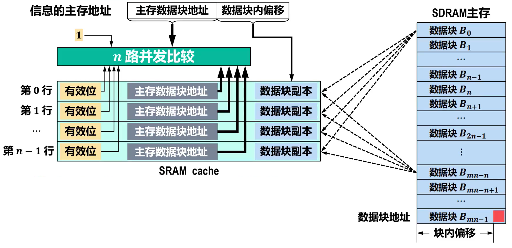

# 存储器概述
- 现代计算机**以存储器为中心**，它是计算机中**存放指令和数据**的主要部件   
  - 存储器的容量越大，能存储的信息越多  
  - 提高存储系统的访问速度，是提高计算机处理信息速度的重要措施  
- 因此，开发具有**大容量**、**高速度**和**低成本**的**存储系统**是计算机技术发展的关键目标之一  


## 存储器分类
  


| 存储器类型             | 特点                                       | 具体种类                                                                                                     |
| ---------------------- | ------------------------------------------ | ------------------------------------------------------------------------------------------------------------ |
| $RAM$                  | 数据读写速度快，断电后数据丢失             | $SRAM$：高速，耗电大，成本高（用于缓存）<br> $DRAM$：速度慢，需刷新，成本低（用于主存）                      |
| $ROM$                  | 数据只读，断电后数据不丢失                 | $PROM$：一次性可编程<br> $EPROM$：可擦除，需紫外线<br> $EEPROM$：电可擦除，可多次编程                        |
| $Flash\quad    Memory$ | 电可擦除，多次编程，断电后数据不丢失       | $NAND\quad    Flash$：适合大容量存储（ $U$ 盘、$SSD$）<br> $NOR\quad    Flash$：随机访问快（固件）           |
| $Cache\quad    Memory$ | CPU 和主存之间的小容量快速存储器           | $L1\    Cache$：速度最快，容量小<br> $L2\    Cache$：容量大于 $L1$ ，略慢<br> $L3\    Cache$：共享，容量更大 |
| 虚拟存储器             | 通过硬盘扩展内存容量，支持多任务管理       | 使用页表和页面置换算法（如 $LRU$、$FIFO$）                                                                   |
| $CMOS\quad    Memory$  | 依赖电池供电，用于保存系统配置参数         | 主要用于 $BIOS$ 设置等                                                                                       |
| 磁性存储器             | 数据通过磁性介质存储，速度较慢             | $HDD$：数据存储密度高<br> 磁带：顺序访问，大批量备份<br>$MRAM$：高速，断电保持数据                           |
| 光学存储器             | 数据通过激光读取和写入                     | $CD / DVD / Blu-ray$：用于数据分发和备份                                                                     |
| 量子存储器             | 利用量子态保存信息，潜在超高密度和超快速度 | 目前在量子计算中研究和实验                                                                                   |

#### 存储介质


##### 磁存储器

- 以磁性材料作为存储介质  
- 利用磁化单元的不同磁化方向来存储数据0和1  
- 主要包括磁芯、磁盘、磁带存储器  
- 磁盘、磁带中都包含有机械装置，因此体积大、存取速度慢、但其单位容量成本最低  

##### 光存储器

- 利用介质的光学特性读出数据  
	- 例如CD-ROM、DVD-ROM都以刻痕的形式将数据存储在盘面上，用激光束照射盘面，靠盘面的不同反射率来读出信息  
- 光盘存储器成本低廉、适用于电子出版物的发行  

##### 半导体存储器

- 用半导体器件组成的存储器  
- 存取速度快、体积小、性能可靠，但单位容量成本相对较高  

#### 存取方式


##### 顺序存储器

- 存储单元中的内容**只能依地址顺序访问**  
	- **存取速度与存储单元的位置有关**  
- 磁带存储器就是典型的顺序存储器  

##### 随机存储器

- **可按给定的任何一个存储单元的地址对其内容进行存取**  
	- **存取速度与存储单元的位置无关**  
- 早期的磁芯存储器和当前广泛使用的半导体存储器都是随机存储器  

##### 直接存储器

- **不必经过顺序搜索就能在存储器中直接存取信息**  
	- **兼有随机存储器和顺序存储器的访问特性**  
- 典型的如磁盘存储器。由于磁盘存在机械寻道和旋转延迟，因此数据访问时间和磁头与目标扇区的距离有关  

#### 可改写性

##### 读写存储器

- 既能读出也能写入信息

##### 只读存储器

- **存储的内容不允许被改变，只能读出**  
- 常见的有光盘存储器  
- 还有半导体只读存储器，信息只能读出、**不能随意写入**   
主要用来存放一些不需要修改的程序(例如B1OS)和常量  

#### 可保存性

##### 易失性存储器

- 断电后所保存的信息会丢失

##### 非易失性存储器

- 断电后所保存的信息不丢失

#### 功能和存取速度

  

##### 寄存器存储器

- CPU内部的多个寄存器（例如MAR、MDR、ACC、MQ等）   
- 用于存放地址、数据以及运算的中间结果  
- **速度与CPU匹配，容量极小**  

##### 高速缓冲存储器

- 寄存器与主存之间的一个**高速小容量**存储器  
- 用于**缓冲CPU与主存之间的性能差异**，提高存储系统的访问速度  
- 存放内容一般是即将或经常要使用的指令和数据  

##### 主存储器

- 用于存放指令和数据  
CPU可以通过主存地址**随机**地读写主存  
- **存取速度低于高速缓存，但一般高于辅存**  
- **容量远大于高速缓存，但一般远小于辅存**  


##### 辅助存储器

- 存放当前暂不参与运行的程序和数据，以及一些需要长期保存的信息   
- **容量很大，但存取速度相对较低**    


## 存储器性能指标和存储系统层次结构

### 存储容量

- 存储容量是指存储器可以存储的二进制信息的总量

  

### 存取速度

##### 存取时间

- 启动一次存储器操作到该操作完成所经历的时间 **(可能不同)**  
	- 读出时间  
	- 写入时间  

##### 存取周期

- 连续两次访问存储器操作（读操作或写操作）之间所需要的最短时间间隔  
- 对于主存，存取周期除包括存取时间外，还包括存储器状态的稳定恢复时间，因此存取周期略大于存取时间  

  

##### 存储器带宽

- 单位时间内存储器所能传输的信息量(单位：b/s或B/s)
- 它是衡量数据传输速率的重要指标，与一次传输的数据位的多少和存取时间的长短有关
	- 一般而言，数据位宽越大、存取时间越短，则存储器带宽越高

### 存储系统层次结构

  

- **上层存储器可为下层存储器做缓冲**，将最经常使用的数据的副本调度到上层，使得CPU只需要访问上层的快速小容量存储器即可获得大部分数据。可以有**效提高存储系统的访问速度，缓解CPU与主存（内存）、主存(内存)与辅存（外存）的性能差异**    
- 另外，**使用大容量辅存**（外存），**缓解了主存（内存）容量不足的问题**  

> [! todo] 基于这种层次结构，就可构建出满足应用需求的存储容量大、存取速度快、成本低的存储系统  

## 主存的基本结构

- 主存是机器指令直接操作的存储器，需要基于**主存地址**对其进行**随机访问**
    
 

  

- 输入地址、获取数据
    

- 输入数据、选择地址、写入
    

> [! todo] 随着硬件技术的发展内存都制成大规模集成电路芯片，而将MAR和MDR集成到了CPU中

## 用于地址译码的译码结构

### 单译码结构

- 若主存的存储体包含64个存储单元，每个存储单元只能存储1个二进制位，请给出只使用一个译码器就能寻址这64个存储单元的方案（即译码器的地址输入线和译码输出线各需要几条）  

> [! question] 若存储体包含64k个存储单元，则译码器的地址输入线和译码输出线各需要几条？
>译码输出线：$64k$ 条
>地址输入线：$16$ 条 ($2^{16} =64 k$)

- 随着存储容量（存储体中存储单元的数量）的增大，译码输出线也随之增多，这样，译码电路的开销就不容忽视，过多的译码输出线也会占用较多的晶圆面积，为生产制造带来困难

- 因此，**单译码结构只适用于容量很小的存储芯片**（例如容量在几百个存储单元以内的存储芯片）

### 双译码结构

  

- **在大容量存储器中普遍采用双译码结构**

## 主存中数据的存放

### 机器字长与存储字长的区别

- 机器字长   
	**CPU一次能够处理**的二进制数据的**位数**  
- 存储字长  
	主存中的**一个存储单元**所能存储的二进制**位数**  
> **存储字长与机器字长不一定相同**，例如机器字长为32位的计算机，所采用的存储字长可以是16位、32位或64位

### 地址访问模式

- 主存通常按字节进行编址，而存储字长（主存中的一个存储单元所能存储的二进制位数）是字节的2的整数次幂倍(例如1字节，2字节，4字节等)
- 以机器字长为32位的计算机为例，对主存的访问既可以按字节访问，也可以按16位半字访问，还可以按32位字访问。因此，可将主存地址分为：
	- 字节地址
	- 半字地址
	- 字地址

  

###### Intel x86汇编语言访问不同存储单元举例
> (假设数据段寄存器DS的值为0)

``` nasm
MOV AL,[0x4]
	;将地址0x4开始的1字节存储单元的内容送入8位寄存器AL,结果为[AL]=0x00
MOV AX,[0x4]
	;将地址0x4开始的2字节存储单元的内容送入16位寄存器AX,结果为[AX]=0xEF00
MOV EAX,[0x4]
	;将地址0x4开始的4字节存储单元的内容送入32位寄存器EAX,结果为[EAX]=0xABCDEF00
```

- 从上述程序可以看出，不**同的地址访问模式**（字节访问、半字访问、字访问）**所使用的主存地址实际上都是字节地址**，CPU在执行指令的时候可以将字节地址的低2位用于访问控制：  
	- 采用字节访问摸式，字节地址的低2位用于选择字存储单元中的哪一个字节  
	- 采用半字访问摸式，字节地址的倒数第2位用于选存储单元中的哪个半字  

### 大端和小端方式
  

###### 小端
- 将数据的低字节保存在主存的低地址中，而数据的高字节保存在主存的高地址中  
- 这样可以将主存地址的高低与数据的位权有效地结合起来，高地址存储的数据部分的权值高，低地址存储的数据部分的权值低，符合逻辑  
- Intel x86、IA64、RISC-V等处理器采用小端方式  
###### 大端
- 将数据的高字节保存在主存的低地址中，而数据的低字节保存在主存的高地址中  
- 符合人类的正常思维  
- PowerPC处理器采用大端方式：ARM、MIPS等处理器同时支持大端方式和小端方式  

> [! tip]
> 1. 上述两种方式并没有绝对的优劣之分，它们在不同的处理器架构和应用场景中都有各自的适用性和优势  
> 2. 除处理器外，大小端方式还涉及外部设备设计、网络数据传输、音视频文件保存等  
> 3. 小端与大端方式的区别不仅存在于处理器的寄存器、存储器中，在指令集、系统总线等各个层次中也可能存在差别  

### 数据的边界对齐
- **主存空间**通常**按字节**进行**编址**   
- 高级语言中**不同数据类型的变量**所包含的**字节数量可能不同**  
	- 编译器在为这些变量分配主存空间时，理论上可以从主存空间的**任何一个字节地址开始**  
	- 当一个多字节变量被编译器**分布在不同的字存储单元中**时，访问该变量就需要**多个存取周期**  
	- 为了**提高数据访问效率**，应该要考虑数据变量、数据结构在**主存空间中的边界对齐问题**  

##### 假设存储字长为32位，为C语言不同数据类型的变量分配主存空间
>   

###### 数据的边界未对齐
  

- 对存储空间的利用率最高
- 存在访问性能问题，例如：
	- 变量c的8个字节分布在3个存储单元中（访问该变量需要3个存取周期）
	- 变量的2个字节分布在2个存储单元中（访问该变量需要2个存取周期）


###### 数据的边界对齐
  

- 有效提升了访问性能，例如：
	- 变量c的8个字节分布在2个存储单元中(访问该变量需要2个存取周期)
	- 变量的2个字节分布在1个存储单元中（访问该变量需要1个存取周期）
- 造成存储空间的浪费

##### 边界对齐的规则

- 字节数据不存在边界对齐问题（因为主存空间就是按字节编址的）  
- 半字(2字节)数据的起始字节地址的最低1位为0(即地址是2的整数倍)  
- 单字(4字节)数据的起始字节地址的最低2位为00(即地址是4的整数倍)  
- 双字(8字节)数据的起始字节地址的最低3位为000(即地址是8的整数倍)  

  


# 静态随机存取存储器SRAM
- 随机存取存储器RAM的一种 
- 所谓“静态”，是指这种RAM只要保持通电，其内部所存储的数据就可以保持不变，而不需要进行周期性地刷新。相比之下，动态随机存取存储器DRAM则需要  
- 一旦断电，SRAM和DRAM内部存储的数据还是会消失的，也就是说SRAM和DRAM属于易失性存储器这与属于非易失性存储器的只读存储器ROM(Read-OnlyMemory)是不同的    
## 存储元
> 存储元(存储1个二进制位的单元)一般采用多个金属-氧化物半导体场效应晶体管MOSFET来构建，MOSFET常简称为MOS管

##### mos管
  

##### 存储元电路
  

##### 上电后初始状态
> (行选通X和列选通Y都为无效信号)

  

- 实际上，a点和b点上升到高电平的时间不可能完全相同  
- 本例中假设a点首先上升到高电平  
- 此时，α点高电平(1)和b点低电平(0)，形成一个稳定状态，可用这个状态表示数据1  
- 若最初b点先上升到高电平，则会形成另一个稳定状态，即a点低电平(0)和b点高电平(1)，该状态表示数据0  
- 综上所述，上电后初始状态随机（即存储元的存储内容随机）
##### 读操作
> (行选通X和列选通Y都为有效信号)

  
  
- 读操作不会破坏原有数据  

##### 写操作
> (行选通X和列选通Y都为有效信号)

  


##### 信息的保持
> (行选通X和列选通Y都为无效信号)

  

#### 总结
- **上电后的初始状态随机**（即存储元的存储内容随机）  
- **读操作不会破坏原有数据**  
- 只要不断电，信息一直保存，不需要刷新  
- 电源$V_{cc}$通过负载管 $T_3$ 、$T_4$ 不断为工作管 $T_1$ 或 $T_2$ 提供电流，以保存信息，因此 **功耗大**   
- 使用**晶体管的数量多**，占用晶圆面积大，成本高，价格昂贵，因而**不适合用于**更高存储密度且低成本的应用，例如**PC的内存**  
- **速度快**，常用于微处理器的cache  

## 存储元扩展和存储阵列扩展
- 电路符号化
  

#### 存储元扩展
  

> [!SUCCESS] 存储阵列
> 行选通线:$X_0 \sim X_{n-1},共n条$  
> 列选通线:$Y_0 \sim Y_{n-1},共n条$  
> 选通线合计:$2n$条  
> 存储元:$n\times n=n^2$个  


- 同一时刻，只能有一条行选通线和一条列选通线输出有效信号，因此只能有一个存储元被选中，也就是一次只能访问一位数据

#### 存储阵列扩展
> 将多个存储阵列的行选通线并联、列选通线并联

  

- 存储字长为4位包含$n^2$个存储字

## 存储器结构及其芯片实例
  

> 存储器
> - 每个 $64\times 64$ 存储阵列(即64行64列)包含 $64\times 64=4096$ 个存储元(每个存储元存储 $1$ 位二进制数)
> - 行选通线：$X_0 \sim X_{63}$，共64条
> - 列选通线：$Y_0 \sim Y_{63}$，共64条
> - 存储字长：$4$ 位（一次可存取的位数）
> - 存储容量：$4096位/片\times 4片=4096 b\times 4\div 8=2kB$

> 驱动器
> - 行译码器的每个译码输出信号线都要同时驱动**这一行上所有存储元**的 $T_5$、$T_6$ 两个门控管  
> - 4片存储阵列并发，每个行译码输出信号线要驱动 $2\times 64\times 4=512$ 个门控管，负载大  
> - 列译码器的每个译码输出信号线都要同时驱动**这一列上所有存储元**共享的$T_7$、$T_8$ 两个门控管  
> - 4片存储阵列并发，每个列译码输出信号线要驱动 $2\times 4=8$ 个门控管，负载较大  

  


# 动态随机存取存储器DRAM

## 存储元及其扩展

#### 存储元
> [!TIP] 设法尽量**减少MOS管**，通过**引入存储电容**暂存电荷的方式来保存数据</p>目前在内存中较为常见的结构是 **单MOS管** 和**电容**构成的DRAM存储元

- 电容**C充满电的状态**，表示二进制1
  
- 电容**C完全没电的状态**， 表示二进制0
  
- 上述电容C放电过程，可看作是对存储元的读操作，可以发现读操作会导致原本存储的1读取后变成0。为避免读操作导致的数据丢失，数据1读出后应将数据1重新写入，称为**数据恢复**  
- MOS管不可能完美关断，电容C上的电荷会逐渐泄露，数据1只能保存较短的时间。为避免数据丢失，必须定期采用类似读操作的方式对电容C补充电荷，称为**刷新**， 这也是动态RAM(DRAM)得名的原因  
  

#### 存储元扩展
  
- 为了**读取**一行中某个存储元的信息，**却破坏了这一行中所有存储元的信息**    
- 因此，**每次读操作过后，必须立即进行写操作**  
- 灵敏读出/恢复放大器会根据锁存的值，将各条列线拉高到 $DRAM$ 的工作电压 $Vcc$ ，或拉低到 $GND$ ，以恢复各存储元中电容的原本状态（即原本存储的信息）  

| 步骤  | $DRAM$ 的**读**操作流程 | $DRAM$ 的**写**操作流程 |
| :---: | :---------------------: | :---------------------: |
|   1   |       预充电操作        |       预充电操作        |
|   2   |        访问操作         |        访问操作         |
|   3   |        信号检测         |        信号检测         |
|   4   |        数据恢复         |        数据恢复         |
|   5   |        数据输出         |        数据输入         |


#### DRAM与SRAM的对比


|        对比项目        |       动态随机存取存储器DRAM        |          静态随机存取存储器SRAM          |
| :--------------------: | :---------------------------------: | :--------------------------------------: |
|    构成存储元的元件    |    $1$ 个 $MOS$ 管和 $1$ 个电容     |             $6$ 个 $MOS$ 管              |
| 读操作后需要“数据恢复” | 需要 （读操作会改变原本存储的信息） |   不需要（读操作不改变原本存储的信息）   |
|     需要动态“刷新”     |      需要 （电容的电荷会泄露）      | 不需要（功耗管和工作管负责保持存储状态） |
|      送行/列地址       | 分两次送（地址线复用，减少地址线）  |                  同时送                  |
|        运行速度        |                较慢                 |                    快                    |
|         集成度         |                 高                  |                    低                    |
|         发热量         |                 小                  |                    大                    |
|        存储成本        |                 低                  |                    高                    |
|        可保存性        |   易失性存储器 （断电后信息丢失）   |    易失性存储器 号 （断电后信息丢失）    |
|        常用应用        |                主存                 |                 $cache$                  |
|        存储信息        |       电容，充电是1，否则为0        |        双稳态触发器，分为0态和1态        |


## 动态刷新


#### 基本概念
##### 刷新周期

- 从数据存入DRAM开始，到数据丢失之前为止的这段时间，称为**最大刷新周期**   
  - 采用不同材料以及不同生产工艺生产的 $DRAM$ ，其最大刷新周期可能不同，常见的有 $2ms$ 、 $4ms$ 、 $8ms$ 等   
- 而**刷新周期**是 $DRAM$ 实际完成两次**完整刷新**之间的时间间隔   
  - 刷新周期 ≤ 最大刷新周期   

##### 刷新存储元的数量  
- $DRAM$ **按行进行**刷新  
  - 为了**缩短刷新周期**，可**减少**存储阵列的**行数**，增加列数  
- 刷新操作由内存控制器负责  

##### 刷新与读操作的区别
- 尽管读操作也具有刷新功能，但读操作与刷新操作又有所不同，**刷新操作只需要给出行地址**，而不需要给出列地址

#### 刷新方式
> $DRAM$ 在刷新时，是不能响应 $CPU$ 的访问的，因此 $CPU$ 对 $DRAM$ 进行访问与内存控制器对 $DRAM$ 进行刷新操作就存在内存争用问题

> [!todo] 假设 $DRAM$ 存储体的结构为 $128$ 行 $×128$ 列，存取周期为 $0.5μs$ ，刷新周期为 $2ms$   
> **刷新操作与读操作类似**，存取周期=刷新一行所需的时间  
> **刷新周期**为 $2ms$ ,在 $2ms$ 内要**完成所有128行的刷新**   
> 将 $2ms(2000μs)$ 划分成 $4000$ 个 $0.5μs$ 长的时隙，在这些时隙中选出 $128$ 个时隙每个时隙刷新一行即可

##### 集中刷新

  

- 读写操作期间不受刷新操作的影响，因此这段时间的访问**速度比较快**  
- 但是，在集中刷新的这128个时隙中，CPU长时间不能访问DRAM，这段时间称为 为 **“死区"时间**  
	- 存储体包含的**行数越多，“死区”时间就越长**  

##### 分散刷新
  

- 相当于将存取周期加上刷新$1$行的时长作为新的存取周期，因此**不存在“死区”时间**。但是，这种方式**刷新过于频繁**（在$2ms$所包含的$4000$个时隙中，有$2000$个时隙用于刷新，每个时隙刷新$1$行，共刷新$2000$行，每刷新$128$行，就相当于把存储体完整地刷新了$1$遍，因此在$2ms$内进行了约$15$次完整的存储体刷新），**严重影响了系统的速度**  
- 不适合应用于高速存储器  


##### 异步刷新
  

- 既充分利用了$2ms$时间，又保持系统高速特性。该方式缩短了死区时间($128$个时隙缩短为$1$个时隙)，该方式相对上述两种效率更高，更为常用

## 存储器芯片实例和DRAM发展
#### 芯片示例
  

#### 发展
  

- **异步DRAM的读写操作与CPU的时钟周期无关**，在进行读写操作时可能会有更多的等待周期，导致性能上的损失，特别是在CPU的时钟频率很高的情况下   
- **同步DRAM的读写操作与CPU的时钟周期同步**，内存控制器可以在时钟信号的特定边缘（上升沿或下降沿）触发数据传输  

###### SDRAM 

  

- $t_{RCD}(RAS\   to\   CAS\    Delay)$ :从行地址选通 $(RAS)$ 到列地址选通 $(CAS)$ 之间的延迟时间  
- $CL(CAS\    Latency)$ :从列地址选通 $(CAS)$ 到开始数据传输的延迟时间  
- $SDRAM$ 自带时钟信号，能与系**统总线频率同步**  
- $SDRAM$ 可以**突发 $(Burst)$ 传输**：第一个列数据就绪后，每经历一个时钟周期就可得到一个数据，有效减少了数据传输的时间延迟  
  - 通常 $SDRAM$ 包含有模式寄存器，可配置**突发传输的长度BL** $(Burst\    Length)$ ，例如 $1、2、4、8$ 以及整行字。该长度是同步地向系统总线上发送数据的存储单元的个数  

> [! danger] *传统DRAM没有突发传输模式* ，每访问一个数据，就要经历行地址、列地址、访问数据的过程  </p>*传统DRAM属于异步DRAM* ,其读写操作与CPU的时钟周期无关，在进行读写操作时可能会有更多的等待周期，导致性能的损失，特别是在CPU的时钟频率很高的情况下  

- 在 $SDRAM$ 之后出现的 **DDR** SDRAM $(Double Data Rate SDRAM)$，其内部采用了2路预取机制，第一个数据输出后，每个时钟周期可传输两次数据，即在**时钟周期的上升沿和下降沿分别进行一次数据传输**，从而实现**双倍数据传输速率**   
- 在DDR SDRAM 之后，又陆续出现了DDR2、DDR3、DDR4,其内部预取分别是4路、8路、16路，即同一个时钟周期可传输4、8、16个数据，可理解成：每个时钟周期传输两次数据，每次传输2个、4个、8个数据   
  - 这就需要**提高数据总线频率**来实现高速的数据传输，DDR2的数据总线频率是DRAM工作频率的2倍，DDR3则为4倍，DDR4为8倍  

> **举例**  
> 以内存规格 $DDR4一3200$ 为例    
> $3200$ 为**等效传输频率** $f$ (单位为 $MHz$ )    
> 数据位宽 $w=8B(64b)$    
> 内存带宽（传输率）$=f×w=(3200×10^6)×8=25.6GB/s$     
> 由于时钟上升沿和下降沿各完成一次数据传输，因此数据总线频率 $=3200MHz÷2=1600MHz$  

  


# 只读存储器ROM简介
**只能**从其**读出**信息、而**不能**向其**随意写入**信息的存储器，称为只读存储器 $(Read-only\   Memory,ROM)$
- 通过特定方式将信息写入**ROM**后，信息就固定在ROM中，即使电源**断电**，所保存的**信息也不会丢失**，也就是说，ROM**属于非易失性存储器**  

按照制造工艺的不同，ROM可分为：
- **掩膜式**只读存储器 $(Mask\    ROM,MROM)$    
- **可编程**只读存储器 $(Programmable\    ROM,PROM)$   
- **可擦除可编程**只读存储器 $(Erasable\    Programmable\    ROM,EPROM)$  
- **电可擦除可编程**只读存储器 $(Electrically\    Erasable\    Programmable\    ROM,EEPROM或E2PROM)$  
- **闪存** $(Flash\    Memory)$  


  

**PC用到的半导体存储器**
  

**作用**
  

# 主存的扩展及其与CPU的连接
## 位扩展
> **当存储芯片的数据总线位宽小于CPU数据总线位宽时**，采用位扩展的方式进行扩展,又称为**数据总线扩展**或**字长**扩展  

**[举例]** CPU的数据总线位宽为32位，SRAM存储芯片的数据总线位宽为1位、容量为256K×1位，采用位扩展将32片这种SRAM存储芯片组成256K×32位的存储器并与CPU连接  

  


> [!cite]- [访问过程](https://www.bilibili.com/video/BV1Hn4y1X7vn?t=188.0&p=57)
>   

## 字扩展
> 当**存储芯片的存储容量不能满足存储器对存储容量的需求时**，采用字扩展的方式进行扩展  

**[举例]** CPU的数据总线位宽为8位，地址总线位宽为21位，SRAM存储芯片的数据总线位宽为8位、容量为256K×8位，采用字扩展将8片这种SRAM存储芯片组成2M×8位的存储器并与CPU连接  

  

> [!cite]- [访问过程](https://www.bilibili.com/video/BV1pw4m1a7gx?t=186.9&p=58) 
>   

#### 地址空间分配
  

## 字位同时扩展
> 当存储芯片的**数据位宽和存储容量均不能满足**存储器的数据位宽和存储总容量要求时，采用字位同时扩展    
> 先通过**位扩展**满足数据位宽的要求  
> 再通过**字扩展**满足存储总容量的要求  


**[举例]** CPU的数据总线位宽为32位，地址总线位宽为21位，SRAM存储芯片的数据总线位宽为8位、容量为256K×8位，采用字位同时扩展将32片这种SRAM存储芯片组成2M×32位的存储器并与CPU连接
  

**连接**
  


# 主存系统的优化
## 双端口存储器
- 随着计算机技术的发展，**主存的存取速度已经成为提升计算机系统性能的瓶颈**  
- 因此，如何提高主存的存取速度，以缓解主存与CPU速度不匹配的问题，是值得研究的  
- **提高主存的存取速度**的方法有：
  - 使用高速元件来提高主存的访问速度   
  - 通过存储器的**并行工作**来提高主存的访问速度   
    - 双端口存储器  
    - 单体多字存储器  
    - 多体交叉存储器

**地址不相同**  
并行读写
  

**地址相同**  
盲标志 $\overline{BUSY}$ 
  
- 当冲突发生时，由判断逻辑决定哪个端口**优先**进行读写操作，而将另一个端口的 $\overline{BUSY}$ 信号输出低电平，以**延迟**该端口对存储器的访问。高优先端口读写操作完成后，被延迟端口的 $\overline{BUSY}$ 信号输出高电平后，该端口就可以对存储器进行访问了  
- 由于**冲突访问是不可避免**的，因此双端口存储器的**访问速度不可能提高1倍**  
- 双端口存储器广泛应用于数字信号处理、图像处理、网络通信、实时控制系统医学影像处理以及人工智能等领域，以其高速并行读写能力**显著提升数据处理效率和系统性能**，但**PC中的内存并未使用**  

## 单体多字存储器
> 双通道内存技术（联动模式）

  

- 单体多字存储器的构建与存储器**位扩展**方式完全相同  
  - 多个存储模块**共享地址总线**    
  - 按同一地址**并行访问不同存储模块的同一单元**  
- 实现了**同一个存取周期内访问多个存储字**  
  - 若n个存储模块并发工作，则主存带宽提升n倍  
- 常见的多通道内存技术(双通道、三通道、四通道等)采用的就是单体多字技术  
- 两个内存条的**容量、频率时序需要完全一致**  

> 双通道内存技术（非联动模式）

  
- **内存控制器有两套独立的端口**分别连接两个内存条  
- 两个内存条也可**并发工作**，但它们的**地址、读写命令不需要同步**  
- 该模式灵活性更高，但控制更复杂  
- 两个内存条只要**频率相同**即可    

## 多体交叉存储器
多体交叉存储器也**由多个存储模块构成，这些模块的容量和存取速度相同**  
根据对**多个模块编址方式的不同**，又分为以下两种：  
- 高位多体交叉
- 低位多体交叉
#### 高位多体交叉
> 顺序编址模式 

  
- 程序具有**局部性**和**连续性**的特点  
- 采用高位多体交叉（顺序编址模式）程序的**指令**和**数据**基本**分布在同一个主存模块**（存储体）中  
- 这样就会导致在程序执行过程中，同一个主存模块被频繁访问，而其他主存模块基本处于空闲状态，**无法实现多个主存模块的并行工作**  
- 高位多体交叉方式的主要目的是扩充存储器的容量，与存储器字扩展完全相同  

#### 低位多体交叉

> 交叉编址模式

  

- **为提高顺序访问时各存储模块的并行性**，低位多体交叉（交叉编址模式）中各存储模块均**有独立的**地址寄存器、数据寄存器和读写控制电路  
- 顺序访问时，各存储模块一般按**流水线**的方式轮流存取  


**假设**要顶序存取地址 $01100、01101、01110、01111$ 中的内容  
设各存储模块的存储周期（存取周期）为 $T$  
设其他延迟（例如总线传输周期）总和为 $τ$   
设交叉模块数量为 $m$ (一般为 $2$ 的整数次幂，本例中为 $m=4$ )  
要实现流水线方式存取，应满足条件  $T=m×τ$  

  

- 在 $1$ 次流水线存取过程中，所有存储模块(本例中 $m=4$ )都被访问 $1$ 次（不能重复访问某一个存储模块）  
-  $1$ 次流水线存取过程总耗时为 $T+(m-1)τ$  
- **连续n次流水线存取过程总耗时为** $nT+(m-1)τ$ 
- 可从**任意地址**（某个模块的某个存储单元）开始顺序存取  

# 高速缓冲存储器cache
## 相关基本概念
#### cache的作用   
- 主存一般采用容量大、功耗较小、成本较低的同步动态随机存取存储器SDRAM(目前主流为DDR4或DDR5)  
- 静态随机存取存储器SRAM的容量小、功耗大、成本高，但SRAM的访问速度远高于SDRAM    
- 因此，为了**提升CPU访问主存的性能**，通常会**在CPU与主存之间添加一个SRAM作为高速缓冲存储器cache**    
  - 将主存中**经常访问**或**即将访问**的数据，复制一份 **（调度）到cachet** 中，使得**大部分数据访问都可以在cachet中进行**，从而提升系统性能    
  - 采用这种方法的主要原因是CPU执行的程序具有较强的**程序局部性**   
  


#### 程序局部性  
- 程序局部性是指，**在一段时间内，整个程序的执行仅限于一个较小的局部范围内**。具体来说，程序的局部性又表现为以下两种：  
  - **时间局部性**：若程序在某个时刻访问了**一个存储位置**，该位置在**未来可能会被多次访问**   
    - 例如程序中的**循环**结构和调用过程就很好地体现了时间局部性  
  - **空间局部性**： 若程序访问了**某个存储位置**，则**其附近的存储位置也可能被访问**   
    - 例如程序中的**数组、结构体成员、顺序执行的代码块**，通常在主存中是按顺序存放的，对它们的访问，就具有较强的空间局部性  
    > [!example]- 举例  
	>   

#### cache系统的性能评价  
- 在 $CPU$ 和主存之间添加了 $cache$ 后， $CPU$ 不再直接访问慢速的主存，而是通过字节地址访问快速的 $cache$   


  
上述情况下，数据访问时间称为**命中访问时间**，记为 $t_c\begin{cases}\   cache内的查找时间\\ \   cache访问时间\end{cases}$


  
上述情况下，数据访问时间称为**缺失补偿** $(Miss Penalty)\begin{cases}\   cache内的查找时间\\ \    主存访问时间（较为漫长），记为t_m \\ \   cache访问时间\end{cases}$  
通常使用 $t_m$ 表示缺失补偿


- 为了便于快速查找，主存和 $cache$ 都被划分成若干个固定大小的**数据块(Block),每个数据块又包含若干个字**  
  - 若进行数据访问时**出现数据缺失**的情况，则需要**将缺失数据所在的数据块从慢速主存载入cache中**   
  - 因此，**缺失数据相邻的数据**也会随着数据块一起载入cache    
- 上述**预读策略**可以充分利用程序的**空间局部性**，提高顺序访问的**命中率**  
- 然而，**数据块的大小**对 $cache$ 有较大影响：  
  - 数据块过小：无法利用预读策略优化程序的空间局部性   
  - 数据块过大：将使得替换算法无法充分利用程序的时间局部性   
- 进行数据分块后，需要给主存内的数据块和cachep内的数据块分配地址  
  - **数据块的地址**由**块地址**和**块内偏移地址**(简称块内偏移 $\mathrm{Offset}$ )两部分构成    
  - 由于cache容量比主存容量小很多，因此cache内的块地址长度小于主存内的块地址长度    

**真正的评价标准**
- 某程序运行期间命中 $cache$ 的次数记为 $n_c$ ,从主存中访问信息的次数记为 $n_m$ ,**命中率** $(Hit\    Ratio)$ 记为 $h$ : $$h=\frac{n_c}{n_c+n_m}$$  
  - $h$ 越接近于 $1$ 性能越好  
- $1-h$ 称为**缺失率** $(Miss\   Ratio)$ 。命中情况下的访问时间记为 $t_c$ ,数据缺失情况下的访问时间记为 $t_m$ , $cache$ /主存系统的**平均访问时间**记为 $t_a$ :  $$t_a=ht_c+(1-h)t_m$$  
  -  $h$ 越接近于 $1$ , $t_a$ 越接近于 $t_c$ 
- 访问效率记为 $e$ : $$e=\frac{t_c}{t_a}=\frac{t_c}{ht_c+(1-h)t_m}=\frac{1}{h+(1-h)\frac{t_m}{t_c}}\frac{1}{h+(1-h)r}$$
  -  $h$ 越接近于 $1$ , $e$ 越接近于 $1$  
  - $r$ 一般为 $5\sim 10$ ，不能太大

## cache的读、写流程
#### 读  
**流程图**  
  
- 读命中访问时间最短   
- 构建cache系统时，应尽可能**提高命中率**，以提升读操作性能  
  - 通过较好的**替换策略**，将经常访问的**热数据保留**在cachel中，将不经常访问的**冷数据淘汰**，来充分**利用时间局部性**，以提高命中率   
  - 数据缺失时，会将缺失数据所在数据块中的其他数据一起载入，这种**预读策略**可以充分**利用空间局部性**来提高**顺序访问**的命中率  

#### 写  
**流程图**  
  

**写回**
  
**写穿**
  
**非写分配**
  
**写分配**
  

- 采用**写回策略**时，将数据写入cachel即可返回写响应时间最短  
  - 对于**突发的小数据量写入**，cache能明显提高写入性能  
  - 然而，由于cache容量很小，当**cache写满数据后**，需要将cacher中的脏数据淘汰，这就需要先将脏数据迁移到主存中，然后从主存载入新数据块到cachel后才能向cache写入新数据，该过程的**写性能比没有采用cache的主存还要慢**  

## 地址映射
- 将主存划分成若干个等长的数据块 $(bock)$  
- 将cache划分成若干个等长的区域，称为行 $(line)$ 或槽 $(slot)$  
- $cache$ 保存 $mn$ 个数据块中的 $n$ 个  
- 在系统启动或复位时，每个 $cache$ 行都是空的（其中的信息无效），只有载入了主存中的数据块后信息才有效  
- 为了表明 $cache$ 行中的信息是否有效，每个 $cache$ 行需要一个有效位 $(valid\    bit)$  
- 将有效位清零，可以淘汰某 $cache$ 行中的数据块，称为**冲刷** $(flush)$   
- 载入一个新的数据块后，再将有效位置 $1$    
- 载入主存数据块时还需要记录一些相关信息：  
  - 主存数据块地址标记(用于地址映射)  
  - 脏数据标志位(用于写入策略)  
  - 淘汰计数(用于替换策略)  


  

- 将某个主存数据块载入 $cache$ 行时，它们之间应该采用某种**映射规则**   
- 这样， $CPU$ 要访问主存中的某个信息时，可依据映射规则到 $cache$ 对应行中查找信息，而不用在整个 $cache$ 中查找  

#### 直接映射
> (Direct Mapping)

- 直接映射规则：每个主存数据块映射到 $cache$ 中的一个固定行 
-  $cache$ 行号=主存数据块号$\quad mod\quad   cache$ 行数
- 等效于将主存按照 $cache$ 大小进行了分区  
  - 每个分区包含的数据块的数量与 $cache$ 的行数相同  
  <!-- - 查找数据时：     -->
  


**信息的主存地址**
  

**CPU读取主存信息**
  
- CPU要读取主存中的某个信息，通过该信息的主存地址的区内数据块号(cache行号)直接索引到对应的cache行  
  - 若cache行中保存的主存分区号与信息的主存地址中的**主存分区号相同且有效位为1（即有效）**时，则**数据命中**。此时，根据信息的主存地址中的数据块内偏移，从该cache行中的数据块副本中读取信息  
  - 若cache行中保存的主存分区号与信息的主存地址中的**主存分区号不同或有效位为0（即无效）时**，则**数据缺失**。此时，CPU根据该信息的主存地址，将主存中该信息所在数据块载入相应cache行，相应地，还要将该cache行的有效位置1，以及将该cache:行的主存分区号设置为该信息的主存地址中的主存分区号，同时将信息送入CPU  


**硬件逻辑实现**
  

[流眼泪了](https://www.bilibili.com/video/BV1RS411A7U6?t=911.0)

> [!danger] 特点：
> 每个主存数据块映射到cache中的一个固定行  
> - **利用率低**   
> - **命中率低**   
> - **冲突率高** (未满也可能发生数据块替换)   
> 
> 对于快速查找的硬件实现， **成本较低**（仅需要译码器和一个比较器，而不像全相联映射需要相联存储器来实现），**适合于大容量cache使用**  
>  
> **替换算法较为简单**，如果访问不命中则直接替换相应cache行即可。但是，若该cache行存在脏数据，则需要将脏数据写入二级存储器以保证数据一致性


#### 全相联映射
> (Full Associative Mapping)

- 全相联映射规则：每个主存数据块都可映射到cachel中的任何一个cache行  
  - 新的主存数据块可以载入到cacher中的任何一个空行   
  - 只有cache满时，才需要进行数据块替换    

**描述主存中某个信息的位置**
  

**根据信息的主存地址在cache中快速查找**    
- 直接将主存数据块地址与所有cache行中的主存数据块地址进行**并发比较**：所有cache行中有效位的值与1进行并发比较  
  - 若读命中，则输出相应cache行数据块副本中块内偏移处的信息  
  - 若写命中，则写入数据，同时将脏数据标志位置1    

**硬件逻辑实现**
  
[流眼泪了](https://www.bilibili.com/video/BV1JE421P7Lw?t=292.0)


> [!danger] 特点：  
> 每个主存数据块都可映射到cacher中的任何一个cache行  
> - **利用率高**  
> - **冲突率低**(只要cache中还有空行就不会发生数据块替换)  
> 
> 查找时需要并发比较所有cache:行中的主存数据块地址，每个cache行对应一个比较电路，**硬件成本高**，**时间开销较大**，只适合于**小容量cache**使用    
> 
> **cache满后**，当载入新主存数据块时，需要利用替换算法进行替换，**替换策略和算法较为复杂**  

#### 组相联映射
> (Set Associative Mapping)


# 虚拟存储器


