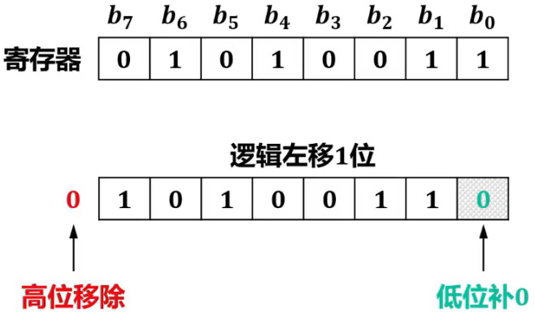
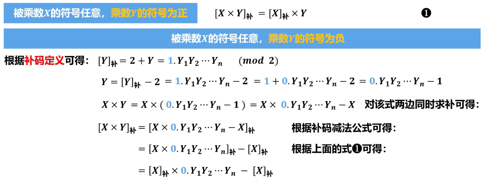
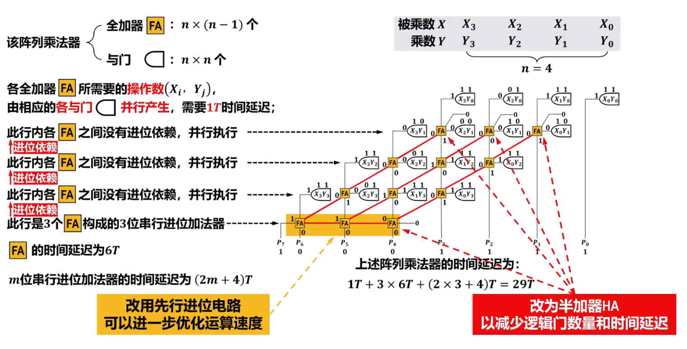

# 移位运算

## 逻辑移位
- 对象
  无符号数  
- 规则
  - 逻辑左移
  高位移除，低位补0  
      


  - 逻辑右移  
  低位移除，高位补0 
    
 
## 算术移位
- 对象
  有`符号数`(针对定点数，包括定点整数和定点小数)
- 不论正数还是负数，**符号位保特不变**，`仅对数值位进行移位`（左移或右移）
- 对真值的原码、反码和补码进行`算术移位`后，它们`各自所对应的新的真值应该保持一致`
#### 真值为`正数`
`真值的原码、反码和补码`都`相同`，因此，对它们进行`算术移位`后，它们各自所对应的新的真值自然是保持一致的。对于移位后出现的`空位`，规定**添补0**
- 左移时，若最高位丢1，则结果出错
- 右移时，若最低位丢1，则精度缺失
      
     

#### 真值为`负数`
`真值的原码、反码和补码`都`不同`，因此，对它们进行`算术移位后`，为了确保`它们各自所对应的新的真值保持一致`，对于移位后出现的`空位`，规定不同
  

### 总结
  

### 符号位也参与移位
- 左移  
  - 高位移除，低位添补0  
  - 移动前后若符号位发生变化，则发生溢出  
- 右移  
  - 低位移除，高位添补符号  
      

- 优点
    - 左移时，有检测出发生溢出的方法：符号位发生变化可判定溢出
    - 符号位与数值位一起移位，方便LU处理，也方便记忆


### C语言中的移位运算

- `左移`运算操作符“<”对应汇编指令中的逻辑左移，即**高位移除**，**低位补0**
- `右移`运算操作符“>>”则根据操作数是无符号还是有符号类型分别对应汇编指令中的逻辑右移和算术右移指令
  - `逻辑右移`：将**低位移除**，**高位补0**
  - `算术右移`：将**低位移除**，**高位补原数据的符号位**
  


## 循环移位

- 对象
  无符号数  
- 将无符号数二进制形式中的各个位向左或向右移动，被移出的位会重新出现在另一端，形成循环  
  
在很多处理器架构中，循环移位指令会影响状态寄存器中的进位标志CF(Carry Flag)位，CF标志位用于标识在执行算术或逻辑操作时是否发生了进位

#### 不带CF标志位的循环右移
  


#### 不带CF标志位的循环左移
  


#### 带CF标志位的循环右移
  


#### 带CF标志位的循环左移
  


#### 应用
- `加密算法`
  - 通过循环移位可以实现数据的混淆和置换，增强加密算法的安全性。
- `哈希函数`
  - 通过循环移位可以用来改变输入数据的排列顺序，以产生不同的哈希值，有利于增强哈希函数的混淆性和扩散性。
- `优化算法`
  - 在某些算法中，循环移位可以用于优化性能和节省资源。例如，在图形处理和数字信号处理中，循环移位可以用于加速算法的执行。

#### C语言实现
- C语言中并没有直接提供循环移位操作符。
  - 通常情况下，可以使用`移位运算操作符`(例如：左移“<<”或右移“>>”)和`位运算操作符`(或运算“|”)来实现。
```c
#include <stdio.h>
/*循环左移*/
unsigned int circularLeftShift(unsigned int value, int n)
{
    return (value << n) | (value >> (32 - n));
}

/*循环右移*/
unsigned int circularRightShift(unsigned int value, int n)
{
    return (value >> n) | (value << (32 - n));
}
int main()
{
    unsigned int usi = 0x12345678; // 待循环移位的32位无符号整数
    int d = 4;                     // 移位距离（即一次循环移动几位）

    printf("Original value:0x%x\n", usi);
    printf("Circular left shift by %d bits:0x%x\n", d, circularLeftShift(usi, d));
    printf("Circular right shift by %d bits:0x%x\n", d, circularRightShift(usi, d));

    return 0;
}
```

--- 
# 定点数的加法和减法运算
## 补码加减法运算公式
定点数（定点整数和定点小数）在计算机内部采用补码表示 **(运算规则简单，易于实现)**
- 补码的符号位可以与数值位一起参加运算
- 采用补码可将减法运算转换成加法运算
#### 公式
$[ A ] _ { 补 } + [ B ] _ { 补 } = [ A + B ] _ { 补 }$   
$[ A ] _ { 补 } - [ B ] _ { 补 } = [ A - B ] _ { 补 } = [ A ] _ { 补 } + [ - B ] _ { 补 }$
$$
(\mod M)
\begin{cases}
定点整数:M=2^{n+1} \\ \qquad ._{n为补码数值位的位数}\\
\\
定点小数:M=2^1=2\\
\end{cases}
$$
> [! example] $\quad$[补码定义](/408/principles/dataRepre.md#补码)$\qquad$[运算公式证明过程](https://www.bilibili.com/video/BV1yr42187B1?t=180.7&p=25)
 

## 补码加减法运算的溢出检测
#### 判断溢出的方法1
根据`操作数的符号位`与`运算结果的符号位`是否一致进行判断
- 两个操作数**相加**时，当它们的**符号位相同**（即同正或同负）时，才**可能发生溢出**


  


#### 判断溢出的方法2
根据运算过程中`最高数值位的进位`与`符号位的进位`是否一致进行判断
- **不同**可判定为**溢出**
- **相同**可判定为**没有溢出**
<!--    -->
  

- 最高数值位的进位记为$C_{n-1}$
- 符号位的进位记为$C_{n}$
- 溢出标志位记为0F,当0F为1时表示发生溢出  
$C_{n-1}$与$C_{n}$不同，则产生溢出(即0F为1)  
$OF = C _ { n - 1 } \oplus C _ { n }$

#### 判断溢出的方法3
利用`变形补码`(具有2位符号位的补码)的符号位进行判断  
- 变形补码也称为`双符号补码`，具有2个符号位，其余与补码相同
  - 双符号位为**00**时，表示**正数**
  - 双符号位为**11**时，表示**负数**
  - 双符号位为**01**时，表示**正溢出**
  - 双符号位为**10**时，表示**负溢出**  

> [! success] 正溢出和负溢出判断非常直观，适合手工运算时的溢出检测，但其硬件成本高，在计算机中主要采用单符号溢出检测方案

> [! info] 负数变形补码转换成原码仍可以使用反码法或扫描法


## 逻辑代数和逻辑门
#### 与门
  

#### 或门
  

#### 非门
  

#### 与非门
  
  

#### 或非门
  

#### 异或门
  

#### 同或门
  


## 串行进位加法器的硬件逻辑实现

<!-- 
!!! success  一位全加器的硬件逻辑实现

      
    ### 逻辑门
      
     
 -->


> [! cite]- 一位全加器的硬件逻辑实现
>   
> #### 逻辑门
>   
>   
> #### 实现
>   
>   

  
### 串行进位加法器的硬件逻辑实现
  
##### 溢出检测
  
  

### 减法
- Sub=1
  
 
- Sub=0 ， ==相当于低位进位$C_0$为0，不影响加法运算结果==
  

> [! cite]- 性能
>   
> 在n位串行进位加法器中，每个高位的一位全加器FA的运算依赖于相邻低位的一位FA的进位$C_{i+1}$因此所有一位FA不能并行运行，其时间关键延迟为(2n+4)T，与串行进位加法器的位数n呈线性关系当n较大时性能较差。


## 先行进位加法器的硬件逻辑实现
### 可级联的4位先行进位电路
$C _ { i + 1 } = G _ { i } + P _ { i } C _ { i }$  
$G _ { i } = X _ { i } Y _ { i } \qquad P _ { i } = X _ { i } \bigoplus { + } Y _ { i }$
- 电路逻辑
  

#### 四位快速加法器
  

#### 4位快速加法器与4位串行进位加法器性能比较
  

### 可级联的4位快速加法器
$C_{4}=G_{3}+P_{3}G_{2}+P_{3}P_{2}G_{1}+P_{3}P_{2}P_{1}G_{0}+P_{3}P_{2}P_{1}P_{0}C_{0}$  
$C_{4}=G^{*}+P^{*}C_{0}$  
$G^{*}=G_{3}+P_{3}G_{2}+P_{3}P_{2}G_{1}+P_{3}P_{2}P_{1}G_{0}$   
$P^*=P_3P_2P_1P_0$  


### 16位组内并行、组间并行加法器
  

- 对比
  

--- 
# 无符号数乘法运算的硬件逻辑实现


  

### 机器实现过程
$\text{设 }x=0.1101,\:y=0.1011,\:\text{计算 }x\times y$  
$x\times y=2^{-1}(\:x\times1+2^{-1}(\:x\times1+2^{-1}(\:x\times1+0\:)))$

##### 初始状态
  


##### $(X)+(ACC) \rightarrow ACC$
  

##### $(C_{out})、(ACC)、(MQ)>>1$
  

<!-- ##### $(X)+(ACC) \rightarrow ACC$
   -->
##### 表格展示
  

> [! cite]  $\text{设 }x=0.1001,y=0.011\text{,计算 }x\times y$


--- 
# 定点数的乘法运算
### 原码乘法运算的硬件逻辑实现
- 由于原码表示与无符号数非常类似，仅比无符号数多一个符号，而乘积的符号可以通过参与运算的两个数各自符号的**逻辑异或**求得，因此，上述无符号数乘法运算的硬件逻辑实现，可用于原码一位乘法，仅需添加符号位处理即可。

##### 流程图

  

##### 表格

  

- 对于定点整数原码乘法，其过程与定点小数原码乘法完全相同，仅将符号位与数值位之间的小数点改为逗号即可。
- 如果每次**根据乘数中的两位来计算位积**，则位积的数目会减少一半，因此循环累加次数将减少一半，可以大大提升乘法的运算速度，这种乘法称为**二位乘法**。

### 补码乘法运算的硬件逻辑实现
- 由于**计算机中采用补码表示数据**，如果用原码乘法计算两个数的乘积，则运算前需要将补码转换为原码、运算后还需要将原码再转换为补码，这样会增加许多操作步骤。为了减少处理环节，英国的布斯(Booth)夫妇于1950年提出了一种**补码乘法**，又称为**Booth算法**。

##### Booth算法
<!-- 好难，救命，别考 -->
  
  
  
  
  
  
$\begin{aligned}[x\times y\:]_{\text{补}}&=2^{-1}(2^{-1}(2^{-1}(2^{-1}(0+(0-1)\:[X]_{\text{补}})+(1-1)[X]_{\text{补}})+(1-0)[X]_{\text{补}})+(0-0)[X]_{\text{补}})+(0-1)[X]_{\text{补}}\\&=2^{-1}(2^{-1}(2^{-1}(2^{-1}(0+[-X]_{\text{补}})+0)+[X]_{\text{补}}\end{aligned}$
- 每轮次中的右移一位，全部是**补码的算术右移**，即移位后，空出的高位用符号位的值添补。
  

##### 初始化
  

##### $((\overline{\mathrm{X}})+1)+(\mathrm{ACC})\to\mathrm{ACC}$
  


##### $(ACC)、(MQ)>>1$
  

##### 表格
  

> [! cite]  $\text{设 }x=0.1101,\:y=-0.1001,\:\text{计算}[\:x\times y\:]_\text{补}$

##### 流程图
  

### 无符号阵列乘法器
- 原码、补码一位乘法的硬件逻辑实现，需要在时钟节拍下、通过控制逻辑的控制，执行相应轮次的“加法、右移”操作来实现，速度较慢  
- 为了提高运算速度，可以仅采用组合逻辑电路以专用硬件方式构建阵列乘法器  
- 构建阵列乘法器的基本思想是模仿二进制乘法的笔算方法  

#####  二进制乘法的笔算方法

 

##### 无符号阵列乘法器

<!--    -->
  
  

- 阵列乘法器结构规范标准化程度高，有利于布局布线，适合用超大规模集成电路实现，且可以获得较高的运算速度，其运算速度仅取决于逻辑门和加法器的传输延迟

### 补码阵列乘法器
[待补充……](https://www.bilibili.com/video/BV1Mw4m1U7NQ?t=3.6&p=35)

### 原码除法运算（恢复余数法）
- 由于原码表示与无符号数非常类似，仅比无符号数多一个符号，因此，进行原码除法运算时，**可将符号位与数值部分分开处理**。
  - 商的符号：由被除数和除数各自的**符号**进行**异或**运算求得
  - 商的数值部分：由被除数和除数各自的**数值部分**（即==真值的绝对值==）**相除**求得

  

- 以上是定点小数（纯小数）原码除法运算的处理方法，为了确保商和余数也为定点小数（即不发生溢出）上述除法的条件为$|X|<|Y|$
- 同理，定点整数原码除法运算的条件为$|X|\geq|Y|$

##### 原码除法的法则
1. 前提条件
   - 除数≠0
   - 定点小数：| 被除数 | $<$ | 除数 |
   - 定点整数：| 被除数 | $\geq$ | 除数 |
2. **商的符号**=被除数的符号⊕除数的符号
3. ==| 商 |== = | 被除数 | ÷ | 除数 |
4. 将**商的符号**与 ==| 商 |== 拼接在一起

##### 二进制除法笔算过程
  

##### 模拟二进制除法笔算过程
- 计算机无法直接判断大小，只能首先默认"够减"
  


  

- 从本例可以看出，由于运算过程中可能需要恢复余数，并且恢复余数的次数和具体的操作数相关，极端情况下每一步运算都需要恢复余数，因 此，该方法的最大**缺点**是运算**时间不确定**，另外，其**控制电路也比较复杂**  


> [!cite] $\text{设}[x]_{\text{原}}=0.1011,[y]_{\text{原}}=1.1101\text{,用恢复余数法,求}[x]_{\text{原}}\div[y]_{\text{原}}$

### 原码除法运算（不恢复余数法）
  

- 当第$i$次中间余数$R_i$为负时，可以**跳过恢复余数**这一步，直接求第$i+1$次中间余数$R_{i+1}$。这种算法称为**不恢复余数法**

##### 举例
  

> [!cite] $\text{设}[x]_\text{原}=0.1011,[y]_\text{原}=1.1101,\text{用不恢复余数法,求}[x]_\text{原}\div[y]_\text{原}$

### 补码除法运算（不恢复余数法）
[待补充……](https://www.bilibili.com/video/BV14w4m197Ub?t=13.2&p=38)

--- 
# 浮点运算
### 浮点加减法运算

1. 对阶
2. 尾数运算
3. 结果规格化
4. 舍入处理
   
  

- 在尾数右规时，尾数末位的几位会因超出计算机字长而被丢弃，从而产生误差。此时，计算机可以按选定的方式进行**舍入**操作  
- 在尾数规格化和尾数舍入时，可能会对结果的阶码执行加、减运算。因此，必须考虑结果的阶码出现**溢出**的问题  
	- 由于浮点数中阶码的位数决定了浮点数的表示范围，因此，对于浮点运算，当**阶码出现溢出时**，表示运算**结果出现溢出**

[待补充……](https://www.bilibili.com/video/BV1Lm421g7dG?t=152.1&p=39)

### IEEE 754浮点数加减法运算
同上


### 浮点数乘法
同上


### 浮点数除法
同上


--- 
# 运算器

- 计算机中的**各类算术运算**都可以**利用基本的定点加法运算和移位运算来实现**  
- 将实现加法运算、移位运算、逻辑运算以及各种算术运算所需的数字逻辑电路集成在一起，就可以构成**CPU中的运算器**
- 运算器一般分为以下两种
  - `定点运算器`：以**算术逻辑单元ALU**为核心，可以进行定点数的移位、算术、逻辑运算  
	- `浮点运算器`：以**浮点运算单元FPU**为核心，负责进行浮点数的算术运算  

> [! info] 浮点运算比定点运算复杂得多，因此，实现浮点运算的逻辑电路也比较复杂，早期将其实现电路集成在一个单独的芯片中，目前大多集成在CPU内部

  

- 不同计算机利用这些标志的方法和时机可能不同


