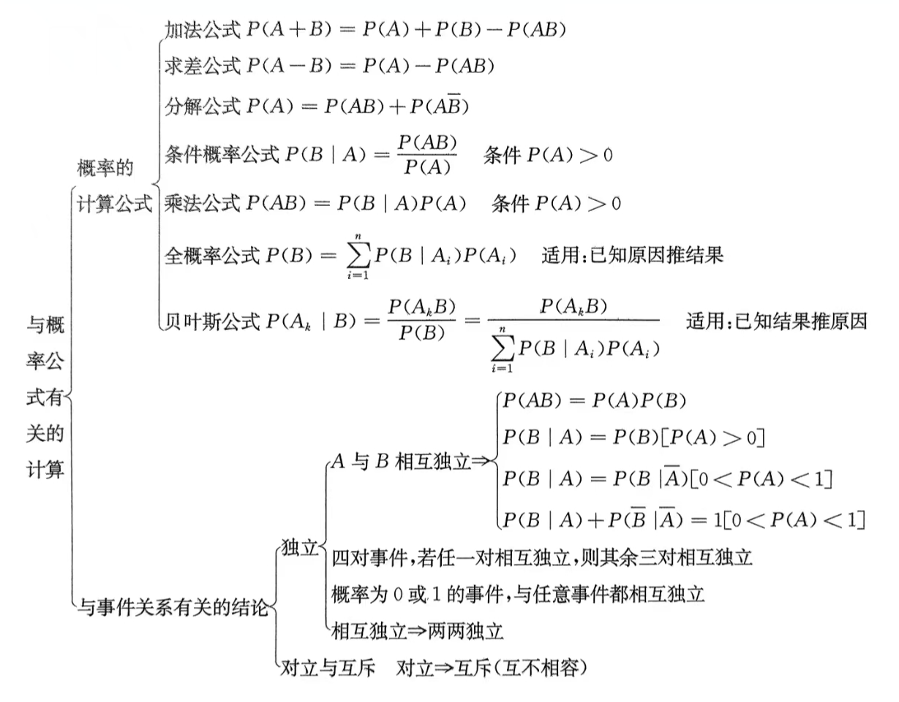
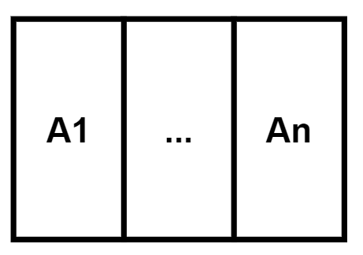

  

# 事件运算

1. $A\cup B=B\cup A$  
   $A\cap B=B\cap A$  
2. $A\cup (B\cup C)=(A\cup B)\cup C$  
   $A\cap (B\cap C)=(A\cap B)\cap C$  
3. $A\cup (B\cap C)=(A\cup B)\cap (A\cup C)$  
   $A\cap (B\cup C)=(A\cap B)\cup (A\cap C)$  
4. $\overline{A\cup B}=\overline{A} \cap \overline{B}$  
   $\overline{A\cap B}=\overline{A} \cup \overline{B}$

# 推导
1. $A\subset B \Rightarrow P(A) \leq P(B)$  
2. $P(\overline{A})=1-P(A)$  
3. $P(A\overline{B})=P(A)-P(AB)$  
4. $P(A+B)=P(A\cup B)=P(A)+P(B)-P(AB)$   
5. $P(A-B)=P(A)-P(AB)$  
6. 在 $A$ 已经发生的条件下，$B$ 发生的概率为 $$P(A|B)=\frac{P(AB)}{(B)}$$  
7. $P(B \cup C | A)=P(B|A)+P(C|A)-P(BC|A)$  
8. 若 $A,B$ 独立 $\Rightarrow P(AB)=P(A)·P(B)$ 
9. 若 $A,B$ 独立，则 $A$ 与 $\overline{B}$ ， $\overline{A}$ 与 $B$ ， $\overline{A}$ 与 $\overline{B}$  独立  
10. 若 $P(A)>0$ 且 $P(B)>0 \Rightarrow A,B$ 独立则不互斥，互斥则不独立  
   只有 $P(A)=0$ 时，二者互斥又独立  

> [!danger] 事件可以推概率，概率不能推事件  
> 例：$P$ 为 $0-1$ 所有实数， $P\{ x=\frac{1}{2}\} =0$ ，但 $x=\frac{1}{2}$ 不是 $\varnothing$  
> $\qquad x=\frac{1}{2}$ 是一个点，长度为 $0$ ，所以概率为 $0$   
>   
> 例：$A,B$ 互斥 $\Rightarrow AB=\varnothing \Rightarrow P(AB)=0$

# n次独立重复实验

成功的概率为 $p$ ，失败的概率为 $q$  ，$n$ 次实验中成功的次数 $k$ 的概率为 $$P\{X=k\}=C_n^k ·p^k·q^{n-k}=C_n^k·p^k·(1-p)^{n-k}$$

# 全概率事件
> 定义：$A_1,...,A_n$ 为一组随机事件  
> $① . \   A_1,...,A_n两两互斥$  
> $\displaystyle ② .\bigcup_{i=1}^{n} A_n =\Omega$  
> 称 $A_1,...,A_n$ 为一个完备事件组  

<!--    -->

## 全概率公式
>（已知第一阶段概率，求第二阶段）  
 
$A_1,...,A_n$ 为一个**完备事件组** ，$B$ 为**任意事件**  

$\color{teal} P(B)=P(B\cap \Omega)=P(B\cap (A_1\cup \dots \cup A_n))$   
$\color{teal} =P((B\cap A_1)\cup \dots \cup (B\cap A_n))$  
$\because A_1,...,A_n$ 两两互斥    
$\therefore B\cap A_1,\dots,B\cap A_n$ 两两互斥   

又 $\because$ 若 $A,B$ 互斥 $\Rightarrow P(AB)=0 \Rightarrow P(A\cup B)=P(A)+P(B)-P(AB)$  
推广至 $A_1,...,A_n$ 得  
$\color{teal} P(B)=P(B\cap A_1)+\dots+P(B\cap A_n)$  
$\  \qquad =P(B A_1)+\dots+P(B  A_n)$  

又 $P(B|A_i)=\frac{P(BA_i)}{P(A_i)} \Rightarrow P(BA_i)=P(A_i)·P(B|A_i)$  
$\color{teal} \therefore P(B)=P(A_1)·P(B|A_1)+\dots+P(A_n)·P(B|A_n)$  
$\color{teal} \  \quad  \qquad =\displaystyle \sum_{i=1}^{n} P(A_i)·P(B|A_i)$

## $Bayes$(贝叶斯) 公式
>（已知第二阶段概率，求第一阶段）  

$A_1,...,A_n$ 为一个**完备事件组** ，$B$ 为**任意事件**  
$P(A_i|B)=\Large{\frac{P(A_i B)}{P(B)}=\frac{P(A_i)·P(B|A_i)}{P(B)}}$

# 泊松分布
$X$ 服从泊松分布，则 $$P\{X=k\}=\large{\frac{\lambda^k}{k!}e^{-\lambda}}$$
