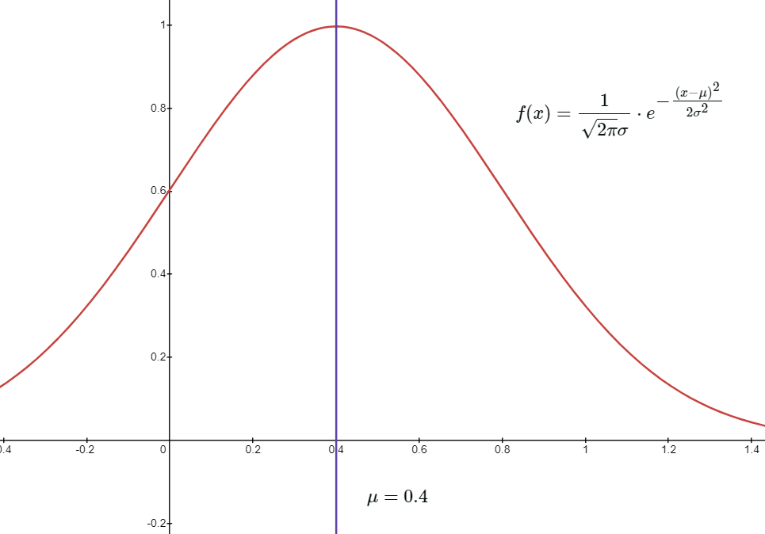

# 随机变量分布函数
$F(x)=P\{X\leqslant x\}=P\{X\in (-\infty,x]\}$
> $P\{X=a\}=P\{X\leqslant a\}-P\{X<a\}$  
> $\qquad \   \qquad =F(a)-F(a-0)$

$F(x)$ **的性质**
1. $0\leqslant F(x) \leqslant 1$  
2. $F(x)$ 单调上升  
3. $F(x)$ **右**连续  
4. $F(-\infty)=0,F(+\infty)=1$

对于离散型随机变量 $X$ , $X$ 的取值可能是可列个  
$P\{X =x_i\}=p_i$

> **注:**
> 1. $0\leqslant p_i \leqslant 1$  
> 2. $\displaystyle \sum_{i=1}^{\infty} p_i=1$
> 3. 对于 $X$ 的分布函数 $F(x)=P\{X\leqslant x\}$  
>     $P\{X=a\}=F(a)-F(a-0)$  

# 连续型随机变量
 $X$ 的分布函数为 $F(x),$ $\exists f(x) \geqslant ,f(x)$ 可积，$\forall x$ 有 $F(x)=\int_{-\infty}^{x} f(t)\mathrm{d}t$   
则称 $X$ 为**连续性随机变量**，$f(x)$ 为 $X$ 的**概率密度**

$f(x)$  **的性质:**
1. $f(x)\geqslant 0$ 
2. $\int_{-\infty}^{+\infty} f(x)\mathrm{d}x=1$   
3. $F(x)=\int_{-\infty}^{x} f(t)\mathrm{d}t$ 一定连续但不一定可导  
4. $P\{X=a\}=F(a)-F(a-0)=0$  
   (连续型随机变量在任一点出概率为0)
5. 若 $F(x)$ 可导,则 $F'(x)=f(x)$

# 常见分布
## 离散型
####  $0-1$ 分布
$X$ 为 $0$ 或 $1$ ，且  
$P\{X=1\}=p$  
$P\{X=0\}=1-p$ 
$$X\sim \begin{pmatrix}0 & 1 \\ 1-p & p \end{pmatrix}$$
称 $X$ 服从 $0-1$ 分布，  
**记为** $X\sim B(1,p)$  
> [!danger] 期望 $E(x)=p$ 
方差 $D(x)=p(1-p)$ 

#### 二项分布
> ( $0-1$ 分布就是 $n=1$ 时的二项分布)  

$X$ 的分布律为 $P\{X=k\}=C_n^k·p^k·(1-p)^{n-k}$   
 **记为** $X\sim B(n,p)$  

> [!danger] 期望 $E(x)=np$ 
方差 $D(x)=np(1-p)$ 

#### 泊松分布
$X$ 服从泊松分布，则 $$P\{X=k\}=\large{\frac{\lambda^k}{k!}e^{-\lambda}}$$

**记为** $X\sim P(\lambda)$  

> [!danger] 期望 $E(x)=\lambda$ 
方差 $D(x)=\lambda$ 

#### 几何分布

$X$ 的分布律为 $$P\{X=k\}=p·(1-p)^{k-1}$$   
**记为** $X\sim G(p)$  

> [!danger] 期望 $E(x)=\large \frac{1}{p}$ 
方差 $D(x)=\large \frac{1-p}{p^2}$ 

## 连续型
#### 均匀分布
$$f(x) = 
 \begin{cases}
 \large \frac{1}{b-a},\qquad a\leqslant x
 \leqslant b\\
 0,\qquad 其他\\
 \end{cases}$$
**记为** $X\sim U(a,b)$  

> [!danger] 期望 $E(x)=\large \frac{a+b}{2}$ 
方差 $D(x)=\large \frac{(b-a)^2}{12}$ 

#### 指数分布
$$
 f(x) = 
 \begin{cases}
 \large \lambda·e^{-\lambda x},\qquad x>0\\
 0,\qquad 其他\\
 \end{cases}
$$
**记为** $X\sim E(\lambda)$  

**结论**：若 $X\sim E(\lambda)$ ，则 $P\{X>a+b | X>a\}=P\{X>b\}$  
(指数分布的无记忆性)

> [!danger] 期望 $E(x)=\large \frac{1}{\lambda}$ 
方差 $D(x)=\large \frac{1}{\lambda^2}$ 

#### 正态分布
$$f(x)=\frac{1}{\sqrt{2\pi}\sigma} · e^{\Large {-\frac{(x-\mu)^2}{2\sigma^2} } }$$

**记为** $X\sim N(\mu,\sigma^2)$  

> [!danger] 期望 $E(x)=\large \frac{1}{\lambda}$ 
方差 $D(x)=\large \frac{1}{\lambda^2}$ 

> [!cite]- 图片 
>   

标准正态分布函数 $X\sim N(0,1)$ 概率密度为 $$\psi(x)=\frac{1}{\sqrt{2\pi}}·e^{\Large -\frac{x^2}{2}}$$  

其分布函数表示为 $$\Psi(x)=\int^x_{- \infty }\psi(t)dt$$

**记为**： $X\sim N(0,1)$   
**性质**：  
1. $\Psi(0)=\frac{1}{2}$  
2. $\Psi(-a)=1-\Psi(a)$  

**若** $X\sim N(\mu,\sigma^2)$  
**则** ：
1. $\Psi(\mu)=P\{X\leqslant \mu \}=P\{X\geqslant \mu \}=\frac{1}{2}$   
2. $\large \frac{X-\mu}{\sigma}\sim N(0,1)$  
3. $P\{a\leqslant X\leqslant b \}=P\{X\leqslant b\}-P\{X<a\}$  
   $=P\{\frac{x-\mu}{\sigma}\leqslant \frac{b-\mu}{\sigma}\}-P\{\frac{x-\mu}{\sigma}< \frac{a-\mu}{\sigma}\}$  
   $=\Psi \{\frac{b-\mu}{\sigma}\} - \Psi\{\frac{a-\mu}{\sigma}\}$  

