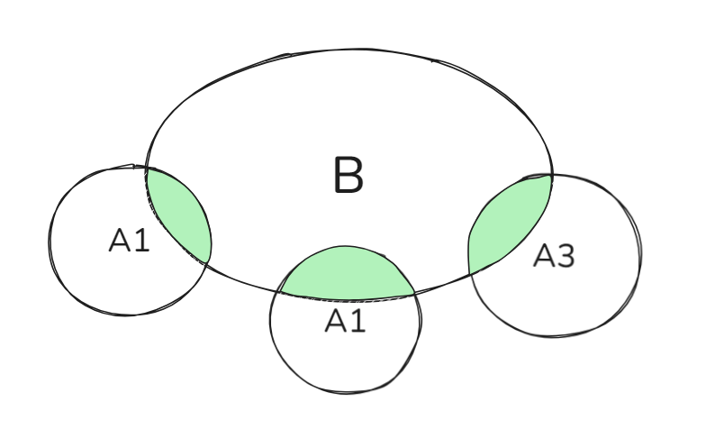

# 二维随机变量

$X,Y$ 为两个随机变量，称 $(X，Y)$ 为二维随机变量  
**定义**：
$$F\{x,y\}=P\{X\leqslant x,Y\leqslant y\}$$  
称为 $(X，Y)$ 的联合分布函数  
即，用一个 ' $\cap$ ' 事件来定义二维随机变量的**分布函数**  

$X$ **的边缘分布函数**  
$F_x(x)=P\{X\leqslant x\}$ ,即 $P(A)$  
$F_y(y)=P\{Y\leqslant y\}$ ,即 $P(B)$  

与一维随机变量类似  
$F(X，Y)$ 的 **性质** 有：
1. $0\leqslant F(X，Y)\leqslant 1$  
2. $F_1' \geqslant 0,F_2' \geqslant 0$  
3. $F(X，Y)$ 关于 $x,y$ 右连续   
4. $F(+\infty，-\infty)=1$  

# 离散型 $(X，Y)$ 
$P\{X=x_i,Y=y_i\}=p_{ij}(i=1,\dots ,m;j=1,\dots ,n)$ 

$1.\displaystyle  \sum_{i=1}^{m} \sum_{j=1}^{n}=1$  
$2. p_{ij}\geqslant 0$

#### 边缘分布律
$F_x(x)=P\{X=x_i\}$ ， $Y$ 的取指只有 $y_1,y_2,\dots ,y_n$ ，且 $Y=y_i$  互斥  $Y=y_1,\dots ,Y=y_n$ 构成一个完备事件集  

$\therefore F_x(x)=P\{X=x_i\}=P\{X=x_i \cap \Omega\}$  
$\qquad \quad \  \   =P\{X=x_i \cap (Y=y_1\cup \dots \cup Y=y_n)\}$  
$\qquad \quad \  \   =P\{(X=x_i \cap Y=y_1) \cup \dots  \cup (X=x_i \cap Y=y_n)\}$  
$\qquad \quad \  \   =P\{(X=x_i \cap Y=y_1)\} \cup \dots  \cup  P\{(X=x_i \cap Y=y_n)\}$  
$\qquad \quad \  \   =p_{i1}+\dots +p_{ij}=\color{red}{p_{i}}$  

> $\because Y=y_1,\dots ,Y=y_n$ 互斥  
> $\therefore X=x_i \cap Y=y_1,\dots ,X=x_i \cap Y=y_n$ 互斥  

  

而$P(A\cup B)=P(A)+P(B)-P(AB)$   
$\because AB$ 互斥  
$\therefore P(AB)=0$  
$\therefore P(A\cup B)=P(A)+P(B)$  
同理，$F_y(y)=P\{Y=y_i\}=p_{1j}+\dots +p_{mj}=\color{red}{p_{j}}$

# 连续型 $(X，Y)$ 
#### 联合分布函数
$F(x,y)=P\{X\leqslant x,Y\leqslant y\}$  

$=\displaystyle \int^x_{-\infty} du\int^y_{-\infty}f(u,v)dv$  

其中  $f(u,v)$ 称为 $(x,y)$  的联合概率
#### 边缘概率密度
关于 $X:\qquad f_X(x)=\displaystyle \int^{+\infty}_{-\infty}f(x,y)dy$

关于 $Y:\qquad f_Y(y)=\displaystyle \int^{+\infty}_{-\infty}f(x,y)dx$

# 条件分布
离散型 $(X，Y)：P\{X=x_i,Y=y_i\}=p_{ij}$   
对于 $\{Y=y_i\}$ 发生的条件下，$\{X=x_i\}$ 发生的概率：$$P\{X=x_i|Y=y_i\}=\frac{P(AB)}{P(A)}=\frac{p_{ij}}{p_j}$$  
同理 $P\{Y=y_i|X=x_i\}=\Large \frac{p_{ij}}{p_i}$

> 一般研究连续型随机变量时，主要研究概率密度  

#### 概率密度？

对于 $(X，Y)$ ，若 $X，Y$ 独立  
则 $F(x，y)=F_X(x)·F_Y(y)$ 
- 不会独立使用

**离散**：$p_{ij}=p_i · p_j$

 <!-- $P\{\}$  -->