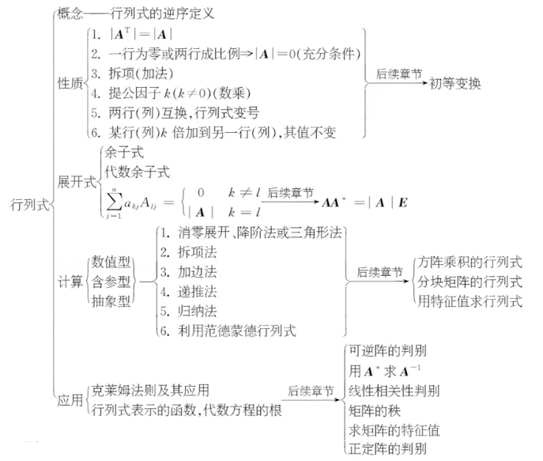

  

# 行列式的性质

1. 行列互换，值不变
   $|A|=|A^T|$
2. 某行（列）为全0，值为0
3. 某行（列）有公因子
$$
 \left|\begin{matrix}
    a_{11} & a_{12} & a_{13} \\
    ka_{21} & ka_{22} & ka_{23} \\
    a_{31} & a_{32} & a_{33}
   \end{matrix} \right| =k\left|\begin{matrix}
    a_{11} & a_{12} & a_{13} \\
    a_{21} & a_{22} & a_{23} \\
    a_{31} & a_{32} & a_{33}
   \end{matrix} \right|
 $$

4. 行列式加减
$$
 \left|\begin{matrix}
    a_{11} & a_{12} & a_{13} \\
    a_{21}+b_{21} & a_{22}+b_{22} & a_{23}+b_{23} \\
    a_{31} & a_{32} & a_{33}
   \end{matrix} \right| =\left|\begin{matrix}
    a_{11} & a_{12} & a_{13} \\
    a_{21} & a_{22} & a_{23} \\
    a_{31} & a_{32} & a_{33}
   \end{matrix} \right|+\left|\begin{matrix}
    a_{11} & a_{12} & a_{13} \\
    b_{21} & b_{22} & b_{23} \\
    a_{31} & a_{32} & a_{33}
   \end{matrix} \right|
 $$
 > $|A|+|B|\neq|A+B|$
5. 换行反号
6. 倍加不变
7. 成比例为0

# 展开定理

#### 余子式
$$
M_{23}=
\left|\begin{matrix}
    a_{11} & a_{12} & a_{14} \\
    a_{31} & a_{32} & a_{34} \\
    a_{41} & a_{42} & a_{44}
   \end{matrix} \right|
$$
#### 代数余子式
$$A_{ij}=(-1)^{i+j}M_{ij}$$
#### 行列式展开公式

$$
|A|=a_{i1}A_{i1}+a_{i2}A_{i2}+…+a_{in}A_{in}= \sum_{k=1}^n a_{ik}A_{ik} , i=1,2,…,n$$
或
$$
|A|=a_{1j}A_{1j}+a_{2j}A_{2j}+…+a_{nj}A_{nj}= \sum_{k=1}^n a_{kj}A_{kj} , j=1,2,…,n
$$

# 重要公式及结论

> 设$A$,$B$ 均为 $n$阶方阵，则有：

1. $|kA|=k^n|A| , (k\in R), \qquad |A|=|A^T|$  
2. $|AB|=|A| |B|=|B||A|=|BA|$  
3. $|A^*|=|A|^{n-1}\quad (AA^*=A^*A=|A|E)$  
4. 若 $A$ 可逆 $(|A|\neq 0)$ ，则 $|A^{-1}|=|A|^{-1}$ ，此时， $A^*$ 也可逆， $(A^*)^*$ 也可逆，而 $(A^*)^*=|A^*|(A^*)^{-1}=|A|^{n-2}A$，于是 $$|(A^*)^*|=(|A|^{n-2})^n|A|=|A|^{n^2-2n+1}=|A|^{(n-1)^2}$$  
5. 若方阵$A=(a_{ij}),\lambda_i(i=1,2,…,n)$是A的特征值 ，则$$|A|=\prod_{i=1}^n\lambda_i \quad , \quad \sum^n_{i=1}a_{ii}=\sum^n_{i=1}\lambda_i$$  
6. 若 $A$ 与 $B$ 相似(即有逆矩阵 $P$，使得 $P^{-1}AP=B$)，则 $|A|=|B|$  
7. 若 $A$ 为正交矩阵 $(AA^T=A^TA=E)$ ，则 $|A|=|B|$  
8. 若 $aA+bE$ 不可逆，则  $|aA+bE|=0$  ，得 $A$ 有特征值 $-\frac{b}{a}$ 
9. 求行列式公式
   1. $A$ 为 $n$ 阶可逆矩阵，$\alpha ， \beta$ 是 $n$ 维逆向量，有 $$|A+\alpha \beta ^T|=|A|(1+\beta ^TA^{-1}\alpha)$$ 
   2. $\alpha ， \beta$ 为 $n$ 维向量，当 $n>1$ 时，有 $$|\lambda E+\alpha \beta ^T|=\lambda ^{n-1}(\lambda+\beta ^T \alpha)$$ 
把 $n$ 阶行列式 $D_n$ 对应的矩阵改写为 $$M= \begin{bmatrix}
 x+a_1&a_2&\cdots&a_n\\
a_1&x+a_2&\cdots&a_n\\
 \vdots&  \vdots&& \vdots\\
 a_1&a_2&\cdots&x+a_n\\
 \end{bmatrix}=A+\alpha \beta ^T
 $$其中，$A=\begin{bmatrix}
 x&0&\cdots&0\\
0&x&\cdots&0\\
 \vdots&  \vdots&& \vdots\\
 0&0&\cdots&x\\
 \end{bmatrix}$, $\alpha=\begin{bmatrix}
1\\
1\\
 \vdots\\
1\\
 \end{bmatrix}$ , $\beta=\begin{bmatrix}
a_1\\
a_2\\
 \vdots\\
a_n\\
 \end{bmatrix}$
 则 $$D_n=|A+\alpha \beta ^T|=|A|(1+\beta ^TA^{-1}\alpha)\\
 =x^n(1+\frac{1}{x} \sum^n_{i=1})=x^{n-1}(x+\sum_{i=1}^n a_i)$$

# 计算

#### 两杠一星
$$
D_n=
 \begin{vmatrix}
 a & b & & & \\
   & a & b & &\\
   &   & a & \ddots  & \\
   &   &   & \ddots & b\\
b &   &   &   & a  \\
 \end{vmatrix}=a^n+(-1)^{n-1}b^n
 $$

#### 拉普拉斯
$$
 \begin{vmatrix}
 a_{11} & \cdots & a_{1n} & c_{11} & \cdots &c_{1m} \\
 \vdots &&\vdots &\vdots &&\vdots \\
 a_{n1} & \cdots & a_{nn} & c_{n1} & \cdots &c_{nm} \\
0 & \cdots & 0 & b_{11} & \cdots &b_{1m} \\
 \vdots &&\vdots &\vdots &&\vdots \\
0 & \cdots & 0 & b_{m1} & \cdots &b_{mm} \\
 \end{vmatrix}= \begin{vmatrix}
 a_{11} & \cdots & a_{1n} \\
 \vdots &&\vdots  \\
 a_{n1} & \cdots & a_{nn} \
 \end{vmatrix} · \begin{vmatrix}
 b_{11} & \cdots & b_{1n} \\
 \vdots &&\vdots  \\
 b_{n1} & \cdots & b_{nn} \
 \end{vmatrix} 
 $$

#### 范德蒙
$$
D_n=
 \begin{vmatrix}
 1&1&\cdots &1 \\  
 x_1&x_2&\cdots &x_n \\
 x^2_1 & x^2_2&\cdots & x^2_n \\
 \vdots & \vdots & &\vdots \\
 x^{n-1}_1 & x^{n-1}_2&\cdots & x^{n-1}_n \\
 \end{vmatrix}= \prod_{1\leqslant j<i\leqslant n} (x_i-x_j)
 $$

#### 爪形
$$
D_n=
 \begin{vmatrix}
 x_1&1&\cdots &1 \\  
 1&x_2&\cdots &0 \\
 1 &  0&\cdots & 0 \\
 \vdots & \vdots & &\vdots \\
 1 & 0&\cdots & x_n \\
 \end{vmatrix}= x_2…x_n(x_1-\sum_{i=2}^n \frac{1}{x_i})
 $$

#### 归纳法
$$
A=
 \begin{vmatrix}
 2a & 1 & & & &\\
  a^2 & 2a & 1 & &\\
   & a^2  & 2a & 1  & \\
   &   &  \ddots & \ddots & \ddots\\
   &   &   & a^2  & 2a  &1\\
   &   &  &  & a^2  & 2a  \\
 \end{vmatrix}=(n+1)a^n
 $$
#### 行列和相等

$$
D_n=
 \begin{vmatrix}
a&b&b&\cdots &b \\  
 b&a&b&\cdots &b \\
 b &  b&a&\cdots & b \\
 \vdots & \vdots & &\vdots \\
b & b&b&\cdots & a \\
 \end{vmatrix}= [a+(n-1)b](a-b)^{n-1}
 $$