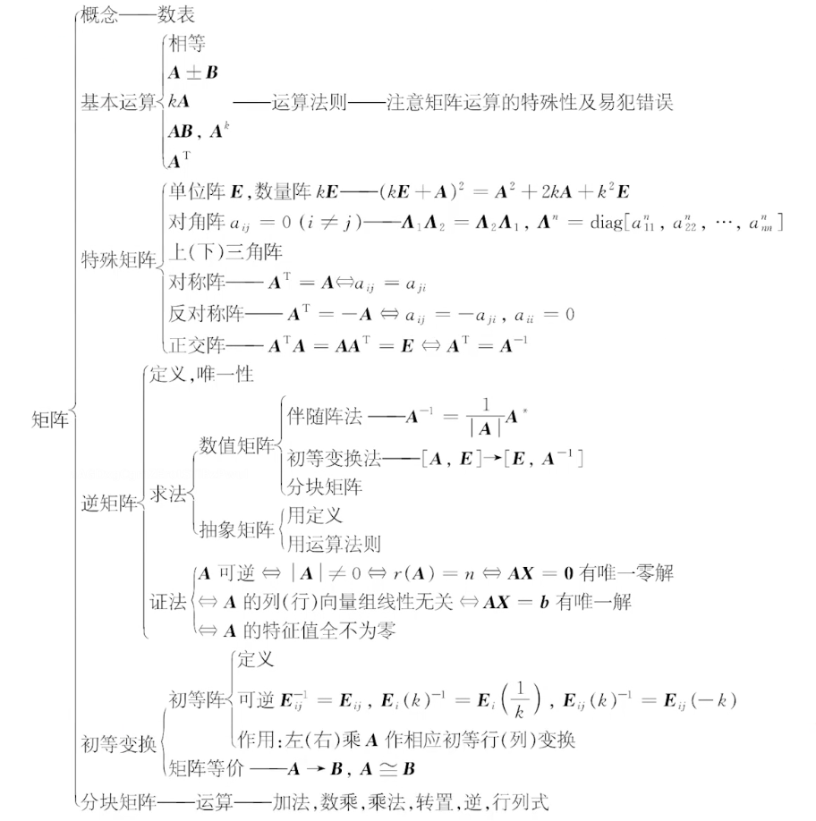

  

# 矩阵的运算
#### 加法 
$$C=A+B=(a_{ij})_{m\times n}+(b_{ij})_{m\times n}=(c_{ij})_{m\times n}$$  
其中，$(c_{ij})=(a_{ij})+(b_{ij})\quad (i=1,2,\dots ,m\   ;\   j=1,2,\dots ,n)$

#### 数乘矩阵 

1. 交换律
2. 结合律
3. 分配律
4. 数与矩阵结合律
- $kA=Ak=(ka_{ij})_{m\times n}$  
- $|kA|=k^n|A|\ne k|A|\quad (n\geqslant 2,k\ne 1,0)$  
- $|A+B|\ne |A|+|B|$

#### 矩阵的乘法 

1. 结合律
2. 分配律
- $A_{m\times s}B_{s\times n}=C_{m\times n}$

#### 转置矩阵

- $A_{m\times n}\qquad \rightarrow \qquad A^T_{n\times m}$   
- $(A^T)^T=A$  
- $(kA^T)=kA^T$  
- $(A+B)^T=A^T+B^T$  
- $(AB)^T=B^TA^T$  
- $|A^T|=|A|^T=|A|$  

#### 特殊矩阵  

- 零矩阵  
- **单位阵**：对角为1  
- 数量阵：数k和单位阵乘积  
- **对角阵**：非对角为0  
- 上下三角矩阵  
- 对称阵：$A=A^T$  
- 反对称阵：$-A=A^T$    
- 正交阵：$A^{-1}=A^T或AA^T=A^TA=E$    

#### 注意  

- $AB\ne BA$  
- $AB=AC \nRightarrow B=C$  
- $AB=O \nRightarrow A=O或B=O$

# 矩阵的逆和伴随矩阵
#### 定义  
**逆矩阵**  
$A,B$ 是 $n$ 阶方阵，若 $AB=BA=E$   ，则称 $A$ 是可逆阵，  是 $B$ 的逆矩阵  

- 若 $A$ 是一个 $n$ 阶可逆阵，则他的逆矩阵是唯一的，记为 $A^{-1}$    
-  $n$ 阶方阵 $A$ 可逆的充分必要条件是 $|A|\ne 0$  

**伴随矩阵**  
代数余子式+转置
$$A^*=
\left|\begin{matrix}
    A_{11} & A_{21} & \dots & A_{n1} \\
    A_{12} & A_{22} & \dots & A_{n2} \\
     \vdots &  \vdots &   &  \vdots \\
    A_{1n} & A_{2n} & \dots & A_{nn}
   \end{matrix} \right|$$

**求逆公式**
$$AA^*=A^*A=|A|E$$
$$A^{-1}=\frac{1}{|A|}A^*$$

#### 逆矩阵性质
$A,B$ 是同阶可逆矩阵  
- $(A^{-1})^{-1}=A$   
- 若 $k=0$ ，则 $(kA)^{-1}=k^{-1}A^{-1}$  
-  $AB$ 也可逆，且 $(AB)^{-1}=B^{-1}A^{-1}$  
-  $A^T$ 也可逆，且 $(A^T)^{-1}=(A^{-1})^T$  
- $|A^{-1}|=|A|^{-1}=\displaystyle \frac{1}{|A|}$

#### 求逆矩阵的方法 
**方法一**  
伴随矩阵，若 $|A|\ne 0$ ，则 $A$ 可逆，且 $|A|^{-1}=\displaystyle \frac{1}{|A|}$ 

**方法二**  
初等变换，$$[A,E]\quad  \xrightarrow{\text{初等行变换}} \quad [E,A^{-1}]$$

**方法三**  
用定义，求矩阵 $B$ 使 $AB=E\quad (或BA=E)$  ，则 $A$ 可逆，且 $A^{-1}=B$

**方法四**  
将 $A$ 分解成若干个可逆矩阵的方法，因为两个可逆阵的积仍是可逆阵，即若 $C=AB$ ，其中 $A,B$ 均可逆，则 $C$ 可逆，且 $C^{-1}=(AB)^{-1}=B^{-1}A^{-1}$  

#### 伴随矩阵性质
当$|A|\ne 0$时，有  
- $A^*=|A|\   A^{-1}$  
- $(kA)^*=k^{n-1}A^*$  
- $A^T(A^T)^*=|A|\   E$  
- $(A^{-1})(A^{-1})=|A^{-1}|\   E$  
- $A^*(A^*)^*=|A^*|\  E$  
- $(AB)^*=B^*A^*$  
- $(A^*)^*=|A|^{n-2}A$  

$r(A^*)=
\begin{cases}
n, & r(A)=n \\
1, & r(A)=n-1 \\
0, & r(A)<n-1 \\
\end{cases}$

# 初等变换和初等矩阵
#### 初等阵的性质 
- 初等阵的转置仍是初等阵  
- 因$|E_i(k)|=k\ne 0,\quad |E_{ij}|=-1\ne 0,\quad |E_{ij}(k)|=1\ne 0$，故初等阵都是可逆阵，且 $$\color{red}E_i(k)^{-1}=E_i(\frac{1}{k}),\quad E_{ij}^{-1}=E_{ij},\quad E_{ij}(k)^{-1}=E_{ij}(-k)$$  其逆矩阵仍是初等阵  
- 若 $A$ 是可逆阵，则 $A$ 可以表示成一系列初等阵的乘积，即 $A=P_1,P_2,\dots ,P_s$  ，其中 $P_1,P_2,\dots ,P_s$  是初等阵  
- 对 $n$ 阶方阵 $A$ 进行**初等行变换**，相当于将矩阵 $A$ **左乘**以相应的初等阵  
  同样，对 $A$ 进行**初等列变换**相当于矩阵 $A$ **右乘**以相应的初等阵

|               | $E_{ij}$        | $E_{i}(k)$                         | $E_{ij}(k)$                   |
| ------------- | --------------- | ---------------------------------- | ----------------------------- |
| 左（行）      | 交换第 $i,j$ 行 | 第 $i$ 行乘 $k$                    | 第 $j$ 行 $k$ 倍加至第 $i$ 行 |
| 右（列）      | 交换第 $i,j$ 列 | 第 $i$ 列乘 $k$                    | 第 $i$ 列 $k$ 倍加至第 $j$ 列 |
| \| $\quad$ \| | $-1$            | $k$                                | $1$                           |
| 逆            | $E_{ij}$        | $E_{i}(\displaystyle \frac{1}{k})$ | $E_{ij}(-k)$                  |
| 转置          | $E_{ij}$        | $E_{i}(k)$                         | $E_{ji}(k)$                   |

#### 初等变换求逆矩阵 

$$[A,E]\quad  \xrightarrow{\text{初等行变换}} \quad [E,A^{-1}]$$
$$\begin{bmatrix}A \\ E \end{bmatrix}\quad  \xrightarrow{\text{初等列变换}} \quad   \begin{bmatrix}E^{-1} \\ A \end{bmatrix}$$

#### 矩阵的k阶子式 

 $m\times n$ 矩阵 $A$ 的任意 $k$ 行与任意 $k$ 列交叉处的 $k^2$ 个元素构成的 $k$ 阶行列式称为矩阵 $A$ 的 $k$ 阶子式，显然矩阵 $A$ 有 $C_m^kC_n^k$ 个 $k$ 阶子式

#### 矩阵的秩 

若矩阵 $A$ 的 $k$ 阶子式是不等于零的最高阶子式，则秩 $(A)=r(A)=k$  

#### 矩阵秩的求法 

$A \xrightarrow{\text{初等行变换}} B$ （行阶梯形矩阵），则 $(A)=r(B)=B$ 的非零行数

#### 满秩矩阵 
- 若 $n$ 阶方阵 $A$ 的秩为 $n$ ，则称矩阵 $A$ 为满秩矩阵  
-  $A$ 是可逆矩阵 $\Leftrightarrow$ $A$ 是满秩矩阵 $\Leftrightarrow$  $A$ 是非奇异矩阵 

#### 矩阵的标准形

若  $m\times n$ 矩阵 $A$ 的秩为 $r$ ，则 $A$ 总可以通过有限次初等变换为 $\begin{bmatrix}E_r & O \\ O & O  \end{bmatrix}$ ，该矩阵称为矩阵 $A$ 的标准型

#### A和B等价

$A$ 和 $B$ 等价 $\Leftrightarrow$ 存在可逆阵 $P,Q$ 使得 $PAQ=B$ 

# 分块矩阵
#### 分块矩阵的转置
$$A=\begin{bmatrix}A_{11} & A_{12} \\ A_{21} & A_{22}  \end{bmatrix}$$
$$A^T=\begin{bmatrix}A_{11} & A_{12} \\ A_{21} & A_{22}  \end{bmatrix}^T=\begin{bmatrix}A_{11}^T & A_{21}^T \\ A_{12}^T & A_{22}^T  \end{bmatrix}$$

#### 可逆分块矩阵的逆矩阵
设对角矩阵：
$$A=\begin{bmatrix}A_{1} & & & \\ & A_{2} \\ & & \ddots \\ & & & A_s \end{bmatrix}$$
$A$ 可逆 $\Leftrightarrow$ $|A|\ne 0,|A_i|\ne 0,i=1,2,\dots ,s$ 且：
$$A^{-1}=\begin{bmatrix}A_{1} & & & \\ & A_{2} \\ & & \ddots \\ & & & A_s  \end{bmatrix}^{-1}=\begin{bmatrix}A_{1}^{-1} & & & \\ & A_{2}^{-1} \\ & & \ddots \\ & & & A_s^{-1}  \end{bmatrix}$$
若 $A=\begin{bmatrix}  & A_1 \\ A_2 &   \end{bmatrix}$ , $A$ 可逆 $\Leftrightarrow$ $|A_1|\ne 0,|A_2|\ne 0$ 且：$$A^{-1}=\begin{bmatrix}  & A_1^{-1} \\ A_2^{-1} &   \end{bmatrix}$$
三角块矩阵
$$A=\begin{bmatrix} B_{m\times m} & D \\ O &  C_{n\times n} \end{bmatrix}$$  
$A$ 可逆 $\Leftrightarrow$ $|B|\ne 0,|C|\ne 0$ 且： 
$$A^{-1}=\begin{bmatrix} B^{-1} & -B^{-1}DC^{-1} \\ O & C^{-1}  \end{bmatrix}$$ 
同样，若 $A=\begin{bmatrix} B_{m\times m} & O \\ D &  C_{n\times n} \end{bmatrix}$ ，则
$$A^{-1}=\begin{bmatrix} B^{-1} & O \\ -C^{-1}DB^{-1} & C^{-1}  \end{bmatrix}$$ 

