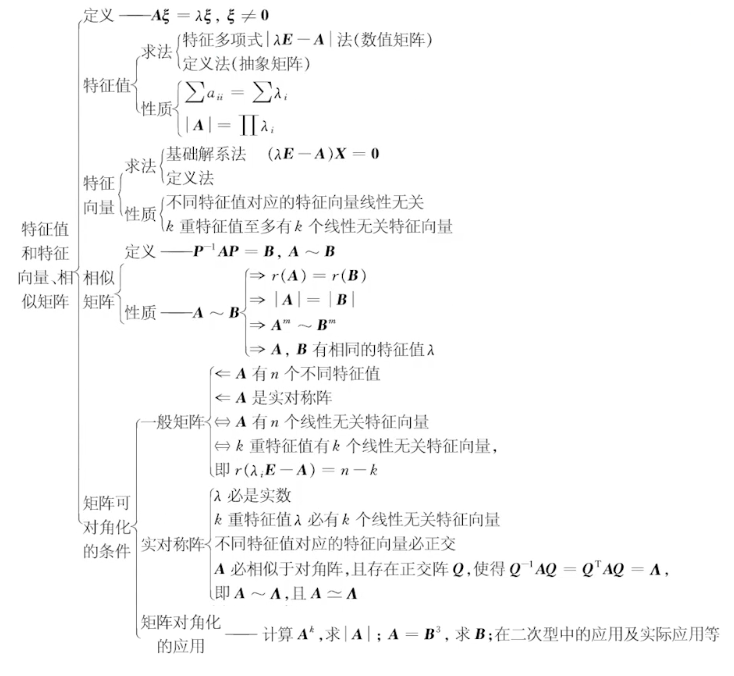

  

|      $A$      |     $A^2$     |    $f(A)$     |      $A^{-1}$       |    $A^{*}$    |              $A^T$              |     $P^{-1}AP$      |       $PAP^{-1}$        |
| :-----------: | :-----------: | :-----------: | :-----------------: | :-----------: | :-----------------------------: | :-----------------: | :---------------------: |
|   $\lambda$   |  $\lambda^2$  | $f(\lambda)$  | $\frac{1}{\lambda}$ | $f(\lambda)$  | $\frac{\vert A\vert }{\lambda}$ |      $\lambda$      | $\displaystyle \lambda$ | $\lambda$ |
| $\varepsilon$ | $\varepsilon$ | $\varepsilon$ |    $\varepsilon$    | $\varepsilon$ |                -                | $P^{-1}\varepsilon$ |     $P\varepsilon$      |
# 特征值、特征向量

# 相似、相似对角阵、实对称相似对角阵 
### 相似矩阵
1. $r(A)=r(B)$  
2. $|A|=|B|$  
3. $|\lambda E-A|=|\lambda E-B|$  
4. $A,B$ 有相同的特征值   

# 一些帮助理解特征值和特征向量的思路：

### 1. **线性变换的本质理解**
- **线性变换**是矩阵的一个核心功能。你可以把一个矩阵 $A$ 看作是将一个向量 $\mathbf{x}$ 映射到另一个向量 $A\mathbf{x}$ 的一种变换。这个变换可以是旋转、缩放、剪切等。

### 2. **特征值和特征向量的定义**
- **特征向量** $\mathbf{v}$ 是在线性变换下不改变方向的向量，即经过矩阵 $A$ 作用后，结果只是被拉伸或压缩了，而不是改变方向。
- **特征值** $\lambda$ 是对应特征向量被拉伸或压缩的比例因子，即满足：
$$
  A\mathbf{v} = \lambda \mathbf{v}
$$
  其中，$\mathbf{v}$ 是非零向量，$\lambda$ 是标量。

### 3. **几何直观理解**
- 假设一个矩阵 $A$ 代表一个平面变换，比如将一个平面向量旋转、缩放或者反射。对于绝大多数向量，变换会改变它们的方向和长度。然而，特征向量是特别的，因为它们在变换后方向保持不变，仅仅是被拉伸（$\lambda > 1$）、压缩（$0 < \lambda < 1$）、翻转（$\lambda < 0$）或者不变（$\lambda = 1$）。
- **例如**，在一个二维平面上，如果我们对一个矩阵 $A$ 进行旋转变换，特征向量可以是沿着某一条轴或固定方向的向量，它在变换后只会被拉伸或缩放，不会改变其原本的方向。

### 4. **特征值和特征向量的意义**
- **描述变换的性质**：特征值和特征向量可以描述一个线性变换的核心性质。通过分析它们，我们可以了解矩阵如何影响空间中的不同向量。例如，通过特征值的大小，可以了解矩阵的伸缩能力或者是否存在某些方向上没有变化的向量（即平衡点）。
- **简化计算**：在许多实际问题中，矩阵的高次幂、矩阵的指数函数、线性方程组的解等可以通过特征值和特征向量简化计算。例如，动态系统的稳定性分析可以通过特征值来确定。
- **在不同领域的应用**：在物理学、统计学和工程学中，特征值和特征向量有许多应用。例如，在图像压缩中使用的奇异值分解（SVD）、在统计学中主成分分析（PCA）中用于数据降维等，都是基于特征值和特征向量的概念。

### 5. **一个简单的例子来帮助理解**
- 设矩阵 $A$ 是一个 $2 \times 2$ 矩阵，它表示平面中的一个变换。如果我们用向量 $\mathbf{v}$ 来表示一个物体在空间中的位置，而 $A$ 作用在 $\mathbf{v}$ 上会使物体在空间中移动。特征向量 $\mathbf{v}$ 表示那些在变换中方向不变的“特殊”位置，而特征值 $\lambda$ 告诉我们这种变换是如何放大、缩小或反向翻转这些向量的。

### 6. **通过简单的物理类比理解**
- 你可以把特征向量和特征值想象成弹簧的运动：当你拉动一个弹簧并释放时，它总会沿着某一方向（其特征向量）压缩和拉伸。拉伸的程度（特征值）告诉你变形的强度。

### 7. **总结**
- **特征向量**：变换中方向不变的向量。
- **特征值**：特征向量变换中拉伸或压缩的比例。

希望通过这些直观解释能帮助你对特征值和特征向量有更深的理解。如果还有不清楚的地方或希望探讨具体的例子，可以进一步讨论！