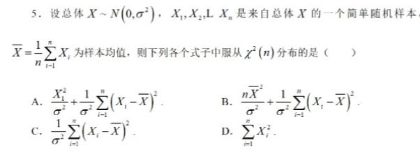
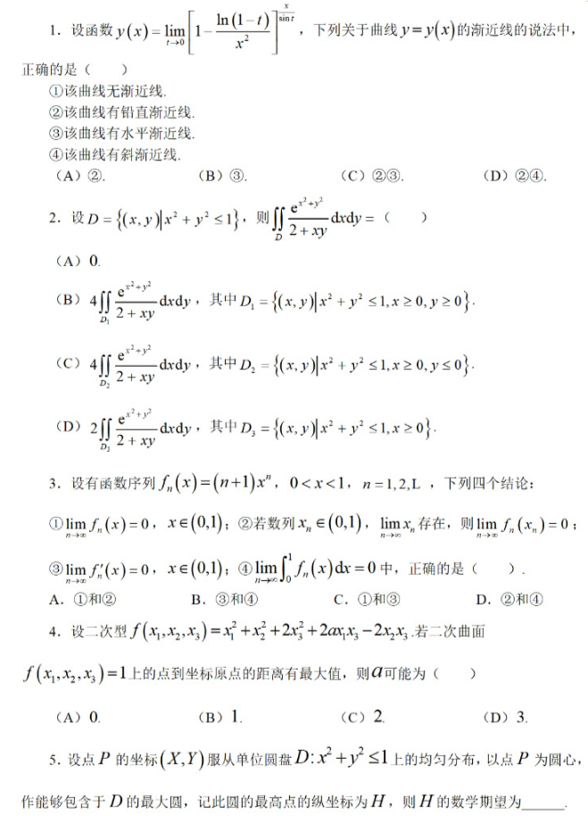

# 1

  
> [!tip]- 解析  
>    
  

# 2
  
> [!tip]- 解析  
>       
 
 
 
 

# 3
  
> [!tip]- 解析  
>     
  
 

# 4
  
> [!tip]- 解析  
>           

 

# 5
  
> [!tip]- 解析  
> 

# 6
  

> [!tip]- 解析  
> 

# 7
  
  

> [!tip]- 解析  
> 

# 8
  

> [!tip]- 解析  
> 

# 9
  

> [!tip]- 解析  
> 

# 10
  

> [!tip]- 解析  
> 

# 11 
  

> [!tip]- 解析  
> 

# 12
  

> [!tip]- 解析  
> 

# 13
  
  
  

## 方法一：秩一方阵法

#### 命题1
设 $A$ 为 $m$ 阶矩阵，且 $r(A)=1$（或者 $A$ 的每行成比例），那么一定有 $A^n = \text{tr}(A)^{n-1}A$。

#### 例子1
矩阵 $A = \left ( \begin{matrix} 1&2&3 \\ -1&-2&-3 \\ 2&4&6 \end{matrix} \right )$，则 $A^n = \text{tr}(A)^{n-1}A = 5^{n-1}A$。

## 方法二：二项展开法

#### 命题2
如果两个同型矩阵 $A$，$B$ 满足 $AB = BA$，那么一定有 $(A+B)^{n} = \sum \limits _{i=0}^{n}C_{n}^{i}A^{i}B^{n-i} = B^{n} + C_{n}^{1}AB^{n-1} + \cdots + C_{n}^{n-1}A^{n-1}B + A^{n}$。

#### 注解1
数量矩阵 $(aE)$（单位矩阵乘一个常数）和任何矩阵可交换，所以一个矩阵可以写成 $aE+B$ 的形式，则可以通过上述方式进行求解。

#### 例子2
对于矩阵 $A = \left ( \begin{matrix} 1&1&0 \\ 0&1&1 \\ 0&0&1 \end{matrix} \right )$，记 $B = \left ( \begin{matrix} 0&1&0 \\ 0&0&1 \\ 0&0&0 \end{matrix} \right )$，一定有 $A^{n} = (E+B)^{n} = E+nB+ \frac {n(n-1)}{2}B^{2} = \left ( \begin{matrix} 1&n& \frac {n(n-1)}{2} \\ 0&1&n \\ 0&0&1 \end{matrix} \right )$。

#### 注解2
对于分块矩阵 $A = \left ( \begin{matrix} O&E_{n-1} \\ 0&O \end{matrix} \right )$，一定有 $A^{k} = \left ( \begin{matrix} O&E_{n-k} \\ 0&O \end{matrix} \right )$，特别地，一定有 $A^n = 0$。其中，$E_k$ 为 $k$ 阶单位矩阵。

## 方法三：归纳观察法。
我们已一个具体例子来看

#### 例题3
已知4阶矩阵A如下：

$$A= \left ( \begin{matrix} -1&1&1&1 \\ 1&-1&1&1 \\ 1&1&-1&1 \\ 1&1&1&-1 \end{matrix} \right )$$
求$A^n$。

注意到：
$$A^{2}=4 \left ( \begin{matrix} 1&0&0&0 \\ 0&1&0&0 \\ 0&0&1&0 \\ 0&0&0&1 \end{matrix} \right )$$
$$A^{3}=4A$$
于是有：
$$A^{n}= \begin{cases} 4^{k}E,n=2k \\ 4^{k-1}A,n=2k-1 \end{cases}$$

#### 注解3：
注意到A矩阵的行向量与列向量是正交的（行列要不同），与正交阵很类似。

## 方法四：分块矩阵高次幂

#### 命题3：设A与B分别是n阶与n阶矩阵，那么对于分块矩阵C如下：
$$C= \left ( \begin{matrix} A&O \\ O&B \end{matrix} \right )$$
一定有：
$$C^{n}= \left ( \begin{matrix} A^{n}&O \\ O&B^{n} \end{matrix} \right )$$

#### 例题4：已知A如下：
$$A= \left ( \begin{matrix} 0&1&0&0 \\ 1&0&0&0 \\ 0&0&1&-1 \\ 0&0&-1&1 \end{matrix} \right )$$
那么有：
$$A^{2n}= \left ( \begin{matrix} 1&0&0&0 \\ 0&1&0&0 \\ 0&0&2n-1&-2^{2n-1} \\ 0&0&-2^{2n-1}&2^{2n-1} \end{matrix} \right )$$

#### 注解4：这个题右下角矩阵是一个秩一矩阵。

#### 注解5：对于矩阵C如下：
$$C= \left ( \begin{matrix} O&A \\ B&O \end{matrix} \right )$$
不可以得到：
$$C^{n}= \left ( \begin{matrix} O&A^{n} \\ B^{n}&O \end{matrix} \right )$$

#### 方法五：
利用相似对角化求高次幂（十分重要）
命题4：如果矩阵A可对角化，即存在可逆矩阵P，使得：
$$P^{-1}AP= \Lambda$$
那么有：
$$(P^{-1}AP)(P^{-1}AP) \cdots (P^{-1}AP)=P^{-1}A^{n}P= \Lambda ^{n} \Rightarrow A^{n}=P \Lambda ^{n}P^{-1}$$
超哥打卡之求矩阵高次幂 (3/3)

特征值与特征向量
对于矩阵 $A$，若存在矩阵 $P$ 满足 $AP = PA$，其中 $P = [ \xi_1, \xi_2, \cdots, \xi_n ]$，则：

$$A[ \xi_1, \xi_2, \cdots, \xi_n ] = [ \xi_1, \xi_2, \cdots, \xi_n ] \text{diag} \{ \lambda_1, \lambda_2, \cdots, \lambda_n \}$$

即：

$$[A \xi_1, A \xi_2, \cdots, A \xi_n] = [ \lambda_1 \xi_1, \lambda_2 \xi_2, \cdots, \lambda_n \xi_n]$$

从而得到：

$$A \xi_i = \lambda_i \xi_i, \quad i = 1, 2, \cdots, n$$

这表明 $P$ 是由 $A$ 的特征向量拼成的矩阵。

#### 例 5
设 $A = \left ( \begin{matrix} -2&0&2 \\ 0&-2&-2 \\ -6&-3&3 \end{matrix} \right )$，求 $A^n$。

特征值与特征向量的计算
1. 特征值计算：
   由 $|\lambda E - A| = 0$，得到 $\lambda(\lambda - 1)(\lambda + 2) = 0$，特征值为 $-2, 1, 0$。
2. 特征向量计算：
   - 对于特征值 $-2$，解线性方程 $(-2E - A)x = 0$，得特征向量 $\xi_1 = (-1, 2, 0)^T$。
   - 对于特征值 $1$，解线性方程 $(E - A)x = 0$，得特征向量 $\xi_2 = (2, -2, 3)^T$。
   - 对于特征值 $0$，解线性方程 $(0E - A)x = 0$，得特征向量 $\xi_3 = (1, -1, 1)^T$。

矩阵 $P$ 和 $P^{-1}$ 的计算
1. 构造矩阵 $P = [ \xi_1, \xi_2, \xi_3 ]$。
2. 通过矩阵初等变化求 $P^{-1}$：
   $$(P, E) = \left ( \begin{matrix} -1&2&1&1&0&0 \\ 2&-2&-1&0&1&0 \\ 0&3&1&0&0&1 \end{matrix} \right ) \rightarrow \left ( \begin{matrix} 1&0&0&1&-1&1 \\ 0&1&0&-2&-1&1 \\ 0&0&1&6&3&-2 \end{matrix} \right )$$
   得到 $P^{-1} = \left ( \begin{matrix} 1&1&0 \\ -2&-1&1 \\ 6&3&-2 \end{matrix} \right )$。

计算 $A^n$
$$A^n = P \Lambda^n P^{-1} = \left ( \begin{matrix} -1&2&1 \\ 2&-2&-1 \\ 0&3&1 \end{matrix} \right ) \left ( \begin{matrix} (-2)^n&0&0 \\ 0&1&0 \\ 0&0&0 \end{matrix} \right ) \left ( \begin{matrix} 1&1&0 \\ -2&-1&1 \\ 6&3&-2 \end{matrix} \right )$$

最终得到：

$$A^n = \left ( \begin{matrix} (-1)^{n-1}2^n - 4&(-1)^{n-1}2^n - 2&2 \\ (-1)^n 2^{n+1} + 4&(-1)^n 2^{n+1} + 2&-2 \\ -6&-3&3 \end{matrix} \right )$$

正定阵的平方根
对于正定阵 $B$，求正定阵 $C$ 使得 $C^2 = B$，即求矩阵的平方根。

#### 方法
1. 对于可对角化矩阵 $A$，存在矩阵 $P$ 和对角矩阵 $\Lambda$ 使得：
   $$A = P \Lambda P^{-1}$$
2. 求 $A$ 的 $k$ 次方根：
   $$A = P \Lambda P^{-1} = \left( P \Lambda^{\frac{1}{k}} P^{-1} \right) \left( P \Lambda^{\frac{1}{k}} P^{-1} \right) \cdots \left( P \Lambda^{\frac{1}{k}} P^{-1} \right)$$
3. 取：
   $$C = P \Lambda^{\frac{1}{k}} P^{-1} = P \text{diag} \left\{ \lambda_1^{\frac{1}{k}}, \lambda_2^{\frac{1}{k}}, \cdots, \lambda_n^{\frac{1}{k}} \right\} P^{-1}$$

2021 年考研数学虽然不是直接求矩阵的高次幂，但涉及到正定阵的平方根问题，本质上还是求矩阵的幂次。考生需要理解求高次幂和 $k$ 次方根是一体两面的问题。 

> [!tip]- 解析  
> 

# 14

> [!tip]- 解析  
> 

