## 空间解析几何知识点

### 1. 平面方程

#### 1.1 平面的一般式

平面方程的**一般形式**为：
$$
Ax + By + Cz + D = 0
$$
其中，$(A, B, C)$ 是平面的法向量，$D$ 为常数。

#### 1.2 平面的点法式

若平面上的一点为 $(x_0, y_0, z_0)$，且法向量为 $(A, B, C)$，则平面的**点法式**方程为：
$$
A(x - x_0) + B(y - y_0) + C(z - z_0) = 0
$$

### 2. 直线方程

#### 2.1 直线的点向式

如果直线上的一点为 $(x_0, y_0, z_0)$，方向向量为 $(l, m, n)$，则直线的**点向式**方程为：
$$
\frac{x - x_0}{l} = \frac{y - y_0}{m} = \frac{z - z_0}{n}
$$

#### 2.2 直线的对称式

若直线的方向向量为 $(l, m, n)$，且过点 $(x_0, y_0, z_0)$，则直线的**对称式**为：
$$
x = x_0 + lt, \quad y = y_0 + mt, \quad z = z_0 + nt
$$
其中 $t$ 为参数。

### 3. 距离公式

#### 3.1 点到平面的距离

点 $(x_1, y_1, z_1)$ 到平面 $Ax + By + Cz + D = 0$ 的距离为：
$$
d = \frac{|Ax_1 + By_1 + Cz_1 + D|}{\sqrt{A^2 + B^2 + C^2}}
$$

#### 3.2 两平面之间的距离

若两平面平行，分别为 $A_1x + B_1y + C_1z + D_1 = 0$ 和 $A_2x + B_2y + C_2z + D_2 = 0$，则它们之间的距离为：
$$
d = \frac{|D_2 - D_1|}{\sqrt{A^2 + B^2 + C^2}}
$$

### 4. 夹角公式

#### 4.1 两平面的夹角

设两个平面 $Ax + By + Cz + D = 0$ 和 $A'x + B'y + C'z + D' = 0$ 的法向量分别为 $(A, B, C)$ 和 $(A', B', C')$，则两平面的夹角 $\theta$ 为：
$$
\cos \theta = \frac{|AA' + BB' + CC'|}{\sqrt{A^2 + B^2 + C^2} \cdot \sqrt{A'^2 + B'^2 + C'^2}}
$$

#### 4.2 直线与平面的夹角

若平面的法向量为 $(A, B, C)$，直线的方向向量为 $(l, m, n)$，则直线与平面的夹角 $\theta$ 为：
$$
\sin \theta = \frac{|Al + Bm + Cn|}{\sqrt{A^2 + B^2 + C^2} \cdot \sqrt{l^2 + m^2 + n^2}}
$$

### 5. 球面方程

#### 5.1 球面的一般式

球面方程的**一般形式**为：
$$
(x - x_0)^2 + (y - y_0)^2 + (z - z_0)^2 = R^2
$$
其中，$(x_0, y_0, z_0)$ 是球心坐标，$R$ 是球的半径。

### 6. 直线和平面的交点

若已知平面方程 $Ax + By + Cz + D = 0$ 和直线的参数方程：
$$
x = x_0 + lt, \quad y = y_0 + mt, \quad z = z_0 + nt
$$
将直线方程代入平面方程，解出参数 $t$，再代回直线方程中，得到交点坐标。

### 7. 平面与球面的关系

设球面方程为 $(x - x_0)^2 + (y - y_0)^2 + (z - z_0)^2 = R^2$，平面方程为 $Ax + By + Cz + D = 0$。设平面到球心的距离为 $d$，则有：

- 如果 $d > R$，则平面与球面无交点；
- 如果 $d = R$，则平面与球面相切；
- 如果 $d < R$，则平面与球面相交，交线为一个圆。

### 8. 切面方程

若球面为 $(x - x_0)^2 + (y - y_0)^2 + (z - z_0)^2 = R^2$，过球面上点 $(x_1, y_1, z_1)$ 且与球面相切的平面方程为：
$$
(x - x_1)(x_1 - x_0) + (y - y_1)(y_1 - y_0) + (z - z_1)(z_1 - z_0) = R^2
$$

## 高等数学中的线积分与面积分

### 1. 线积分

#### 1.1 线积分的定义
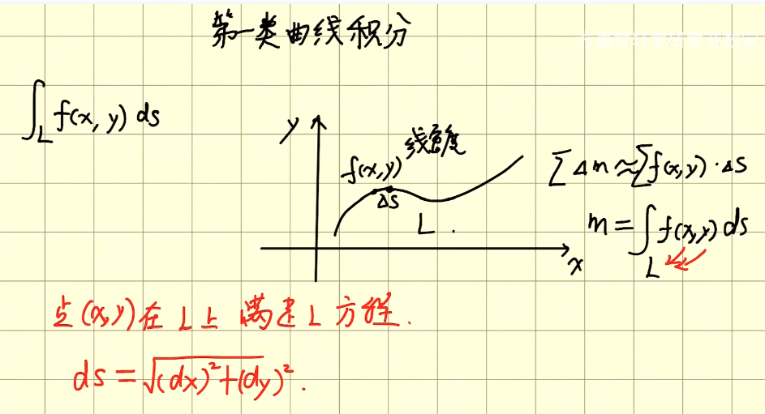  
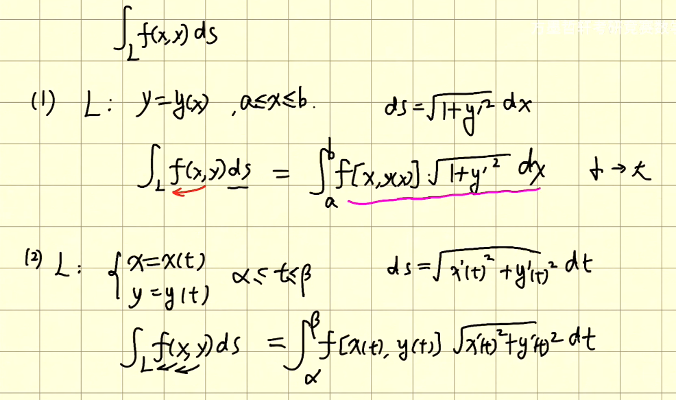  
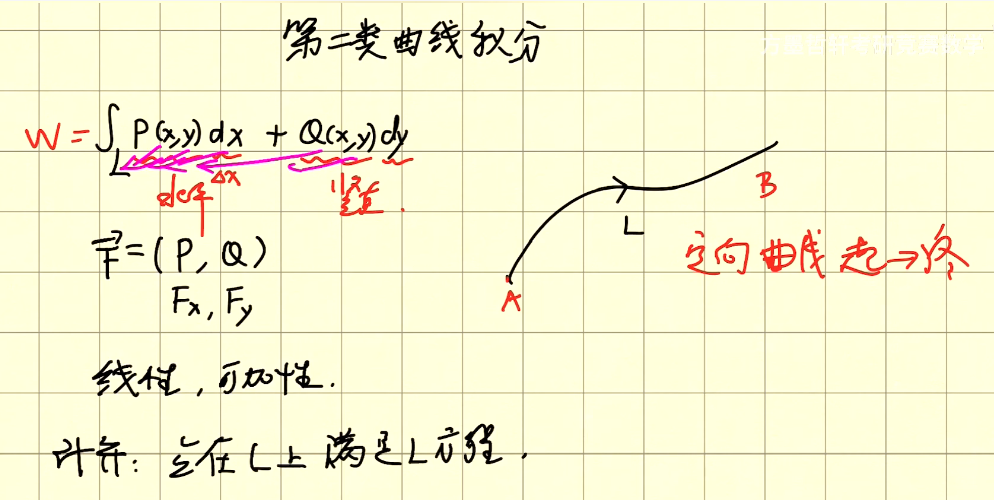  
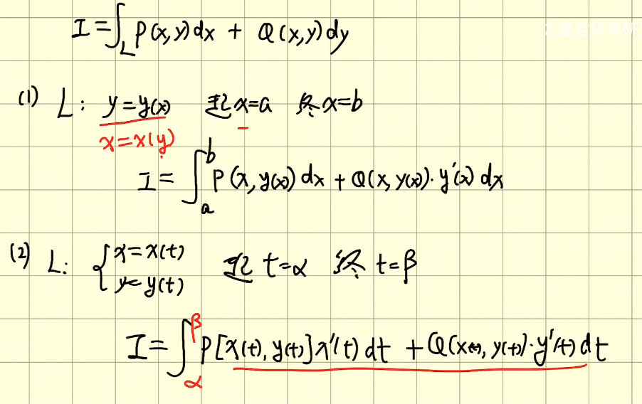  

给定一条光滑曲线 $C$，参数化为 $\mathbf{r}(t) = (x(t), y(t), z(t))$ 其中 $t \in [a, b]$。线积分的**形式**为：
$$
\int_C f(x, y, z) \, ds = \int_a^b f(\mathbf{r}(t)) \|\mathbf{r}'(t)\| \, dt
$$
其中，$ds = \|\mathbf{r}'(t)\| \, dt$ 是曲线的弧长元素。

#### 1.2 向量场的线积分

若 $\mathbf{F} = (P, Q, R)$ 是一个向量场，线积分定义为：
$$
\int_C \mathbf{F} \cdot d\mathbf{r} = \int_a^b \mathbf{F}(\mathbf{r}(t)) \cdot \mathbf{r}'(t) \, dt
$$
其中，$d\mathbf{r} = \mathbf{r}'(t) \, dt$。

### 2. 面积分

#### 2.1 面积分的定义

给定一个曲面 $S$，用参数化形式表示为 $\mathbf{r}(u, v)$，其中 $u$ 和 $v$ 是参数。面积分的**形式**为：
$$
\iint_S f(x, y, z) \, dS = \iint_D f(\mathbf{r}(u, v)) \|\mathbf{r}_u \times \mathbf{r}_v\| \, dudv
$$
其中，$D$ 是参数域，$\mathbf{r}_u$ 和 $\mathbf{r}_v$ 是曲面上参数的偏导数。

#### 2.2 向量场的面积分

若 $\mathbf{F} = (P, Q, R)$ 是一个向量场，面积分定义为：
$$
\iint_S \mathbf{F} \cdot d\mathbf{S} = \iint_D \mathbf{F}(\mathbf{r}(u, v)) \cdot (\mathbf{r}_u \times \mathbf{r}_v) \, dudv
$$
其中，$d\mathbf{S} = \mathbf{n} \, dS$，$\mathbf{n}$ 是曲面的单位法向量。

### 3. 重要定理

#### 3.1 格林定理

在平面区域 $D$ 中，若 $\mathbf{F} = (P, Q)$ 是一连续可微的向量场，格林定理表示为：
$$
\oint_{\partial D} \mathbf{F} \cdot d\mathbf{r} = \iint_D \left( \frac{\partial Q}{\partial x} - \frac{\partial P}{\partial y} \right) \, dA
$$

#### 3.2 斯托克斯定理

斯托克斯定理连接了曲线积分与曲面积分，表示为：
$$
\oint_C \mathbf{F} \cdot d\mathbf{r} = \iint_S \nabla \times \mathbf{F} \cdot d\mathbf{S}
$$

#### 3.3 整体公式

整体公式是描述三维空间中向量场与其发散的关系，表示为：
$$
\iiint_V \nabla \cdot \mathbf{F} \, dV = \iint_{\partial V} \mathbf{F} \cdot d\mathbf{S}
$$

# 二次曲面

###### 椭球面
$\displaystyle\frac{x^2}{a^2}+\frac{y^2}{b^2}+\frac{z^2}{c^2}=1$
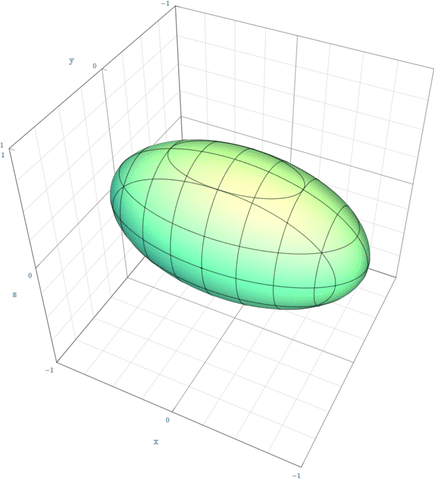  

###### 椭圆锥面
$\displaystyle\frac{x^2}{a^2}+\frac{y^2}{b^2}=z^2$
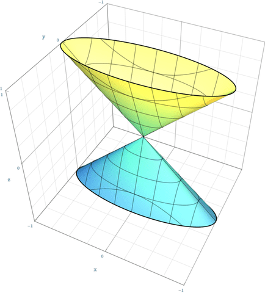  

###### 单叶双曲面
$\displaystyle\frac{x^2}{a^2}+\frac{y^2}{b^2}-\frac{z^2}{c^2}=1$
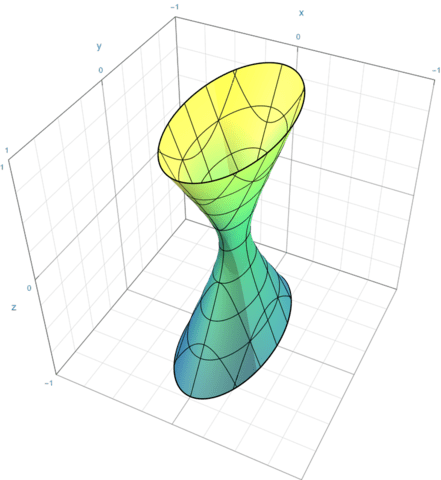  

###### 双叶双曲面
$\displaystyle\frac{x^2}{a^2}+\frac{y^2}{b^2}-\frac{z^2}{c^2}=-1$
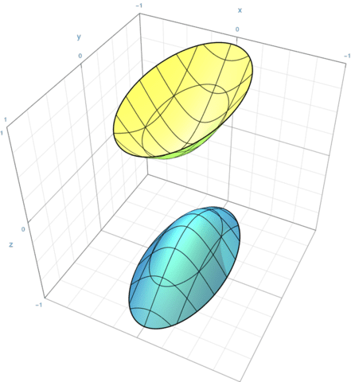  

###### 椭圆抛物面
$\displaystyle\frac{x^2}{a^2}+\frac{y^2}{b^2}=z$
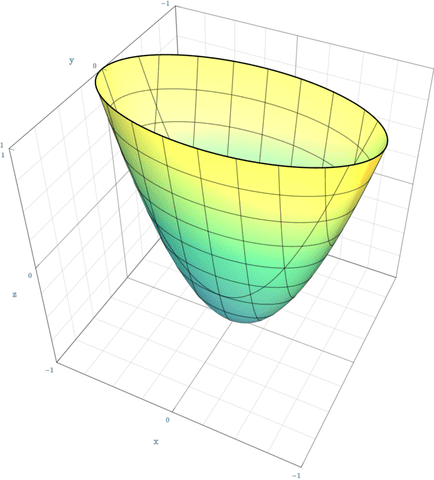  

###### 双曲抛物面
$\displaystyle\frac{x^2}{a^2}-\frac{y^2}{b^2}=z$
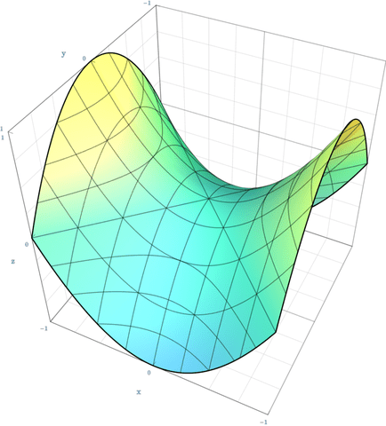  

###### 椭圆柱面
$\displaystyle\frac{x^2}{a^2}+\frac{y^2}{b^2}=1$
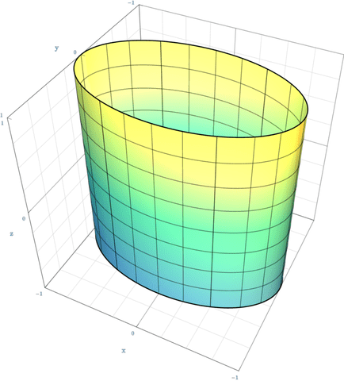  

###### 双曲柱面
$\displaystyle\frac{x^2}{a^2}-\frac{y^2}{b^2}=1$
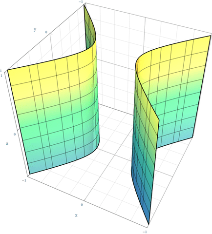  

###### 抛物柱面
$x^2=ay$
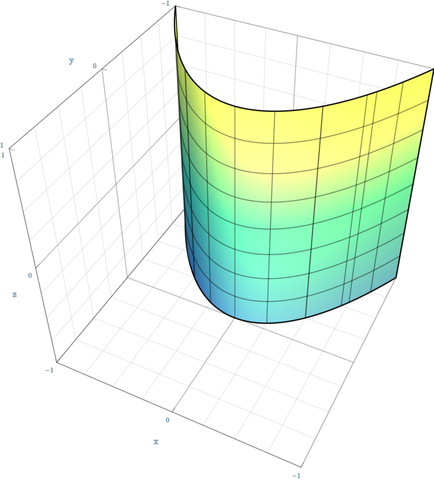  

