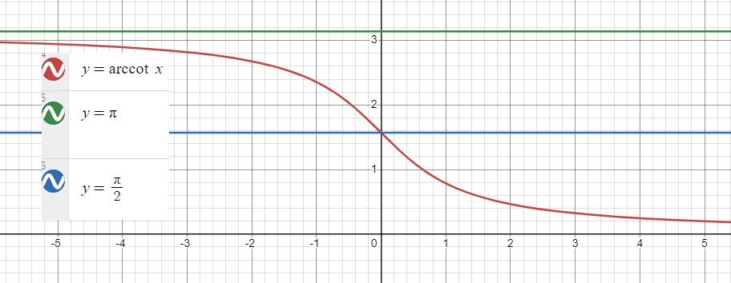

# 函数

### 幂函数

- $y=x^a$

### 指数函数

- $y=a^x$
  
  > 1. $a^x*a^y=a^{x+y}$
  > 2. $\frac{a^x}{a^y}=a^{x-y}$
  > 3. $(a^x)^y =a^{x*y}$
  > 4. $(ab)^x=a^x*b^y$
  > 5. $a^{-\frac{x}{y}}=\frac{1}{\sqrt[y]{a^x}}$

### 对数函数及其图像

- $y=\log\\_ax$
  
  
  > 1. $\log\\_a(MN)=\log\\_aM+\log\\_aN$ 
  > 2. $\log\\_a(\frac{M}{N})=\log\\_aM-\log\\_aN$
  > 3. $\log\\_aM^b=b\log\\_aM$
  > 4. $\log\\_a\sqrt[N]{M}=\frac{1}{N}\log\\_aM$
  > 5. $\log\\_a1=0$
  > 6. $\log\\_aa=1$

### 三角函数及其图像

- $y=\sin x$
- $y=\cos x$

|          | $0^\circ$ | $30^\circ$    | $45^\circ$            | $60^\circ$    | $90^\circ$ |
| :------- | :-------- | :------------ | :-------------------- | :------------ | :--------- |
| $\sin\\$ | $0$       | $\frac{1}{2}$ | $\frac {\sqrt{2}}{2}$ | $\frac{3}{2}$ | $1$        |
| $\cos\\$ | $1$       | $\frac{3}{2}$ | $\frac{\sqrt{2 }}{2}$ | $\frac{1}{2}$ | $0$        |
 
- $y=\tan x , x\neq k\pi + \frac{\pi}{2}$
  
- $y=\cot x , x\neq k\pi$
  

|        | $0^\circ$ | $30^\circ$           | $45^\circ$ | $60^\circ$           | $\lim\limits_{x\to90^\circ}$ |
| :----- | :-------- | :------------------- | :--------- | :------------------- | :--------------------------- |
| $\tan$ | $0$       | $\frac{\sqrt{3}}{3}$ | $1$        | $\sqrt{3}$           | $\infty$                     |
| $\cot$ | $\infty$  | $\sqrt{3}$           | $1$        | $\frac{\sqrt{3}}{3}$ | $0$                          |

- $y=\sec x=\frac{1}{cos x}$
    
- $y=\csc x=\frac{1}{sin x}$  
    
###  三角公式
> [! success]- 平方和
> $\sin ^2x+\cos ^2x=1$  
> $\tan ^2x+1=\sec ^2x$  
> $\cot ^2x+1=\csc ^2x$  

> [! success]- 奇变偶不变、符号看象限
> $\sin(\pi+x)=-\sin x,\cos(\pi +x)=-\cos x,\tan(\pi +x)=\tan x$  
> $\sin(\pi-x)=\sin x,\cos(\pi -x)=-\cos x,\tan(\pi -x)=-\tan x$  
> $\sin(\frac{\pi}{2}+x)=\cos x,\cos(\frac{\pi}{2} +x)=-\sin x,\tan(\frac{\pi}{2} +x)=-\cot x$  
> $\sin(\frac{\pi}{2}-x)=\cos x,\cos(\frac{\pi}{2} -x)=\sin x,\tan(\frac{\pi}{2} -x)=\cot x$  

> [! success]- 基本公式
> $\sin (x\pm y)=\sin x\cos y \pm \cos x \sin y$  
> $\cos(x \mp y)=\cos x\cos y \pm \sin x\sin y$  
> $\tan(x \mp y)=\frac{\tan x\pm \tan y}{1\mp \tan x\tan y}$  

> [! success]- 双倍角
> $\sin 2x=2\sin x\cos x$  
> $\cos 2x=\cos^2-\sin^2=2\cos^2-1=1-2\sin^2$  
> $(\cos^2+sin^2=1)$  
> $\sin^2x=\frac{1-\cos 2x}{2},\cos^2x=\frac{1+\cos 2x}{2}$  
 
> [! success]-   万能公式  
> $u=\tan \frac{x}{2}$      
> $\sin x=\frac{2\sin \frac{x}{2}\cos \frac{x}{2}}  {\sin^2 \frac{x}{2}+\cos^2 \frac{x}{2}}/\cos ^2\frac{x}{2}=\frac{2\tan \frac{x}{2}}{\tan^2\frac{x}{2}+1}$       
>   
> $\sin x=\frac{2u}{u^2+1}$     
> $\cos x=\frac{1-u^2}{1+u^2}$    
> $\tan x=\frac{2u}{1-u^2}$    
>    
> $\frac{x}{2} = \arctan u$   
> $x=2\arctan u$  
>  $dx=\frac{2dt}{1+t^2}$      

> [! success]- 和差化积、积化和差
> $\sin x\cos y=\frac{1}{2}(\sin(x+y)+\sin (x-y))$  
> $\sin x+\sin y=2\sin\frac{x+y}{2}\cos\frac{x-y}{2}$  
> 
> $\cos x\sin y=\frac{1}{2}(\sin(x+y)-\sin (x-y))$  
> $\sin x-\sin y=2\cos\frac{x+y}{2}\sin\frac{x-y}{2}$  
> 
> $\cos x\cos y=\frac{1}{2}(\cos(x+y)+\cos (x-y))$  
> $\cos x+\cos y=2\cos \frac{x+y}{2}2\cos \frac{x-y}{2}$  
>  
> $\sin x\sin y=-\frac{1}{2}(\cos(x+y)-\cos(x-y))$  
> $\cos x-\cos y=-2\sin \frac{x+y}{2}\sin \frac{x-y}{2}$  

### 反三角函数
> [! info]- $\quad y=\arcsin x$ 定义域[-1,1]
  

> [! info]- $\quad y=\arccos x$ 定义域[-1,1]
  

> [! info]- $\quad y= \arctan x$ 定义域$[-\infty,+\infty]$
  

> [! info]- $\quad y=$ arccot $x$ 定义域$[-\infty,+\infty]$
  
# 代数
#### 常见乘法公式
**立方公式**
   $$ (a + b)^3 = a^3 + 3a^2b + 3ab^2 + b^3 $$
   $$ (a - b)^3 = a^3 - 3a^2b + 3ab^2 - b^3 $$

 **完全立方公式**
   $$ a^3 + b^3 = (a + b)(a^2 - ab + b^2) $$
   $$ a^3 - b^3 = (a - b)(a^2 + ab + b^2) $$
**和差乘积公式**
   $$ (a + b)^n - (a - b)^n = 2 \sum_{k=0}^{\lfloor n/2 \rfloor} \binom{n}{2k+1} a^{n-2k-1} b^{2k+1} $$

#### 整式除法 
 **长除法**  
   - 对于多项式 $P(x)$ 和 $D(x)$（假设 $D(x)$ 的首项系数为1），使用长除法可以将 $P(x)$ 表示为：
     $P(x) = Q(x) \cdot D(x) + R(x)$  
     其中 $Q(x)$  是商 $R(x)$ 是余数，且 $\deg(R(x)) < \deg(D(x))$。

 **因式分解与除法**  
   - 如果 $P(x) = (x - r)Q(x)$，则  $P(x)$  除以  $x - r$ 的余数为0，商为$Q(x)$。
     $P(x) = Q(x) \cdot D(x) + R(x) $
     其中 $Q(x)$ 是商$R(x)$是余数，且 $\deg(R(x)) < \deg(D(x))$。

 **因式分解与除法**  
   - 如果 $P(x) = (x - r)Q(x)$，则  $P(x)$ 除以  $x - r$ 的余数为0，商为$Q(x)$。
   - 使用多项式除法可以找到多项式的根，尤其是当已知一个根$r$ 时，可以用 $P(x)$ 除以$(x - r)$ 得到商多项式。

# 数列
**等差数列公式**
   - 第n项：  
     $$ a_n = a_1 + (n - 1) d $$
   - 前n项和：  
     $$ S_n = \frac{n}{2} \cdot (a_1 + a_n) = \frac{n}{2} \cdot \left[ 2a_1 + (n - 1)d \right] $$

**等比数列公式**
   - 第n项：  
     $$ a_n = a_1 \cdot r^{n-1} $$
   - 前n项和：  
     $$ S_n = a_1 \cdot \frac{1 - r^n}{1 - r} \quad (r \neq 1) $$
   - 无限等比数列的和（当 $|r| < 1$）：  
     $$ S = \frac{a_1}{1 - r} $$

**斐波那契数列**
   - 第n项公式：  
     $$ F_n = F_{n-1} + F_{n-2} \quad \text{其中} \, F_1 = F_2 = 1 $$
   - 生成函数：  
     $$ G(x) = \frac{x}{1 - x - x^2} $$

# 不等式

 **基本不等式**
   - **三角不等式**：  
     $$ |a + b| \leq |a| + |b| $$
   - **柯西不等式（Cauchy-Schwarz Inequality）**：  
     $$ \left( \sum_{i=1}^n a_i b_i \right)^2 \leq \left( \sum_{i=1}^n a_i^2 \right) \left( \sum_{i=1}^n b_i^2 \right) $$
   - **均值不等式**（算术-几何不等式）：  
     $$ \frac{a_1 + a_2 + \dots + a_n}{n} \geq \sqrt[n]{a_1 \cdot a_2 \cdot \dots \cdot a_n} $$
     其中  $a_i \geq 0$。

**其他常见不等式**
   - **霍尔不等式（Holder's Inequality）**：  
     $$ \left( \sum_{i=1}^n |a_i b_i| \right) \leq \left( \sum_{i=1}^n |a_i|^p \right)^{\frac{1}{p}} \left( \sum_{i=1}^n |b_i|^q \right)^{\frac{1}{q}} $$
     其中 $$\frac{1}{p} + \frac{1}{q} = 1$$。
   - **贝努利不等式**（Bernoulli's Inequality）：  
     $$ (1 + x)^n \geq 1 + nx \quad (x \geq -1) $$

