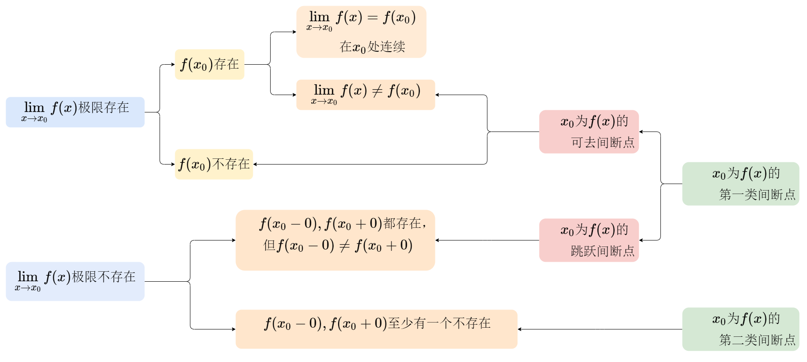

# 定义
$\lim\limits_{x\to x_0} = A \Leftrightarrow \lim\limits_{x \to x^+_0}=A\&\&\lim\limits_{x \to x^-_0}=A$  
$\lim\limits_{x\to \infty} = A \Leftrightarrow \lim\limits_{x \to \infty^+}=A\&\&\lim\limits_{x \to \infty^-}=A$

> [! success] 重要极限 
> <mark>$\Large \lim\limits_{x\to 0}\frac{\sin x}{x}=1$</mark>     <mark>$\Large \lim\limits_{x\to \infty}x\sin \frac{1}{x}=1$</mark>
> 
> <mark>$\Large \lim\limits_{x\to 0}x\sin\frac{1}{x}=0$</mark> <mark>$\Large \lim\limits_{x\to 0}\frac{\sin x}{x}=0$</mark>
> 
> <mark>$\Large \lim\limits_{x\to \infty}x\sin x\,不存在$</mark> <mark>$\Large \lim\limits_{x\to \infty}\frac{1}{x}\sin\frac{1}{x}\,不存在$</mark>

# 泰勒公式求极限

<!-- ### 等价无穷小

$\lim\limits_{x\to 0}\frac{f(x)}{g(x)}=1,\,\,f(x)\sim g(x)$

> **公式：**
> 
> $\sin x \sim x\\
> \tan x\sim x\\  
> \arcsin x\sim x\\
> \arcsin x\sim x\\
> e^x-1\sim x\\
> \ln(1+x)\sim x\\
> \\1-\cos x\sim \frac{1}{2}x^2\\
> (1+x)^\alpha-1\sim \alpha x$

> **定理：**
> 等价无穷小替换，乘除可，加减不可

### 泰勒公式大法

- 设$f(x)$在$x_0$某邻域$U(x_0,\sigma)$内具有n+1阶导数
  则有$\forall x \in U(x_0,\sigma)\\ f(x)=f(x_0)+f'(x_0)(x-x_0)+ \frac{1}{2!}f''(x_0)(x-x_0)^2+…+\frac{1}{n!}f^{(n)}(x_0)(x-x_0)^n+R_n(x)\\若R_n(x）=o(x-x_0)^n，则R_n(x)为皮亚诺余项\\若x_0=0,则为：\\f(x)=f(0)+f'(0)x+…+ \frac{f^{(n)}(0)}{n!}x^n+o(x^n)$ -->

### 麦克劳林公式
####   $e^x$
$
 = 1 + x + \frac{x^2}{2!} + \frac{x^3}{3!} + \frac{x^4}{4!} + \frac{x^5}{5!} + \cdots
$

####   $\ln(1+x)$ 
$
= x - \frac{x^2}{2} + \frac{x^3}{3} - \frac{x^4}{4} + \frac{x^5}{5} + \cdots \quad (|x| < 1)
$

####  $(1+x)^n$
$
= 1 + nx + \frac{n(n-1)}{2}x^2 + \frac{n(n-1)(n-2)}{3!}x^3 + \frac{n(n-1)(n-2)(n-3)}{4!}x^4 + \cdots \quad (|x| < 1)
$
####   $\sin(x)$
$
=x - \frac{x^3}{3!} + \frac{x^5}{5!} - \frac{x^7}{7!} + \cdots
$

####   $\arcsin(x)$
$
 = x + \frac{x^3}{6} + \frac{3x^5}{40} + \frac{5x^7}{112} + \frac{35x^9}{1152} + \cdots \quad (|x| \leq 1)
$
####   $\cos(x)$
$
 = 1 - \frac{x^2}{2!} + \frac{x^4}{4!} - \frac{x^6}{6!} + \cdots
$

####   $\tan(x)$
$
 = x + \frac{x^3}{3} + \frac{2x^5}{15} + \frac{17x^7}{315} + \frac{62x^9}{2835} + \cdots \quad (|x| < \frac{\pi}{2})
$
####   $\arctan(x)$
$
 = x - \frac{x^3}{3} + \frac{x^5}{5} - \frac{x^7}{7} + \cdots \quad (|x| \leq 1)
$

####   $\sinh(x)$
$
 = x + \frac{x^3}{3!} + \frac{x^5}{5!} + \cdots
$

####   $\cosh(x)$
$
 = 1 + \frac{x^2}{2!} + \frac{x^4}{4!} + \cdots
$

<!-- $
\sin x =x-\frac{1}{3!}x^3+\frac{1}{5!}x^5+o(x^5)\\
\cos x = 1-\frac{1}{2!}x^2+\frac{1}{4!}x^4 +o(x^4)\\
\tan x=x+\frac{1}{3!}x^3+o(x^3)\\
\arcsin x =x+\frac{1}{6!}x^3+o(x^3)\\
\arctan x =x-\frac{1}{3!}x^3+o(x^3)\\
\ln (1+x)=x-\frac{1}{2!}x^3+o(x^3)\\
$ -->

<!-- # 无穷小替换求极限

#### 等价无穷小

$x\rightarrow 0，$八个公式

1. $(1+x)^\alpha-1\sim\alpha x，x\rightarrow f(x)，x为分数$
2. $x\rightarrow 0，e^x-1\sim x，\color{red} 无穷小$
3. $x\rightarrow 0，\ln(1+x)\sim x$
4. $x\rightarrow 0，1-\cos x\sim \frac{1}{2}x^2$
5. $x\rightarrow 0，\sin x\sim x$ -->

--- 

# 幂指函数求极限

- $1^{\infty} , {\infty}^0 , 0^0 \Rightarrow 0*\infty \Rightarrow \frac{0}{0}/\frac{\infty}{\infty}$

$$
f(x)^{g(x)}=e^{g(x)\ln f(x)}
$$

|  $f(x)$  |  $g(x)$  | $e^{g(x)}$ | $\ln f(x)$ |
| :------: | :------: | :--------: | :--------: |
|    1     | $\infty$ |  $\infty$  |     0      |
| $\infty$ |    1     |     0      |  $\infty$  |
|    0     |    0     |     0      |  $\infty$  |

$$
\lim\limits_{x\to ()}(1+x)^{\frac{1}{x}}=e\\
\lim\limits_{x\to \infty}(1+x)^x=e\\
$$

1. $\lim\limits_{x \to \Box} [1+f(x)]^{g(x)} , 其中f(x) \rightarrow 0,g(x) \rightarrow \infty$  
   $\lim\limits_{x \to \Box}[1+f(x)]^{g(x)}=e^A \Rightarrow A=\lim\limits_{x \to \Box} f(x)*g(x)$  
2. $\lim\limits_{x \to \Box} f(x)^{g(x)}, 其中f(x) \rightarrow 1,g(x) \rightarrow \infty$  
   $\lim\limits_{x \to \Box}f(x)^{g(x)}=e^A \Rightarrow A=\lim\limits_{x \to \Box} [f(x)-1]*g(x)$  

# 连续与间断点

##### 间断点的分类
<!-- 1. 可去间断点
   左极限等于右极限，但与$f(x)$不相等
2. 跳跃间断点
   左极限、右极限都存在但不相等
3. 无穷间断点
   左极限、右极限有一个不存在且无穷
4. 震荡间断点
   左极限、右极限有一个不存在且震荡 -->

  

# 求渐近线

> asymptoto

$$\lim\limits_{x \to \infty} f(x)  \enspace \exists , \lim\limits_{x \to \infty}f(x)=A$$

##### 垂直渐近线vertical 
   $\lim\limits_{x \to x_0}f(x)=\infty$
##### 水平渐近线
   $\lim\limits_{x \to \infty}f(x)=A (\exists)$
##### 斜渐近线 $y=kx+b$
   $k=\lim\limits_{x \to \infty}\frac{f(x)}{x}\\b=\lim\limits_{x \to \infty}(f(x)-kx)\\$
   - $y=f(x)与y=kx+b接近\\\lim\limits_{x \to \infty}[f(x)-(kx+b)]=0\\$
   - $\lim\limits_{x \to x_0}f(x)=A, f(x)=A+\alpha (x)\\$
   - 函数极限无穷小的关系定理
  
# 求导数

### 导数定义

$$
f'(x)=\lim\limits_{\Delta x to 0} \frac{f((x_0 + \Delta x)-f(x_0))}{\Delta x} \\ =\lim\limits_{x \to x_0} \frac{f(x)-f(x_0)}{x-x_0} \\ =\lim\limits_{x \to x_0} \frac{f[x_0+\psi(x)]}{\phi(x)} \\ 
$$

##### 1. 高阶无穷小
设 $f(x)$ 和 $g(x)$ 是两个函数，且在 $x \to a$ 时，$f(x)$ 和 $g(x)$ 都趋于 0。如果
$$
\lim_{x \to a} \frac{f(x)}{g(x)} = 0,
$$
则称 $f(x)$ 是**比 $g(x)$ 高阶的无穷小**，或称 $f(x)$ 是 $g(x)$ 的高阶无穷小。

##### 2. 低阶无穷小
如果 $g(x)$ 是 $f(x)$ 的高阶无穷小，则称 $g(x)$ 是**比 $f(x)$ 低阶的无穷小**。换句话说，如果
$$
\lim_{x \to a} \frac{g(x)}{f(x)} = 0,
$$
则称 $g(x)$ 是 $f(x)$ 的低阶无穷小。

##### 3. 等价无穷小
设 $f(x)$ 和 $g(x)$ 在 $x \to a$ 时都趋于 0。如果存在常数 $C \neq 0$ 使得
$$
\lim_{x \to a} \frac{f(x)}{g(x)} = C,
$$
则称 $f(x)$ 和 $g(x)$ 是**等价无穷小**。

##### 4. 同阶无穷小
如果 $f(x)$ 和 $g(x)$ 是等价无穷小，特别地，当 $C = 1$ 时，即
$$
\lim_{x \to a} \frac{f(x)}{g(x)} = 1,
$$
则称 $f(x)$ 和 $g(x)$ 是**同阶无穷小**。

##### 5. $k$ 阶无穷小
设 $f(x)$ 是在 $x \to a$ 时趋于 0 的无穷小，如果存在常数 $C \neq 0$ 使得
$$
\lim_{x \to a} \frac{f(x)}{(x-a)^k} = C,
$$
则称 $f(x)$ 是在 $x \to a$ 处的**$k$ 阶无穷小**。通常，$k$ 阶无穷小是指 $f(x)$ 和 $(x-a)^k$ 是同阶无穷小。

### 求导公式

> $(e^x)' = e^x , (a^x)'=a^x \ln a , (x^a)'=ax^{a-1}$  
> 正弦: $(\sin x)'=\cos x , (\tan x)' =\sec ^2x , (\sec x)' = \sec x \tan x$   
> 余弦: $(\cos x)'=-\sin x , (\cot x)' =\csc ^2x , (\csc x)' = \csc x \cot x$   
> $(\arcsin x)'=\frac{1}{\sqrt{1-x^2}}$  
> $(\arccos x)'=- \frac{1}{\sqrt{1-x^2}}$  
> $(\arctan x)'=\frac{1}{1+x^2}$  
> $(arccot \  x)'=- \frac{1}{1+x^2}$  
> $(\ln x)'=\frac{1}{x}$  
> $(\ln (x+\sqrt{x^2\pm a^2}))'=\frac{1}{\sqrt{x^2\pm a^2}}$  

 

